## Percepção, Stealth, Combate, Hive, NPC AI, Monster AI, Boss AI e Arquitetura Modular

> **Projeto:** Dungeon Explorer: Ashvault  
> **Documento:** GDD específico dos **AI Systems**  
> **Escopo:** IA de monstros, NPCs, stealth, percepção, investigação, combate, alertas, hive system, boss AI, party AI, rotinas, memória, blackboard, behavior trees, utility AI, GOAP/HTN futuro e preparação para MORL posterior.  
> **Regra central:** IA em Ashvault deve gerar **leitura, tensão, consequência e histórias emergentes**, não apenas inimigos que correm até o jogador.
> **`fase_permitida`:** MVP para FSM, percepção básica, investigação, combat AI simples, boss phase controller e interest budget; Utility AI em Alpha; GOAP/HTN/MORL em P&D/futuro.

---

# 1. High Concept

O **AI System** define como criaturas, NPCs, bosses, grupos e entidades da dungeon percebem, decidem, investigam, atacam, fogem, cooperam, lembram e reagem ao mundo.

Percepção não é autoridade interna da IA. O AI System consome fatos do `NoiseAuthority` e atualiza blackboard/decisão a partir deles; fórmulas de visão, ruído, oclusão, suspeita e memória curta pertencem ao [Noise & Perception System](<../Gameplay/Noise & Perception System.md>).

A IA precisa sustentar quatro pilares do jogo:

1. **Stealth sistêmico**  
    O player pode ser visto, ouvido, cheirado, rastreado ou percebido por vibração/magia.
    
2. **Dungeon viva**  
    Criaturas reagem a ruído, mineração, cadáveres, luz, comida, sangue, queda e presença da party.
    
3. **NPCs funcionais**  
    NPCs do Hub e da dungeon possuem serviços, rotinas, relação, medo, reputação e memória.
    
4. **Hive e ameaça coletiva**  
    Algumas criaturas ou biomas reagem como ecossistema ou colônia, escalando alerta local para alerta regional.
    

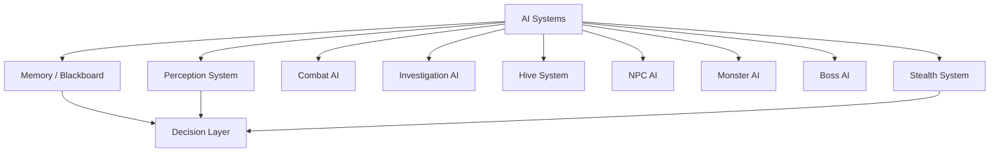

---

# 2. Objetivos de Design

## 2.1 Objetivo principal

Criar uma IA que seja **legível, modular e expansível**, capaz de sustentar stealth, combate, exploração, ecologia, NPCs e multiplayer sem depender de simulação pesada demais.

O jogador deve sentir:

- “fiz barulho e algo ouviu”;
    
- “essa criatura caça pelo cheiro, não pela visão”;
    
- “esse monstro está investigando, ainda posso escapar”;
    
- “a colônia percebeu atividade demais nessa área”;
    
- “o NPC reagiu ao que aconteceu”;
    
- “o boss mudou de fase de forma compreensível”;
    
- “meu conhecimento do bestiário realmente ajuda”.
    

---

## 2.2 Problemas que o AI System resolve

| Problema                                   | Solução via AI                                          |
|--------------------------------------------|---------------------------------------------------------|
| Stealth precisa ser mais que cone de visão | múltiplos sensores: visão, som, cheiro, vibração, magia |
| Mining/Crafting/Alchemy geram ruído        | Acoustic Events alimentam investigação e hive           |
| Bestiário precisa ter utilidade            | conhecimento reduz risco e melhora leitura de IA        |
| Dungeon precisa parecer viva               | criaturas patrulham, caçam, dormem, fogem e investigam  |
| Hive System precisa escalar ameaça         | alertas locais viram comportamento coletivo             |
| NPCs precisam reagir                       | reputação, serviços, rotinas e memória                  |
| Multiplayer precisa ser leve               | interest management e IA server-authoritative           |
| MORL é desejado no futuro                  | arquitetura preparada, mas não dependente               |

---

# 3. Pilares da IA

## 3.1 IA deve ser legível

O jogador precisa conseguir entender por que a IA reagiu.

Exemplos corretos:

- monstro virou a cabeça ao ouvir ruído;
    
- NPC recuou ao ver player corrompido;
    
- criatura farejou sangue;
    
- hive começou com sinais pequenos antes de ataque;
    
- boss telegrafou mudança de fase.
    

Exemplos ruins:

- inimigo sabe onde o player está sem pista;
    
- criatura detecta através de parede sem regra;
    
- hive spawna inimigos sem feedback;
    
- NPC muda preço sem razão comunicada;
    
- boss usa ataque impossível de ler.
    

---

## 3.2 IA deve ser modular

Cada entidade usa módulos combináveis:

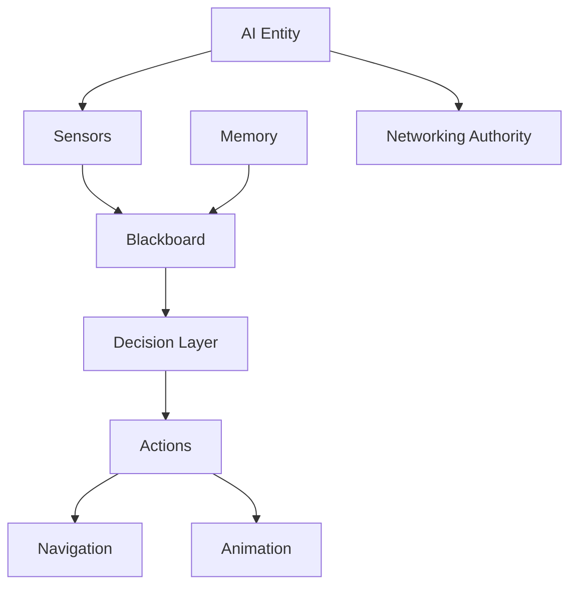

---

## 3.3 IA deve ser barata fora do interesse

A dungeon pode ser grande e vertical.  
A IA não pode simular tudo em detalhe o tempo inteiro.

| Distância / relevância   | Simulação                    |
|--------------------------|------------------------------|
| Próximo ao player        | IA completa                  |
| Mesmo andar, longe       | IA simplificada              |
| Outro andar conectado    | summary/state machine        |
| Floor descarregado       | snapshot/abstract simulation |
| NPC em missão off-screen | simulação estatística        |

---

## 3.4 IA não deve burlar boss gates

Nenhuma IA pode atravessar, revelar, cavar, voar ou simular além de uma camada bloqueada sem regra de progressão.

$$  
AITraversal \not\Rightarrow BossGateBypass  
$$

---

# 4. Arquitetura Geral

## 4.1 Camadas

| Camada           | Função                     |
|------------------|----------------------------|
| Sensors          | coletam sinais do mundo    |
| Blackboard       | guarda estado atual        |
| Memory           | guarda eventos relevantes  |
| Decision Layer   | decide próxima ação        |
| Action Layer     | executa ação               |
| Navigation       | pathfinding, cover, patrol |
| Animation Bridge | animação e feedback        |
| Networking       | autoridade e sincronização |
| Debug Layer      | visualização e tuning      |

---

## 4.2 Modelo híbrido de decisão

O sistema deve usar abordagens diferentes por complexidade.

| IA                        | Técnica recomendada                   |
|---------------------------|---------------------------------------|
| Criatura simples          | FSM                                   |
| Criatura stealth          | Behavior Tree + Sensors               |
| Boss                      | Behavior Tree + Phase Controller      |
| NPC serviço               | FSM + Dialogue Conditions             |
| NPC rotina                | Schedule + Utility AI                 |
| NPC explorador off-screen | simulação estatística                 |
| Hive                      | Global Alert State + Event Aggregator |
| Futuro avançado           | GOAP/HTN                              |
| Futuro acadêmico          | MORL modular                          |

---

# 5. AI Perception Consumption

## 5.1 High Concept

Percepção é a base de stealth, combate e investigação.

As fórmulas desta seção são espelhos explicativos para designers. A autoridade de cálculo pertence ao [Noise & Perception System](<../Gameplay/Noise & Perception System.md>). AI Systems só consome `PerceptionFact`, `StimulusFact` e `DetectionState`.

A IA não deve detectar o jogador por “magia interna” sem feedback. Ela detecta por sinais:

- visão;
    
- som;
    
- cheiro;
    
- vibração;
    
- calor;
    
- magia;
    
- luz;
    
- sangue;
    
- cadáver;
    
- comida;
    
- mineração;
    
- alquimia;
    
- crafting;
    
- queda.
    

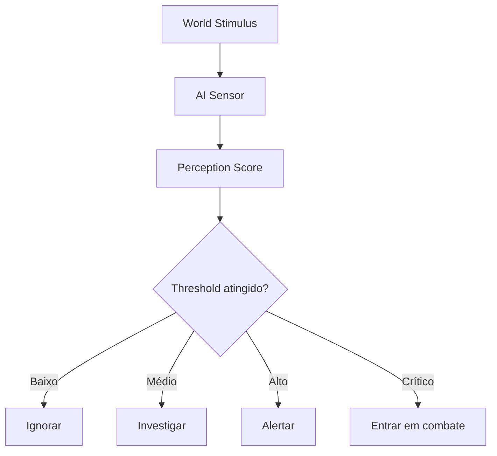

---

## 5.2 Tipos de estímulo

| Estímulo  | Fonte                                    |
|-----------|------------------------------------------|
| Visual    | player em linha de visão, luz, movimento |
| Acoustic  | passos, mining, crafting, queda, combate |
| Scent     | sangue, comida, cadáver, veneno          |
| Vibration | corrida, queda, mineração pesada         |
| Heat      | fogo, corpo, forja, magia                |
| Arcane    | feitiço, item mágico, ritual             |
| Corpse    | cadáver de player, NPC ou criatura       |
| Social    | reputação, facção, crime                 |
| Hive      | alerta coletivo, feromônio, grito        |

---

## 5.3 Fórmula geral de percepção

$$  
PerceptionScore =  
VisionScore +  
HearingScore +  
ScentScore +  
VibrationScore +  
ArcaneScore -  
StealthScore -  
ObstructionPenalty  
$$

Se:

$$  
PerceptionScore \ge T_{detect}  
$$

a IA detecta o alvo.

Se:

$$  
T_{suspicion} \le PerceptionScore < T_{detect}  
$$

a IA investiga.

---

## 5.4 Visão

$$  
VisionScore =  
Visibility  
\cdot  
LightLevel  
\cdot  
MovementFactor  
\cdot  
DistanceFalloff  
\cdot  
LineOfSight  
$$

| Fator             | Descrição                 |
|-------------------|---------------------------|
| `Visibility`      | tamanho/exposição do alvo |
| `LightLevel`      | iluminação local          |
| `MovementFactor`  | alvo parado ou correndo   |
| `DistanceFalloff` | penalidade por distância  |
| `LineOfSight`     | bloqueio por parede/cover |

---

## 5.5 Audição

$$  
HearingScore =  
NoiseVolume  
\cdot  
MaterialEcho  
\cdot  
DistanceFalloff  
\cdot  
CreatureHearingSensitivity  
$$

Fontes de ruído:

| Fonte                   |       Ruído |
|-------------------------|------------:|
| andar devagar           |       baixo |
| correr                  |       médio |
| pular/cair              |        alto |
| mineração               |        alto |
| forja/crafting metálico |        alto |
| alquimia explosiva      |     extremo |
| combate                 |        alto |
| porta pesada            |       médio |
| corda                   | baixo/médio |

---

## 5.6 Cheiro

$$  
ScentScore =  
ScentIntensity  
\cdot  
AirflowModifier  
\cdot  
Freshness  
\cdot  
CreatureScentSensitivity  
$$

Fontes:

- sangue;
    
- cadáver;
    
- carne;
    
- comida;
    
- veneno;
    
- fungo;
    
- player ferido;
    
- reagente alquímico;
    
- monstro recém-harvestado.
    

---

## 5.7 Vibração

Usada por criaturas cegas, subterrâneas ou de hive.

$$  
VibrationScore =  
ImpactForce  
\cdot  
GroundConductivity  
\cdot  
DistanceFalloff  
\cdot  
VibrationSensitivity  
$$

Fontes:

- queda de player;
    
- mineração;
    
- corrida pesada;
    
- boss walking;
    
- explosivo;
    
- colapso.
    

---

# 6. Stealth System

## 6.1 High Concept

Stealth em Ashvault deve ser baseado em **risco, informação e comportamento**, não invisibilidade gratuita.

O player pode evitar monstros por:

- sombra;
    
- silêncio;
    
- distância;
    
- cheiro mascarado;
    
- rota alternativa;
    
- notes;
    
- bestiário;
    
- distrações;
    
- timing;
    
- conhecimento de sentidos da criatura.
    

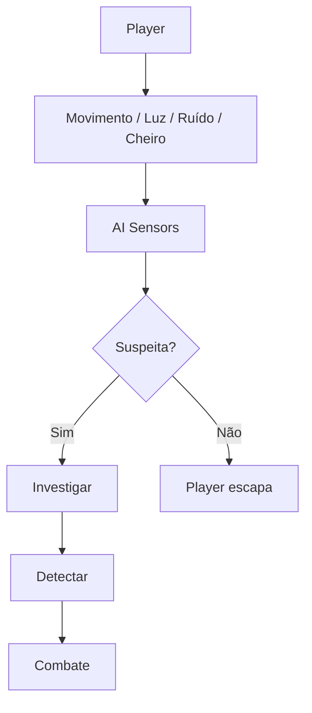

---

## 6.2 Estados de alerta

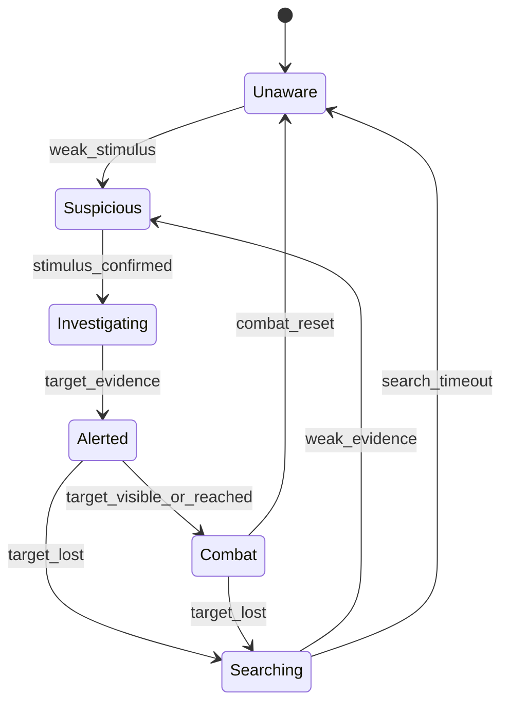

| Estado        | Comportamento                  |
|---------------|--------------------------------|
| Unaware       | patrulha/rotina normal         |
| Suspicious    | pausa, vira cabeça, escuta     |
| Investigating | caminha até fonte do estímulo  |
| Alerted       | chama aliados, prepara ataque  |
| Combat        | ataca ou persegue              |
| Searching     | procura último local conhecido |

---

## 6.3 Fórmula de stealth do player

## $$  
StealthScore =  
MovementStealth +  
LightConcealment +  
ScentMasking +  
EquipmentSilence +  
KnowledgeBonus

## CarryWeightPenalty

InjuryPenalty  
$$

Conhecimento do bestiário pode dar bônus:

$$  
KnowledgeBonus =  
K_{senses}  
\cdot  
CreatureSpecificModifier  
$$

Exemplo:

- saber que Bone Hound usa cheiro permite usar repelente;
    
- saber que Crystal Bat reage à luz permite apagar cristal;
    
- saber que Slime sente vibração altera movimentação.
    

---

# 7. Investigation AI

## 7.1 High Concept

Investigação é o estado entre “não viu nada” e “combate”.

É importante porque cria tensão.

A IA deve:

- ouvir algo;
    
- ir até o local;
    
- verificar;
    
- olhar ao redor;
    
- cheirar/rastrear;
    
- chamar aliados se encontrar evidência;
    
- retornar se nada for encontrado.
    

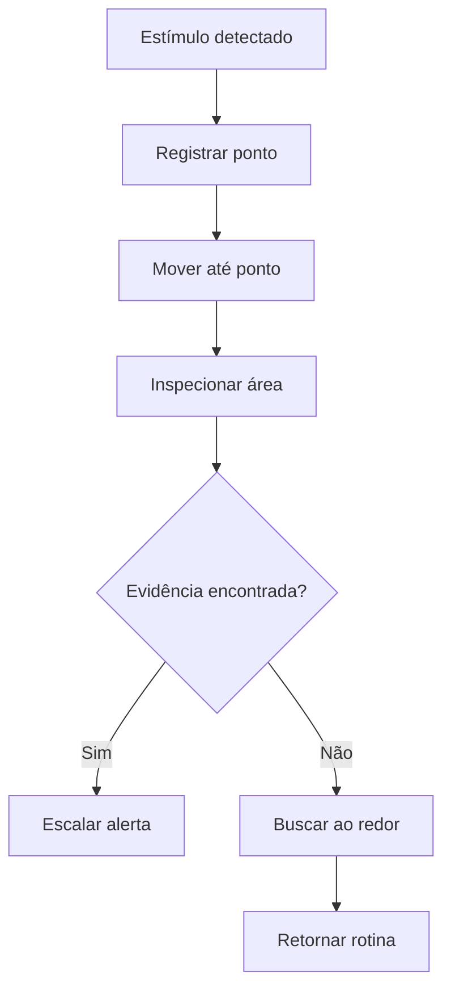

---

## 7.2 Evidências investigáveis

| Evidência            | Efeito             |
|----------------------|--------------------|
| pegada               | busca direcional   |
| sangue               | alerta maior       |
| cadáver              | chama aliados/hive |
| item dropado         | curiosidade        |
| cheiro de comida     | atrai criatura     |
| ruído repetido       | alerta escalado    |
| porta aberta         | investiga sala     |
| marca de player      | suspeita           |
| frasco quebrado      | alerta químico     |
| pedra recém-minerada | busca minerador    |

---

# 8. Combat AI

## 8.1 High Concept

Combate deve ser específico por criatura, não só aproximação e ataque.

Cada criatura possui:

- distância ideal;
    
- agressividade;
    
- medo;
    
- ataques;
    
- cooldown;
    
- padrões;
    
- reação a dano;
    
- fraquezas;
    
- comportamento de grupo;
    
- reação ao ambiente.
    

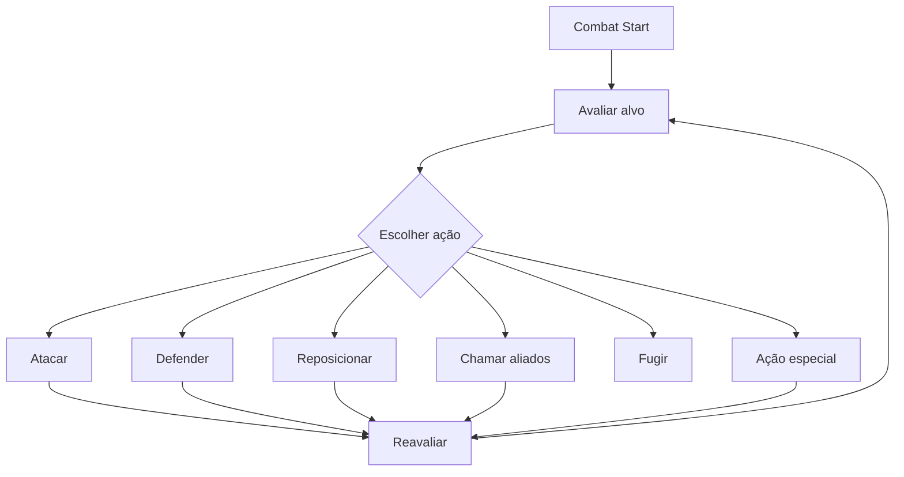

---

## 8.2 Utility de combate

$$  
Utility(action) =  
TacticalValue +  
Opportunity +  
PersonalityWeight -  
Risk -  
CooldownPenalty  
$$

Ação escolhida:

$$  
Action = \arg\max Utility(action)  
$$

---

## 8.3 Tipos de comportamento de combate

| Tipo        | Comportamento              |
|-------------|----------------------------|
| Charger     | corre e ataca direto       |
| Ambusher    | espera e ataca de surpresa |
| Pack Hunter | flanqueia em grupo         |
| Coward      | foge quando ferido         |
| Defender    | protege ninho/recurso      |
| Stalker     | segue à distância          |
| Screamer    | chama hive/aliados         |
| Grappler    | puxa player para perigo    |
| Ranged      | mantém distância           |
| Boss        | fases e padrões            |

---

# 9. Monster AI

## 9.1 Categorias

| Categoria  | IA principal                         |
|------------|--------------------------------------|
| Slime/Ooze | vibração, contato, divisão           |
| Beast      | cheiro, perseguição, medo            |
| Bat        | audição, swarm, luz                  |
| Fungoid    | esporos, área, camuflagem            |
| Undead     | persistência, baixa percepção social |
| Construct  | patrulha, trigger, lógica fixa       |
| Abyssal    | emboscada, corrupção, medo           |
| Rootborn   | controle de terreno                  |
| Insectoid  | hive/feromônio                       |
| Humanoid   | cover, armas, tática                 |
| Boss       | fases, arena, gatekeeper             |

---

## 9.2 Monster Brain

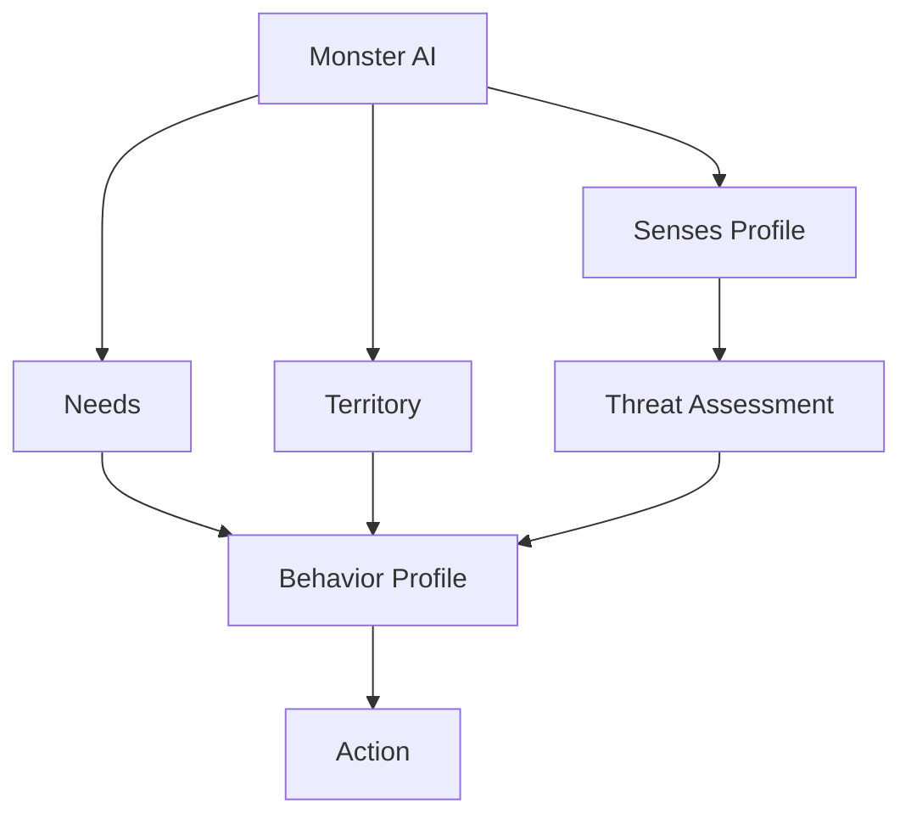

---

## 9.3 Necessidades simples de criatura

| Need       | Efeito                                |
|------------|---------------------------------------|
| Hunger     | caça ou come cadáver                  |
| Fear       | evita player forte/fogo               |
| Territory  | protege sala/ninho                    |
| Sleep      | reduz percepção, mas acorda com ruído |
| Pack       | chama aliados                         |
| Corruption | comportamento errático                |
| Hive       | obedece alerta coletivo               |

---

# 10. Hive System

## 10.1 High Concept

O **Hive System** representa inteligência coletiva, colônia, ecossistema ou alerta regional.

Não precisa ser uma mente única literal. Pode representar:

- colônia de insetos;
    
- fungos conectados;
    
- morcegos em swarm;
    
- raízes vivas;
    
- criaturas abissais;
    
- dungeon reagindo ao player.
    

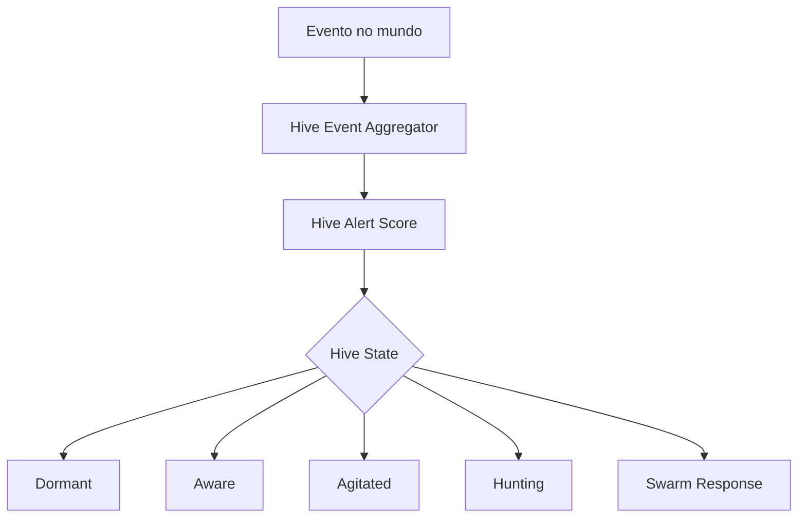

---

## 10.2 Eventos que alimentam Hive

| Evento                     |        Peso |
|----------------------------|------------:|
| mineração alta             |       médio |
| explosão alquímica         |        alto |
| morte de criatura hive     |        alto |
| sangue/cadáver             |       médio |
| fogo em ninho              |        alto |
| player correndo muito      | baixo/médio |
| boss gate alterado         |        alto |
| roubo de recurso protegido |        alto |
| uso de magia               |    variável |
| queda forte                |       médio |

---

## 10.3 Fórmula de alerta hive

## $$  
HiveAlert =  
\sum EventWeight_i  
\cdot  
ProximityModifier  
\cdot  
BiomeSensitivity

DecayOverTime  
$$

Estados:

| HiveAlert | Estado   |
|----------:|----------|
|      0–20 | Dormant  |
|     21–50 | Aware    |
|     51–80 | Agitated |
|    81–120 | Hunting  |
|      >120 | Swarm    |

---

## 10.4 Respostas do Hive

| Estado   | Resposta                                  |
|----------|-------------------------------------------|
| Dormant  | nada                                      |
| Aware    | sons, pequenos movimentos                 |
| Agitated | patrulhas mudam                           |
| Hunting  | criaturas buscam player                   |
| Swarm    | ataque coordenado, bloqueio, fuga forçada |

---

## 10.5 Hive não deve ser injusto

O Hive precisa dar feedback antes de punir:

- som de paredes;
    
- fungos pulsando;
    
- morcegos se agitando;
    
- raízes se movendo;
    
- insetos correndo;
    
- mudança na música;
    
- notes automáticas com WIS;
    
- bestiário indicando risco.
    

---

# 11. NPC AI

## 11.1 Tipos de IA de NPC

| NPC            | IA recomendada                       |
|----------------|--------------------------------------|
| Comerciante    | FSM + preço + diálogo                |
| Ferreiro       | Service Behavior + schedule          |
| Alquimista     | Service Behavior + inventory         |
| Cozinheiro     | schedule + serviço                   |
| Guarda         | perception + patrol + crime response |
| Informante     | dialogue conditions + rumor system   |
| NPC Explorador | off-screen simulation                |
| Lost NPC       | fear + follow/rescue                 |
| Rival          | utility AI + greed/risk              |
| Corrupted NPC  | monster-like AI                      |

---

## 11.2 NPC Utility

$$  
Utility(action) =  
NeedScore +  
ServicePriority +  
RelationshipScore +  
ScheduleScore -  
RiskScore  
$$

Exemplo:

- comerciante escolhe trabalhar se loja aberta;
    
- guarda investiga crime se viu evidência;
    
- NPC ferido pede ajuda se player é confiável;
    
- rival foge se risco é alto e loot é baixo.
    

---

# 12. Boss AI

## 12.1 High Concept

Boss AI deve ser mais roteirizada e legível que IA comum.

Boss é gatekeeper de camada.  
Ele deve testar mecânicas aprendidas nos andares anteriores.

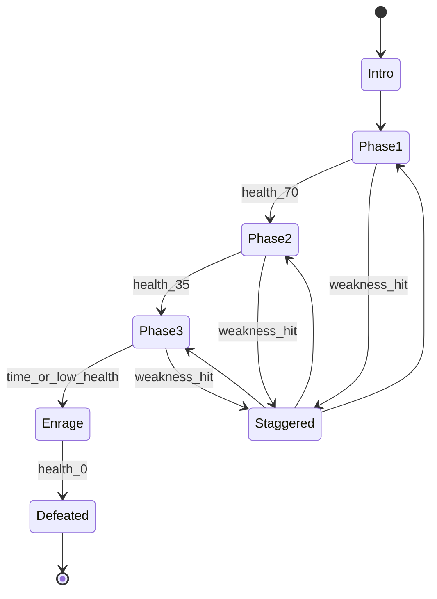

---

## 12.2 Componentes de Boss AI

| Componente              | Função                  |
|-------------------------|-------------------------|
| Phase Controller        | troca fases             |
| Arena Controller        | hazards e espaço        |
| Attack Pattern Selector | escolhe ataques         |
| Weakness Window         | janela de contra-ataque |
| Telegraph System        | aviso visual/sonoro     |
| Summon Controller       | adds limitados          |
| Anti-cheese             | evita exploit           |
| Gate Unlock             | desbloqueia camada      |

---

## 12.3 Boss não pode ser totalmente procedural

A arena pode variar, mas o boss precisa ter:

- leitura clara;
    
- ataques testáveis;
    
- janelas de punição;
    
- fraqueza aprendível;
    
- relação com bestiário;
    
- recompensa coerente.
    

---

# 13. Party AI / Companion AI

## 13.1 Escopo

Pode existir NPC companheiro ou assistente, mas com cautela.

Funções possíveis:

- seguir player;
    
- carregar item;
    
- segurar tocha;
    
- avisar perigo;
    
- ajudar em crafting;
    
- defender em combate;
    
- instalar corda;
    
- carregar player ferido.
    

---

## 13.2 Regras

Companheiro não deve:

- resolver dungeon sozinho;
    
- revelar mapa completo;
    
- detectar tudo automaticamente;
    
- vencer boss sozinho;
    
- carregar loot infinito;
    
- burlar quedas;
    
- burlar boss gate.
    

---

# 14. AI e Bestiário

Bestiário deve revelar como a IA funciona.

| Conhecimento      | Efeito                       |
|-------------------|------------------------------|
| visão fraca       | player usa sombra            |
| audição forte     | player evita ruído           |
| cheiro forte      | player usa masking           |
| hive link         | evita matar perto de colônia |
| medo de fogo      | usa torch/fire flask         |
| guarda território | evita ninho                  |
| come cadáver      | usa corpse como distração    |
| reage a cristal   | controla iluminação          |

---

# 15. AI e Notes

Notes ajudam a lembrar padrões de IA.

| Note                          | Uso                       |
|-------------------------------|---------------------------|
| “morcegos investigam metal”   | evitar mining com martelo |
| “fungo pulsa antes de swarm”  | reconhecer hive           |
| “hound sente sangue”          | usar bandagem/repelente   |
| “construct patrulha em ciclo” | timing stealth            |
| “slime sente vibração”        | andar devagar             |
| “boss abre janela após slam”  | contra-ataque             |

---

# 16. AI e Sistemas de Ruído

Todos os sistemas ativos podem gerar eventos acústicos:

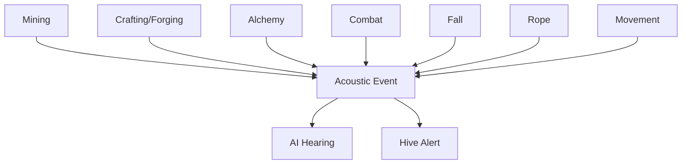

---

# 17. AI e Dungeon Generation

A dungeon precisa gerar suporte para IA:

| Elemento                | Uso de IA             |
|-------------------------|-----------------------|
| patrol nodes            | rotas                 |
| investigation points    | pontos de busca       |
| cover points            | stealth/combat        |
| sound propagation zones | audição               |
| scent zones             | cheiro                |
| hive zones              | alerta coletivo       |
| spawn nests             | origem de criaturas   |
| sleep zones             | descanso/baixo alerta |
| boss arena markers      | fases/ataques         |
| fall landing zones      | reação a queda        |
| rope anchor points      | NPC/party interaction |

---

# 18. Multiplayer e Autoridade

## 18.1 Server-authoritative AI

Em multiplayer, o servidor deve validar:

- percepção;
    
- estado de alerta;
    
- combate;
    
- dano;
    
- path decisions principais;
    
- hive alert;
    
- boss phases;
    
- NPC state;
    
- reputação;
    
- eventos relevantes.
    

Client pode prever:

- animações;
    
- feedback visual;
    
- UI de alerta;
    
- efeitos locais.
    

---

## 18.2 Interest Management

Não replicar IA completa para todos.

| Caso               | Replicação                          |
|--------------------|-------------------------------------|
| player perto da IA | estado completo                     |
| mesmo andar longe  | estado resumido                     |
| outro andar        | summary                             |
| floor descarregado | snapshot                            |
| boss fight         | replicação completa para envolvidos |
| NPC Hub próximo    | completo                            |
| NPC off-screen     | resultado estatístico               |

---

## 18.3 AI Tick Budget

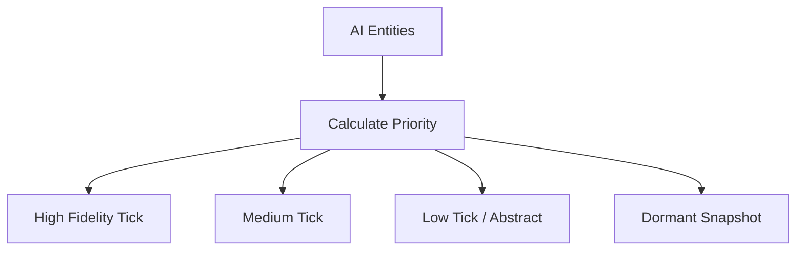

Prioridade depende de:

$$  
AIPriority =  
ProximityToPlayer +  
ThreatLevel +  
RelevanceToQuest +  
CombatState +  
Visibility  
$$

---

# 19. Persistência

## 19.1 O que salvar

| Dado                    | Persistência                |
|-------------------------|-----------------------------|
| boss derrotado          | Meta/World                  |
| hive state semanal      | World/Weekly                |
| NPC importante          | Meta/World                  |
| criatura comum          | não precisa, salvo exceções |
| corpse gerado por IA    | World/Run                   |
| patrol alterada         | World/session               |
| creature nest destroyed | World/Weekly                |
| relacionamento NPC      | Meta                        |
| rumor gerado            | World/Weekly                |
| bestiary knowledge      | Meta                        |
| AI memory relevante     | Meta/World                  |

---

## 19.2 AI Snapshot

Para floors descarregados:

$$  
AISnapshot =  
EntityType +  
State +  
LocationSummary +  
AlertLevel +  
Health +  
RelevantFlags  
$$

Não salvar cada microdecisão.

---

# 20. Modelo de Dados

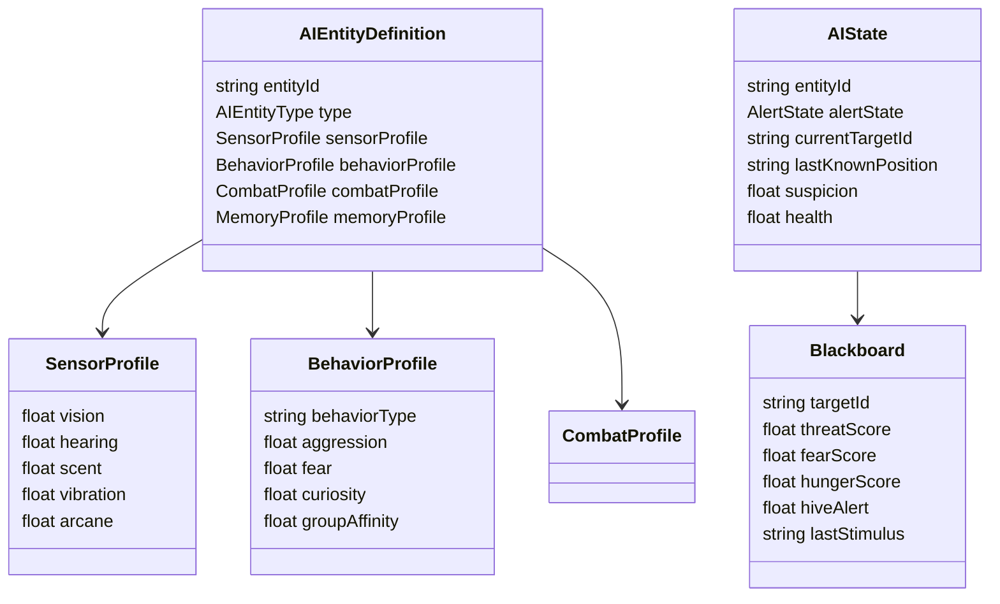

---

# 21. Estrutura de Scripts Recomendada

| Pasta            | Arquivos                                                                                                                  |
|------------------|---------------------------------------------------------------------------------------------------------------------------|
| `AI/Core`        | `AIEntityDefinition.cs`, `AIState.cs`, `AIEntityType.cs`, `AlertState.cs`                                                 |
| `AI/Perception`  | `SensorProfile.cs`, `PerceptionService.cs`, `VisionSensor.cs`, `HearingSensor.cs`, `ScentSensor.cs`, `VibrationSensor.cs` |
| `AI/Stimuli`     | `StimulusEvent.cs`, `AcousticEvent.cs`, `ScentEvent.cs`, `VisualStimulus.cs`, `ArcaneStimulus.cs`                         |
| `AI/Blackboard`  | `AIBlackboard.cs`, `BlackboardKey.cs`, `BlackboardUpdater.cs`                                                             |
| `AI/Decision`    | `DecisionService.cs`, `UtilityDecisionResolver.cs`, `BehaviorTreeRunner.cs`, `FSMController.cs`                           |
| `AI/Actions`     | `AIAction.cs`, `InvestigateAction.cs`, `AttackAction.cs`, `FleeAction.cs`, `CallForHelpAction.cs`, `PatrolAction.cs`      |
| `AI/Stealth`     | `StealthResolver.cs`, `SuspicionService.cs`, `LastKnownPositionService.cs`                                                |
| `AI/Combat`      | `CombatAIService.cs`, `AttackSelector.cs`, `ThreatEvaluator.cs`, `TargetSelector.cs`                                      |
| `AI/Hive`        | `HiveAlertService.cs`, `HiveEventAggregator.cs`, `HiveStateController.cs`, `HiveResponseResolver.cs`                      |
| `AI/NPC`         | `NPCDecisionBridge.cs`, `NPCScheduleBridge.cs`, `NPCServiceAI.cs`                                                         |
| `AI/Boss`        | `BossPhaseController.cs`, `BossAttackPatternSelector.cs`, `BossTelegraphService.cs`                                       |
| `AI/Navigation`  | `PatrolRoute.cs`, `InvestigationPoint.cs`, `CoverPoint.cs`, `AINavigationService.cs`                                      |
| `AI/Networking`  | `ServerAIService.cs`, `AIReplicationController.cs`, `AIInterestResolver.cs`                                               |
| `AI/Persistence` | `AISnapshot.cs`, `AIStateSave.cs`, `HiveSaveData.cs`                                                                      |
| `AI/Debug`       | `AIDebugView.cs`, `PerceptionGizmos.cs`, `UtilityScoreDebugger.cs`                                                        |

---

# 22. Pipeline Técnico

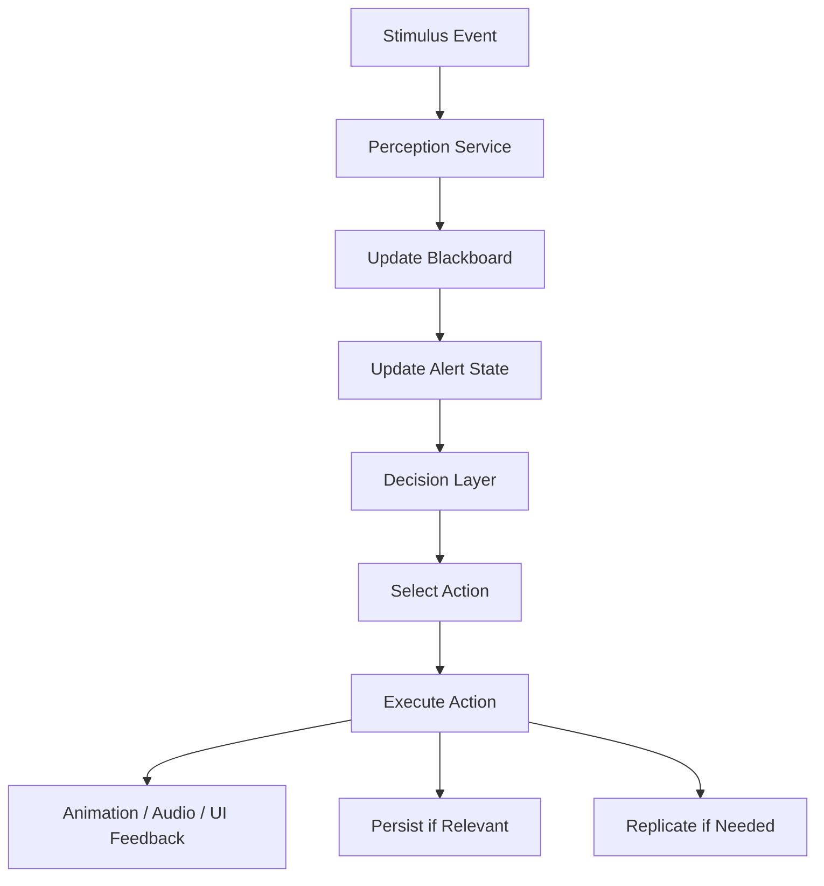

---

# 23. Validação

## 23.1 Constraints obrigatórias

| Constraint                    | Regra                                 |
|-------------------------------|---------------------------------------|
| `ai_has_sensor_profile`       | toda IA relevante tem sensores        |
| `stimulus_has_source`         | estímulo precisa origem               |
| `detection_is_not_free`       | IA não detecta sem estímulo ou regra  |
| `alert_state_is_legible`      | alerta precisa feedback               |
| `hive_has_decay`              | hive não fica infinito sem regra      |
| `boss_gate_not_bypassed`      | IA não atravessa camada selada        |
| `server_authoritative_ai`     | servidor valida IA relevante          |
| `interest_management_applied` | não replicar tudo para todos          |
| `morl_not_required_for_mvp`   | MORL é futuro                         |
| `bestiary_can_explain_ai`     | comportamento pode virar conhecimento |
| `notes_can_record_ai_pattern` | notes registram padrões               |

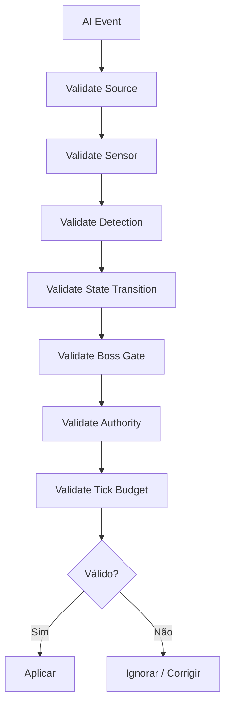

---

# 24. Roadmap Interno de Evolução da IA

Este roadmap interno não altera o MVP global. A entrada de qualquer item depende do [Roadmap Content Scope](<../Production/Roadmap Content Scope.md>) e do [MVP Implementation Plan](<../Production/MVP Implementation Plan.md>).

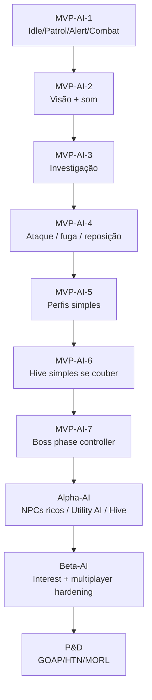

## 24.1 Escopo por Fase

| Fase | Entrega |
|---|---|
| MVP-AI-1 | IA com estados Idle/Patrol/Alert/Combat |
| MVP-AI-2 | visão e som com suspicion |
| MVP-AI-3 | investigação de último estímulo |
| MVP-AI-4 | ataque, fuga, reposicionamento |
| MVP-AI-5 | perfis simples de criatura por sensor |
| MVP-AI-6 | hive alert simples, se couber no budget |
| MVP-AI-7 | boss phase controller |
| Alpha-AI | NPCs mais ricos, Utility AI local e Hive mais sistêmico |
| Beta-AI | interest management refinado e multiplayer hardening |
| P&D | GOAP/HTN/MORL |

---

# 25. Non-Goals

Não implementar no primeiro ciclo:

- MORL no MVP;
    
- simulação completa de ecossistema;
    
- todos os NPCs com IA profunda;
    
- pathfinding global em todos os floors;
    
- IA perfeita;
    
- inimigos com informação impossível;
    
- hive punindo sem feedback;
    
- companions resolvendo dungeon;
    
- boss totalmente procedural sem design;
    
- LLM para decisões de NPC;
    
- simulação de todos os NPCs em floors descarregados;
    
- IA atravessando boss gate;
    
- stealth sem leitura visual/sonora.
    

---

# 26. Critérios de Aceite

O AI System está aceitável quando:

- IA detecta por estímulos claros;
    
- stealth usa visão e som no MVP;
    
- estados de alerta são legíveis;
    
- IA investiga último local conhecido;
    
- combate tem pelo menos ataque, perseguição, fuga e reposicionamento;
    
- criaturas possuem perfis de sensores diferentes;
    
- mining, alchemy, crafting e queda geram eventos de ruído;
    
- hive acumula alerta e decai com o tempo;
    
- bestiário explica comportamentos;
    
- notes podem registrar padrões;
    
- NPCs de serviço usam IA simples;
    
- boss possui fases e telegraph;
    
- servidor valida estados relevantes;
    
- interest management evita custo excessivo;
    
- arquitetura permite GOAP/HTN/MORL no futuro;
    
- IA não burla boss gate.
    

---

# 27. Definição Final para o GDD Principal

## AI Systems

Os AI Systems de Ashvault controlam percepção, stealth, investigação, combate, hive, NPCs, monstros e bosses. A IA é baseada em estímulos do mundo, como visão, som, cheiro, vibração, magia, sangue, cadáveres, luz, mineração, alquimia, crafting, queda e combate.

A IA deve ser legível. O jogador precisa entender por que foi detectado, por que uma criatura investigou uma área ou por que a hive escalou o alerta. Estados como Unaware, Suspicious, Investigating, Alerted, Combat e Searching devem ter feedback visual, sonoro ou comportamental.

Stealth é sistêmico. Criaturas diferentes percebem o mundo de maneiras diferentes. Algumas usam visão, outras som, cheiro, vibração, magia ou hive link. O bestiário revela esses padrões, e notes ajudam o jogador a registrar comportamento.

O Hive System representa alerta coletivo ou ecológico. Eventos como mineração, explosões alquímicas, morte de criaturas, sangue, fogo em ninho, queda e uso de magia aumentam o Hive Alert. O alerta escala de Dormant para Aware, Agitated, Hunting e Swarm. O sistema deve sempre dar feedback antes de punir.

NPC AI cobre serviços, rotinas, reputação, diálogo, rumores, contratos e missões. NPCs não geram recursos infinitos e não substituem o jogador. NPC Explorers são Alpha ou posterior e usam simulação off-screen com custo, risco, falha e rendimento menor que o jogador ativo.

Boss AI usa fases, telegraphs, janelas de fraqueza e arena controlada. Bosses testam mecânicas aprendidas na camada e desbloqueiam progressão após derrota.

A arquitetura é modular. O MVP usa FSM, Behavior Trees simples, Blackboard e schedule mínimo. Utility AI entra em Alpha; GOAP/HTN podem entrar depois para NPCs mais complexos. MORL deve ser previsto como evolução futura, mas não é requisito do MVP.

No multiplayer, a IA relevante é server-authoritative. Clients exibem feedback, mas o servidor valida percepção, combate, hive, boss phases e estados persistentes. Interest management evita replicar ou simular IA completa fora do contexto do jogador.

---

# 28. Resumo Final

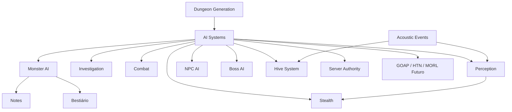

**Regra final:**  
**IA em Ashvault é percepção + consequência.** A dungeon não precisa pensar como humano; ela precisa reagir de forma legível, modular e perigosa ao que o jogador faz.
