## NPCs Sociais, Exploradores, Comerciantes, Companheiros, Serviços, Rotinas e IA Modular

> **Projeto:** Dungeon Explorer: Ashvault  
> **Documento:** GDD específico do **NPC System**  
> **Escopo:** NPCs do Hub, NPCs exploradores, comerciantes, artesãos, alquimistas, ferreiros, cozinheiros, contratáveis, resgatáveis, informantes, party NPCs, rotinas, reputação, serviços, economia, notes, rumores, missões, multiplayer e arquitetura de IA modular.  
> **Regra central:** NPCs não são decoração. NPCs são agentes sociais, econômicos e operacionais que conectam o Hub, a dungeon e os sistemas de progressão.
> **`fase_permitida`:** MVP apenas para serviços e rumores básicos do Hub; NPC Explorer e NPCs de dungeon são Alpha ou posterior.

---

# 1. High Concept

O **NPC System** define todos os personagens não controlados pelo jogador que vivem, trabalham, negociam, exploram, ajudam, traem, informam ou reagem ao mundo de Ashvault.

NPCs devem cumprir três funções principais:

1. **Dar vida ao Hub**  
    Comerciantes, ferreiros, cozinheiros, alquimistas, curandeiros, informantes, guardas, exploradores e sobreviventes.
    
2. **Gerar interação sistêmica**  
    Compra, venda, contrato, treinamento, reparo, crafting, cooking, alchemy, rumor, notes, reputação e serviços.
    
3. **Conectar o jogador à dungeon**  
    NPCs podem ser contratados, encontrados, resgatados, perdidos, mortos, corrompidos ou transformados em fonte de informação.
    

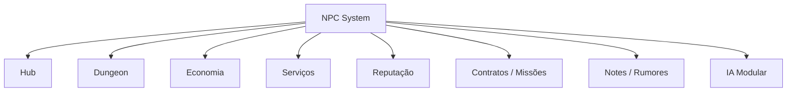

---

# 2. Objetivos de Design

## 2.1 Objetivo principal

Criar NPCs que pareçam integrados ao mundo, mas sem exigir simulação total no MVP.

O jogador deve sentir:

- “esse ferreiro depende dos materiais que eu trago”;
    
- “esse alquimista pode identificar reagentes raros”;
    
- “esse explorador pode morrer se eu mandar fundo demais”;
    
- “esse mercador muda preço conforme demanda”;
    
- “esse NPC sabe rumores sobre a dungeon”;
    
- “esse cozinheiro transforma monstros em receitas”;
    
- “esse personagem lembra do que aconteceu”;
    
- “minhas ações no Hub alteram relações e serviços”.
    

---

## 2.2 Problemas que o NPC System resolve

| Problema                                        | Solução via NPCs                                  |
|-------------------------------------------------|---------------------------------------------------|
| Hub precisa parecer vivo                        | NPCs com rotina, serviços e reações               |
| Economia precisa de compradores/vendedores      | comerciantes, artesãos e contratos                |
| Dungeon precisa gerar histórias                 | NPCs perdidos, mortos, resgatáveis ou corrompidos |
| Notes precisam circular                         | NPCs vendem, validam ou espalham rumores          |
| Bestiário precisa de validação social           | caçadores e estudiosos confirmam informações      |
| Crafting/Forging precisa de especialistas       | ferreiro, artesão, refinador                      |
| Alchemy precisa de laboratório social           | alquimista identifica e compra reagentes          |
| Cooking precisa de função no Hub                | cozinheiro, taverna, receitas                     |
| Multiplayer precisa de serviços compartilháveis | NPCs vinculados à loja/party/guild                |

---

# 3. Tipos de NPC

## 3.1 NPCs do Hub

| Tipo                  | Função                           |
|-----------------------|----------------------------------|
| Merchant              | compra/vende recursos            |
| Blacksmith            | forja, reparo, ligas, armas      |
| Alchemist             | poções, reagentes, identificação |
| Cook                  | receitas, comida, buff social    |
| Healer                | cura, antídotos, corrupção leve  |
| Informant             | rumores, rotas, preço, boss gate |
| Cartographer          | notes, mapas parciais, marcações |
| Trainer               | skills e especializações         |
| Guild Clerk           | contratos e recompensas          |
| Banker/Storage Keeper | stash, seguro, armazenamento     |
| Priest                | purificação, deuses, sacrifícios |
| Guard                 | segurança, crime, reputação      |
| Recruiter             | contratação de NPC explorador    |

---

## 3.2 NPCs de Dungeon

| Tipo             | Função                            |
|------------------|-----------------------------------|
| Lost Explorer    | pode ser resgatado                |
| Wounded NPC      | pede ajuda ou troca item por cura |
| Rival Adventurer | compete por loot                  |
| Corpse NPC       | gera loot, notes ou pista         |
| Captured NPC     | resgate/quest                     |
| Corrupted NPC    | inimigo ou tragédia narrativa     |
| Merchant Caravan | evento raro de comércio           |
| Scout            | fornece informação de andar       |
| Trapped NPC      | ensina hazard ou armadilha        |
| Expedition Party | grupo independente                |

---

## 3.3 NPCs Contratáveis

| Tipo              | Função                               |
|-------------------|--------------------------------------|
| NPC Explorer      | faz expedição off-screen com risco   |
| Porter            | carrega mais loot                    |
| Guard             | protege loja ou party                |
| Miner             | melhora extração off-screen limitada |
| Harvester         | coleta partes específicas            |
| Cook Assistant    | ajuda em produção de comida          |
| Smith Assistant   | reduz tempo de reparo/forja          |
| Alchemy Assistant | reduz risco de falha                 |
| Scout             | encontra rumores/rotas               |
| Shop Clerk        | ajuda vendas e contratos             |

---

# 4. Pilares do NPC System

## 4.1 NPCs têm função sistêmica

Todo NPC relevante deve tocar pelo menos um sistema.

$$  
NPCValue = Service + Information + Economy + Relationship + WorldReaction  
$$

Um NPC sem função clara deve ser:

- ambientação simples;
    
- evento temporário;
    
- rumor giver;
    
- ou removido do escopo inicial.
    

---

## 4.2 NPCs não geram riqueza do nada

NPCs podem ajudar, mas não podem quebrar a economia fechada.

Regra:

$$  
NPCGeneratedValue \Rightarrow Cost + Risk + Time + FailureChance  
$$

Exemplo correto:

- NPC explorador custa salário;
    
- pode falhar;
    
- pode morrer;
    
- traz menos que jogador ativo;
    
- consome tempo;
    
- gera desgaste;
    
- pode precisar de resgate.
    

Exemplo incorreto:

- NPC gera minério infinito;
    
- loja produz dinheiro passivo sem estoque;
    
- NPC vende item raro ilimitado;
    
- NPC explorador é melhor que player.
    

---

## 4.3 NPCs têm memória limitada, mas útil

NPCs devem lembrar eventos importantes:

- player salvou NPC;
    
- player abandonou NPC;
    
- player vendeu item raro;
    
- player completou contrato;
    
- player causou inflação/saturação;
    
- player matou boss;
    
- player voltou corrompido;
    
- player trouxe item de bioma raro.
    

Não precisa simular memória infinita. Basta ter **flags e reputação**.

---

## 4.4 IA deve ser modular

O sistema deve suportar IA mais simples no MVP e evoluir depois.

Camadas recomendadas:

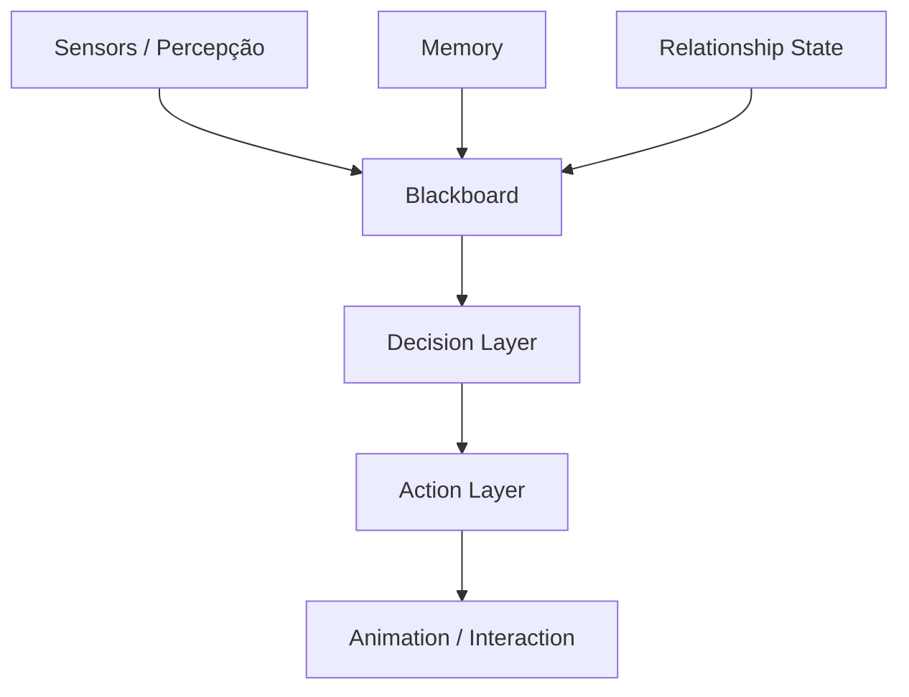

A camada de decisão pode começar simples:

- FSM;
    
- Utility AI;
    
- behavior tree básica;
    
- schedules;
    
- priority actions.
    

E evoluir depois para:

- GOAP;
    
- HTN;
    
- multi-objective planning;
    
- MORL futuramente.
    

---

# 5. MORL — Fora do MVP, mas preparado

O sistema deve ser modular para permitir **MORL** depois, mas não deve depender disso no MVP.

## 5.1 No MVP

Usar:

- FSM para estados simples;
    
- Utility AI para decisões locais;
    
- Behavior Trees para combate/serviço;
    
- Blackboard para dados;
    
- Schedule System para rotinas.
    

## 5.2 Futuro

MORL pode entrar para NPCs com múltiplos objetivos:

- lucro;
    
- segurança;
    
- lealdade;
    
- fome;
    
- medo;
    
- corrupção;
    
- reputação;
    
- risco;
    
- ambição;
    
- vínculo com jogador.
    

Fórmula conceitual futura:

$$  
Reward_{npc} =  
w_1Profit +  
w_2Safety +  
w_3Loyalty +  
w_4Survival +  
w_5Reputation -  
w_6Risk  
$$

Mas isso é **camada futura**, não dependência do MVP.

---

# 6. Core Loop — NPC do Hub

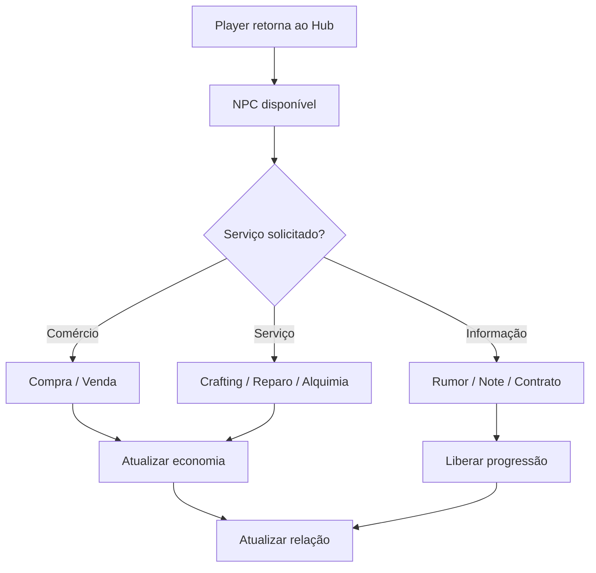

---

# 7. Core Loop — NPC Explorador

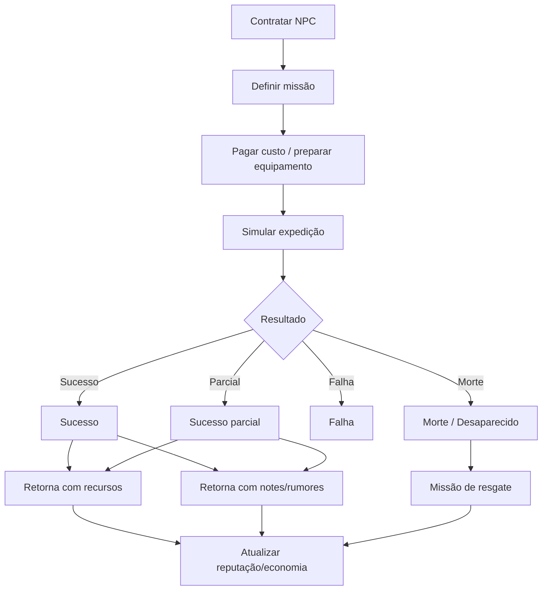

---

# 8. Core Loop — NPC de Dungeon

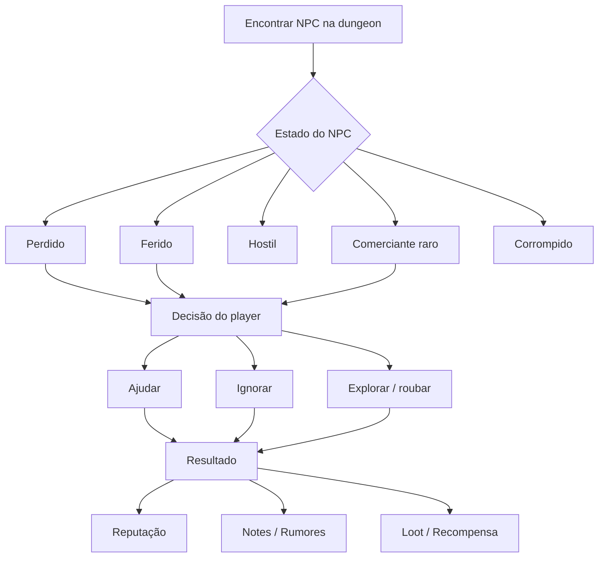

---

# 9. Sistemas Internos de NPC

## 9.1 NPC Identity

Cada NPC deve ter identidade estável.

| Campo                  | Função               |
|------------------------|----------------------|
| `npc_id`               | identificador único  |
| `display_name_key`     | nome localizado      |
| `npc_type`             | tipo funcional       |
| `faction_id`           | facção               |
| `home_location`        | local base           |
| `service_profile`      | serviços disponíveis |
| `relationship_profile` | relação com player   |
| `schedule_profile`     | rotina               |
| `risk_profile`         | coragem/medo/perigo  |
| `memory_state`         | eventos lembrados    |
| `economic_profile`     | compra/venda/salário |
| `dialogue_profile`     | falas e rumores      |

---

## 9.2 NPC State

Estados comuns:

| Estado    | Descrição          |
|-----------|--------------------|
| Idle      | sem tarefa         |
| Working   | executando serviço |
| Trading   | negociando         |
| Resting   | descansando        |
| Traveling | deslocando         |
| Exploring | em missão          |
| Injured   | ferido             |
| Afraid    | com medo           |
| Hostile   | hostil             |
| Corrupted | corrompido         |
| Missing   | desaparecido       |
| Dead      | morto              |
| Rescued   | resgatado          |

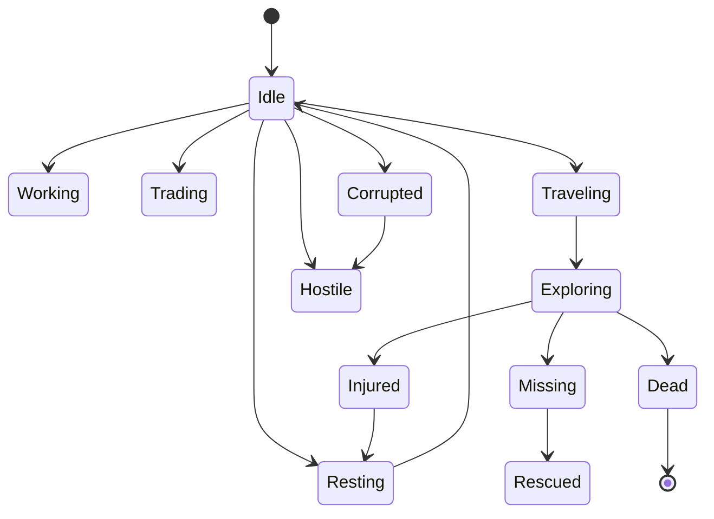

---

# 10. Serviços de NPC

## 10.1 Serviços por tipo

| NPC            | Serviços                                       |
|----------------|------------------------------------------------|
| Blacksmith     | forja, reparo, ligas, identificação de metal   |
| Alchemist      | poções, identificação, transmutação, antídotos |
| Cook           | receitas, buffs alimentares, preparo comercial |
| Merchant       | compra/venda, contratos, avaliação             |
| Cartographer   | notes, mapas parciais, localização de corpse   |
| Informant      | rumores, boss gate, preço, facções             |
| Priest         | purificação, bênçãos, sacrifícios              |
| Healer         | cura, veneno, corrupção leve                   |
| Trainer        | skills e perks                                 |
| Recruiter      | contratação de NPCs                            |
| Storage Keeper | stash, seguro, transporte                      |
| Guild Clerk    | board de contratos                             |

---

## 10.2 Fórmula de qualidade do serviço

## $$  
ServiceQuality =  
Skill_{npc}  
+  
RelationshipBonus  
+  
StationQuality  
+  
MaterialQuality

WorkloadPenalty  
$$

Com clamp:

$$  
ServiceQuality = clamp(ServiceQuality, 0, 1)  
$$

---

## 10.3 Preço do serviço

$$  
ServicePrice =  
BasePrice  
\cdot  
TierModifier  
\cdot  
DemandModifier  
\cdot  
RelationshipModifier  
$$

NPCs com melhor relação podem:

- cobrar menos;
    
- revelar informação;
    
- aceitar troca;
    
- priorizar pedido;
    
- oferecer missão especial.
    

---

# 11. Reputação e Relacionamento

## 11.1 Reputação

Reputação mede a imagem geral do player.

| Ação                    | Efeito                          |
|-------------------------|---------------------------------|
| completar contrato      | reputação sobe                  |
| salvar NPC              | reputação sobe                  |
| abandonar NPC ferido    | reputação cai                   |
| vender item raro        | reputação sobe com comerciantes |
| roubar NPC              | reputação cai                   |
| causar colapso no Hub   | reputação cai                   |
| derrotar boss           | reputação sobe                  |
| voltar muito corrompido | medo/desconfiança               |

---

## 11.2 Relação individual

Cada NPC pode ter relação própria com o jogador.

| Estado     | Comportamento             |
|------------|---------------------------|
| Hostile    | recusa serviço ou ataca   |
| Suspicious | preços piores             |
| Neutral    | serviço normal            |
| Friendly   | desconto leve             |
| Trusted    | informações melhores      |
| Loyal      | ajuda especial            |
| Devoted    | risco pessoal pelo player |

---

## 11.3 Fórmula de relacionamento

# $$  
Relationship_{npc}

## BaseRelation  
+  
HelpScore  
+  
TradeScore  
+  
QuestScore

## BetrayalScore

FearScore  
$$

---

# 12. Rumores, Notes e Informação

NPCs são fonte e destino de informação.

## 12.1 Tipos de informação

| Informação     | Exemplo                                  |
|----------------|------------------------------------------|
| Dungeon Rumor  | “há rachaduras no Floor 05”              |
| Market Rumor   | “cristal está saturado”                  |
| Monster Rumor  | “morcegos odeiam metal vibrando”         |
| Boss Rumor     | “o selo do décimo andar mudou”           |
| Resource Rumor | “obsidiana apareceu em cavernas quentes” |
| Corpse Rumor   | “um corpo foi visto perto do shaft”      |
| Alchemy Rumor  | “fungo azul reage com álcool”            |
| Crafting Rumor | “ferro negro precisa de flux puro”       |

---

## 12.2 Validade da informação

Nem todo rumor é verdade.

| Estado      | Descrição                  |
|-------------|----------------------------|
| True        | informação correta         |
| Partial     | parcialmente correta       |
| Outdated    | era correta antes do reset |
| False       | boato errado               |
| Manipulated | NPC mentiu ou omitiu       |
| Unknown     | não verificado             |

Fórmula de confiança:

$$  
RumorConfidence =  
NPCTrust  
\cdot  
InformationFreshness  
\cdot  
SourceReliability  
$$

---

## 12.3 Integração com Notes

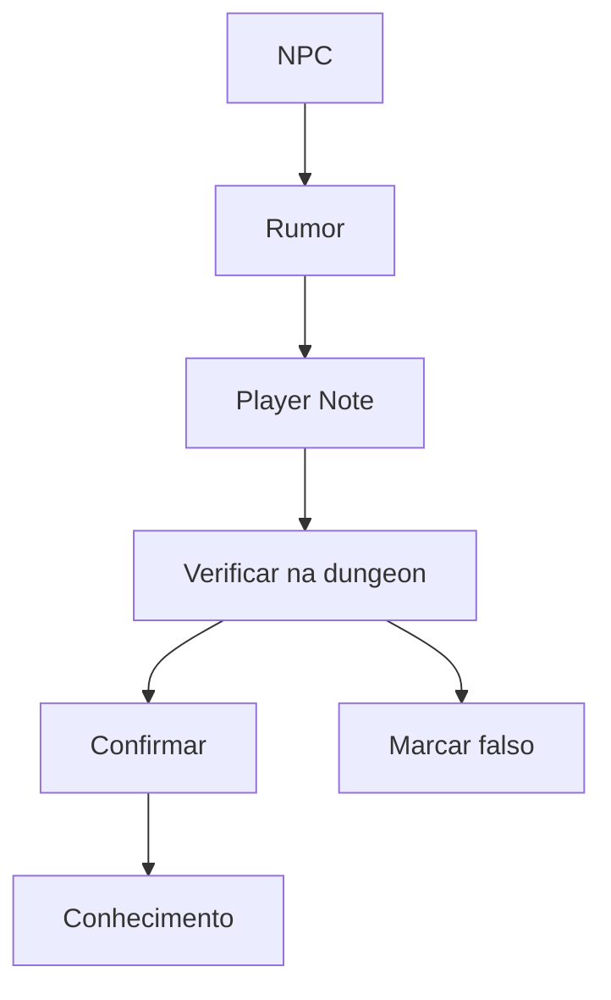

---

# 13. NPC Economy

## 13.1 NPCs como compradores

NPCs podem ter preferências.

| NPC          | Compra melhor                                 |
|--------------|-----------------------------------------------|
| Blacksmith   | minério, lingote, arma, ferramenta            |
| Alchemist    | reagente, cristal, glândula, solvente         |
| Cook         | carne, fungo, tempero, sal                    |
| Priest       | relíquia sagrada, osso santo, item purificado |
| Collector    | artefato, raridade, boss drop                 |
| Hunter       | couro, osso, parte de monstro                 |
| Cartographer | notes, mapas, marcas de rota                  |

---

## 13.2 NPCs como vendedores

NPCs não devem ter estoque infinito.

Estoque depende de:

- tier do Hub;
    
- economia semanal;
    
- contratos;
    
- recursos vendidos pelo player;
    
- rotas abertas;
    
- boss gates derrotados;
    
- reputação;
    
- facção.
    

Regra:

$$  
NPCStock \not= InfiniteStock  
$$

---

## 13.3 Preço de NPC

$$  
NPCPrice =  
BaseValue  
\cdot  
DemandModifier  
\cdot  
RelationshipModifier  
\cdot  
StockModifier  
\cdot  
RarityModifier  
$$

---

# 14. NPC Explorador

## 14.1 Função

O NPC Explorador é automação parcial, não substituição do jogador.

Ele pode:

- explorar andar conhecido;
    
- buscar recurso específico;
    
- gerar rumor;
    
- encontrar corpse;
    
- mapear sala;
    
- desaparecer;
    
- morrer;
    
- pedir resgate;
    
- retornar corrompido;
    
- trazer item danificado.
    

---

## 14.2 Regra de balanceamento

$$  
NPCYieldRate < PlayerYieldRate  
$$

Sempre.

O NPC pode ajudar, mas nunca deve ser melhor que o gameplay ativo.

---

## 14.3 Fórmula de sucesso

## $$  
MissionSuccess =  
Skill_{npc}  
+  
EquipmentQuality  
+  
KnownRouteBonus  
+  
PlayerNotesBonus

## FloorDanger

## DepthPenalty

CorruptionRisk  
$$

Com clamp:

$$  
MissionSuccess = clamp(MissionSuccess, 0, 1)  
$$

---

## 14.4 Resultado de missão

| Resultado    | Efeito                              |
|--------------|-------------------------------------|
| Sucesso      | retorna com loot e relatório        |
| Parcial      | traz pouco loot, ferido ou atrasado |
| Falha        | retorna sem loot                    |
| Desaparecido | gera missão de resgate              |
| Morto        | corpo pode aparecer na dungeon      |
| Corrompido   | volta alterado ou vira inimigo      |
| Traição      | rouba item ou vende informação      |

---

# 15. NPCs e Dungeon

## 15.1 NPCs encontrados na dungeon

NPCs podem aparecer como:

- sobreviventes;
    
- cadáveres;
    
- exploradores rivais;
    
- comerciantes raros;
    
- cultistas;
    
- feridos;
    
- prisioneiros;
    
- guias;
    
- traidores;
    
- corrompidos.
    

---

## 15.2 Geração por evento

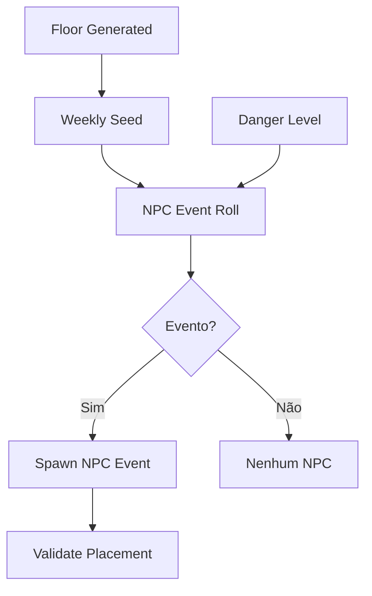

---

## 15.3 Restrições

NPCs não podem:

- spawnar em boss gate bloqueado;
    
- revelar rota final sem custo;
    
- gerar loot infinito;
    
- ignorar danger budget;
    
- quebrar stealth/hive system;
    
- carregar simulação pesada fora de interesse;
    
- atravessar floors sem regra de loading.
    

---

# 16. IA Modular

## 16.1 Camadas de IA

| Camada       | Função                          |
|--------------|---------------------------------|
| Sensors      | visão, audição, cheiro, eventos |
| Blackboard   | estado compartilhado            |
| Needs        | fome, medo, trabalho, descanso  |
| Schedule     | rotina diária                   |
| Decision     | escolha de ação                 |
| Action       | execução                        |
| Memory       | eventos relevantes              |
| Relationship | relação com player/facções      |
| Navigation   | pathfinding e locais            |
| Dialogue     | fala e reação                   |

---

## 16.2 Percepção

NPCs devem perceber:

- player próximo;
    
- perigo;
    
- ruído;
    
- monstro;
    
- fogo;
    
- item valioso;
    
- queda;
    
- corpse;
    
- combate;
    
- crime;
    
- corrupção;
    
- pedido de ajuda.
    

Fórmula simplificada:

## $$  
PerceptionScore =  
Vision  
+  
Hearing  
+  
ContextAwareness

## Obstruction

Distraction  
$$

---

## 16.3 Utility AI

Para decisões simples:

## $$  
Utility(action) =  
NeedWeight  
+  
ContextScore  
+  
RelationshipScore

## RiskScore

CostScore  
$$

NPC escolhe:

$$  
Action = \arg\max Utility(action)  
$$

---

## 16.4 Behavior Tree para serviços

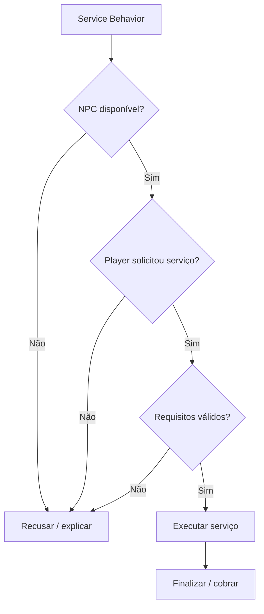

---

# 17. Diálogo

## 17.1 Tipos de diálogo

| Tipo         | Uso                         |
|--------------|-----------------------------|
| Greeting     | cumprimento                 |
| Service      | abrir serviço               |
| Rumor        | informação                  |
| Quest        | contrato/missão             |
| Reaction     | comentário sobre evento     |
| Relationship | fala baseada em relação     |
| Warning      | alerta                      |
| Trade        | negociação                  |
| Lore         | mundo                       |
| Dynamic      | baseado em estado sistêmico |

---

## 17.2 Variáveis de diálogo

Diálogos devem reagir a:

- reputação;
    
- floor alcançado;
    
- boss derrotado;
    
- recursos vendidos;
    
- corrupção do player;
    
- morte de NPC;
    
- economia saturada;
    
- contrato ativo;
    
- note validada;
    
- resgate realizado;
    
- falha de missão.
    

Exemplo:

| Condição          | Fala                                              |
|-------------------|---------------------------------------------------|
| player salvou NPC | “Eu não esqueci o que você fez lá embaixo.”       |
| mercado saturado  | “Cristal? Todo mundo trouxe cristal esta semana.” |
| boss derrotado    | “Então o selo realmente caiu...”                  |
| player corrompido | “Você trouxe algo da escuridão com você.”         |

---

# 18. Facções

## 18.1 Tipos de facção

| Facção                  | Função                          |
|-------------------------|---------------------------------|
| Guilda dos Exploradores | contratos, ranking, expedições  |
| Ferreiros do Hub        | crafting/forging                |
| Círculo Alquímico       | alchemy, reagentes, pesquisa    |
| Cozinheiros/Taverna     | food, descanso, rumores         |
| Igreja/Ordem            | purificação, deuses, corrupção  |
| Mercadores              | economia, preços, rotas         |
| Cartógrafos             | notes, mapas, dungeon logs      |
| Cultistas               | corrupção, boss gates, risco    |
| Caçadores               | bestiário, harvesting, monstros |

---

## 18.2 Reputação por facção

## $$  
FactionReputation =  
ContractScore  
+  
TradeScore  
+  
RescueScore

## CrimeScore

BetrayalScore  
$$

Facções podem:

- liberar serviços;
    
- bloquear serviços;
    
- oferecer descontos;
    
- enviar NPCs;
    
- vender informação;
    
- comprar itens raros;
    
- manipular rumores.
    

---

# 19. Crime, Moralidade e Consequência

## 19.1 Ações negativas

| Ação                          | Consequência            |
|-------------------------------|-------------------------|
| roubar NPC                    | reputação cai           |
| atacar NPC                    | hostilidade             |
| abandonar resgate             | medo/desconfiança       |
| vender item corrompido oculto | penalidade futura       |
| sabotar economia              | preços piores           |
| entregar NPC a culto          | facção religiosa hostil |
| matar comerciante             | serviço indisponível    |

---

## 19.2 Sistema simples de consequência

## $$  
ConsequenceScore =  
CrimeSeverity  
\cdot  
WitnessCount  
\cdot  
FactionImportance

BribeOrReputationBuffer  
$$

---

# 20. NPCs e Sistemas Principais

## 20.1 Economia

NPCs:

- compram;
    
- vendem;
    
- geram demanda;
    
- criam contratos;
    
- saturam mercado;
    
- espalham rumor econômico.
    

---

## 20.2 Cooking

NPCs:

- ensinam receitas;
    
- compram ingredientes;
    
- vendem comida;
    
- validam toxicidade;
    
- criam buffs sociais/taverna.
    

---

## 20.3 Bestiário

NPCs:

- confirmam monster notes;
    
- compram partes;
    
- ensinam fraquezas;
    
- caçadores validam anatomia.
    

---

## 20.4 Notes

NPCs:

- vendem rumores;
    
- compram mapas;
    
- validam notes;
    
- roubam notes;
    
- espalham informação falsa.
    

---

## 20.5 Mining

NPCs:

- compram minério;
    
- vendem ferramentas;
    
- informam veios;
    
- mineradores contratáveis.
    

---

## 20.6 Crafting/Forging

NPCs:

- forjam;
    
- reparam;
    
- identificam ligas;
    
- treinam crafting;
    
- aceitam contratos.
    

---

## 20.7 Alchemy

NPCs:

- identificam reagentes;
    
- vendem solventes;
    
- criam poções;
    
- compram glândulas;
    
- validam fórmulas.
    

---

# 21. Multiplayer

## 21.1 Autoridade

Em multiplayer, o servidor valida:

- compra/venda;
    
- contrato;
    
- reputação;
    
- morte de NPC;
    
- missão de NPC explorador;
    
- serviços;
    
- estoque;
    
- diálogo com consequência;
    
- geração de rumors;
    
- contratação.
    

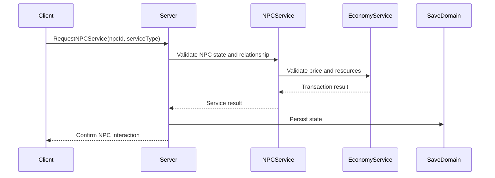

---

## 21.2 Interest Management

Players não precisam receber todos os NPCs sempre.

Recebem:

- NPCs próximos;
    
- NPCs do Hub atual;
    
- NPCs relacionados à party;
    
- summary de NPC explorador;
    
- eventos de NPC relevante;
    
- contratos compartilhados.
    

Não recebem:

- simulação completa de todos os NPCs;
    
- rotinas de NPCs distantes;
    
- estoque oculto completo;
    
- informações de outra party;
    
- diálogo privado de outro player sem contexto.
    

---

# 22. Persistência

## 22.1 O que salvar

| Dado                    | Domínio       | Duração           |
|-------------------------|---------------|-------------------|
| NPCs importantes        | World/Meta    | permanente        |
| NPCs genéricos          | World/session | temporário        |
| relação individual      | Meta          | permanente        |
| reputação por facção    | Meta          | permanente        |
| estoque de NPC          | Shop/World    | weekly/permanente |
| contratos               | Shop/World    | até conclusão     |
| NPC explorador          | Shop/Meta     | permanente        |
| missão de NPC           | World/session | até resolver      |
| morte de NPC importante | World/Meta    | permanente        |
| rumores                 | World/Weekly  | semanal           |
| diálogo desbloqueado    | Meta          | permanente        |

---

## 22.2 Fórmula de save

$$  
NPCSave =  
ImportantNPCStates  
+  
FactionReputation  
+  
RelationshipStates  
+  
ActiveContracts  
+  
NPCMissions  
+  
ServiceUnlocks  
+  
RumorState  
$$

---

# 23. Modelo de Dados

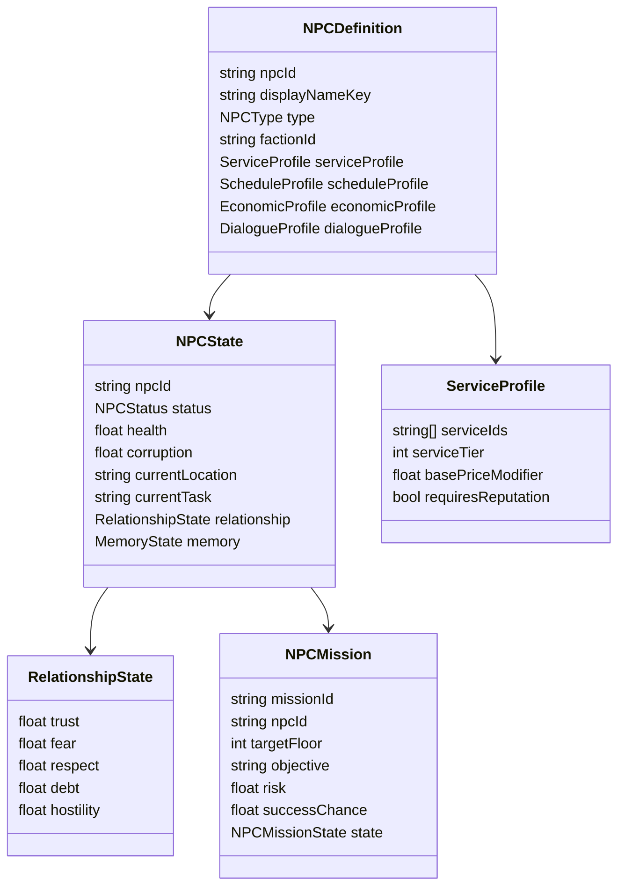

---

# 24. Estrutura de Scripts Recomendada

| Pasta              | Arquivos                                                                                            |
|--------------------|-----------------------------------------------------------------------------------------------------|
| `NPC/Core`         | `NPCDefinition.cs`, `NPCState.cs`, `NPCType.cs`, `NPCStatus.cs`                                     |
| `NPC/Services`     | `NPCServiceProfile.cs`, `NPCServiceResolver.cs`, `NPCServiceTransaction.cs`                         |
| `NPC/Economy`      | `NPCPricingService.cs`, `NPCStockService.cs`, `NPCBuyerPreference.cs`                               |
| `NPC/Relationship` | `RelationshipState.cs`, `RelationshipService.cs`, `FactionReputationService.cs`                     |
| `NPC/Rumors`       | `RumorDefinition.cs`, `RumorService.cs`, `RumorValidationService.cs`                                |
| `NPC/Dialogue`     | `DialogueProfile.cs`, `DialogueConditionResolver.cs`, `DynamicDialogueService.cs`                   |
| `NPC/Schedule`     | `ScheduleProfile.cs`, `ScheduleService.cs`, `NPCRoutineController.cs`                               |
| `NPC/AI`           | `NPCBlackboard.cs`, `NPCSensorController.cs`, `NPCDecisionService.cs`, `UtilityDecisionResolver.cs` |
| `NPC/Explorer`     | `NPCExplorerProfile.cs`, `NPCMission.cs`, `NPCMissionSimulator.cs`, `NPCMissionResultResolver.cs`   |
| `NPC/Dungeon`      | `DungeonNPCSpawner.cs`, `NPCRescueEvent.cs`, `NPCCorpseEvent.cs`                                    |
| `NPC/Networking`   | `ServerNPCService.cs`, `NPCRpcController.cs`, `NPCVisibilityResolver.cs`                            |
| `NPC/Persistence`  | `NPCSaveData.cs`, `NPCStateSave.cs`, `RelationshipSave.cs`, `FactionSave.cs`                        |
| `NPC/UI`           | `NPCInteractionView.cs`, `NPCDialogueView.cs`, `NPCServiceView.cs`, `NPCRecruitmentView.cs`         |

---

# 25. Pipeline Técnico

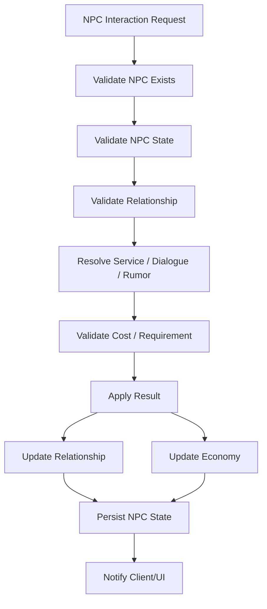

---

# 26. Validação

## 26.1 Constraints obrigatórias

| Constraint                            | Regra                                     |
|---------------------------------------|-------------------------------------------|
| `npc_exists`                          | NPC precisa existir                       |
| `npc_state_allows_interaction`        | NPC morto/desaparecido não presta serviço |
| `service_exists`                      | serviço precisa estar definido            |
| `relationship_checked`                | relação afeta preço/serviço               |
| `faction_reputation_checked`          | facção pode bloquear serviço              |
| `stock_is_not_infinite`               | estoque não é infinito                    |
| `transaction_is_server_authoritative` | client não decide transação               |
| `npc_mission_has_risk`                | missão de NPC precisa risco               |
| `npc_yield_less_than_player_yield`    | NPC não supera player                     |
| `rumor_has_confidence_state`          | rumor pode ser falso/parcial              |
| `important_npc_death_persisted`       | morte importante salva                    |
| `npc_does_not_bypass_boss_gate`       | NPC não quebra progressão                 |

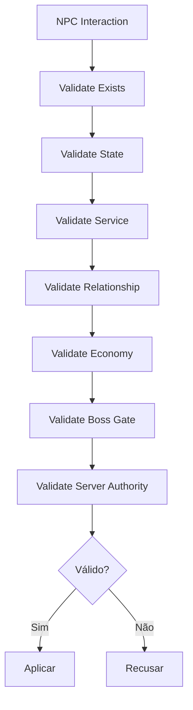

---

# 27. Roadmap de Fase

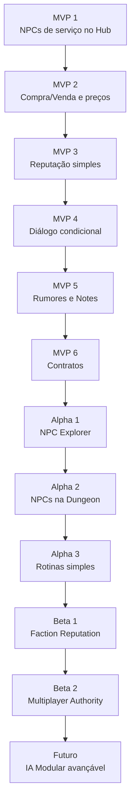

## 27.1 Escopo por Fase

| Fase   | Entrega                                   |
|--------|-------------------------------------------|
| MVP 1  | Blacksmith, Merchant, Alchemist, Cook     |
| MVP 2  | compra/venda com estoque limitado         |
| MVP 3  | relação simples: neutral/friendly/hostile |
| MVP 4  | falas condicionais por evento             |
| MVP 5  | rumores transformáveis em notes           |
| MVP 6  | board de contratos                        |
| Alpha 1 | NPC Explorer com risco/custo/falha       |
| Alpha 2 | Lost/Wounded NPC na dungeon              |
| Alpha 3 | rotina simples no Hub                    |
| Beta 1 | facções e reputação                       |
| Beta 2 | servidor valida interações                |
| Futuro | blackboard + utility AI expansível        |

---

# 28. Non-Goals

Não implementar no primeiro ciclo:

- simulação completa de cidade;
    
- LLM para todos os diálogos;
    
- rotina complexa de todos os NPCs;
    
- economia totalmente autônoma;
    
- NPC explorador melhor que player;
    
- NPC gerando recursos sem risco;
    
- romance complexo;
    
- MORL no MVP;
    
- facções com guerra sistêmica completa;
    
- diálogo infinito;
    
- NPCs atravessando boss gates;
    
- simulação pesada de NPCs em floors descarregados;
    
- estoque infinito;
    
- contratos que não consomem itens reais.
    

---

# 29. Critérios de Aceite

O NPC System está aceitável quando:

- no MVP, existem NPCs funcionais no Hub;
    
- cada NPC relevante possui serviço claro;
    
- serviços têm custo e requisito;
    
- estoque não é infinito;
    
- reputação altera preço ou acesso;
    
- NPCs podem gerar rumores;
    
- rumores podem virar notes;
    
- NPCs podem oferecer contratos;
    
- em Alpha, NPC Explorer tem custo, risco e falha;
    
- em Alpha, NPC Explorer não supera rendimento do player;
    
- NPCs de dungeon podem ser encontrados/resgatados;
    
- eventos importantes afetam memória/reputação;
    
- facções podem bloquear/liberar serviços;
    
- multiplayer é server-authoritative;
    
- NPCs não burlam boss gates;
    
- IA é modular e expansível para stealth/GOAP/HTN/MORL futuro;
    
- simulação fora de interesse é leve.
    

---

# 30. Definição Final para o GDD Principal

## NPC System

O NPC System define personagens sociais, comerciais, operacionais e exploratórios de Ashvault. NPCs não são apenas decoração: eles vendem serviços, compram recursos, oferecem contratos, espalham rumores, validam notes, reagem à reputação do jogador e conectam o Hub à dungeon.

NPCs do Hub incluem comerciantes, ferreiros, alquimistas, cozinheiros, curandeiros, informantes, cartógrafos, treinadores, sacerdotes, guardas e recrutadores. NPCs de dungeon incluem exploradores perdidos, feridos, rivais, cadáveres, comerciantes raros, prisioneiros e corrompidos. NPCs contratáveis podem explorar, carregar, minerar, proteger, reparar ou ajudar em produção, mas sempre com custo, risco, tempo e chance de falha.

A economia dos NPCs respeita a economia fechada. NPCs não geram recursos infinitos nem dinheiro passivo. Estoque, serviços e preços dependem de reputação, demanda, relação, contratos, boss gates, recursos vendidos e weekly state. O NPC Explorer é automação parcial de Alpha ou posterior e nunca deve superar o jogador ativo.

NPCs possuem relação individual e reputação por facção. Ajudar, salvar, negociar e completar contratos melhora relação. Roubar, abandonar, trair ou vender itens corrompidos pode gerar penalidade. NPCs importantes possuem memória persistente de eventos relevantes.

Rumores são parte central do sistema. NPCs podem fornecer informações verdadeiras, parciais, falsas ou desatualizadas sobre monstros, mercado, recursos, boss gates, corpse, crafting, alchemy e dungeon. Rumores podem virar notes e ser confirmados pelo jogador.

Rumores usam `KnowledgeRuntime` para `source`, `confidence`, `state`, `scope` e `loss_policy`. O NPC System decide acesso, preço e contexto social; ele não mantém state machine paralela de conhecimento.

A IA deve ser modular. O MVP pode usar FSM, Utility AI, Behavior Trees simples, schedules e blackboard. A arquitetura deve permitir evolução futura para GOAP, HTN e MORL, mas MORL não é requisito do MVP.

No multiplayer, o servidor valida interações, serviços, estoque, contratos, missões, reputação, morte e contratação de NPCs. Clients apenas solicitam e exibem resultados confirmados. NPCs respeitam interest management: jogadores não recebem simulação completa de NPCs fora de seu contexto.

---

# 31. Resumo Final

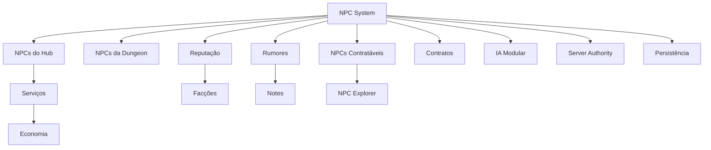

**Regra final:**  
**NPCs são a camada social e operacional de Ashvault.** Eles transformam o Hub em um lugar vivo, a dungeon em uma fonte de histórias e a economia em uma rede de relações, riscos, serviços, rumores e consequências.
