> **Projeto:** Dungeon Explorer: Ashvault  
> **Documento:** GDD específico de biomas  
> **Escopo:** biomas, transições, invasões de bioma, parâmetros de geração, impacto em salas, quedas, cordas, hazards, recursos, visual e validação.  
> **Fora de escopo direto:** IA completa, Hive System completo, economia detalhada, cooking, bestiário e MORL.

Este documento complementa o GDD de geração da dungeon. A base anterior já define a dungeon como uma estrutura vertical procedural, semanal, carregada por andares, com escada, queda, corda, boss gate, runtime deltas e validação por constraints. O sistema de biomas deve operar **em cima dessa estrutura**, sem quebrar boss gates, streaming por andar, Fall Origin/Fall Landing ou regras de multiplayer.

---

# 1. High Concept

O **Biome System** define a identidade ambiental, estrutural e sistêmica de cada região da dungeon.

Bioma não é apenas visual. Cada bioma altera:
- forma das salas;
- chance de buracos;
- densidade de hazards;
- altura de teto;
- chance de shafts;
- recursos;
- iluminação;
- materiais;
- som ambiente;
- regras de queda;
- regras de corda;
- compatibilidade com retrofit;
- dificuldade ambiental.

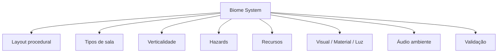

A regra central:
**Bioma modifica o comportamento da dungeon, não apenas a aparência.**

---

# 2. Papel do Bioma na Dungeon

Cada andar possui pelo menos um bioma principal.

Opcionalmente, o andar pode ter:
- bioma secundário;
- zona de transição;
- invasão de bioma;
- microbiomas;
- salas contaminadas por outro bioma;
- boss biome override.

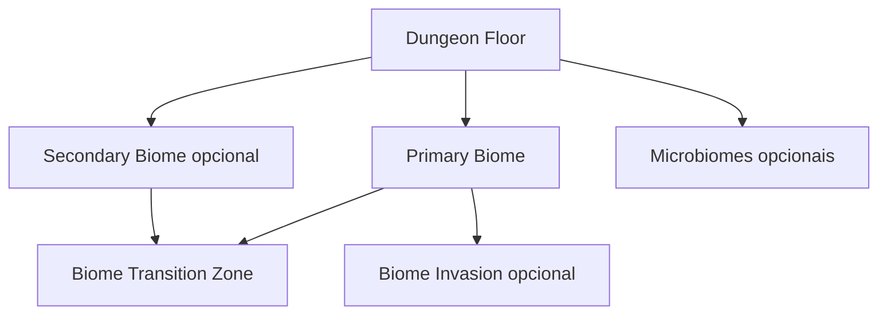

---

# 3. Fundamento Técnico

## 3.1 Biomas como dados

Os biomas devem ser data-driven. Em Unity, `ScriptableObject` é apropriado para isso porque funciona como container de dados compartilhados entre objetos, reduzindo duplicação de valores em instâncias e separando dados de lógica. ([Unity Manual](https://docs.unity3d.com/6000.4/Documentation/Manual/class-ScriptableObject.html?utm_source=chatgpt.com "ScriptableObject"))

Cada bioma deve ser uma definição reutilizável, por exemplo:

| Campo                | Função                          |
|----------------------|---------------------------------|
| `biome_id`           | identificador estável           |
| `display_name`       | nome exibido                    |
| `generation_weights` | pesos de geração                |
| `room_rules`         | regras de salas                 |
| `verticality_rules`  | regras de queda, shaft e teto   |
| `hazard_rules`       | hazards ambientais              |
| `resource_rules`     | recursos e materiais coletáveis |
| `visual_set`         | materiais, prefabs e iluminação |
| `audio_set`          | ambiência e efeitos             |
| `validation_rules`   | constraints específicas         |

---

## 3.2 Noise para distribuição orgânica

Para evitar divisões artificiais entre biomas, o sistema pode usar mapas de ruído. A função `Mathf.PerlinNoise` da Unity gera padrões pseudoaleatórios suaves em 2D, úteis para textura, animação e geração de heightmaps/terreno; esse mesmo princípio pode ser usado como máscara de influência de bioma. ([Unity Manual](https://docs.unity3d.com/6000.4/Documentation/ScriptReference/Mathf.PerlinNoise.html?utm_source=chatgpt.com "Scripting API: Mathf.PerlinNoise"))

A influência de um bioma pode ser calculada por:

$$  
I_b(x,z) = Noise_b(x \cdot s_b, z \cdot s_b)  
$$

Onde:

| Termo      | Descrição                                  |
|------------|--------------------------------------------|
| $I_b(x,z)$ | influência do bioma $b$ na posição $(x,z)$ |
| $Noise_b$  | função de ruído associada ao bioma         |
| $s_b$      | escala do ruído                            |
| $x,z$      | coordenadas locais do andar                |

---

# 4. Tipos de Bioma

## 4.1 Lista inicial

| Bioma            | Função principal                                            |
|------------------|-------------------------------------------------------------|
| Caverna Natural  | base orgânica, fendas, shafts e queda                       |
| Ruína Antiga     | salas artificiais, portas, pilares e colapsos               |
| Gelo             | controle de movimento, piso escorregadio e quedas perigosas |
| Lava             | dano ambiental, calor, colapso e risco alto                 |
| Cristal          | iluminação emissiva, recursos raros e ressonância           |
| Cogumelos        | névoa, umidade, esporos e salas orgânicas                   |
| Abismo           | verticalidade extrema, pouca segurança, quedas profundas    |
| Raízes Profundas | vegetação subterrânea, bloqueios naturais e túneis vivos    |
| Ossuário         | restos antigos, salas macabras e hazards físicos            |
| Ruína Híbrida    | construção artificial invadida por caverna                  |

---

# 5. Bioma: Caverna Natural

## Conceito

A Caverna Natural é o bioma-base para verticalidade orgânica. Deve parecer um espaço escavado pela própria dungeon, com paredes irregulares, tetos altos e passagens naturais.

## Regras de geração

| Parâmetro                     | Valor inicial |
|-------------------------------|--------------:|
| `pit_chance`                  |          alta |
| `shaft_chance`                |          alta |
| `large_room_chance`           |         média |
| `corridor_irregularity`       |          alta |
| `fall_retrofit_compatibility` |          alta |
| `rope_anchor_stability`       |         média |
| `diggable_density`            |          alta |

## Elementos visuais

- paredes rochosas;
- teto alto;
- fendas verticais;
- poeira;
- cascalho;
- estalactites;
- pontes naturais;
- buracos orgânicos.

## Interação com queda

A queda é altamente compatível com esse bioma.

Quando o player cai, o retrofit deve criar:
- fenda no teto;
- shaft irregular;
- marca de impacto;
- detritos;
- abertura orgânica.

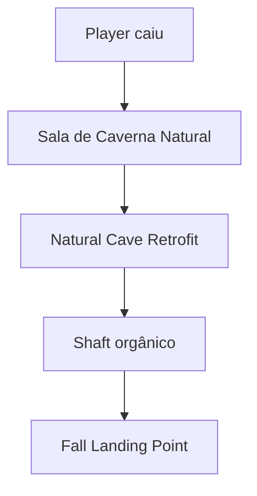

---

# 6. Bioma: Ruína Antiga

## Conceito

A Ruína Antiga representa arquitetura artificial soterrada. O espaço deve parecer construído por uma civilização anterior, agora quebrado pela dungeon.

## Regras de geração

| Parâmetro                     | Valor inicial |
|-------------------------------|--------------:|
| `pit_chance`                  |         média |
| `shaft_chance`                |         baixa |
| `large_room_chance`           |         média |
| `corridor_straightness`       |          alta |
| `fall_retrofit_compatibility` |         média |
| `rope_anchor_stability`       |          alta |
| `diggable_density`            |         baixa |

## Elementos visuais

- lajes;
- colunas;
- corredores retos;
- portas;
- escadas quebradas;
- tetos artificiais;
- rachaduras;
- símbolos antigos.

## Interação com queda

A queda precisa justificar o buraco.

O retrofit deve criar:
- laje quebrada;
- rachaduras no teto;
- detritos;
- rocha natural exposta;
- caverna alta acima da construção.

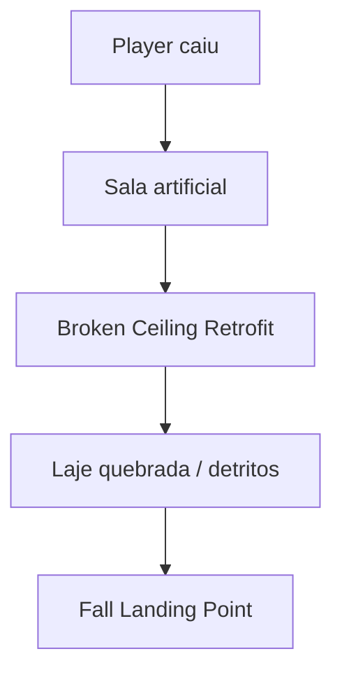

---

# 7. Bioma: Gelo

## Conceito

O bioma de Gelo altera navegação e risco. Ele deve criar sensação de instabilidade, escorregamento e dificuldade de controle em pontes, rampas e áreas próximas a abismos.

## Regras de geração

| Parâmetro                | Valor inicial |
|--------------------------|--------------:|
| `pit_chance`             |         média |
| `slippery_floor_density` |          alta |
| `bridge_risk`            |          alta |
| `fall_damage_multiplier` |         médio |
| `rope_anchor_stability`  |   baixa/média |
| `diggable_density`       |         baixa |

## Elementos visuais

- gelo azul;
- rachaduras;
- paredes congeladas;
- vapor frio;
- estalactites de gelo;
- reflexos;
- pontes congeladas.

## Regras sistêmicas

- piso pode reduzir controle;
- bordas podem ser mais perigosas;
- corda pode exigir ancoragem especial;
- quedas podem ser causadas por escorregamento;
- áreas de boss podem ter abismos visuais selados.

## Fórmula de escorregamento

$$  
controlFactor = 1 - slipperiness  
$$

Onde:

$$  
0 \le slipperiness \le 1  
$$

Se:

$$  
slipperiness = 0.35  
$$

Então:

$$  
controlFactor = 0.65  
$$

---

# 8. Bioma: Lava

## Conceito

O bioma de Lava é de alto risco ambiental. Ele deve pressionar o jogador com calor, dano passivo, colapsos e travessias perigosas.

## Regras de geração

| Parâmetro                | Valor inicial |
|--------------------------|--------------:|
| `pit_chance`             |         média |
| `hazard_density`         |          alta |
| `fall_damage_multiplier` |          alto |
| `bridge_risk`            |          alto |
| `rope_anchor_stability`  |         baixa |
| `diggable_density`       |         baixa |

## Elementos visuais

- rachaduras incandescentes;
- rios de lava;
- calor distorcendo o ar;
- fumaça;
- pedra queimada;
- pontes estreitas;
- plataformas instáveis.

## Fórmula de dano ambiental

$$  
D_{env} = D_{base} \cdot t \cdot H  
$$

Onde:

| Termo      | Descrição                |
|------------|--------------------------|
| $D_{env}$  | dano ambiental acumulado |
| $D_{base}$ | dano base por segundo    |
| $t$        | tempo de exposição       |
| $H$        | intensidade do hazard    |

---

# 9. Bioma: Cristal

## Conceito

Cristal é um bioma de recursos raros, iluminação emissiva e geometria vertical com formações rígidas. Ele deve criar áreas bonitas, perigosas e economicamente valiosas.

## Regras de geração

| Parâmetro                     | Valor inicial |
|-------------------------------|--------------:|
| `resource_density`            |          alta |
| `pit_chance`                  |         média |
| `shaft_chance`                |         média |
| `visibility`                  |          alta |
| `fall_retrofit_compatibility` |         média |
| `diggable_density`            |         média |

## Elementos visuais

- cristais emissivos;
- reflexos;
- paredes facetadas;
- estilhaços;
- pontes cristalinas;
- salas amplas;
- feixes de luz.

## Regras sistêmicas

- mineração gera ruído alto;
- cristais podem bloquear shafts;
- cristais podem selar camadas próximas a boss gates;
- quedas podem quebrar cristais no ponto de impacto.

---

# 10. Bioma: Cogumelos

## Conceito

Cogumelos é um bioma úmido, orgânico e denso. Deve gerar névoa, cobertura visual, superfícies macias e hazards por esporos.

## Regras de geração

| Parâmetro               | Valor inicial |
|-------------------------|--------------:|
| `fog_density`           |          alta |
| `spore_hazard_density`  |    média/alta |
| `pit_chance`            |         média |
| `soft_landing_chance`   |         média |
| `diggable_density`      |          alta |
| `rope_anchor_stability` |         média |

## Elementos visuais

- cogumelos gigantes;
- névoa baixa;
- esporos;
- musgo;
- paredes úmidas;
- chão macio;
- raízes finas.

## Fórmula de visibilidade

$$  
visibilityRange = V_{base} \cdot (1 - fogDensity)  
$$

Se:

$$  
fogDensity = 0.40  
$$

Então:

$$  
visibilityRange = 0.60 \cdot V_{base}  
$$

---

# 11. Bioma: Abismo

## Conceito

Abismo é o bioma de verticalidade extrema. Deve ser usado com cautela porque aumenta o risco de queda, separação de party e múltiplos floors ativos.

## Regras de geração

| Parâmetro                    | Valor inicial |
|------------------------------|--------------:|
| `deep_pit_chance`            |          alta |
| `abyssal_rift_chance`        |         média |
| `large_vertical_room_chance` |          alta |
| `rope_requirement`           |          alta |
| `fall_damage_multiplier`     |          alto |
| `host_budget_risk`           |          alto |

## Elementos visuais

- escuridão profunda;
- paredes verticais enormes;
- plataformas suspensas;
- pontes finas;
- vento vindo de baixo;
- ruído grave;
- shafts longos.

## Regra de segurança

No modo host/listen-server, o bioma Abismo deve respeitar:

$$  
ActiveFloors \le MaxActiveFloorsPerParty  
$$

Com MVP inicial:

$$  
MaxActiveFloorsPerParty = 2  
$$

Se uma queda no Abismo geraria um terceiro floor ativo, o sistema deve redirecionar ou bloquear a queda profunda.

---

# 12. Bioma: Raízes Profundas

## Conceito

Raízes Profundas representa uma camada viva, com raízes gigantes, túneis orgânicos e bloqueios naturais.

## Regras de geração

| Parâmetro                     | Valor inicial |
|-------------------------------|--------------:|
| `root_block_density`          |          alta |
| `diggable_density`            |         média |
| `rope_anchor_stability`       |          alta |
| `fall_retrofit_compatibility` |         média |
| `collapsed_path_chance`       |         média |

## Elementos visuais

- raízes grandes;
- paredes atravessadas por vegetação;
- túneis vivos;
- bloqueios naturais;
- teto sustentado por raízes;
- shafts parcialmente fechados.

## Uso no boss gate

Raízes podem representar o selo orgânico da camada.

Antes do boss:
- raízes bloqueiam shaft;
- corda enrosca;
- escavação não atravessa;
- queda é redirecionada.

Depois do boss:
- raízes recuam;
- abrem passagem;
- liberam escada ou shaft.

---

# 13. Bioma: Ossuário

## Conceito

O Ossuário é um bioma de restos, ossos, ruínas mortuárias e salas antigas de descarte. Ele deve criar tensão visual e hazards físicos.

## Regras de geração

| Parâmetro                     | Valor inicial |
|-------------------------------|--------------:|
| `bone_hazard_density`         |         média |
| `pit_chance`                  |         média |
| `collapsed_room_chance`       |          alta |
| `resource_density`            |         média |
| `fall_retrofit_compatibility` |         média |

## Elementos visuais

- ossos gigantes;
- crânios;
- pilhas de restos;
- corredores estreitos;
- câmaras funerárias;
- poços selados;
- paredes arranhadas.

## Regras sistêmicas

- queda pode espalhar ossos;
- corda pode prender em estruturas ósseas;
- algumas pontes podem ser ossos gigantes;
- boss floor pode usar poços visuais sem queda funcional.

---

# 14. Bioma: Ruína Híbrida

## Conceito

Ruína Híbrida é a união de construção artificial com caverna natural. É o melhor bioma para a estética central do projeto: construção antiga engolida pela dungeon vertical.

## Regras de geração

| Parâmetro                     | Valor inicial |
|-------------------------------|--------------:|
| `fall_retrofit_compatibility` |          alta |
| `collapsed_room_chance`       |          alta |
| `shaft_chance`                |    média/alta |
| `rope_anchor_stability`       |          alta |
| `diggable_density`            |         média |
| `large_room_chance`           |         média |

## Elementos visuais

- colunas quebradas;
- paredes de pedra artificial;
- rocha natural exposta;
- teto rompido;
- raízes ou cristais invadindo arquitetura;
- shafts atravessando salas;
- pontes quebradas.

## Função

Esse bioma deve ser usado como ponte entre estilos. Ele aceita bem:

- queda;
- retrofit;
- corda;
- Drunkard’s Walk local;
- sala colapsada;
- abismo visual;
- boss gate selado.

---

# 15. Seleção de Bioma por Floor

## 15.1 Bioma por camada

Cada camada de 10 andares pode ter um conjunto de biomas permitidos.

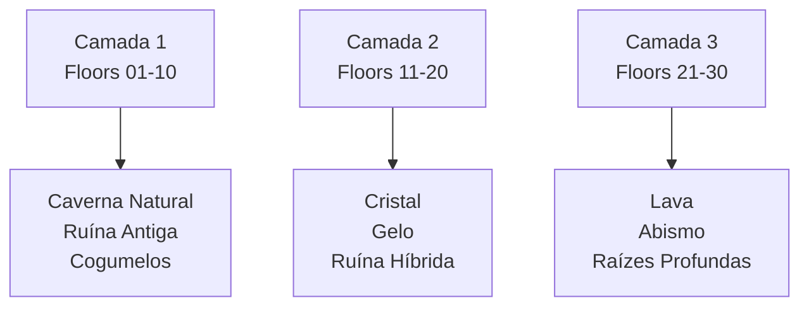

## 15.2 Fórmula de escolha

Cada bioma recebe um score:

$$  
Score_b = W_b + D_b + L_b + R_b - P_b  
$$

Onde:

| Termo | Descrição                    |
|-------|------------------------------|
| $W_b$ | peso base do bioma           |
| $D_b$ | bônus por profundidade       |
| $L_b$ | compatibilidade com a camada |
| $R_b$ | bônus por regra semanal      |
| $P_b$ | penalidade por repetição     |

O bioma escolhido é:

$$  
Biome = \arg\max_b(Score_b)  
$$

---

# 16. Transição de Biomas

## 16.1 Conceito

Transições evitam cortes bruscos entre biomas. Um andar pode conter bioma principal e secundário.

Exemplo:

- 0% a 60% do mapa: bioma principal;
- 60% a 80%: transição;
- 80% a 100%: bioma secundário.

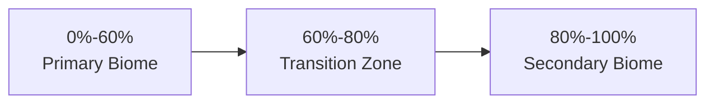

## 16.2 Fórmula de blend

Para uma posição $p$:

$$  
BiomeValue(p) = (1 - \alpha) \cdot B_{primary}(p) + \alpha \cdot B_{secondary}(p)  
$$

Onde:

$$  
0 \le \alpha \le 1  
$$

E:

| Valor de $\alpha$ | Resultado             |
|------------------:|-----------------------|
|               $0$ | 100% bioma principal  |
|             $0.5$ | mistura               |
|               $1$ | 100% bioma secundário |

---

# 17. Invasão de Bioma

## 17.1 Conceito

Invasão de bioma ocorre quando um bioma aparece dentro de outro de forma localizada, criando contraste e narrativa ambiental.

Exemplos:

| Bioma base      | Invasão                         |
|-----------------|---------------------------------|
| Ruína Antiga    | raízes atravessam corredores    |
| Caverna Natural | cristais crescem em shafts      |
| Gelo            | lava cria rachaduras derretidas |
| Cogumelos       | ossos e restos infectam sala    |
| Cristal         | abismo corta uma câmara         |

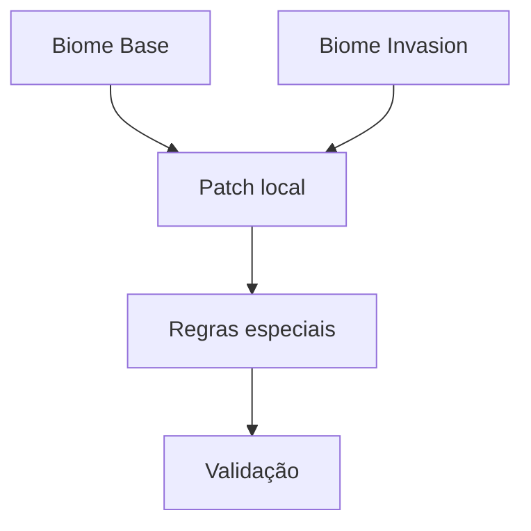

## 17.2 Fórmula de invasão

A invasão ocorre se:

$$  
Noise_{invasion}(p) > T_{invasion}  
$$

Onde:

| Termo                 | Descrição                     |
|-----------------------|-------------------------------|
| $Noise_{invasion}(p)$ | ruído local da invasão        |
| $T_{invasion}$        | threshold mínimo para invasão |

Recomendação inicial:

$$  
T_{invasion} = 0.75  
$$

---

# 18. Biomas e Verticalidade

Cada bioma altera a verticalidade.

| Bioma            |    Buracos |     Shafts | Corda | Queda profunda |
|------------------|-----------:|-----------:|------:|---------------:|
| Caverna Natural  |       alta |       alta | média |          média |
| Ruína Antiga     |      média |      baixa |  alta |          baixa |
| Gelo             |      média |      média | baixa |          média |
| Lava             |      média |      média | baixa |          média |
| Cristal          |      média |      média | média |          baixa |
| Cogumelos        |      média |      baixa | média |          baixa |
| Abismo           | muito alta | muito alta |  alta |           alta |
| Raízes Profundas |      média |      média |  alta |          baixa |
| Ossuário         |      média |      baixa | média |          baixa |
| Ruína Híbrida    |       alta |       alta |  alta |          média |

---

# 19. Biomas e Boss Gate

Biomas devem reforçar o bloqueio orgânico do boss gate.

| Bioma            | Selo da camada                        |
|------------------|---------------------------------------|
| Caverna Natural  | rocha densa e estrato fechado         |
| Ruína Antiga     | laje ritual ou mecanismo antigo       |
| Gelo             | gelo azul impenetrável                |
| Lava             | calor extremo ou rocha derretida      |
| Cristal          | cristal selado                        |
| Cogumelos        | micélio endurecido                    |
| Abismo           | vazio instável que redireciona queda  |
| Raízes Profundas | raízes gigantes bloqueando            |
| Ossuário         | ossos colossais fechando passagem     |
| Ruína Híbrida    | colapso estrutural misturado com selo |

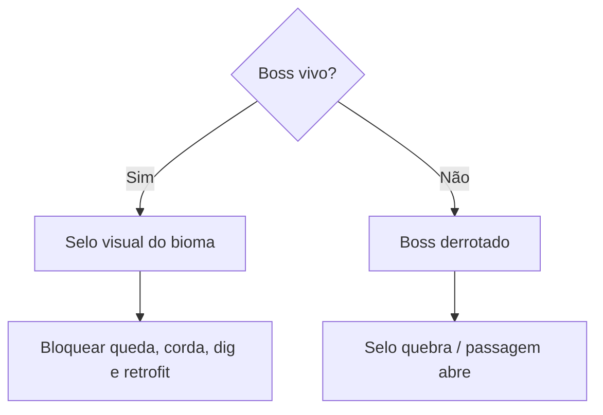

---

# 20. Biomas e Dynamic Fall Retrofit

Cada bioma define como uma queda adapta a sala.

| Bioma            | Retrofit esperado                                     |
|------------------|-------------------------------------------------------|
| Caverna Natural  | fenda orgânica e shaft natural                        |
| Ruína Antiga     | teto quebrado, laje caída e rocha exposta             |
| Gelo             | teto rachado, gelo quebrado e superfície escorregadia |
| Lava             | rachadura quente, pedra queimada e vapor              |
| Cristal          | cristais quebrados, estilhaços e luz emissiva         |
| Cogumelos        | cogumelos esmagados, esporos e chão macio             |
| Abismo           | shaft profundo, vento e pouca luz                     |
| Raízes Profundas | raízes partidas e abertura viva                       |
| Ossuário         | ossos quebrados e poeira                              |
| Ruína Híbrida    | colapso arquitetônico com caverna alta                |

---

# 21. Biomas e Corda

Cada bioma altera a estabilidade da corda.

## 21.1 Fórmula de estabilidade

$$  
S_{rope} = A_b + M_p - H_b  
$$

Onde:

| Termo      | Descrição                          |
|------------|------------------------------------|
| $S_{rope}$ | estabilidade final da corda        |
| $A_b$      | estabilidade de ancoragem do bioma |
| $M_p$      | modificador do ponto de ancoragem  |
| $H_b$      | penalidade de hazard do bioma      |

A corda é válida se:

$$  
S_{rope} \ge S_{min}  
$$

Recomendação inicial:

$$  
S_{min} = 0.5  
$$

---

# 22. Biomas e Drunkard’s Walk

Biomas também controlam como a escavação orgânica se comporta.

| Bioma            | Drunkard’s Walk                       |
|------------------|---------------------------------------|
| Caverna Natural  | livre e orgânico                      |
| Ruína Antiga     | limitado a rachaduras e colapsos      |
| Gelo             | abre rachaduras e cavernas congeladas |
| Lava             | altamente restrito                    |
| Cristal          | cria túnel facetado                   |
| Cogumelos        | cria túnel macio/orgânico             |
| Abismo           | cria shaft vertical com alto risco    |
| Raízes Profundas | segue túneis entre raízes             |
| Ossuário         | abre passagens por restos             |
| Ruína Híbrida    | mistura colapso artificial e caverna  |

---

# 23. Biomas e Weekly Season

A weekly seed deve influenciar:
- biomas disponíveis na semana;
- frequência de biomas;
- bioma dominante por camada;
- intensidade de invasões;
- chance de transições;
- variação visual.

## 23.1 Fórmula de variação semanal

$$  
WeeklyBiomeBias_b = Hash(weeklySeed, biomeId) \cdot W_{season}  
$$

Onde:

| Termo               | Descrição                         |
|---------------------|-----------------------------------|
| $WeeklyBiomeBias_b$ | bônus semanal do bioma            |
| $weeklySeed$        | seed semanal                      |
| $biomeId$           | identificador do bioma            |
| $W_{season}$        | peso máximo da influência semanal |

---

# 24. Biomas e Floor Snapshot

O snapshot de floor deve salvar o bioma e as alterações ambientais relevantes.

O snapshot não salva a geometria inteira. Ele salva:

$$  
SavedFloor = floorSeed + biomeState + RuntimeDeltas + RelevantEntityStates  
$$

Onde:

| Termo                  | Descrição                                          |
|------------------------|----------------------------------------------------|
| $floorSeed$            | reconstrói layout base                             |
| $biomeState$           | bioma principal, secundário, invasões e transições |
| $RuntimeDeltas$        | quedas, cordas, retrofits, digs                    |
| $RelevantEntityStates$ | corpses, drops e estados relevantes                |

---

# 25. Validação de Biomas

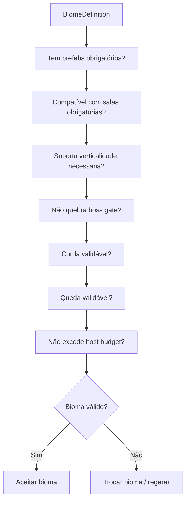

## Constraints obrigatórias

- `biome_has_required_prefabs == true`
- `biome_supports_required_room_types == true`
- `biome_supports_stairwell == true`
- `biome_supports_sleep_zone == true`
- `biome_does_not_break_boss_gate == true`
- `biome_does_not_force_unavoidable_fall == true`
- `biome_has_valid_fall_landing_rules == true`
- `biome_has_valid_rope_rules == true`
- `biome_hazard_density_within_limit == true`
- `biome_host_budget_risk_within_limit == true`

---

# 26. Estrutura de Dados Recomendada

## 26.1 BiomeDefinition

| Campo                      | Tipo conceitual | Função                           |
|----------------------------|-----------------|----------------------------------|
| `biome_id`                 | string          | identificador estável            |
| `display_name`             | string          | nome exibido                     |
| `structural_style_weights` | map             | pesos por estilo estrutural      |
| `room_weights`             | map             | pesos por tipo de sala           |
| `verticality_rules`        | object          | buracos, shafts, quedas          |
| `fall_rules`               | object          | dano, landing, retrofit          |
| `rope_rules`               | object          | estabilidade, alcance, bloqueios |
| `dig_rules`                | object          | permissões de Drunkard’s Walk    |
| `hazard_rules`             | object          | hazards ambientais               |
| `resource_rules`           | object          | recursos gerados                 |
| `visual_set`               | object          | materiais, prefabs, luz          |
| `audio_set`                | object          | ambiência                        |
| `validation_rules`         | object          | constraints específicas          |

---

# 27. Estrutura de Scripts Recomendada

| Pasta                        | Arquivos                                                                                             |
|------------------------------|------------------------------------------------------------------------------------------------------|
| `Dungeon/Biomes/Core`        | `BiomeDefinition.cs`, `BiomeId.cs`, `BiomeTag.cs`                                                    |
| `Dungeon/Biomes/Selection`   | `BiomeSelector.cs`, `WeeklyBiomeBiasService.cs`, `BiomeLayerRules.cs`                                |
| `Dungeon/Biomes/Blending`    | `BiomeBlendMap.cs`, `BiomeTransitionZone.cs`, `BiomeInvasionPatch.cs`                                |
| `Dungeon/Biomes/Application` | `BiomeGenerationApplier.cs`, `BiomeRoomRuleApplier.cs`, `BiomeVerticalityApplier.cs`                 |
| `Dungeon/Biomes/Validation`  | `BiomeValidator.cs`, `BiomeBossGateValidator.cs`, `BiomeHazardBudgetValidator.cs`                    |
| `Dungeon/Biomes/Rendering`   | `BiomeVisualSet.cs`, `BiomeMaterialResolver.cs`, `BiomeLightingResolver.cs`, `BiomeAudioResolver.cs` |
| `Dungeon/Biomes/Runtime`     | `BiomeRuntimeState.cs`, `BiomeSnapshotState.cs`                                                      |

---

# 28. Pipeline de Biomas

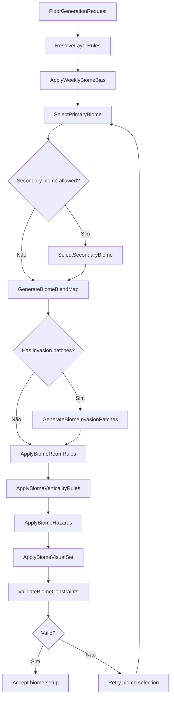

---

# 29. MVP de Biomas

## MVP 1 — BiomeDefinition

Entregar:
- `biome_id`;
- nome;
- pesos de sala;
- pesos de verticalidade;
- material principal;
- prefabs básicos;
- hazards simples.

## MVP 2 — Bioma principal por andar

Entregar:
- seleção por `floor_index`;
- peso por camada;
- seed determinística;
- validação básica.

## MVP 3 — Aplicação visual

Entregar:
- materiais;
- iluminação;
- prefabs ambientais;
- ambient audio.

## MVP 4 — Bioma afetando verticalidade

Entregar:
- `pit_chance`;
- `shaft_chance`;
- `fall_damage_multiplier`;
- `rope_anchor_stability`;
- compatibilidade de retrofit.

## MVP 5 — Transição simples

Entregar:
- bioma principal;
- bioma secundário;
- zona de transição por região do mapa.

## MVP 6 — Invasão de bioma

Entregar:
- patches locais;
- visual alternativo;
- constraints de validação.

## MVP 7 — Drunkard’s Walk por bioma

Entregar:
- permissões de escavação;
- bias específico;
- limites por bioma.

---

# 30. Non-Goals

Não implementar no primeiro ciclo:
- mistura procedural complexa por muitos biomas;
- Perlin Noise 3D custom completo;
- simulação ecológica total;
- biomas com IA própria completa;
- bioma alterando boss gate sem validação;
- bioma permitindo bypass de camada;
- hazards que tornam queda inevitável;
- voxel runtime completo;
- persistência semanal completa de todos os patches;
- biome blending visual avançado com shader custom complexo.

---

# 31. Critérios de Aceite

O Biome System está aceitável quando:
- cada andar possui bioma principal;
- o bioma altera geração, não só visual;
- bioma influencia salas, verticalidade, hazards e recursos;
- bioma não quebra boss gate;
- bioma não permite queda inevitável;
- bioma não força soft-lock;
- bioma define visual coerente para queda;
- bioma define regras de corda;
- bioma define compatibilidade com retrofit;
- bioma pode participar da weekly seed;
- bioma pode ser salvo em FloorSnapshot;
- bioma é data-driven;
- bioma é validado antes do render final.

---

# 32. Definição Final para o GDD Principal

## Biome System

O Biome System define a identidade ambiental e sistêmica dos andares da dungeon. Cada floor possui um bioma principal e pode opcionalmente possuir bioma secundário, zonas de transição, invasões locais e microbiomas.

Biomas não são apenas skins visuais. Eles alteram pesos de sala, chance de buracos, densidade de hazards, recursos, altura de teto, compatibilidade com queda, estabilidade de corda, permissões de escavação, iluminação, materiais e ambiência sonora.

A seleção de bioma é determinística e baseada na `weekly_seed`, no `floor_index`, na camada de progressão e em pesos de repetição. A variação semanal pode favorecer certos biomas, mas nunca deve violar constraints de progressão, boss gate, queda, corda ou host budget.

Transições de bioma podem ocorrer entre regiões do andar, usando blend simples por zonas no MVP e mapas de ruído em versões futuras. Invasões de bioma podem criar patches locais, desde que passem por validação.

Cada bioma precisa definir como quedas, cordas, retrofits e Drunkard’s Walk se comportam em seu ambiente. Em cavernas, quedas geram fendas e shafts orgânicos. Em construções, geram teto quebrado e rocha exposta. Em biomas de risco, como Lava ou Abismo, o sistema deve reforçar validações para evitar morte inevitável, party split excessivo ou excesso de floors ativos no host.

---

# 33. Resumo Final

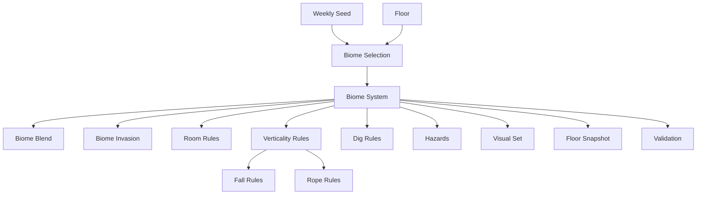

## Regra final

O bioma deve transformar a dungeon em um espaço sistêmico:
- altera o layout;
- altera o risco;
- altera a verticalidade;
- altera a leitura visual;
- altera queda e corda;
- altera escavação;
- respeita boss gates;
- respeita constraints;
- respeita budget de host;
- permanece determinístico pela seed.