> **Projeto:** Dungeon Explorer: Ashvault  
> **Escopo:** geração procedural da dungeon, entrada externa, reset semanal, streaming de andares, escadas, quedas, cordas, boss gates, retrofit de salas, escavação local, validação, multiplayer e restrições de host/server.  
> **Fora de escopo:** biomas, IA/Hive, MORL, diário, bestiário, cooking, economia e combate.

Esta versão consolida a documentação que você montou anteriormente sobre dungeon procedural vertical, sem biomas, incorporando os ajustes sobre escada, queda, corda, boss gate, host/server e interest management.

---

# 1. High Concept

A dungeon é uma **estrutura vertical procedural**, acessada fisicamente pelo Hub/Overworld, gerada por temporada semanal e carregada sob demanda por andar.

Ela não é um mapa inteiro carregado de uma vez. Cada andar é uma unidade independente de:
- geração procedural;
- validação;
- streaming;
- navegação vertical;
- sincronização multiplayer;
- persistência temporária por sessão;
- deltas runtime.

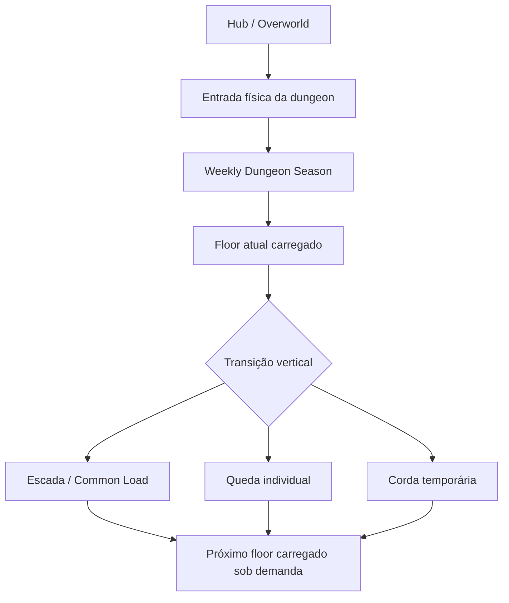
```mermaid
flowchart TD
    Hub["Hub / Overworld"]
    Entrance["Entrada física da dungeon"]
    Season["Weekly Dungeon Season"]
    Floor["Floor atual carregado"]
    Transition{"Transição vertical"}
    Stair["Escada / Common Load"]
    Fall["Queda individual"]
    Rope["Corda temporária"]
    NextFloor["Próximo floor carregado sob demanda"]

    Hub --> Entrance
    Entrance --> Season
    Season --> Floor
    Floor --> Transition
    Transition --> Stair
    Transition --> Fall
    Transition --> Rope
    Stair --> NextFloor
    Fall --> NextFloor
    Rope --> NextFloor
```

## Regra central

A dungeon não é carregada inteira.  
A dungeon é carregada por andares.  
Cada andar é gerado, validado, renderizado e sincronizado separadamente.

---

# 2. Identidade Estrutural da Dungeon

A dungeon deve parecer um espaço vertical em camadas, não uma sequência plana de salas.

Visualmente, a estrutura deve transmitir:
- caverna vertical;
- ruína antiga;
- leitura em camadas estilo Terraria;
- construção engolida por rocha;
- abismos, shafts e fendas conectando andares;
- paredes altas ao redor de áreas de queda;
- salas artificiais com teto rompido quando houver queda.

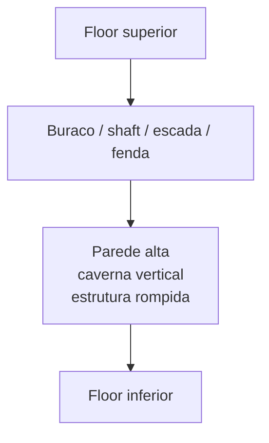
```mermaid
flowchart TB
    F1["Floor superior"]
    Opening["Buraco / shaft / escada / fenda"]
    Vertical["Parede alta<br/>caverna vertical<br/>estrutura rompida"]
    F2["Floor inferior"]

    F1 --> Opening
    Opening --> Vertical
    Vertical --> F2
```

Mesmo sem biomas, a dungeon pode alternar entre estilos arquitetônicos e geológicos:

| Estilo          | Característica                                             |
|-----------------|------------------------------------------------------------|
| Natural Cave    | caverna orgânica, teto alto, fendas, shafts naturais       |
| Ancient Dungeon | salas artificiais, corredores retos, lajes e pilares       |
| Hybrid Ruin     | construção dentro de caverna, teto quebrado, rocha exposta |
| Collapsed Layer | áreas destruídas, salas soterradas e rotas bloqueadas      |

---

# 3. Pilares da Geração

## 3.1 Verticalidade com consequência

A verticalidade não é apenas visual. Ela afeta:
- queda;
- dano;
- separação da party;
- streaming de andar;
- resgate com corda;
- boss gates;
- validação de progressão;
- retrofit de salas;
- escavação local;
- custo de simulação multiplayer.

---

## 3.2 Geração sob demanda

O runtime mantém apenas o necessário:
- andar atual do player;
- transição ativa;
- andares com players ativos;
- andares conectados por corda ativa;
- andares com corpse relevante;
- andares com deltas runtime importantes;
- andar adjacente opcional, se houver orçamento de memória.

Unity permite carregar cenas de forma aditiva sem descarregar as cenas já carregadas, o que encaixa com o modelo de `SC_DungeonFloor_Runtime` + cenas de transição aditivas. ([Unity Docs](https://docs.unity3d.com/ScriptReference/SceneManagement.LoadSceneMode.Additive.html?utm_source=chatgpt.com "Scripting API: SceneManagement.LoadSceneMode.Additive"))

---

## 3.3 Validação antes da renderização

Todo andar deve ser validado antes de existir no jogo.

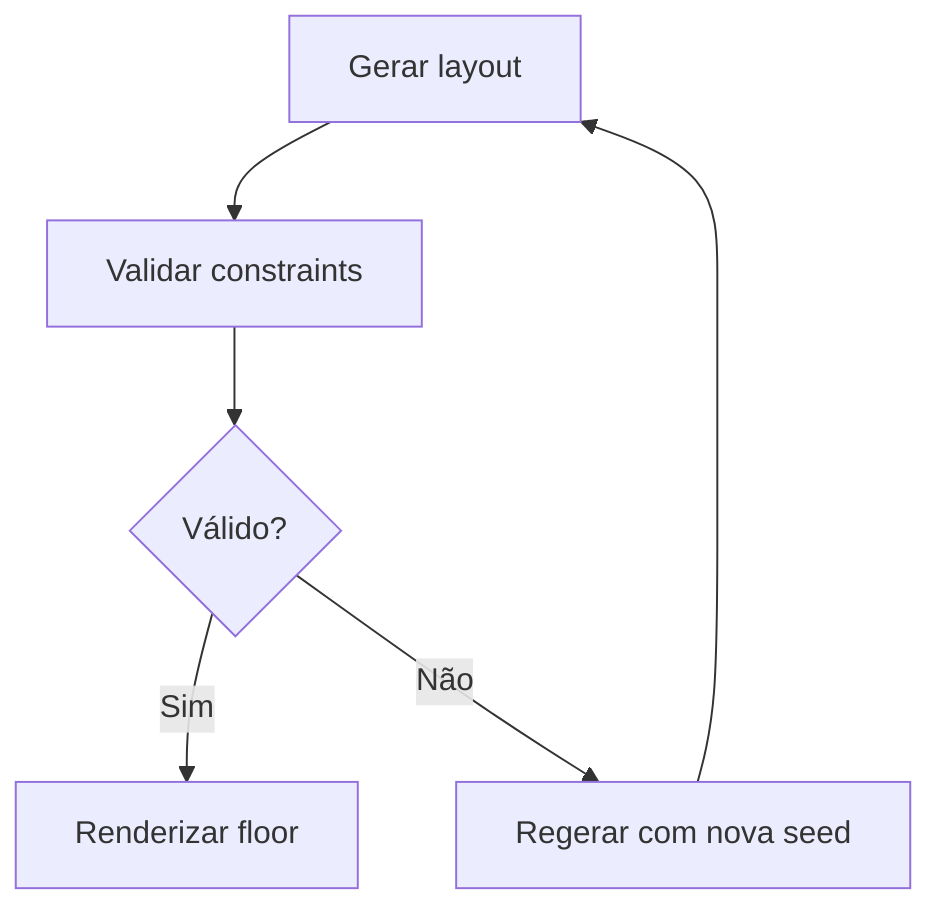
```mermaid
flowchart TD
    Generate["Gerar layout"]
    Validate["Validar constraints"]
    Valid{"Válido?"}
    Render["Renderizar floor"]
    Retry["Regerar com nova seed"]

    Generate --> Validate
    Validate --> Valid
    Valid -- Sim --> Render
    Valid -- Não --> Retry
    Retry --> Generate
```

---

## 3.4 Boss gate como barreira de camada

O boss não é só uma sala final. Ele representa o selo estrutural da próxima camada.

| Camada   |      Andares | Gate             |
|----------|-------------:|------------------|
| Camada 1 | Floors 01–10 | Boss no Floor 10 |
| Camada 2 | Floors 11–20 | Boss no Floor 20 |
| Camada 3 | Floors 21–30 | Boss no Floor 30 |

Antes de derrotar o boss, o jogador não pode acessar a próxima camada por:
- queda;
- corda;
- escavação;
- retrofit;    
- shaft;
- Drunkard’s Walk;
- buraco funcional;
- passagem vertical alternativa.

---

# 4. Weekly Dungeon Season

## 4.1 Conceito

A dungeon é gerada em ciclos semanais. A cada 7 dias, uma nova `weekly_seed` define a estrutura base da dungeon.

Exemplo:

| Semana    | `weekly_seed` |
|-----------|--------------:|
| Semana 01 |        839120 |
| Semana 02 |        771442 |

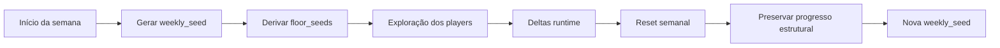
```mermaid
flowchart LR
    WeekStart["Início da semana"]
    Seed["Gerar weekly_seed"]
    Floors["Derivar floor_seeds"]
    Runtime["Exploração dos players"]
    Deltas["Deltas runtime"]
    Reset["Reset semanal"]
    Preserve["Preservar progresso estrutural"]
    NewSeed["Nova weekly_seed"]

    WeekStart --> Seed
    Seed --> Floors
    Floors --> Runtime
    Runtime --> Deltas
    Deltas --> Reset
    Reset --> Preserve
    Preserve --> NewSeed
```

## 4.2 Fórmula de seed por andar

A seed de cada andar deve ser derivada da seed semanal:

$$  
floorSeed = Hash(weeklySeed, floorIndex, dungeonVersion)  
$$

Onde:

| Termo            | Função                                          |
|------------------|-------------------------------------------------|
| $weeklySeed$     | define a dungeon-base da semana                 |
| $floorIndex$     | identifica o andar                              |
| $dungeonVersion$ | evita incompatibilidade quando o algoritmo muda |
| $Hash$           | função determinística de composição             |

---

## 4.3 O que o reset semanal altera

O reset semanal altera:
- layout dos andares;
- salas;
- corredores;
- rotas;
- buracos;
- shafts;
- pontos de queda;
- posições de Sleep Zones;
- posições de escadas;
- possíveis pontos de corda;
- estruturas colapsadas;
- distribuição inicial de elementos procedurais.

## 4.4 O que o reset semanal não altera

O reset semanal não altera:
- skills;
- progressão estrutural;
- reputação;
- maior andar desbloqueado;
- direito de acesso por Pilar;
- boss states persistentes, se aplicável;
- dados permanentes do jogador.

---

# 5. Entrada Externa da Dungeon

A dungeon deve ser acessada fisicamente pelo Hub/Overworld.

Exemplos válidos:
- boca de caverna gigante;
- ruína antiga;
- abismo central;
- mina abandonada;
- portal físico;
- torre invertida;
- entrada subterrânea monumental.

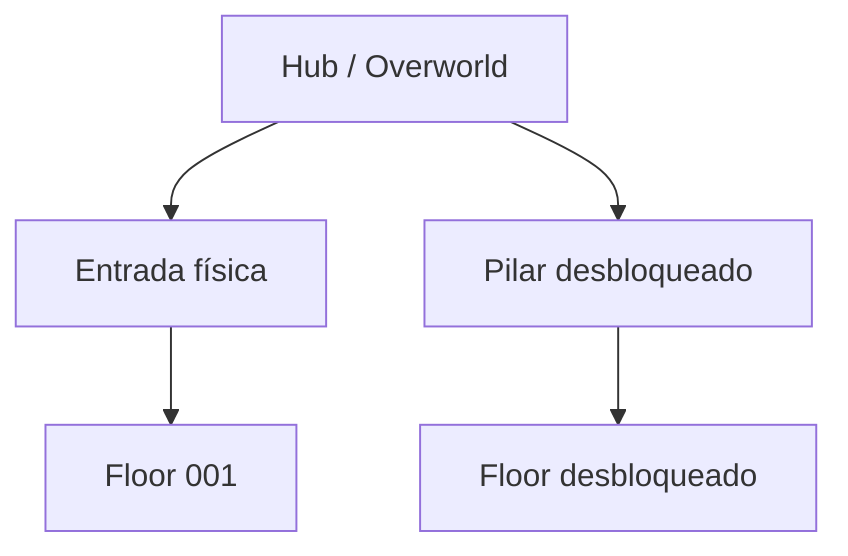
```mermaid
flowchart TD
    Hub["Hub / Overworld"]
    Entrance["Entrada física"]
    Floor1["Floor 001"]
    Pillar["Pilar desbloqueado"]
    HigherFloor["Floor desbloqueado"]

    Hub --> Entrance
    Entrance --> Floor1
    Hub --> Pillar
    Pillar --> HigherFloor
```

O jogador não deve sentir que entrou por um menu. A entrada precisa existir no mundo.

---

# 6. Unidade Principal: Floor

Um `Floor` é a unidade principal da dungeon.

Cada floor contém:
- `floor_index`;
- `floor_seed`;
- `weekly_season_id`;
- estilo estrutural;
- salas;
- conexões;
- rotas principais;
- rotas alternativas;
- escadas;
- buracos;
- shafts;
- Fall Landing Points;
- Fall Origin Points;
- Rope Anchor Points;
- Sleep Zone;
- boss room, se aplicável;
- mini-boss room, se aplicável;
- runtime deltas;
- estado de simulação;
- estado de interest management.

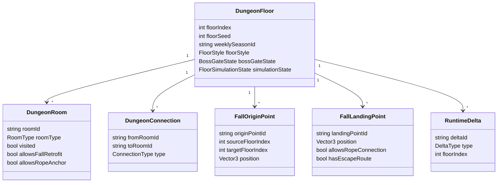
```mermaid
classDiagram
    class DungeonFloor {
        int floorIndex
        int floorSeed
        string weeklySeasonId
        FloorStyle floorStyle
        BossGateState bossGateState
        FloorSimulationState simulationState
    }

    class DungeonRoom {
        string roomId
        RoomType roomType
        bool visited
        bool allowsFallRetrofit
        bool allowsRopeAnchor
    }

    class DungeonConnection {
        string fromRoomId
        string toRoomId
        ConnectionType type
    }

    class FallOriginPoint {
        string originPointId
        int sourceFloorIndex
        int targetFloorIndex
        Vector3 position
    }

    class FallLandingPoint {
        string landingPointId
        Vector3 position
        bool allowsRopeConnection
        bool hasEscapeRoute
    }

    class RuntimeDelta {
        string deltaId
        DeltaType type
        int floorIndex
    }

    DungeonFloor "1" --> "*" DungeonRoom
    DungeonFloor "1" --> "*" DungeonConnection
    DungeonFloor "1" --> "*" FallOriginPoint
    DungeonFloor "1" --> "*" FallLandingPoint
    DungeonFloor "1" --> "*" RuntimeDelta
```

---

# 7. Estilos Estruturais

Como este documento remove biomas, a variação vem dos **estilos estruturais**.

## 7.1 Natural Cave

Características:
- paredes orgânicas;
- teto alto;
- fendas;
- shafts naturais;
- câmaras amplas;
- pontes naturais;
- buracos irregulares;
- boa compatibilidade com Drunkard’s Walk.

## 7.2 Ancient Dungeon

Características:
- arquitetura artificial;
- salas retangulares;
- corredores retos;
- pilares;
- lajes;
- portas;
- tetos estruturais;
- buracos aparecem como colapso.

## 7.3 Hybrid Ruin

Características:
- construção dentro de caverna;
- ruína engolida por rocha;
- teto artificial quebrado expondo caverna alta;
- paredes artificiais rompidas por formações naturais;
- shafts atravessando estrutura antiga.    

## 7.4 Collapsed Layer

Características:
- áreas destruídas;
- salas parcialmente soterradas;
- teto rompido;
- pedras caídas;
- rotas bloqueadas;
- excelente candidato para queda e retrofit.

---

# 8. Pipeline de Geração do Andar

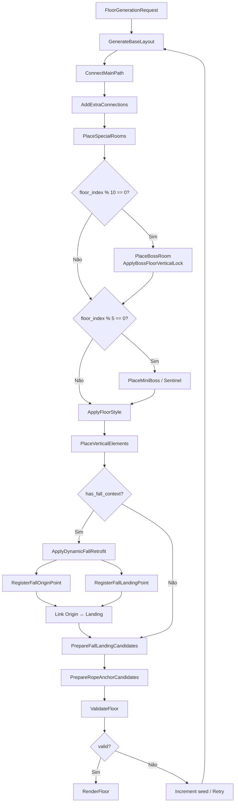
```mermaid
flowchart TD
    Request["FloorGenerationRequest"]
    Base["GenerateBaseLayout"]
    MainPath["ConnectMainPath"]
    Extra["AddExtraConnections"]
    Special["PlaceSpecialRooms"]

    BossCheck{"floor_index % 10 == 0?"}
    Boss["PlaceBossRoom<br/>ApplyBossFloorVerticalLock"]

    MiniCheck{"floor_index % 5 == 0?"}
    Mini["PlaceMiniBoss / Sentinel"]

    Style["ApplyFloorStyle"]
    Vertical["PlaceVerticalElements"]

    FallContext{"has_fall_context?"}
    Retrofit["ApplyDynamicFallRetrofit"]
    Origin["RegisterFallOriginPoint"]
    Landing["RegisterFallLandingPoint"]
    Link["Link Origin ↔ Landing"]

    FallCandidates["PrepareFallLandingCandidates"]
    RopeCandidates["PrepareRopeAnchorCandidates"]

    Validate["ValidateFloor"]
    Valid{"valid?"}
    Render["RenderFloor"]
    Retry["Increment seed / Retry"]

    Request --> Base
    Base --> MainPath
    MainPath --> Extra
    Extra --> Special

    Special --> BossCheck
    BossCheck -- Sim --> Boss
    BossCheck -- Não --> MiniCheck
    Boss --> MiniCheck

    MiniCheck -- Sim --> Mini
    MiniCheck -- Não --> Style
    Mini --> Style

    Style --> Vertical
    Vertical --> FallContext

    FallContext -- Sim --> Retrofit
    Retrofit --> Origin
    Retrofit --> Landing
    Origin --> Link
    Landing --> Link
    Link --> FallCandidates

    FallContext -- Não --> FallCandidates

    FallCandidates --> RopeCandidates
    RopeCandidates --> Validate
    Validate --> Valid
    Valid -- Sim --> Render
    Valid -- Não --> Retry
    Retry --> Base
```

---

# 9. Algoritmo Base de Salas

## 9.1 Regra central

Toda nova sala nasce conectada a uma sala existente.

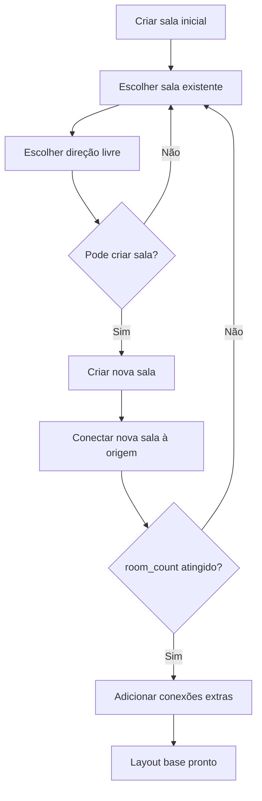
```mermaid
flowchart TD
    Start["Criar sala inicial"]
    Pick["Escolher sala existente"]
    Direction["Escolher direção livre"]
    CanPlace{"Pode criar sala?"}
    Create["Criar nova sala"]
    Connect["Conectar nova sala à origem"]
    Count{"room_count atingido?"}
    Extra["Adicionar conexões extras"]
    Done["Layout base pronto"]

    Start --> Pick
    Pick --> Direction
    Direction --> CanPlace
    CanPlace -- Sim --> Create
    Create --> Connect
    Connect --> Count
    CanPlace -- Não --> Pick
    Count -- Não --> Pick
    Count -- Sim --> Extra
    Extra --> Done
```

## 9.2 Objetivo do algoritmo

O algoritmo deve criar:
- dungeon conectada;
- sem salas isoladas;
- rotas alternativas;    
- loops;
- becos sem saída controlados;
- possibilidade de expansão vertical.

---

# 10. Tipos de Sala

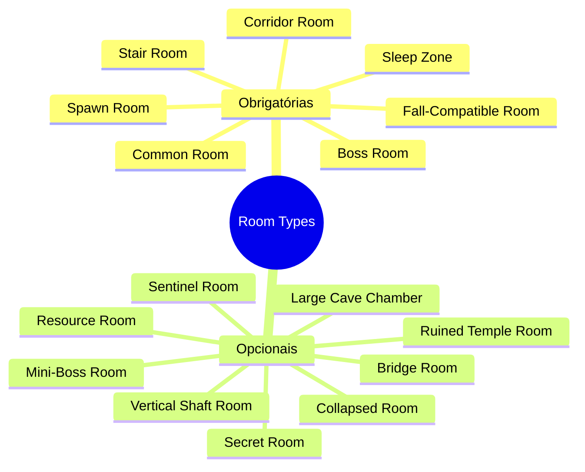
```mermaid
mindmap
  root((Room Types))
    Obrigatórias
      Spawn Room
      Common Room
      Corridor Room
      Sleep Zone
      Stair Room
      Boss Room
      Fall-Compatible Room
    Opcionais
      Resource Room
      Collapsed Room
      Bridge Room
      Vertical Shaft Room
      Secret Room
      Ruined Temple Room
      Large Cave Chamber
      Mini-Boss Room
      Sentinel Room
```

## Regras por sala

| Tipo de sala       | Pode receber queda? | Pode receber corda? | Observação                      |
|--------------------|--------------------:|--------------------:|---------------------------------|
| Common Room        |                 Sim |                 Sim | Principal candidata             |
| Large Cave Chamber |                 Sim |                 Sim | Excelente para queda            |
| Resource Room      |                 Sim |                 Sim | Bom risco/recompensa            |
| Collapsed Room     |                 Sim |                 Sim | Coerente visualmente            |
| Bridge Room        |    Sim, com cuidado |              Talvez | Não pode gerar morte inevitável |
| Corridor Room      |                Raro |                Raro | Exige largura e altura          |
| Sleep Zone         |      Não por padrão |      Não por padrão | Evita pouso seguro demais       |
| Boss Room          |                 Não |                 Não | Evita bypass                    |
| Stair Room         |                Raro |      Não por padrão | Não pode quebrar common load    |
| Spawn Room         |      Não por padrão |                 Não | Evita confusão de entrada       |

---

# 11. Salas Grandes

O gerador pode unir células vizinhas para formar salas maiores.

Exemplo horizontal:

| Antes         | Depois  |
|---------------|---------|
| `[R]-[R]-[R]` | `[ R ]` |

Exemplo 2x2:

| Antes                     | Depois       |
|---------------------------|--------------|
| `[R]-[R]``\| \|``[R]-[R]` | `[ R ]``[ ]` |

## 11.1 Regra de prioridade

Ordem recomendada:
1. salas conectadas;
2. validação;
3. escada;
4. queda;
5. streaming;
6. corda;
7. retrofit;
8. salas grandes.

---

# 12. Navegação Vertical

A navegação vertical possui três formas principais:

| Sistema | Papel                                |
|---------|--------------------------------------|
| Escada  | transição coletiva segura            |
| Queda   | transição individual emergente       |
| Corda   | conexão temporária criada pela party |

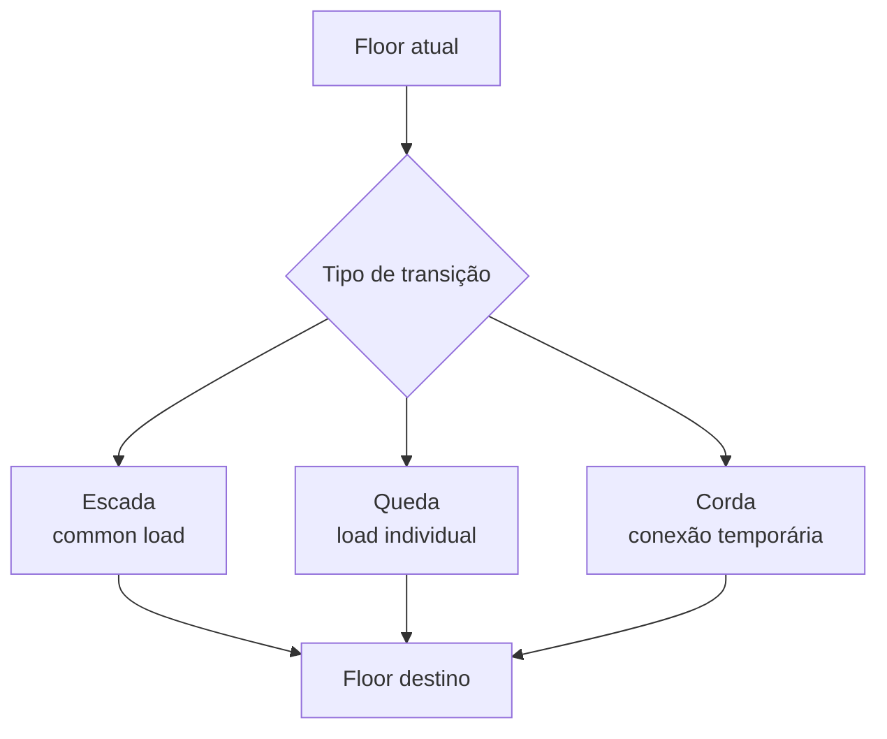
```mermaid
flowchart TD
    Floor["Floor atual"]
    Decision{"Tipo de transição"}
    Stair["Escada<br/>common load"]
    Fall["Queda<br/>load individual"]
    Rope["Corda<br/>conexão temporária"]
    Next["Floor destino"]

    Floor --> Decision
    Decision --> Stair
    Decision --> Fall
    Decision --> Rope
    Stair --> Next
    Fall --> Next
    Rope --> Next
```

---

# 13. Escada como Common Load

## 13.1 Conceito

A escada é a transição segura e coletiva da party.

Ela mascara o carregamento como:
- túnel;
- escada espiral;
- passagem longa;
- corredor estreito;
- descida por ruína;
- rampa subterrânea.

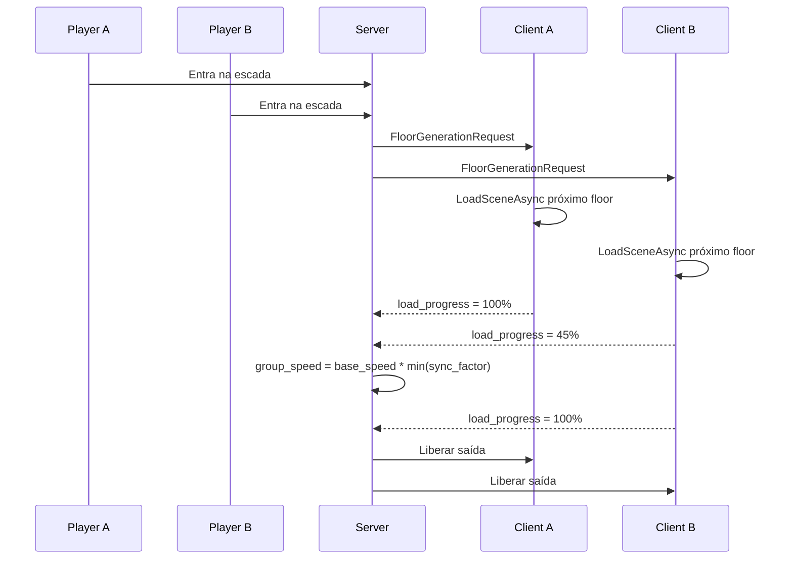
```mermaid
sequenceDiagram
    participant P1 as Player A
    participant P2 as Player B
    participant S as Server
    participant C1 as Client A
    participant C2 as Client B

    P1->>S: Entra na escada
    P2->>S: Entra na escada
    S->>C1: FloorGenerationRequest
    S->>C2: FloorGenerationRequest
    C1->>C1: LoadSceneAsync próximo floor
    C2->>C2: LoadSceneAsync próximo floor
    C1-->>S: load_progress = 100%
    C2-->>S: load_progress = 45%
    S->>S: group_speed = base_speed * min(sync_factor)
    C2-->>S: load_progress = 100%
    S->>C1: Liberar saída
    S->>C2: Liberar saída
```

## 13.2 Fórmula anti-desync

$$  
v_{group} = v_{base} \cdot \min(s_1, s_2, \ldots, s_n)  
$$

Onde:

| Termo       | Descrição                                    |
|-------------|----------------------------------------------|
| $v_{group}$ | velocidade real do grupo na escada           |
| $v_{base}$  | velocidade base da transição                 |
| $s_i$       | progresso de carregamento do player $i$      |
| $n$         | número de players participantes da transição |

Nenhum player sai antes da party carregar o próximo andar.

---

# 14. Queda Individual

## 14.1 Conceito

A queda é individual.

Quando um player cai:
- apenas ele entra em transição;
- apenas ele carrega o andar inferior;
- os outros players continuam no andar superior;
- o servidor mantém ambos os andares ativos se houver players nos dois.

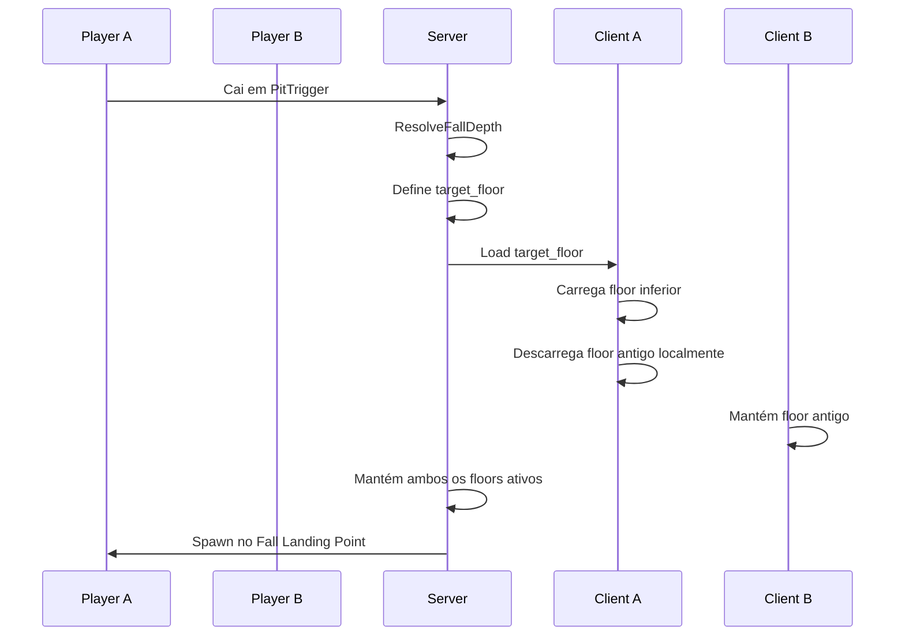
```mermaid
sequenceDiagram
    participant A as Player A
    participant B as Player B
    participant S as Server
    participant CA as Client A
    participant CB as Client B

    A->>S: Cai em PitTrigger
    S->>S: ResolveFallDepth
    S->>S: Define target_floor
    S->>CA: Load target_floor
    CA->>CA: Carrega floor inferior
    CA->>CA: Descarrega floor antigo localmente
    CB->>CB: Mantém floor antigo
    S->>S: Mantém ambos os floors ativos
    S->>A: Spawn no Fall Landing Point
```

---

# 15. Profundidade da Queda

A queda normalmente leva ao próximo andar, mas certos buracos podem levar mais fundo.

| Resultado      | Chance base | Efeito      |
|----------------|------------:|-------------|
| Queda comum    |         85% | `floor + 1` |
| Queda profunda |         12% | `floor + 2` |
| Queda crítica  |          3% | `floor + 3` |

## 15.1 Fórmula de resolução da profundidade

Um modelo simples de queda pode usar uma variável aleatória uniforme:

$$  
r \sim U(0,1)  
$$

Com:

$$  
targetFloor =  
\begin{cases}  
floor + 3, & r < p_{critical} \  
floor + 2, & p_{critical} \le r < p_{critical} + p_{deep} \  
floor + 1, & r \ge p_{critical} + p_{deep}  
\end{cases}  
$$

Onde:

| Termo          | Valor inicial |
|----------------|--------------:|
| $p_{critical}$ |        $0.03$ |
| $p_{deep}$     |        $0.12$ |
| $p_{common}$   |        $0.85$ |

A soma deve respeitar:

$$  
p_{common} + p_{deep} + p_{critical} = 1  
$$

---

## 15.2 Tipos de buraco

| Tipo          | Comportamento                          |
|---------------|----------------------------------------|
| `ShallowGap`  | dano e reposicionamento no mesmo andar |
| `FloorDrop`   | cai 1 andar                            |
| `DeepShaft`   | pode cair 1–2 andares                  |
| `AbyssalRift` | chance rara de cair 3+ andares         |

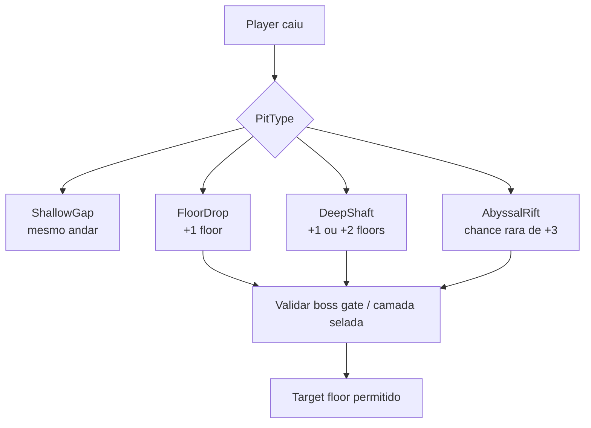
```mermaid
flowchart TD
    Fall["Player caiu"]
    Pit{"PitType"}
    Shallow["ShallowGap<br/>mesmo andar"]
    FloorDrop["FloorDrop<br/>+1 floor"]
    Deep["DeepShaft<br/>+1 ou +2 floors"]
    Abyss["AbyssalRift<br/>chance rara de +3"]
    GateCheck["Validar boss gate / camada selada"]
    Target["Target floor permitido"]

    Fall --> Pit
    Pit --> Shallow
    Pit --> FloorDrop
    Pit --> Deep
    Pit --> Abyss
    FloorDrop --> GateCheck
    Deep --> GateCheck
    Abyss --> GateCheck
    GateCheck --> Target
```

---

# 16. Dano de Queda

## 16.1 Fórmula base

$$  
D_{fall} = D_{base} \cdot h \cdot (1 - R_{fall})  
$$

Onde:

| Termo      | Descrição                                        |
|------------|--------------------------------------------------|
| $D_{fall}$ | dano final da queda                              |
| $D_{base}$ | dano base por andar                              |
| $h$        | quantidade de andares caídos                     |
| $R_{fall}$ | resistência à queda, normalizada entre $0$ e $1$ |

## 16.2 Clamp obrigatório

Para evitar cura, overflow ou valores negativos:

$$  
R_{fall} = clamp(R_{fall}, 0, R_{max})  
$$

Recomendação inicial:

$$  
R_{max} = 0.85  
$$

Assim, mesmo com build especializada, o player ainda recebe pelo menos:

$$  
D_{min} = D_{base} \cdot h \cdot 0.15  
$$

---

# 17. Fall Origin Point e Fall Landing Point

## 17.1 Fall Origin Point

Quando um jogador cai, o ponto exato no andar superior vira um **Fall Origin Point**.

Esse ponto representa:
- o local físico onde o player caiu;
- o buraco, fenda ou abertura usada na queda;
- o ponto onde outro player pode instalar uma corda;
- a origem de uma possível conexão vertical posterior.

## 17.2 Fall Landing Point

O Fall Landing Point é o ponto onde o player aterrissa no andar inferior.

Ele representa:
- ponto de pouso;
- saída inferior do shaft;
- local de possível RopeExit;
- posição usada para validação de segurança;
- ponto usado para renderizar marca de impacto e detritos.

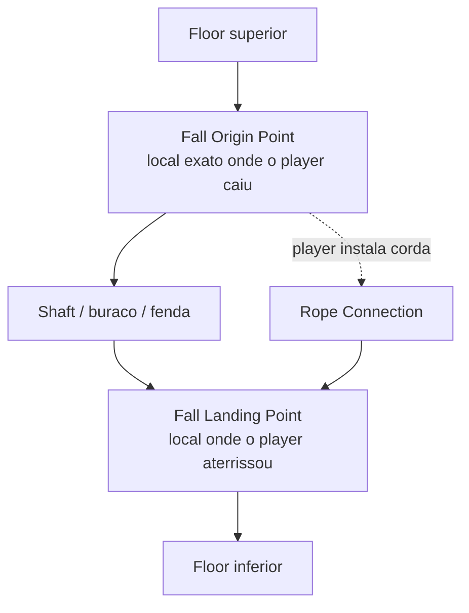
```mermaid
flowchart TB
    Upper["Floor superior"]
    Origin["Fall Origin Point<br/>local exato onde o player caiu"]
    Shaft["Shaft / buraco / fenda"]
    Lower["Floor inferior"]
    Landing["Fall Landing Point<br/>local onde o player aterrissou"]
    Rope["Rope Connection"]

    Upper --> Origin
    Origin --> Shaft
    Shaft --> Landing
    Landing --> Lower
    Origin -. "player instala corda" .-> Rope
    Rope --> Landing
```

---

# 18. Dynamic Fall Retrofit

## 18.1 Conceito

Se a sala de destino ainda não foi vista ou carregada, a queda pode adaptar a sala para receber o player.

Fluxo:
1. player cai;
2. o sistema calcula o andar de destino;
3. o gerador escolhe uma sala elegível;
4. a sala recebe retrofit;
5. o sistema cria Fall Landing Point;
6. o player pousa;
7. o retrofit vira delta persistente da sessão.

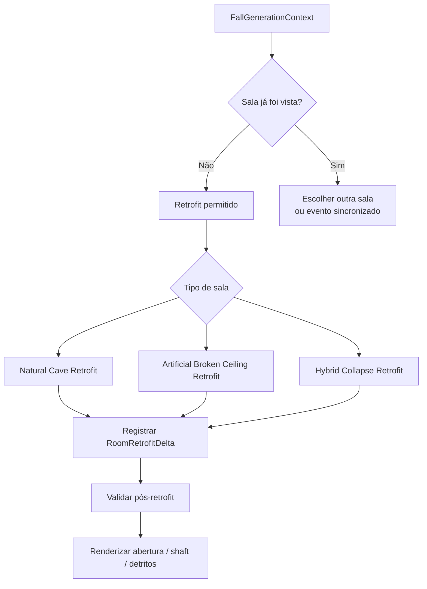
```mermaid
flowchart TD
    FallContext["FallGenerationContext"]
    Seen{"Sala já foi vista?"}
    CanRetrofit["Retrofit permitido"]
    Cannot["Escolher outra sala<br/>ou evento sincronizado"]
    RoomType{"Tipo de sala"}
    Cave["Natural Cave Retrofit"]
    Artificial["Artificial Broken Ceiling Retrofit"]
    Hybrid["Hybrid Collapse Retrofit"]
    Delta["Registrar RoomRetrofitDelta"]
    Validate["Validar pós-retrofit"]
    Render["Renderizar abertura / shaft / detritos"]

    FallContext --> Seen
    Seen -- Não --> CanRetrofit
    Seen -- Sim --> Cannot
    CanRetrofit --> RoomType
    RoomType --> Cave
    RoomType --> Artificial
    RoomType --> Hybrid
    Cave --> Delta
    Artificial --> Delta
    Hybrid --> Delta
    Delta --> Validate
    Validate --> Render
```

## 18.2 Níveis de retrofit

| Nível           | Alteração                                          |
|-----------------|----------------------------------------------------|
| Visual          | buraco no teto, rachaduras, poeira, detritos       |
| Geométrico leve | remove teto, aumenta altura, limpa obstáculos      |
| Estrutural      | cria shaft, colapso, parede alta, conexão vertical |

---

# 19. Regras Visuais da Queda

Se o player caiu ali, o ambiente precisa mostrar por onde ele caiu.

## 19.1 Em caverna natural

Elementos obrigatórios ou recomendados:
- fenda vertical;
- abertura orgânica no teto;
- shaft de pedra;
- teto alto;
- poeira;
- cascalho;
- paredes rochosas verticais.

## 19.2 Em construção artificial

Elementos obrigatórios ou recomendados:
- buraco visível no teto;
- laje quebrada;
- rachaduras;
- detritos;
- rocha exposta;
- caverna alta envolvendo a construção;
- shaft vertical coerente.

---

# 20. Corda

## 20.1 Conceito

A corda é uma conexão temporária criada pela party.

Regra:

**Player A caiu. Player B coloca corda no Fall Origin Point. A corda conecta Origin → Landing.**

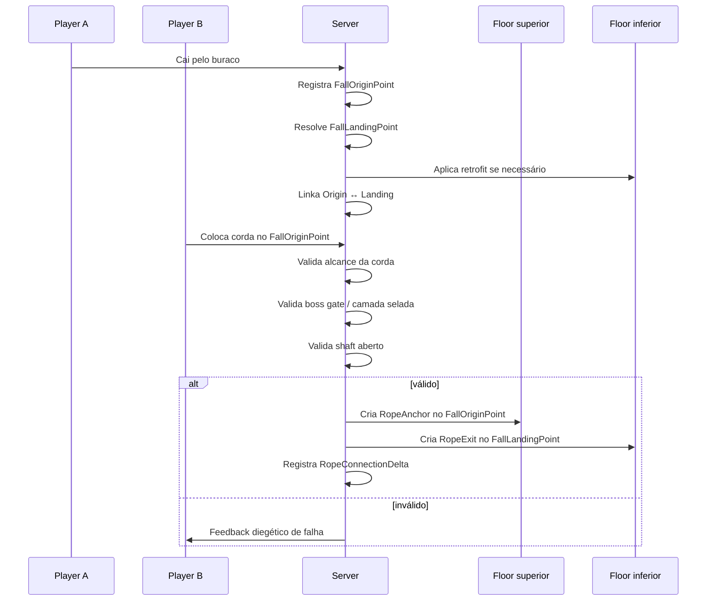
```mermaid
sequenceDiagram
    participant A as Player A
    participant B as Player B
    participant S as Server
    participant F1 as Floor superior
    participant F2 as Floor inferior

    A->>S: Cai pelo buraco
    S->>S: Registra FallOriginPoint
    S->>S: Resolve FallLandingPoint
    S->>F2: Aplica retrofit se necessário
    S->>S: Linka Origin ↔ Landing

    B->>S: Coloca corda no FallOriginPoint
    S->>S: Valida alcance da corda
    S->>S: Valida boss gate / camada selada
    S->>S: Valida shaft aberto

    alt válido
        S->>F1: Cria RopeAnchor no FallOriginPoint
        S->>F2: Cria RopeExit no FallLandingPoint
        S->>S: Registra RopeConnectionDelta
    else inválido
        S->>B: Feedback diegético de falha
    end
```

## 20.2 Tiers de corda

| Item        |       Alcance |
|-------------|--------------:|
| Rope Kit T1 |       1 andar |
| Rope Kit T2 | até 2 andares |
| Rope Kit T3 | até 3 andares |

## 20.3 Fórmula de alcance da corda

A corda é válida se:

$$  
L_{rope} \ge d_{vertical} + d_{slack}  
$$

Onde:

| Termo          | Descrição                                 |
|----------------|-------------------------------------------|
| $L_{rope}$     | comprimento máximo da corda               |
| $d_{vertical}$ | distância vertical entre Origin e Landing |
| $d_{slack}$    | margem extra para irregularidade do shaft |

Recomendação inicial:

$$  
d_{slack} = 0.15 \cdot d_{vertical}  
$$

Então:

$$  
L_{required} = 1.15 \cdot d_{vertical}  
$$

## 20.4 Regras

A corda:
- precisa ser colocada no Fall Origin Point;
- conecta com o Fall Landing Point;
- exige alcance suficiente;
- não pode atravessar boss gate;
- não pode atravessar camada selada;
- vira RopeConnectionDelta;
- é temporária;
- some no reset semanal, salvo regra futura.

---

# 21. Anti-Boss-Gate Bypass

## 21.1 Regra central

A corda pode conectar andares dentro da mesma camada desbloqueada.  
A corda não pode atravessar camada selada por boss gate.

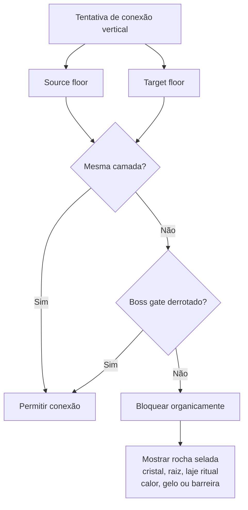
```mermaid
flowchart TD
    Action["Tentativa de conexão vertical"]
    Source["Source floor"]
    Target["Target floor"]
    LayerCheck{"Mesma camada?"}
    BossCheck{"Boss gate derrotado?"}
    Allow["Permitir conexão"]
    Block["Bloquear organicamente"]
    Visual["Mostrar rocha selada<br/>cristal, raiz, laje ritual<br/>calor, gelo ou barreira"]

    Action --> Source
    Action --> Target
    Source --> LayerCheck
    Target --> LayerCheck
    LayerCheck -- Sim --> Allow
    LayerCheck -- Não --> BossCheck
    BossCheck -- Sim --> Allow
    BossCheck -- Não --> Block
    Block --> Visual
```

## 21.2 Fórmula de camada

$$  
layer(floor) = \left\lfloor \frac{floor - 1}{10} \right\rfloor  
$$

Exemplo:

| Floor | Layer |
|------:|------:|
|     1 |     0 |
|     5 |     0 |
|    10 |     0 |
|    11 |     1 |
|    20 |     1 |
|    21 |     2 |

A conexão vertical é permitida se:

$$  
layer(sourceFloor) = layer(targetFloor)  
$$

ou se:

$$  
BossDefeated(requiredBossFloor) = true  
$$

Caso contrário:

$$  
ConnectionAllowed = false  
$$

---

# 22. Boss Pacing

## 22.1 Decisão

| Encontro                     |        Frequência | Função                |
|------------------------------|------------------:|-----------------------|
| Mini-boss / Sentinel / Elite |  a cada 5 andares | pressão intermediária |
| Boss principal               | a cada 10 andares | gate estrutural       |

## 22.2 Mini-boss a cada 5 andares

O mini-boss não é gate estrutural. Ele serve para:
- pressão intermediária;
- recompensa parcial;
- teste de domínio da camada;
- preparação para boss principal.

## 22.3 Boss principal a cada 10 andares

O boss principal bloqueia a próxima camada.

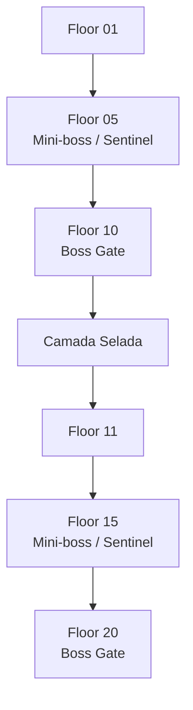
```mermaid
flowchart TB
    F1["Floor 01"]
    F5["Floor 05<br/>Mini-boss / Sentinel"]
    F10["Floor 10<br/>Boss Gate"]
    Seal["Camada Selada"]
    F11["Floor 11"]
    F15["Floor 15<br/>Mini-boss / Sentinel"]
    F20["Floor 20<br/>Boss Gate"]

    F1 --> F5
    F5 --> F10
    F10 --> Seal
    Seal --> F11
    F11 --> F15
    F15 --> F20
```

---

# 23. Boss Floor Vertical Lock

## 23.1 Regra

Andares de boss não possuem buracos funcionais de descida livre antes da derrota do boss.

Podem conter:
- abismos visuais;
- poços selados;
- buracos rasos;
- hazards internos;
- shafts bloqueados;
- quedas que reposicionam dentro da arena.

Não podem conter:
- FloorDrop para próxima camada;
- DeepShaft funcional;
- AbyssalRift funcional;
- rope anchor para próxima camada;
- DigDelta atravessando camada;
- Fall Retrofit para andar abaixo;
- Landing Point além do boss gate.

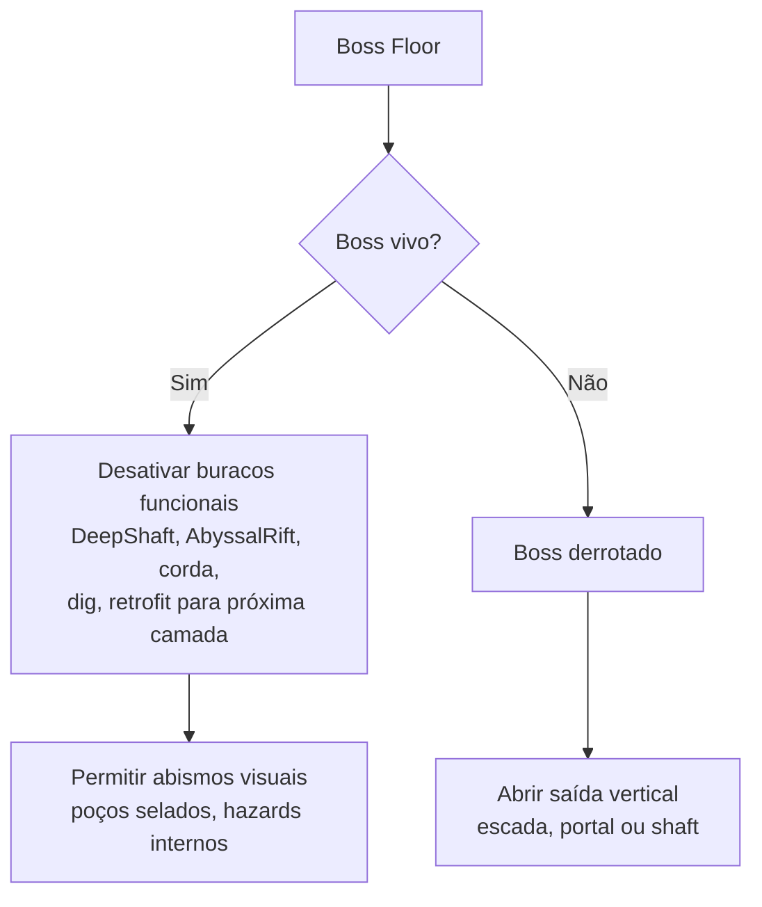
```mermaid
flowchart TD
    BossFloor["Boss Floor"]
    BossAlive{"Boss vivo?"}
    Disable["Desativar buracos funcionais<br/>DeepShaft, AbyssalRift, corda,<br/>dig, retrofit para próxima camada"]
    AllowVisual["Permitir abismos visuais<br/>poços selados, hazards internos"]
    BossDead["Boss derrotado"]
    Open["Abrir saída vertical<br/>escada, portal ou shaft"]

    BossFloor --> BossAlive
    BossAlive -- Sim --> Disable
    Disable --> AllowVisual
    BossAlive -- Não --> BossDead
    BossDead --> Open
```

---

# 24. Drunkard Walk Excavation

## 24.1 Conceito

Drunkard’s Walk é uma ferramenta local para criar organicidade.

Ele não substitui o gerador principal.

| Sistema          | Responsabilidade                 |
|------------------|----------------------------------|
| Gerador do andar | estrutura, progressão, validação |
| Drunkard’s Walk  | detalhe local orgânico           |

## 24.2 Usos

Drunkard’s Walk pode ser usado para:
- abrir shaft de queda;
- criar fenda natural;
- gerar túnel orgânico;
- conectar queda com sala inferior;
- criar caverna atravessando construção;
- criar buraco irregular no teto;
- permitir escavação controlada do player;
- criar passagem emergencial.

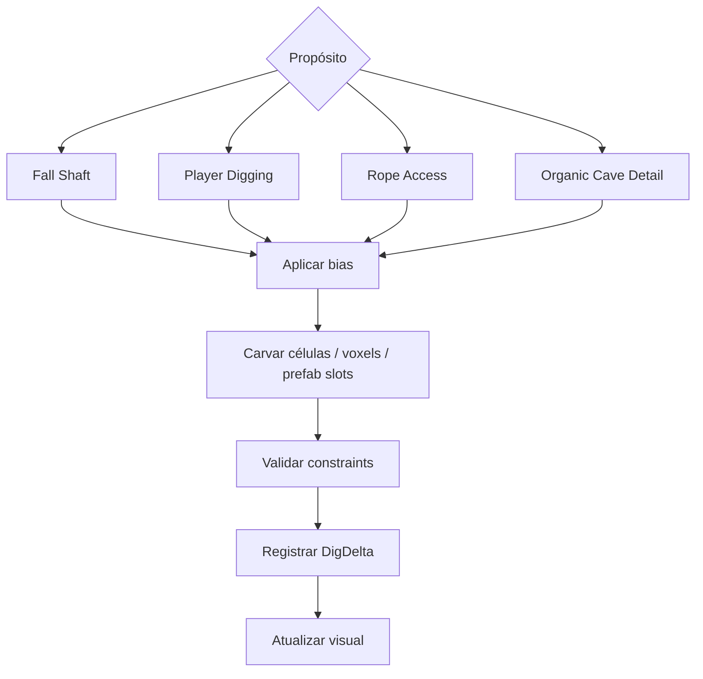
```mermaid
flowchart TD
    Purpose{"Propósito"}
    Fall["Fall Shaft"]
    Dig["Player Digging"]
    Rope["Rope Access"]
    Cave["Organic Cave Detail"]
    Bias["Aplicar bias"]
    Carve["Carvar células / voxels / prefab slots"]
    Validate["Validar constraints"]
    Delta["Registrar DigDelta"]
    Render["Atualizar visual"]

    Purpose --> Fall
    Purpose --> Dig
    Purpose --> Rope
    Purpose --> Cave
    Fall --> Bias
    Dig --> Bias
    Rope --> Bias
    Cave --> Bias
    Bias --> Carve
    Carve --> Validate
    Validate --> Delta
    Delta --> Render
```

## 24.3 Fórmula de bias direcional

Para evitar caminhada puramente aleatória, cada passo usa uma distribuição ponderada:

$$  
P(direction) =  
\begin{cases}  
p_{main}, & direction = mainDirection \  
p_{side}, & direction \in sideDirections \  
p_{noise}, & direction \in noiseDirections  
\end{cases}  
$$

Recomendação inicial:

$$  
p_{main} = 0.60  
$$

$$  
p_{side} = 0.30  
$$

$$  
p_{noise} = 0.10  
$$

Com:

$$  
p_{main} + p_{side} + p_{noise} = 1  
$$

## 24.4 Limites

Só pode alterar áreas marcadas como:
- SoftSoil;
- CaveWall;
- CrackedStone;
- CollapsedStructure;
- MagicalEarth;
- ProceduralOnly.

Não pode alterar:
- boss gate;
- boss room;
- Sleep Zone;
- escada de common load;
- limite externo do andar;
- Hub;
- estruturas críticas multiplayer.

---

# 25. Streaming de Andares

## 25.1 Modelo

Cada andar é um **level lógico runtime**, mas não uma Scene Unity manual.

A cena técnica reutilizável é:
- `SC_DungeonFloor_Runtime`

Cenas persistentes:
- `SC_GameBootstrap`;
- `SC_NetworkSession`;
- `SC_PlayerRig`;
- `SC_UI`.

Cenas de transição:
- `SC_Transition_Stairwell`;
- `SC_Transition_FallShaft`.

```mermaid
flowchart TD
    Client["Client"]
    Server["Server / Host"]
    Current["Floor atual"]
    Transition["Transition Scene"]
    Next["Próximo Floor"]
    Old["Floor antigo"]
    Instance["FloorInstanceManager"]

    Client --> Current
    Client --> Transition
    Transition --> Next
    Server --> Instance
    Instance --> Current
    Instance --> Next
    Instance --> Old

    Old --> Check{"players_per_floor == 0<br/>no ropes<br/>no corpses<br/>no transitions?"}
    Check -- Sim --> Unload["Unload Floor"]
    Check -- Não --> Keep["Manter Floor ativo"]
```

## 25.2 Fórmula de unload

Um andar pode ser descarregado se:

$$  
UnloadAllowed =  
(P = 0) \land (T = 0) \land (R = 0) \land (C = 0) \land (t \ge t_{delay})  
$$

Onde:

| Símbolo     | Descrição                                       |
|-------------|-------------------------------------------------|
| $P$         | número de players no floor                      |
| $T$         | número de transições ativas para o floor        |
| $R$         | número de cordas relevantes conectadas ao floor |
| $C$         | número de corpses relevantes no floor           |
| $t_{delay}$ | tempo mínimo antes do unload                    |

---

# 26. Seed e Autoridade Multiplayer

## 26.1 Regra

O servidor é autoridade de geração.

Clients não decidem seeds.

Em Netcode for GameObjects, a topologia client-server padrão assume que o servidor tem autoridade final sobre spawn/despawn e propriedade de `NetworkObjects`, o que encaixa com este modelo de geração autoritativa. ([Unity Docs](https://docs.unity3d.com/Packages/com.unity.netcode.gameobjects%402.5/manual/basics/ownership.html?utm_source=chatgpt.com "Understanding ownership and authority | Netcode for ..."))

```mermaid
flowchart TD
    Server["Server / Host"]
    Weekly["weekly_seed"]
    FloorSeed["floor_seed = hash(weekly_seed + floor_index + dungeon_version)"]
    Request["FloorGenerationRequest"]
    ClientA["Client A"]
    ClientB["Client B"]
    LayoutA["Layout determinístico local"]
    LayoutB["Layout determinístico local"]
    Dynamic["Elementos dinâmicos sincronizados pela rede"]

    Server --> Weekly
    Weekly --> FloorSeed
    FloorSeed --> Request
    Server --> Request
    Request --> ClientA
    Request --> ClientB
    ClientA --> LayoutA
    ClientB --> LayoutB
    Server --> Dynamic
    Dynamic --> ClientA
    Dynamic --> ClientB
```

## 26.2 FloorGenerationRequest

| Campo                     | Função                            |
|---------------------------|-----------------------------------|
| `season_id`               | identifica a temporada semanal    |
| `weekly_seed`             | seed base da semana               |
| `floor_index`             | andar a ser gerado                |
| `floor_seed`              | seed determinística do andar      |
| `floor_style`             | estilo estrutural                 |
| `difficulty_multiplier`   | multiplicador de dificuldade      |
| `fall_context?`           | contexto opcional de queda        |
| `required_runtime_deltas` | deltas que precisam ser aplicados |

---

# 27. Runtime Deltas

Tudo que altera a dungeon depois da geração base deve virar delta.

```mermaid
classDiagram
    class RuntimeDelta {
        string deltaId
        int floorIndex
        int seed
        DeltaType type
    }

    class RoomRetrofitDelta {
        string roomId
        Vector3 landingPosition
        string retrofitType
        bool allowsRope
    }

    class DigDelta {
        string roomId
        Vector3 start
        Vector3 direction
        float length
        float width
    }

    class RopeConnectionDelta {
        int sourceFloor
        int targetFloor
        Vector3 anchorPosition
        Vector3 exitPosition
    }

    class CollapseDelta {
        string roomId
        string collapseType
    }

    RuntimeDelta <|-- RoomRetrofitDelta
    RuntimeDelta <|-- DigDelta
    RuntimeDelta <|-- RopeConnectionDelta
    RuntimeDelta <|-- CollapseDelta
```

Deltas devem ser:
- autorizados pelo servidor;
- sincronizados com clients relevantes;
- persistentes durante a sessão;
- limpos no reset semanal, salvo regra futura.

---

# 28. Interest Management por Andar

## 28.1 Problema

Se todo client receber dados completos de todos os players e objetos em todos os andares, o custo de rede e simulação cresce rápido.

A solução é:
**Servidor sabe tudo. Client só recebe o que é relevante.**

Unity Netcode permite controlar visibilidade de objetos por client com `NetworkObject.CheckObjectVisibility`, o que permite implementar visibilidade por andar ou por grupo de interesse. ([Unity Docs](https://docs.unity3d.com/Packages/com.unity.netcode.gameobjects%402.4/manual/basics/object-visibility.html?utm_source=chatgpt.com "Object visibility | Netcode for GameObjects | 2.4.4"))

```mermaid
flowchart TD
    Server["Server / Host<br/>estado autoritativo global"]

    F3["Interest Group: Floor 03"]
    F4["Interest Group: Floor 04"]
    F5["Interest Group: Floor 05"]

    A["Client A<br/>Player no Floor 03"]
    B["Client B<br/>Player no Floor 03"]
    C["Client C<br/>Player no Floor 04"]

    Server --> F3
    Server --> F4
    Server --> F5

    F3 --> A
    F3 --> B
    F4 --> C
```

## 28.2 Regra

Client no Floor 03 recebe:
- objetos do Floor 03;
- party summary dos players em outros andares;
- Fall Origin Points relevantes;
- RopeAnchor se existir no Floor 03;
- estados globais necessários, como boss gate.

Client no Floor 03 não recebe:
- transform detalhado de player no Floor 04;
- inimigos do Floor 04;
- loot do Floor 04;
- física local do Floor 04;
- animações do Floor 04;
- deltas internos não relevantes do Floor 04.    

---

## 28.3 PartyMemberSummary

Players fora do andar atual são representados por um resumo leve.

| Campo              | Função                   |
|--------------------|--------------------------|
| `player_id`        | identificador do jogador |
| `display_name`     | nome                     |
| `floor_index`      | andar atual              |
| `floor_state`      | estado geral             |
| `is_alive`         | vivo/morto               |
| `needs_help`       | precisa de ajuda         |
| `is_in_transition` | está transitando         |

Estados possíveis:

| Estado           | Significado         |
|------------------|---------------------|
| `SameFloor`      | está no mesmo andar |
| `DifferentFloor` | está em outro andar |
| `Falling`        | está caindo         |
| `ClimbingRope`   | está usando corda   |
| `InStairwell`    | está na escada      |
| `Downed`         | abatido             |
| `Dead`           | morto               |
| `Disconnected`   | desconectado        |

---

# 29. Host, Dedicated Server e Custo de Simulação

## 29.1 Problema do host/listen-server

Se um player for host, ele concentra a simulação autoritativa da sessão. Interest management reduz o custo dos outros clients, mas não elimina o custo do host.

O host precisa simular:
- floors ativos;
- players;
- quedas;
- cordas;
- deltas;
- inimigos, quando existirem;
- boss gates;
- transições;
- validações autoritativas.

## 29.2 Recomendação de MVP

Para MVP:
- usar host/listen-server;
- limitar party split;
- limitar floors ativos;
- simular completamente apenas floors com players;
- manter floors vazios como estado resumido;
- não usar voxel dinâmico completo.

Regra inicial:

$$  
MaxActiveFloorsPerParty = 2  
$$

Ou seja:
- floor principal da party;
- floor adjacente onde alguém caiu ou desceu.

## 29.3 Recomendação para produção

Para versão online mais séria:
- usar dedicated server;
- manter server build sem renderização desnecessária;
- manter interest management por floor;
- manter simulação abstrata para floors sem player.

Unity possui suporte para Dedicated Server Build Target, com criação de builds dedicadas via Editor, script ou linha de comando. ([Unity Docs](https://docs.unity3d.com/6000.4/Documentation/Manual/dedicated-server-build.html?utm_source=chatgpt.com "Build your application for Dedicated Server"))

## 29.4 Distributed authority

Distributed authority pode ser estudado no futuro, mas não deve ser a base inicial, porque o jogo depende de progressão, boss gate, deltas de geometria e validação autoritativa. A documentação da Unity observa que topologias de distributed authority usam um `session owner` para gerenciar e sincronizar tarefas globais de estado da sessão. ([Unity Docs](https://docs.unity3d.com/Packages/com.unity.netcode.gameobjects%402.7/manual/terms-concepts/distributed-authority.html?utm_source=chatgpt.com "Distributed authority topologies | Netcode for GameObjects"))

---

# 30. Validação Geral

```mermaid
flowchart TD
    Layout["Layout gerado"]
    Graph["Graph Validation"]
    Vertical["Vertical Validation"]
    Boss["Boss Gate Validation"]
    Retrofit["Retrofit Validation"]
    Rope["Rope Validation"]
    Dig["Dig Validation"]
    Interest["Interest Management Validation"]
    Hosting["Host Budget Validation"]
    Result{"Tudo válido?"}
    Accept["Aceitar layout"]
    Reject["Regerar / corrigir"]

    Layout --> Graph
    Graph --> Vertical
    Vertical --> Boss
    Boss --> Retrofit
    Retrofit --> Rope
    Rope --> Dig
    Dig --> Interest
    Interest --> Hosting
    Hosting --> Result
    Result -- Sim --> Accept
    Result -- Não --> Reject
```

## 30.1 Constraints base

- `spawn_room_always_safe == true`
    
- `boss_room_reachable == true`
    
- `sleep_zones_count >= 1`
    
- `sleep_zones_all_reachable == true`

- `camp_eligible_rooms_declared == true`

- `camp_eligible_rooms_do_not_block_critical_path == true`
    
- `no_permanent_softlock == true`
    
- `min_valid_paths_per_room >= 1`
    
- `unavoidable_fall_deaths == 0`
    

## 30.2 Constraints de escada

- `stair_down_reachable == true`
    
- `stair_up_valid_on_next_floor == true`
    
- `stair_exit_not_blocked == true`
    
- `stair_not_broken_by_retrofit == true`
    
- `common_load_path_valid == true`
    

## 30.3 Constraints de queda

- `every_floor_drop_has_valid_landing_point`
    
- `fall_origin_point_registered`
    
- `landing_point_has_escape_route`
    
- `landing_point_has_valid_surface`
    
- `landing_point_has_vertical_clearance`
    
- `landing_point_not_inside_boss_room`
    
- `landing_point_does_not_bypass_boss_gate`
    
- `no_immediate_death_after_landing`
    
- `fall_depth_respects_pit_type`
    

## 30.4 Constraints de corda

- `rope_anchor_uses_valid_fall_origin_point`
    
- `rope_exit_matches_fall_landing_point`
    
- `rope_length_within_kit_range`
    
- `rope_does_not_cross_sealed_layer`
    
- `rope_does_not_bypass_boss_gate`
    
- `rope_connection_delta_registered`
    

## 30.5 Constraints de boss gate

- `boss_floor_has_no_functional_drop_before_boss_defeat`
    
- `rope_does_not_cross_sealed_layer`
    
- `fall_does_not_cross_sealed_layer`
    
- `dig_does_not_cross_sealed_layer`
    
- `retrofit_does_not_cross_sealed_layer`
    
- `drunkard_walk_does_not_cross_sealed_layer`
    
- `sealed_layer_has_visual_explanation`
    

## 30.6 Constraints de host budget

Para host/listen-server:

$$  
ActiveFloors \le MaxActiveFloorsPerParty  
$$

Com valor inicial:

$$  
MaxActiveFloorsPerParty = 2  
$$

Se a regra falhar, o sistema deve:

- bloquear queda profunda;
    
- redirecionar queda;
    
- transformar queda em dano interno;
    
- exigir reagrupamento;
    
- impedir criação de novo floor ativo.
    
## 30.7 Bridge com Rest

Dungeon Generation é dona de `sleep_zone`, reachability e elegibilidade espacial. Rest System é dono de custos, recuperação, interrupção e risco durante descanso.

Bridge obrigatória:

```text
DungeonFloorValidator
-> RestSiteDefinition / CampEligibilityToken
-> RestManager.CanCamp
```

Regras:

- `sleep_zone` não é automaticamente `Camp`.
- `RoomAllowsCamp` só é verdadeiro se a sala tiver token válido, rota de saída, ameaça controlada e não bloquear caminho crítico.
- Camp não pode ser usado como pouso seguro padrão de queda.
- Se o layout não conseguir garantir pelo menos um rest site justo, o floor deve ser regenerado ou marcado sem camp, com compensação de tuning explícita.


---

# 31. Renderização

## 31.1 Separação

| Sistema                 | Responsabilidade |
|-------------------------|------------------|
| `DungeonFloorGenerator` | gera dados       |
| `DungeonFloorValidator` | valida dados     |
| `DungeonFloorRenderer`  | instancia visual |

```mermaid
flowchart TD
    Data["FloorLayout / Dados"]
    Rooms["Room Data"]
    Prefabs["Prefab Resolver"]
    Instantiate["Instanciar salas"]
    Connections["Aplicar paredes e conexões"]
    Vertical["Aplicar verticalidade"]
    Deltas["Aplicar runtime deltas"]
    FX["Aplicar efeitos visuais"]
    Done["Floor renderizado"]

    Data --> Rooms
    Rooms --> Prefabs
    Prefabs --> Instantiate
    Instantiate --> Connections
    Connections --> Vertical
    Vertical --> Deltas
    Deltas --> FX
    FX --> Done
```

## 31.2 Elementos visuais obrigatórios da queda

Quando um Fall Landing Point é usado, renderizar:
- abertura no teto;
- shaft ou fenda;
- detritos;
- poeira;
- marca de impacto;
- pedras quebradas;
- parede vertical;
- rocha exposta em construção;
- luz ou sombra vindo de cima.

---

# 32. Estrutura de Scripts Recomendada

| Pasta                | Arquivos                                                                                                                                                                                                                       |
|----------------------|--------------------------------------------------------------------------------------------------------------------------------------------------------------------------------------------------------------------------------|
| `Dungeon/Core`       | `DungeonCell.cs`, `DungeonRoom.cs`, `DungeonFloor.cs`, `DungeonDirection.cs`, `DungeonConnection.cs`                                                                                                                           |
| `Dungeon/Season`     | `DungeonSeasonId.cs`, `WeeklyDungeonSeason.cs`, `WeeklyDungeonSeedProvider.cs`                                                                                                                                                 |
| `Dungeon/Generation` | `FloorGenerationRequest.cs`, `DungeonFloorGenerator.cs`, `DungeonRoomConnector.cs`, `DungeonVerticalityPlacer.cs`, `DynamicFallRetrofitService.cs`                                                                             |
| `Dungeon/Digging`    | `DigRequest.cs`, `DigDelta.cs`, `DrunkardWalkExcavator.cs`, `DigValidationService.cs`, `DiggableSurface.cs`                                                                                                                    |
| `Dungeon/Validation` | `DungeonFloorValidator.cs`, `DungeonGraphValidator.cs`, `FallLandingPointValidator.cs`, `FallOriginPointValidator.cs`, `StairwellValidator.cs`, `RopeAnchorValidator.cs`, `RetrofitValidator.cs`, `LayerLockValidator.cs`, `BossGateBypassValidator.cs` |
| `Dungeon/Streaming`  | `FloorStreamingManager.cs`, `FloorInstanceManager.cs`, `StairwellTransitionController.cs`, `FallTransitionController.cs`, `RopeConnectionController.cs`                                                                        |
| `Dungeon/Networking` | `FloorInterestManager.cs`, `PartySummaryReplicator.cs`, `NetworkVisibilityResolver.cs`, `HostBudgetValidator.cs`                                                                                                               |
| `Dungeon/Rendering`  | `DungeonFloorRenderer.cs`, `DungeonRoomView.cs`, `FallOpeningView.cs`, `ShaftView.cs`                                                                                                                                          |

---

# 33. MVP Roadmap

```mermaid
flowchart TD
    M1["MVP 1<br/>Andar único"]
    M2["MVP 2<br/>Weekly Dungeon Season"]
    M3["MVP 3<br/>Escada / Common Load"]
    M4["MVP 4<br/>Queda individual"]
    M5["MVP 5<br/>Fall Origin + Landing Point"]
    M6["MVP 6<br/>Dynamic Fall Retrofit"]
    M7["MVP 7<br/>Corda"]
    M8["MVP 8<br/>Interest Management"]
    M9["MVP 9<br/>Host Budget Limit"]
    M10["MVP 10<br/>Drunkard Walk limitado"]

    M1 --> M2
    M2 --> M3
    M3 --> M4
    M4 --> M5
    M5 --> M6
    M6 --> M7
    M7 --> M8
    M8 --> M9
    M9 --> M10
```

## 33.1 Escopo por MVP

| MVP    | Entrega                                                            |
|--------|--------------------------------------------------------------------|
| MVP 1  | grid lógico, salas conectadas, spawn, Sleep Zone, boss room, BFS   |
| MVP 2  | weekly_seed, floor_seed, entrada externa, reset semanal conceitual |
| MVP 3  | escada, LoadSceneAsync, common load, group speed                   |
| MVP 4  | PitType, queda individual, dano, floor inferior                    |
| MVP 5  | Fall Origin Point, Fall Landing Point, link Origin ↔ Landing       |
| MVP 6  | sala pousável, teto quebrado, shaft modular, RoomRetrofitDelta     |
| MVP 7  | Rope Kit T1, RopeAnchor, RopeExit, anti-bypass                     |
| MVP 8  | FloorInterestManager, PartyMemberSummary, visibilidade por floor   |
| MVP 9  | MaxActiveFloorsPerParty, simulação limitada no host                |
| MVP 10 | Drunkard Walk local, shaft orgânico, DigDelta simples              |

---

# 34. Non-Goals

Não implementar no primeiro ciclo:
- dungeon inteira carregada;
- destruição livre total;
- voxel runtime completo;
- queda para qualquer número de andares;
- party split ilimitado;
- boss gate bypass por escavação;
- salas alteradas secretamente após vistas;
- clients decidindo seeds;
- multiplayer sem autoridade do servidor;
- geração sem validação;
- boss principal a cada 5 andares;
- boss floor com queda funcional antes da vitória;
- dedicated server obrigatório no MVP;
- distributed authority como base inicial;
- simulação completa de todos os floors no client.

---

# 35. Critérios de Aceite

A geração da dungeon está aceitável quando:
- a dungeon é acessada fisicamente pelo Hub;
- existe `weekly_seed`;
- cada floor tem seed derivada;
- andar é carregado sob demanda;
- escada funciona como common load da party;
- queda individual carrega apenas o player que caiu;
- servidor mantém floors com players ativos;
- queda registra Fall Origin Point;
- queda registra Fall Landing Point;
- corda pode ser instalada no ponto exato onde o player caiu;
- corda conecta Origin → Landing;
- queda pode adaptar sala elegível para pouso;
- queda mostra buraco, fenda ou shaft visual coerente;
- corda não atravessa camada selada;
- boss floor não tem buraco funcional de descida antes da vitória;
- layout sempre passa por constraints;
- boss room não é burlada por queda, corda ou escavação;
- Sleep Zone não é usada como pouso seguro padrão;
- deltas runtime são sincronizados;
- reset semanal muda layout sem apagar progresso estrutural;
- mini-boss pode existir a cada 5 andares;
- boss principal existe a cada 10 andares;
- clients não recebem dados completos de outros andares;
- players fora do andar atual aparecem como PartyMemberSummary;
- host/listen-server limita floors ativos no MVP;
- dedicated server permanece como caminho recomendado para produção.

---

# 36. Definição Final para o GDD Principal

## Dungeon Generation System

A dungeon é uma estrutura vertical procedural acessada fisicamente pelo Hub/Overworld e organizada em temporadas semanais. A cada 7 dias, uma nova `weekly_seed` define a base determinística da dungeon, incluindo layout dos andares, salas, rotas, buracos, shafts, Sleep Zones e estruturas principais. O reset semanal altera a dungeon, mas não apaga a progressão estrutural do jogador.

Cada andar é uma unidade de geração, validação, streaming e sincronização multiplayer. A dungeon nunca deve ser carregada inteira. O runtime carrega apenas os andares necessários, incluindo o andar atual, transições ativas, andares com players, cordas, corpses relevantes ou deltas ativos.

A geração de cada floor começa por um layout lógico de salas conectadas. Toda nova sala nasce conectada a uma sala existente, garantindo conectividade inicial. Depois, conexões extras podem ser adicionadas para formar loops e rotas alternativas. O layout só é aceito após validação de hard constraints, incluindo boss alcançável, Sleep Zone alcançável, ausência de soft-lock, escada alcançável e ausência de queda inevitável.

A verticalidade é estrutural. Escadas funcionam como common load multiplayer, mascarando `LoadSceneAsync` por meio de escada espiral ou túnel diegético. Quedas funcionam como transições individuais emergentes, podendo separar temporariamente a party. Cordas funcionam como conexões temporárias entre andares.

Quando um player cai, o ponto exato de queda no andar superior é registrado como Fall Origin Point. O ponto de pouso no andar inferior é registrado como Fall Landing Point. Se outro player instalar uma corda no Fall Origin Point, o sistema pode criar uma conexão vertical entre Origin e Landing, desde que a corda tenha alcance suficiente e a conexão não atravesse camada selada por boss gate.

Boss principal ocorre a cada 10 andares e funciona como gate estrutural da próxima camada. Mini-bosses, sentinels ou elites podem ocorrer a cada 5 andares como teste intermediário, sem funcionar como gate principal. Antes da derrota do boss, a camada inferior permanece selada, impedindo cordas, quedas, shafts, retrofits e escavações de burlar a progressão.

Quedas não dependem de salas especiais fixas. O jogador pode cair em qualquer room elegível, desde que o sistema gere ou valide um Fall Landing Point. Se o andar ou sala ainda não foi visto, o gerador pode aplicar Dynamic Fall Retrofit, adaptando a sala para receber a queda. Em cavernas, isso cria fendas, shafts e teto alto. Em construções, isso cria buracos no teto, lajes quebradas, detritos, rocha exposta e paredes altas de caverna.

Drunkard’s Walk pode ser usado como pass local de escavação procedural para criar shafts, fendas e túneis orgânicos dentro de áreas permitidas. Ele não substitui o gerador principal do andar. O gerador controla progressão, estrutura e validação; Drunkard’s Walk controla organicidade local.

Toda alteração runtime da dungeon deve ser registrada como delta autorizado pelo servidor. `RoomRetrofitDelta`, `DigDelta`, `RopeConnectionDelta` e `CollapseDelta` passam a fazer parte do estado do andar durante a sessão e são sincronizados para os clients relevantes.

No multiplayer, a dungeon usa interest management por andar. O servidor mantém o estado autoritativo global, mas cada client recebe apenas os dados completos do próprio floor, transições relacionadas e objetos cross-floor relevantes. Players em outros andares são representados por `PartyMemberSummary`, evitando replicação desnecessária de transform, IA, loot, física e objetos locais.

No MVP, o modo host/listen-server deve limitar a separação da party e o número de floors ativos para proteger o player host. Para produção online com party split mais livre, dedicated server é a arquitetura recomendada.

---

# 37. Resumo Final

```mermaid
flowchart TD
    Dungeon["Dungeon"]
    Weekly["Mundo-base semanal"]
    Floor["Floor = unidade de geração"]
    Seed["Seed = contrato determinístico"]
    Stair["Escada = common load"]
    Fall["Queda = load individual"]
    Origin["Fall Origin Point"]
    Landing["Fall Landing Point"]
    Rope["Corda = Origin → Landing"]
    Boss["Boss a cada 10 = gate estrutural"]
    Mini["Mini-boss a cada 5 = pressão intermediária"]
    Seal["Camada selada = anti-bypass orgânico"]
    Retrofit["Retrofit = sala adaptada pela consequência"]
    Drunkard["Drunkard Walk = escavação local"]
    Validation["Validação = garantia de justiça"]
    Interest["Interest Management = visibilidade por andar"]
    Host["Host Budget = limite no MVP"]
    Dedicated["Dedicated Server = recomendado para produção"]
    Server["Servidor = autoridade"]
    Client["Client = streaming/render local"]

    Dungeon --> Weekly
    Dungeon --> Floor
    Dungeon --> Seed
    Dungeon --> Stair
    Dungeon --> Fall
    Fall --> Origin
    Fall --> Landing
    Origin --> Rope
    Landing --> Rope
    Dungeon --> Boss
    Dungeon --> Mini
    Boss --> Seal
    Fall --> Retrofit
    Retrofit --> Drunkard
    Floor --> Validation
    Floor --> Interest
    Interest --> Client
    Host --> Server
    Dedicated --> Server
    Server --> Seed
    Server --> Validation
    Client --> Floor
```

## Regra final

A dungeon deve ser gerada como um sistema vertical vivo:
- semanal na base;
- sob demanda no runtime;
- validado por constraints;
- autoritativo no servidor;
- visível por interest groups;
- remodelável apenas dentro de limites controlados;
- leve o suficiente para host no MVP;
- escalável para dedicated server em produção.
