# Alquimia, Reagentes, Poções, Centrifugação, Coatings, Transmutação e Instabilidade

> **Projeto:** Dungeon Explorer: Ashvault  
> **Documento:** GDD completo do **Alchemy System**  
> **Escopo total do sistema:** reagentes, solventes, catalisadores, fórmulas, poções, elixires, coatings, frascos, transmutação, toxicidade, corrupção, minigame de laboratório, centrifugação, extração por camadas, notes, economia, crafting/forging, bestiário, mining, multiplayer, persistência e VR/Flatscreen.  
> **Regra central:** alquimia é **experimentação perigosa transformada em efeito jogável**.
> **Roadmap:** Ver `Roadmap Content Scope.md` para gates de feature: [Roadmap Content Scope](<../Production/Roadmap Content Scope.md>). Este documento define o sistema completo, mas o escopo por fase abaixo é subordinado ao roadmap principal.
> **`fase_permitida`:** MVP apenas como suporte de Hub; expansão sistêmica em Alpha ou posterior.

---

## Escopo MVP Atual

No MVP, Alchemy é limitado a uma bancada no Hub e a quatro outputs básicos:

- poção de cura;
- poção de stamina;
- antídoto;
- fire flask.

O MVP inclui reagentes com tags de qualidade e toxicidade, estabilidade simples, falha possível e notes de fórmula. Não inclui centrifugação, extração por camadas, field alchemy, coatings complexos, multiplayer authority dedicado ou validação completa de paridade VR/flatscreen.

Se `UnifiedEffectsRuntime` e `KnowledgeRuntime` ainda não estiverem implementados, Alchemy no MVP deve ser mock controlado ou adiado para Alpha. O sistema não pode criar efeitos, notes ou descoberta por pipeline paralelo.

Qualquer efeito alquímico que altere travessia, destruição, scouting, acesso vertical ou abertura de caminho deve passar pelo `LayerLockValidator`.

---

# 1. High Concept

O **Alchemy System** é o sistema que transforma substâncias coletadas na dungeon em **efeitos controlados**.

Ele fica entre:

- **Cooking**, porque usa ingredientes orgânicos, mas não produz comida;
    
- **Crafting/Forging**, porque cria coatings, solventes, estabilizadores e materiais especiais;
    
- **Mining**, porque usa cristais, sais, enxofre, flux e catalisadores minerais;
    
- **Bestiário**, porque usa glândulas, venenos, sangue, órgãos e partes de criaturas;
    
- **Notes**, porque o jogador registra fórmulas, falhas, hipóteses e propriedades;
    
- **Economia**, porque poções, elixires e coatings podem ser vendidos;
    
- **Sistema de Efeitos**, porque todo resultado alquímico vira `StatusEffect`, `Buff`, `Debuff`, `CoatingEffect` ou `MaterialModifier`.
    

A fantasia central:

> O jogador coleta substâncias perigosas, testa combinações, separa camadas, estabiliza reações e transforma conhecimento em vantagem.

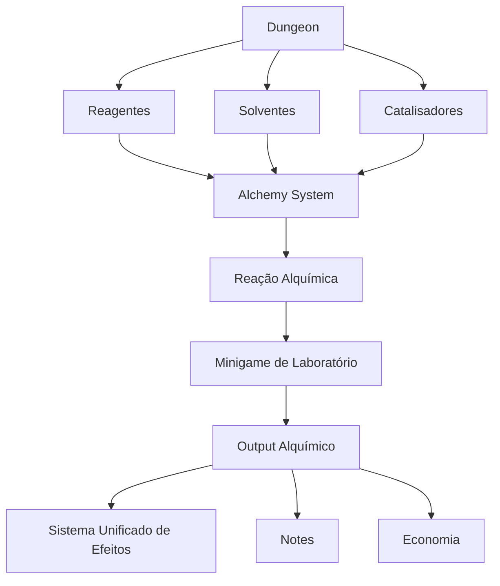

---

# 2. Objetivos de Design

## 2.1 Objetivo principal

Criar um sistema de alquimia que pareça **físico, experimental, legível e arriscado**, sem virar uma simulação química realista demais.

O jogador deve sentir:

- “eu não sei ainda o que esse reagente faz”;
    
- “essa mistura pode curar, intoxicar ou explodir”;
    
- “a centrífuga separou uma camada valiosa”;
    
- “se eu extrair a camada errada, contamino a poção”;
    
- “essa fórmula eu descobri por tentativa e notes”;
    
- “essa glândula do monstro virou um veneno útil”;
    
- “esse cristal estabilizou o efeito arcano”;
    
- “posso usar, vender ou aplicar isso como coating”.
    

---

## 2.2 Problemas que o sistema resolve

| Problema                                   | Solução via Alchemy                                 |
|--------------------------------------------|-----------------------------------------------------|
| Poções não devem ser só crafting de menu   | minigame físico de laboratório                      |
| Cooking já cobre comida                    | Alchemy cobre reações, solventes, poções e coatings |
| Crafting/Forging precisa de revestimentos  | Alchemy produz coatings e estabilizadores           |
| Mining precisa gerar catalisadores         | sais, cristais, enxofre e flux alimentam fórmulas   |
| Bestiário precisa gerar utilidade          | órgãos e glândulas viram reagentes                  |
| Notes precisam registrar descoberta        | fórmulas, falhas e propriedades viram notes         |
| Economia precisa de produtos de valor alto | poções e elixires são produtos comerciais           |
| Dungeon precisa de risco de preparo        | field alchemy gera ruído, fumaça e explosões        |
| Multiplayer precisa evitar exploit         | servidor valida resultado e consumo                 |

---

# 3. Pilares do Alchemy System

## 3.1 Alquimia é experimental

O jogador não começa com todas as fórmulas.

Fórmulas e propriedades precisam ser descobertas por:

- inspeção;
    
- mistura;
    
- erro;
    
- notes;
    
- bestiário;
    
- mining;
    
- cooking;
    
- NPCs;
    
- repetição;
    
- análise de falha.
    

Estados possíveis:

| Estado       | Descrição                               |
|--------------|-----------------------------------------|
| `Unknown`    | fórmula/propriedade desconhecida        |
| `Hypothesis` | suspeita criada por note ou experimento |
| `Volatile`   | funciona, mas instável                  |
| `Partial`    | efeito parcialmente conhecido           |
| `Known`      | fórmula funcional                       |
| `Refined`    | fórmula otimizada                       |
| `Mastered`   | fórmula dominada                        |

---

## 3.2 Reagentes têm propriedades ocultas

Cada reagente pode ter propriedades visíveis e ocultas.

Exemplo:

| Reagente          | Propriedades possíveis         |
|-------------------|--------------------------------|
| Glândula venenosa | Poison, Acid, Toxicity         |
| Cristal azul      | Mana, Frost, Stabilizer        |
| Sangue abissal    | Power, Corruption, Instability |
| Seiva de raiz     | Regeneration, Binding, Earth   |
| Enxofre           | Fire, Smoke, Volatile          |
| Sal mineral       | Preservation, Stabilizer       |
| Esporo fúngico    | Heal, Hallucination, Toxicity  |
| Osso sagrado      | Purify, Holy, Stability        |

---

## 3.3 Alquimia tem risco real

Alquimia pode gerar:

- veneno;
    
- explosão;
    
- gás tóxico;
    
- fumaça;
    
- ruído;
    
- corrupção;
    
- mutação;
    
- perda de material;
    
- reação inerte;
    
- item instável;
    
- contaminação da bancada.
    

Regra:

$$  
AlchemyRisk \propto ReagentPower + Instability + Unknownness  
$$

---

## 3.4 Alquimia usa o sistema unificado de efeitos

Poções, elixires, coatings, ácidos, venenos, bombas e transmutadores não devem criar sistemas paralelos.

Todos devem gerar efeitos pelo mesmo modelo:

$$  
FinalEffect =  
BaseEffect  
\cdot  
(1 + \sum AdditiveModifiers)  
\cdot  
\prod MultiplicativeModifiers  
\cdot  
ConditionModifier  
$$

---

## 3.5 Alquimia não substitui Cooking nem Crafting

| Sistema          | Papel                                              |
|------------------|----------------------------------------------------|
| Cooking          | comida, nutrição, buffs alimentares                |
| Alchemy          | reações, poções, solventes, coatings, transmutação |
| Crafting/Forging | gear, ferramentas, armas, armaduras, kits          |
| Mining           | catalisadores e reagentes minerais                 |
| Bestiário        | reagentes orgânicos e venenos                      |
| Notes            | hipóteses, fórmulas e falhas                       |
| Economia         | venda, contratos e demanda                         |

---

# 4. Core Loop

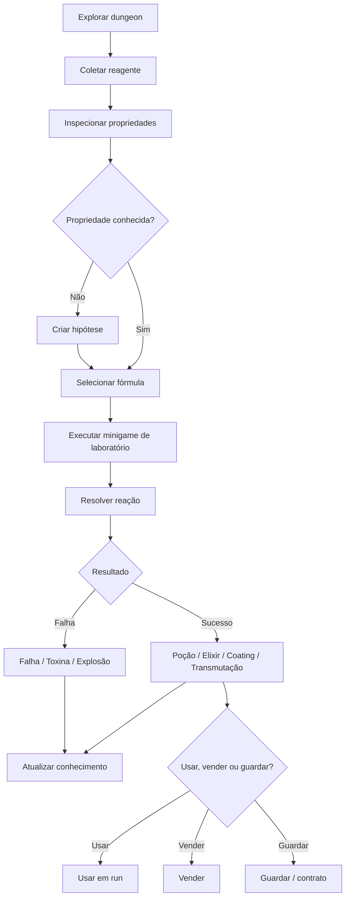

---

# 5. Categorias de Reagentes

## 5.1 Reagentes orgânicos

| Reagente          | Origem             | Uso                      |
|-------------------|--------------------|--------------------------|
| Glândula venenosa | monstro            | veneno, ácido            |
| Sangue            | criatura           | ritual, vigor, corrupção |
| Olho arcano       | criatura mágica    | visão, mana              |
| Fungo medicinal   | bioma fúngico      | cura, regen              |
| Esporo tóxico     | fungo              | poison, alucinação       |
| Seiva viva        | raízes             | regen, binding           |
| Osso em pó        | ossuário           | estabilizador, ritual    |
| Gordura de besta  | harvesting/cooking | base oleosa              |
| Carapaça moída    | inseto/crustáceo   | armor coating            |
| Muco de slime     | slime              | solvente viscoso         |

---

## 5.2 Reagentes minerais

| Reagente          | Origem     | Uso                        |
|-------------------|------------|----------------------------|
| Enxofre           | mineração  | fire, smoke, volatile      |
| Sal mineral       | mineração  | preservação, estabilização |
| Pó cristalino     | cristal    | mana, arcane               |
| Obsidiana moída   | lava/rocha | dark catalyst, sharpness   |
| Cinza vulcânica   | lava       | burn, resistência          |
| Gelo alquímico    | gelo       | frost, conservação         |
| Flux mineral      | mining     | estabilização              |
| Fragmento abissal | abismo     | poder, corrupção           |

---

## 5.3 Solventes

Solvente define como a reação acontece.

| Solvente        | Função                    |
|-----------------|---------------------------|
| Água pura       | base neutra               |
| Álcool          | extração rápida, instável |
| Óleo            | coatings e venenos        |
| Ácido leve      | dissolução                |
| Sangue          | ritual, instável          |
| Seiva           | estabilização orgânica    |
| Mana condensada | efeitos arcanos           |
| Água benta      | holy, anti-corruption     |

---

## 5.4 Catalisadores

| Catalisador       | Efeito                        |
|-------------------|-------------------------------|
| Flux alquímico    | reduz instabilidade           |
| Cristal condutivo | amplifica magia               |
| Sal negro         | aumenta potência e toxicidade |
| Osso sagrado      | purificação                   |
| Enxofre refinado  | fogo/explosão                 |
| Pó prismático     | efeito raro/aleatório         |
| Raiz seca         | estabiliza regen              |
| Cinza ritual      | converte potência em duração  |

---

# 6. Fórmulas Alquímicas

## 6.1 Estrutura de uma fórmula

Uma fórmula define:

| Campo                   | Função                               |
|-------------------------|--------------------------------------|
| `formula_id`            | identificador estável                |
| `display_name_key`      | nome localizado                      |
| `required_reagent_tags` | tags obrigatórias                    |
| `optional_reagent_tags` | tags bônus                           |
| `forbidden_tags`        | combinações perigosas                |
| `solvent_type`          | base da reação                       |
| `catalyst_type`         | catalisador                          |
| `station_type`          | estação                              |
| `difficulty`            | dificuldade                          |
| `reaction_time`         | tempo                                |
| `temperature_range`     | temperatura ideal                    |
| `stability_rule`        | regra de estabilidade                |
| `output_type`           | poção, elixir, coating, ácido, flask |
| `failure_rule`          | falha possível                       |

---

## 6.2 Estados da fórmula

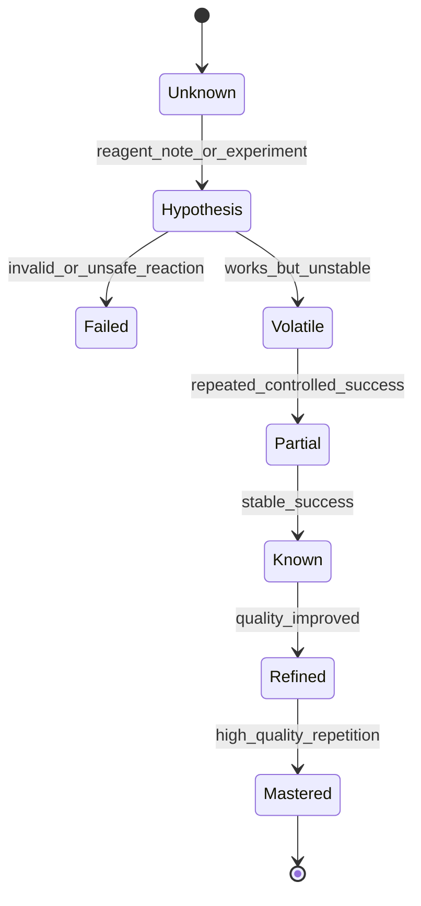

---

# 7. Estações de Alquimia

| Estação           | Uso                             | Local             |
|-------------------|---------------------------------|-------------------|
| Mortar & Pestle   | triturar reagentes              | Hub/dungeon       |
| Alchemy Bench     | poções comuns                   | Hub/loja          |
| Alembic           | destilação                      | Hub               |
| Centrifuge        | separação por camadas           | Hub/loja avançada |
| Field Alchemy Kit | mistura simples                 | dungeon           |
| Arcane Crucible   | reações mágicas                 | Hub avançado      |
| Coating Table     | coatings para armas/ferramentas | Hub/loja          |
| Distillation Coil | extratos puros                  | Hub               |
| Toxic Chamber     | venenos e ácidos                | Hub avançado      |
| Ritual Vessel     | elixires raros                  | Hub/altar         |

---

# 8. Minigame de Laboratório

## 8.1 Visão geral

O minigame principal de alquimia deve ser **semi-realista e usável**.

Ele não precisa simular química real. Ele precisa parecer plausível e ter leitura clara.

A sequência completa:

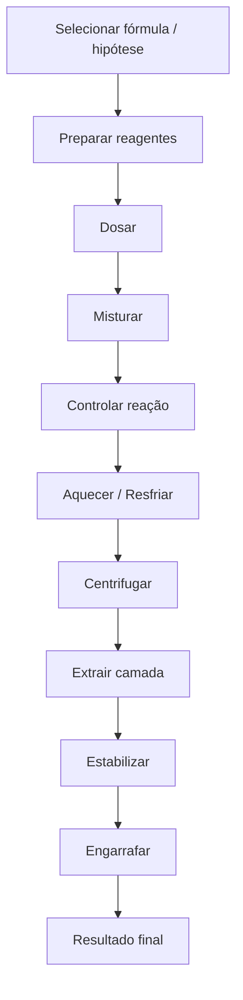

---

## 8.2 Etapas do minigame

| Etapa          | Ação do player                         | Skill testado       |
|----------------|----------------------------------------|---------------------|
| Preparação     | triturar, cortar, macerar              | ritmo e tempo       |
| Dosagem        | colocar quantidade certa               | controle fino       |
| Mistura        | agitar, girar, inverter tubo           | intensidade correta |
| Reação         | observar cor, calor, fumaça, bolhas    | leitura visual      |
| Aquecimento    | manter temperatura ideal               | controle e timing   |
| Centrifugação  | balancear tubos e definir rotação      | lógica e precisão   |
| Extração       | puxar camada certa com pipeta          | precisão            |
| Estabilização  | adicionar catalisador no momento certo | timing              |
| Engarrafamento | selar sem contaminar                   | finalização         |

---

# 9. Subminigames

## 9.1 Dosagem

O jogador precisa colocar a quantidade certa de reagente.

| Resultado       | Efeito            |
|-----------------|-------------------|
| Dose perfeita   | estabilidade alta |
| Dose baixa      | efeito fraco      |
| Dose alta       | toxicidade        |
| Excesso crítico | reação violenta   |

Fórmula:

$$  
DoseAccuracy =  
1 -  
\frac{|DoseActual - DoseTarget|}{DoseTolerance}  
$$

Com clamp:

$$  
DoseAccuracy = clamp(DoseAccuracy, 0, 1)  
$$

---

## 9.2 Mistura

Nem toda fórmula quer mistura forte.

| Técnica           | Uso                |
|-------------------|--------------------|
| Swirl leve        | poções delicadas   |
| Shake forte       | venenos agressivos |
| Inversão lenta    | elixires arcanos   |
| Agitação circular | emulsões/coatings  |
| Repouso           | separação natural  |
| Mistura mínima    | explosivos         |

Fórmula:

$$  
MixQuality =  
TechniqueMatch  
\cdot  
RhythmAccuracy  
\cdot  
DurationAccuracy  
$$

---

## 9.3 Aquecimento

Algumas fórmulas exigem calor.

| Estado        | Resultado                 |
|---------------|---------------------------|
| Frio demais   | reação incompleta         |
| Morno         | efeito fraco              |
| Ideal         | reação perfeita           |
| Quente demais | toxicidade                |
| Superaquecido | explosão/fumaça/corrupção |

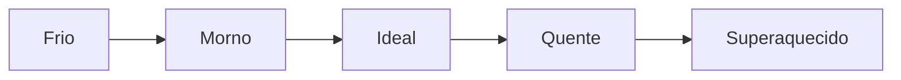

Fórmula:

$$  
HeatAccuracy =  
1 -  
\frac{|TemperatureActual - TemperatureIdeal|}{TemperatureTolerance}  
$$

Com clamp:

$$  
HeatAccuracy = clamp(HeatAccuracy, 0, 1)  
$$

---

## 9.4 Centrifugação

A centrífuga é a identidade da alquimia avançada.

O jogador coloca tubos na máquina, balanceia os lados, define rotação e tempo.

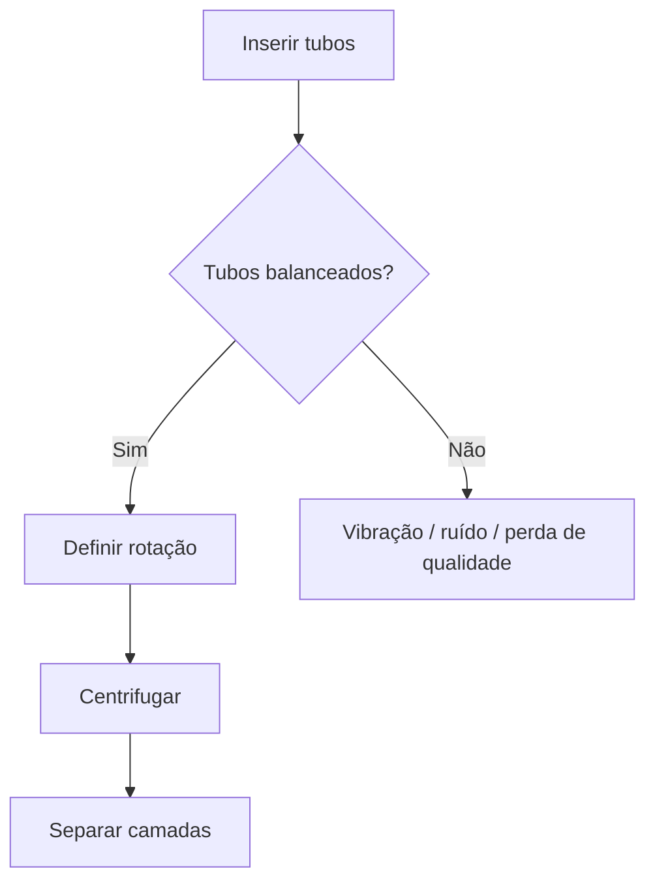

Regras:

| Situação             | Resultado                |
|----------------------|--------------------------|
| Tubos balanceados    | separação limpa          |
| Tubos desbalanceados | vibração e ruído         |
| Rotação baixa        | separação parcial        |
| Rotação ideal        | camadas claras           |
| Rotação alta demais  | quebra composto sensível |
| Tempo curto          | separação incompleta     |
| Tempo longo demais   | degrada camada ativa     |

Fórmula:

$$  
SeparationQuality =  
Balance  
\cdot  
RPMAccuracy  
\cdot  
TimeAccuracy  
\cdot  
Stability  
$$

---

## 9.5 Extração por camada

Depois da centrífuga, o tubo mostra camadas.

| Camada   | Possível significado                    |
|----------|-----------------------------------------|
| Superior | essência leve, óleo, toxina volátil     |
| Média    | princípio ativo desejado                |
| Inferior | sedimento, impureza, catalisador pesado |

O jogador usa uma pipeta para extrair a camada correta.

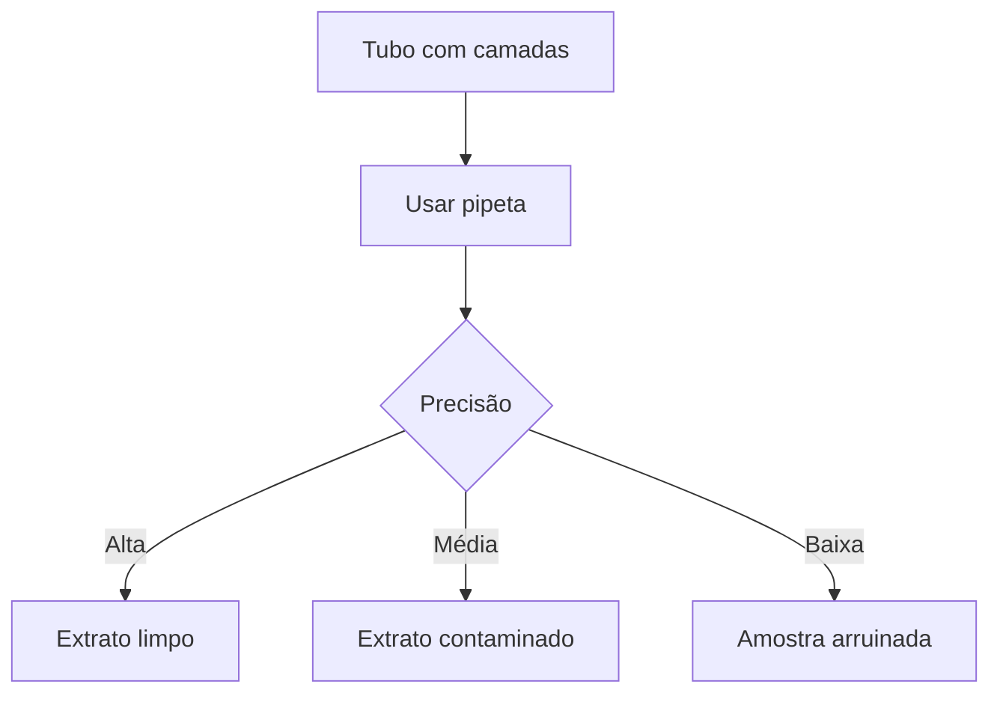

Fórmula:

$$  
ExtractQuality =  
LayerAccuracy  
\cdot  
HandStability  
\cdot  
ToolQuality  
$$

---

## 9.6 Estabilização

O jogador adiciona estabilizador na janela correta.

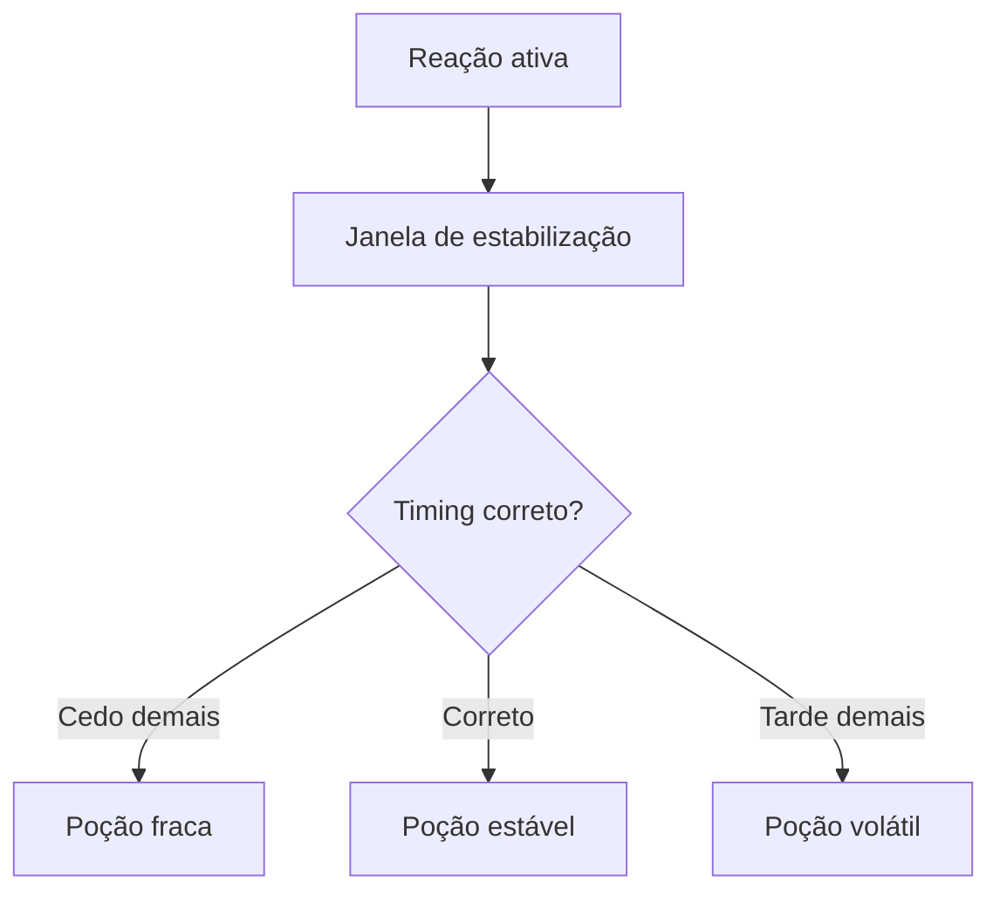

Fórmula:

$$  
StabilizationQuality =  
TimingAccuracy  
\cdot  
StabilizerCompatibility  
$$

---

# 10. Qualidade Final do Processo

Cada etapa gera uma nota parcial.

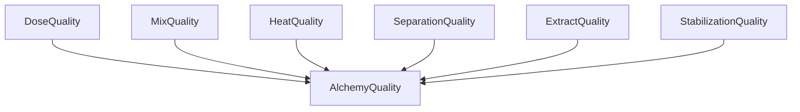

Fórmula:

$$  
AlchemyQuality =  
w_dDoseQuality +  
w_mMixQuality +  
w_hHeatQuality +  
w_cSeparationQuality +  
w_eExtractQuality +  
w_sStabilizationQuality  
$$

Com:

$$  
w_d + w_m + w_h + w_c + w_e + w_s = 1  
$$

Pesos variam por fórmula.

| Fórmula       | Etapas mais importantes     |
|---------------|-----------------------------|
| Poção de cura | dosagem + aquecimento       |
| Veneno        | centrifugação + extração    |
| Explosivo     | dosagem + estabilização     |
| Coating       | mistura + viscosidade       |
| Elixir arcano | temperatura + estabilização |
| Antídoto      | dose + pureza               |

---

# 11. Fórmulas Matemáticas do Sistema

## 11.1 Qualidade média dos reagentes

# $$  
Q_{reagents}

\frac{  
\sum_{i=1}^{n} Q_i \cdot W_i  
}{  
\sum_{i=1}^{n} W_i  
}  
$$

---

## 11.2 Estabilidade da reação

## $$  
Stability =  
S_{solvent}  
+  
S_{catalyst}  
+  
S_{station}  
+  
K_{formula}  
+  
S_{alchemy}

## I_{reagents}

## T_{toxicity}

V_{volatility}  
$$

Com clamp:

$$  
Stability = clamp(Stability, 0, 1)  
$$

---

## 11.3 Chance de falha

# $$  
P_{fail}

## D_{formula}  
+  
I_{reagents}  
+  
V_{volatility}  
+  
T_{toxicity}

## S_{alchemy}

## K_{formula}

S_{station}  
$$

Com clamp:

$$  
P_{fail} = clamp(P_{fail}, 0.05, 0.95)  
$$

---

## 11.4 Toxicidade acumulada

# $$  
T_{total}

## \sum_{i=1}^{n} T_i

## S_{purifier}

S_{stabilizer}  
$$

Se:

$$  
T_{total} > T_{safe}  
$$

o item pode causar penalidade.

---

## 11.5 Potência do efeito

# $$  
Power_{alchemy}

BasePower  
\cdot  
Q_{reagents}  
\cdot  
AlchemyQuality  
\cdot  
CatalystModifier  
\cdot  
KnowledgeModifier  
\cdot  
StationModifier  
$$

---

## 11.6 Duração do efeito

$$  
Duration =  
BaseDuration  
\cdot  
AlchemyQuality  
\cdot  
Stability  
$$

---

## 11.7 Efeito final

$$  
FinalAlchemyEffect =  
BaseEffect  
\cdot  
AlchemyQuality  
\cdot  
Stability  
\cdot  
TargetCompatibility  
\cdot  
ConditionModifier  
$$

---

# 12. Tipos de Output

## 12.1 Poções

| Poção            | Efeito                       |
|------------------|------------------------------|
| Healing Potion   | cura                         |
| Stamina Draught  | stamina                      |
| Mana Potion      | mana                         |
| Antidote         | reduz veneno                 |
| Fire Resistance  | reduz burn/calor             |
| Frost Resistance | reduz frio/slow              |
| Stone Skin       | defesa temporária            |
| Night Sight      | visão no escuro              |
| Silence Potion   | reduz ruído                  |
| Focus Potion     | melhora aim/crafting/casting |

---

## 12.2 Elixires

Elixires são mais fortes, raros e arriscados.

| Elixir                 | Efeito                           |
|------------------------|----------------------------------|
| Elixir of Depth        | resistência a pressão/abismo     |
| Elixir of Clarity      | revela propriedades de reagentes |
| Elixir of Iron Blood   | resistência física               |
| Elixir of Rooted Flesh | regen lenta                      |
| Elixir of Arcane Flow  | melhora canalização              |
| Elixir of Purity       | reduz corrupção                  |
| Elixir of Sacrifice    | efeito forte com custo           |

---

## 12.3 Coatings alquímicos

| Coating         | Uso                          |
|-----------------|------------------------------|
| Poison Oil      | arma aplica veneno           |
| Fire Oil        | arma aplica burn             |
| Frost Gel       | arma aplica slow             |
| Acid Paste      | reduz armadura               |
| Conductive Oil  | amplifica Fulmen             |
| Holy Wash       | anti-corruption              |
| Silent Resin    | reduz ruído de ferramenta    |
| Anti-Rust Oil   | reduz desgaste               |
| Beast Lure      | atrai criaturas              |
| Beast Repellent | repele criaturas específicas |

---

## 12.4 Frascos e bombas

| Item             | Uso                                   |
|------------------|---------------------------------------|
| Smoke Flask      | cobertura visual                      |
| Fire Flask       | área de fogo                          |
| Acid Flask       | corrosão/armor break                  |
| Sleep Gas        | stealth/control                       |
| Noise Flask      | distração                             |
| Light Flask      | ilumina ou cega                       |
| Stink Flask      | atrai/afasta monstros                 |
| Crystal Flash    | stun contra criaturas sensíveis à luz |
| Corruption Flask | alto risco, efeito forte              |

---

## 12.5 Transmutações

| Transmutação        | Uso                         |
|---------------------|-----------------------------|
| Purify Material     | remove corrupção            |
| Stabilize Crystal   | reduz instabilidade         |
| Harden Leather      | melhora armadura            |
| Refine Salt         | melhora preservação         |
| Extract Essence     | cria essência concentrada   |
| Convert Ore Residue | recupera subproduto         |
| Arcane Infusion     | adiciona propriedade mágica |
| Decontaminate Organ | reduz toxicidade            |

---

# 13. Reações e Falhas

## 13.1 Tipos de reação

| Reação     | Resultado              |
|------------|------------------------|
| Stable     | output esperado        |
| Potent     | output mais forte      |
| Diluted    | efeito fraco           |
| Volatile   | funciona, mas instável |
| Toxic      | efeito + veneno        |
| Explosive  | dano/ruído/perda       |
| Corruptive | corrupção              |
| Mutagenic  | mutação temporária     |
| Inert      | sem efeito             |
| Backlash   | dano no alquimista     |

---

## 13.2 Fluxo de reação

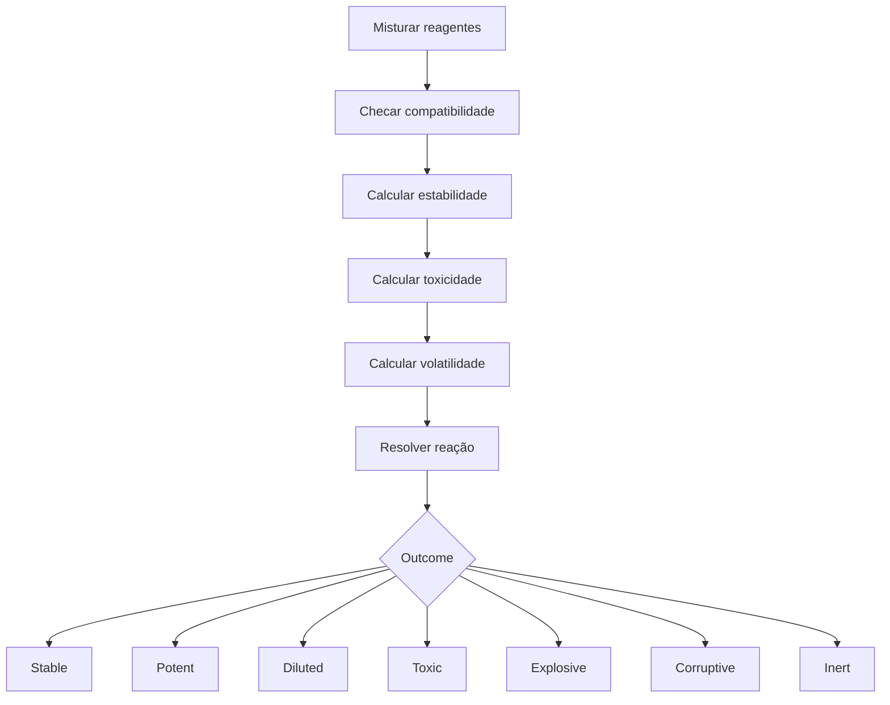

---

## 13.3 Falhas interessantes

| Falha              | Causa                       | Consequência            |
|--------------------|-----------------------------|-------------------------|
| Emulsão ruim       | misturou forte demais       | separação difícil       |
| Precipitado inútil | solvente errado             | efeito reduzido         |
| Superaquecimento   | temperatura alta            | toxicidade/explosão     |
| Camada contaminada | pipeta pegou impureza       | efeito colateral        |
| Reação inerte      | catalisador errado          | sem efeito              |
| Gás tóxico         | combinação perigosa         | dano/área contaminada   |
| Frasco instável    | estabilização ruim          | pode quebrar na mochila |
| Coating quebradiço | viscosidade errada          | perde efeito rápido     |
| Backlash arcano    | catalisador mágico instável | dano/corrupção          |

---

# 14. Descoberta de Propriedades

## 14.1 Estados de propriedade

| Estado    | Descrição       |
|-----------|-----------------|
| Hidden    | desconhecida    |
| Suspected | suspeita        |
| Tested    | testada         |
| Confirmed | confirmada      |
| False     | hipótese errada |
| Mastered  | dominada        |

---

## 14.2 Fontes de descoberta

| Fonte                | O que revela                    |
|----------------------|---------------------------------|
| Inspeção             | categoria e risco básico        |
| Cheiro/cor           | pistas                          |
| Reação simples       | propriedade primária            |
| Mistura com solvente | toxicidade/estabilidade         |
| Uso em poção         | efeito                          |
| Falha                | incompatibilidade               |
| Bestiário            | propriedade de parte de monstro |
| Cooking              | toxicidade orgânica             |
| Mining               | pureza/catalisador              |
| Notes                | hipótese e confirmação          |
| NPC alquimista       | fórmula parcial                 |

---

## 14.3 Fórmula de conhecimento alquímico

# $$  
K_{alchemy}

K_{inspect}  
+  
K_{reaction}  
+  
K_{failure}  
+  
K_{notes}  
+  
K_{bestiary}  
+  
K_{repetition}  
$$

Thresholds:

$$  
K_{alchemy} \ge T_{property} \Rightarrow PropertyRevealed  
$$

$$  
K_{alchemy} \ge T_{formula} \Rightarrow FormulaKnown  
$$

$$  
K_{alchemy} \ge T_{mastery} \Rightarrow FormulaMastered  
$$

---

# 15. Integração com Notes

Alchemy depende muito de notes.

## 15.1 Tipos de Alchemy Notes

| Note                  | Uso                                |
|-----------------------|------------------------------------|
| Reagent Note          | registra propriedade de reagente   |
| Formula Note          | registra combinação                |
| Failure Note          | registra mistura perigosa          |
| Toxicity Note         | registra toxicidade                |
| Stability Note        | registra estabilizador útil        |
| Market Note           | registra valor de poção            |
| Creature Reagent Note | liga parte de monstro a efeito     |
| Transmutation Note    | registra transformação de material |

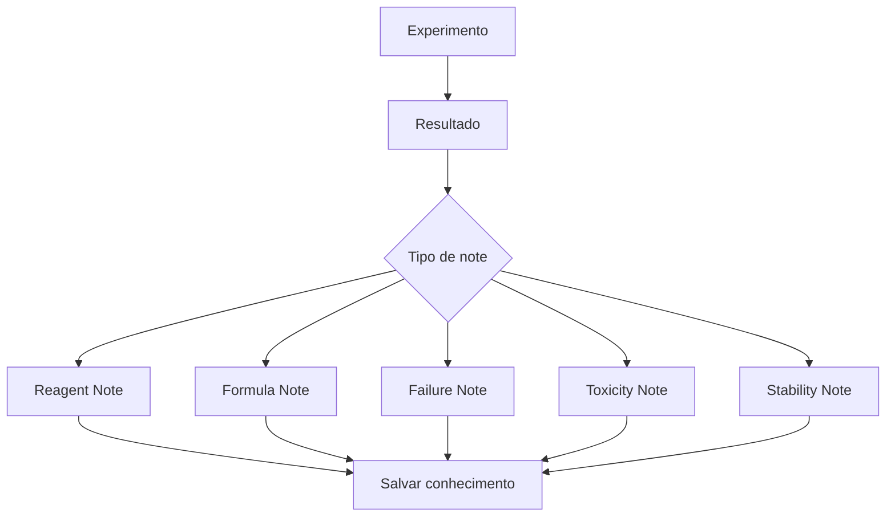

---

# 16. Integração com Bestiário

Bestiário fornece reagentes orgânicos e conhecimento anatômico.

| Conhecimento do Bestiário | Uso Alquímico          |
|---------------------------|------------------------|
| glândula venenosa         | poison/acid            |
| olho arcano               | vision/mana            |
| sangue de criatura        | ritual/buff/corruption |
| carapaça moída            | armor coating          |
| osso sagrado              | purificação            |
| órgão de fogo             | burn/fire resistance   |
| muco de slime             | solvente/gel           |
| veneno conhecido          | antídoto específico    |

Fórmula de extração:

# $$  
Q_{reagent}

## Q_{harvest}  
+  
K_{anatomy}  
+  
S_{alchemy}

## P_{decay}

P_{damage}  
$$

Com clamp:

$$  
Q_{reagent} = clamp(Q_{reagent}, 0, 1)  
$$

---

# 17. Integração com Mining

Mining fornece reagentes minerais.

| Material minerado  | Uso Alquímico              |
|--------------------|----------------------------|
| Enxofre            | fogo, fumaça, explosivo    |
| Sal mineral        | preservação, estabilização |
| Cristal prismático | mana, arcane               |
| Obsidiana          | ácido, dark catalyst       |
| Gelo mineral       | frost, conservação         |
| Pó metálico        | transmutação               |
| Flux               | estabilização              |
| Fragmento abissal  | poder/corrupção            |

---

# 18. Integração com Cooking

Cooking e Alchemy compartilham materiais, mas não têm o mesmo papel.

| Elemento        | Cooking        | Alchemy             |
|-----------------|----------------|---------------------|
| Fungo medicinal | comida de cura | extrato de cura     |
| Sal             | preservação    | estabilização       |
| Gordura         | alimento       | base oleosa         |
| Sangue          | receita ritual | catalisador         |
| Veneno          | não comestível | poison flask        |
| Seiva           | caldo/regen    | solvente orgânico   |
| Cristal em pó   | prato arcano   | mana potion/coating |

Regra:

$$  
Cooking = FoodBasedEffect  
$$

$$  
Alchemy = ReactionBasedEffect  
$$

---

# 19. Integração com Crafting & Forging

Alchemy fornece:

- coatings;
    
- solventes;
    
- purificadores;
    
- estabilizadores;
    
- ácidos;
    
- catalisadores;
    
- óleos;
    
- reagentes para upgrades;
    
- materiais transmutados.
    

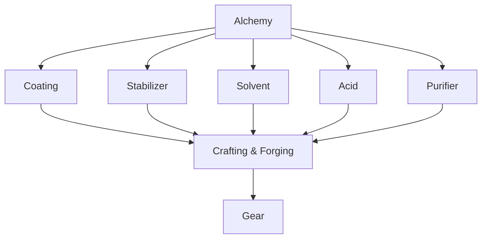

Exemplos:

| Produto alquímico | Uso no Crafting/Forging      |
|-------------------|------------------------------|
| Fire Oil          | Burn coating                 |
| Acid Paste        | armor shred                  |
| Conductive Oil    | Fulmen amplifier             |
| Holy Wash         | anti-corruption              |
| Stabilizing Flux  | reduz falha em liga          |
| Purifying Solvent | remove corrupção de material |
| Binding Resin     | melhora binding              |
| Anti-Rust Oil     | preserva durabilidade        |

---

# 20. Integração com Economia

Alchemy cria produtos de alto valor, mas precisa de anti-exploit.

## 20.1 Valor econômico

# $$  
V_{alchemy}

(V_{reagents} + V_{labor})  
\cdot  
Q_{alchemy}  
\cdot  
D_{market}  
\cdot  
R_{rarity}  
$$

Anti-exploit:

$$  
V_{alchemy}  
\le  
(V_{reagents} + V_{labor})  
\cdot  
M_{profitCap}  
$$

Recomendação inicial:

$$  
M_{profitCap} = 1.5  
$$

Exceções só devem ocorrer com:

- fórmula rara;
    
- falha relevante;
    
- reagente raro;
    
- contrato específico;
    
- alta demanda;
    
- estação avançada;
    
- risco de toxicidade.
    

---

## 20.2 Contratos alquímicos

Contratos podem pedir:

- antídotos;
    
- poções de cura;
    
- fire oil;
    
- holy wash;
    
- acid flasks;
    
- elixires;
    
- estabilizadores;
    
- purificadores;
    
- solventes raros.
    

Regra:

$$  
ContractFulfilled \Rightarrow ItemsConsumed = true  
$$

---

# 21. Integração com Dungeon

## 21.1 Field Alchemy

Alquimia na dungeon deve existir, mas com risco alto.

Riscos:

- fumaça;
    
- cheiro;
    
- luz;
    
- explosão;
    
- ruído;
    
- gás;
    
- tempo parado;
    
- inventário aberto;
    
- contaminação;
    
- perda de reagente.
    

Fórmula:

# $$  
Risk_{fieldAlchemy}

T_{reaction}  
\cdot  
Volatility  
\cdot  
NoiseLevel  
\cdot  
ExposureScore  
\cdot  
DangerLevel  
$$

---

## 21.2 Usos táticos

| Item            | Uso                                  |
|-----------------|--------------------------------------|
| Smoke Flask     | fugir/stealth                        |
| Acid Flask      | quebrar armadura ou obstáculo leve   |
| Fire Flask      | área de dano                         |
| Noise Flask     | distrair inimigo                     |
| Beast Repellent | afastar criatura                     |
| Light Flask     | iluminar ou cegar                    |
| Antidote        | sobreviver a veneno                  |
| Stabilizer      | tornar crafting de campo mais seguro |
| Purifier        | remover corrupção leve               |
| Rope Resin      | melhorar corda temporariamente       |

---

## 21.3 Anti-boss-gate bypass

Alchemy não pode burlar progressão.

Não permitido:

- ácido abrir boss gate;
    
- explosivo atravessar camada selada;
    
- transmutação atravessar selo;
    
- poção permitir queda infinita sem consequência;
    
- elixir ignorar boss lock;
    
- solvente dissolver barreira de camada.
    

Regra:

$$  
AlchemyUtility \not\Rightarrow BossGateBypass  
$$

---

# 22. Toxicidade, Corrupção e Mutação

## 22.1 Toxicidade

# $$  
ToxicityApplied

## T_{total}

## Resistance_{toxin}

PurityModifier  
$$

Se:

$$  
ToxicityApplied > T_{bodySafe}  
$$

o player sofre penalidade.

---

## 22.2 Corrupção

# $$  
CorruptionGain

## C_{reagent}  
\cdot  
Instability  
\cdot  
ExposureTime

PurityResistance  
$$

---

## 22.3 Mutações temporárias

| Mutação      | Efeito                               |
|--------------|--------------------------------------|
| Iron Skin    | defesa alta, movimento menor         |
| Night Eyes   | visão no escuro, sensibilidade à luz |
| Root Veins   | regen, fraqueza a fogo               |
| Abyss Breath | resistência abissal, corrupção       |
| Beast Scent  | melhor tracking, atrai predadores    |

---

# 23. VR / Flatscreen Parity

## 23.1 Princípio

VR e Flatscreen devem ter o mesmo teto de qualidade.

$$  
Q_{max}^{VR} = Q_{max}^{Flat}  
$$

$$  
MaterialCost_{VR} = MaterialCost_{Flat}  
$$

$$  
T_{alchemy}^{VR} \approx T_{alchemy}^{Flat}  
$$

$$  
Risk_{alchemy}^{VR} \approx Risk_{alchemy}^{Flat}  
$$

---

## 23.2 VR

Ações físicas:

| Ação        | Input VR                       |
|-------------|--------------------------------|
| Triturar    | movimento no almofariz         |
| Dosar       | inclinar frasco/pipeta         |
| Misturar    | girar tubo                     |
| Centrifugar | encaixar tubos e fechar tampa  |
| Pipetar     | puxar camada com controle fino |
| Aquecer     | aproximar do fogo              |
| Resfriar    | colocar no banho               |
| Estabilizar | pingar catalisador             |
| Engarrafar  | despejar e fechar rolha        |

---

## 23.3 Flatscreen

Equivalências:

| VR              | Flatscreen                    |
|-----------------|-------------------------------|
| inclinar frasco | segurar botão até marca       |
| mexer tubo      | analog stick / mouse circular |
| centrifugar     | posicionar tubos em slots     |
| pipetar camada  | cursor vertical com precisão  |
| aquecer         | slider de temperatura         |
| estabilizar     | apertar no timing             |
| engarrafar      | quick hold / timing simples   |

---

# 24. Corpse System

Itens físicos e reagentes podem ser perdidos.

| Dado                               | Vai para corpse? |
|------------------------------------|-----------------:|
| Reagentes da run                   |              Sim |
| Poções criadas na run              |              Sim |
| Fórmulas conhecidas                |              Não |
| Notes não confirmadas              |              Sim |
| Fórmula dominada                   |              Não |
| Propriedade confirmada de reagente |              Não |
| Elixir consumido                   |              Não |
| Estação portátil                   |              Sim |

Regras:

$$  
RunAlchemyItems \subseteq CorpseLoot  
$$

$$  
KnownFormulae \not\subseteq CorpseLoot  
$$

---

# 25. Persistência

## 25.1 Domínios

| Dado                     | Domínio                | Duração            |
|--------------------------|------------------------|--------------------|
| Reagentes na run         | `RunDomain`            | até extração/morte |
| Poções da run            | `RunDomain`            | até extração/morte |
| Reagentes no estoque     | `ShopDomain/Inventory` | permanente         |
| Fórmulas conhecidas      | `MetaDomain`           | permanente         |
| Formula mastery          | `MetaDomain`           | permanente         |
| Propriedades confirmadas | `MetaDomain`           | permanente         |
| Notes alquímicas         | `Run/World/Meta`       | conforme validação |
| Contratos alquímicos     | `ShopDomain`           | até conclusão      |
| Estação desbloqueada     | `Shop/MetaDomain`      | permanente         |

---

## 25.2 Fórmula de save

# $$  
AlchemySave

KnownFormulae  
+  
MasteredFormulae  
+  
ReagentKnowledge  
+  
StationUnlocks  
+  
AlchemyInventory  
+  
AlchemyNotes  
$$

Separação crítica:

$$  
RunReagents \neq MetaKnowledge  
$$

A morte pode remover reagentes, mas não apaga conhecimento confirmado.

---

# 26. Multiplayer

## 26.1 Server authority

Em multiplayer, o servidor valida:

- posse dos reagentes;
    
- estação;
    
- fórmula;
    
- solvente;
    
- catalisador;
    
- ordem de mistura;
    
- estabilidade;
    
- falha;
    
- toxicidade;
    
- criação do item;
    
- efeitos aplicados;
    
- consumo de materiais.
    

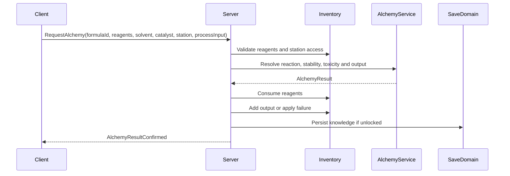

---

## 26.2 Party Alchemy

| Modelo                  | Regra                          |
|-------------------------|--------------------------------|
| Personal Alchemy        | player usa próprios reagentes  |
| Party Alchemy           | usa stash compartilhado        |
| Assisted Alchemy        | outro player reduz tempo/risco |
| Specialist Alchemist    | especialista melhora qualidade |
| Shop Alchemy            | produção vinculada à loja      |
| Emergency Field Alchemy | uso rápido em dungeon          |

Fórmula de assistência:

# $$  
S_{partyAlchemy}

S_{main}  
+  
\sum_{i=1}^{n} A_i  
$$

Com cap:

$$  
S_{partyAlchemy}  
\le  
S_{main}  
\cdot  
1.5  
$$

---

# 27. Modelo de Dados

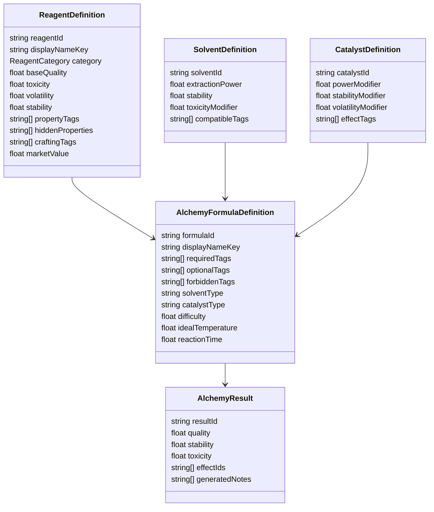

---

# 28. Estrutura de Scripts Recomendada

| Pasta                 | Arquivos                                                                                                                                                      |
|-----------------------|---------------------------------------------------------------------------------------------------------------------------------------------------------------|
| `Alchemy/Core`        | `ReagentDefinition.cs`, `AlchemyFormulaDefinition.cs`, `AlchemyResult.cs`, `AlchemyTag.cs`                                                                    |
| `Alchemy/Reagents`    | `ReagentInstance.cs`, `ReagentPropertyState.cs`, `ReagentKnowledgeService.cs`                                                                                 |
| `Alchemy/Solvents`    | `SolventDefinition.cs`, `SolventResolver.cs`                                                                                                                  |
| `Alchemy/Catalysts`   | `CatalystDefinition.cs`, `CatalystResolver.cs`                                                                                                                |
| `Alchemy/Processing`  | `AlchemyService.cs`, `ReactionResolver.cs`, `StabilityCalculator.cs`, `ToxicityCalculator.cs`, `VolatilityCalculator.cs`                                      |
| `Alchemy/Minigame`    | `DosageController.cs`, `MixingController.cs`, `HeatingController.cs`, `CentrifugeController.cs`, `LayerExtractionController.cs`, `StabilizationController.cs` |
| `Alchemy/Outputs`     | `PotionFactory.cs`, `ElixirFactory.cs`, `FlaskFactory.cs`, `AlchemyCoatingFactory.cs`, `TransmutationService.cs`                                              |
| `Alchemy/Effects`     | `AlchemyEffectBridge.cs`, `UnifiedEffectFactory.cs`, `StatusEffectResolver.cs`                                                                                |
| `Alchemy/Notes`       | `AlchemyNoteBridge.cs`, `FormulaNoteGenerator.cs`, `FailureNoteGenerator.cs`, `ReagentNoteGenerator.cs`                                                       |
| `Alchemy/Bestiary`    | `CreatureReagentBridge.cs`, `VenomKnowledgeService.cs`                                                                                                        |
| `Alchemy/Mining`      | `MineralCatalystBridge.cs`, `CrystalReagentResolver.cs`                                                                                                       |
| `Alchemy/Crafting`    | `CoatingCraftingBridge.cs`, `StabilizerCraftingBridge.cs`                                                                                                     |
| `Alchemy/Economy`     | `AlchemyValueCalculator.cs`, `AlchemyContractBridge.cs`                                                                                                       |
| `Alchemy/Networking`  | `ServerAlchemyService.cs`, `AlchemyRpcController.cs`, `AlchemyVisibilityResolver.cs`                                                                          |
| `Alchemy/Persistence` | `AlchemySaveData.cs`, `FormulaKnowledgeSave.cs`, `ReagentKnowledgeSave.cs`                                                                                    |
| `Alchemy/UI`          | `AlchemyBenchView.cs`, `ReagentInspectView.cs`, `FormulaBookView.cs`, `ReactionResultView.cs`                                                                 |

---

# 29. Pipeline Técnico

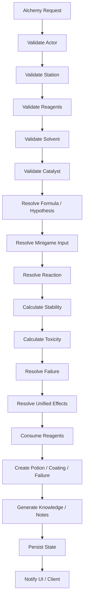

---

# 30. Validação

## 30.1 Constraints obrigatórias

| Constraint                       | Regra                                  |
|----------------------------------|----------------------------------------|
| `reagents_exist_in_inventory`    | não criar poção sem reagente           |
| `station_supports_formula`       | estação correta                        |
| `solvent_is_valid`               | solvente precisa ser compatível        |
| `catalyst_is_valid`              | catalisador precisa existir            |
| `formula_or_hypothesis_valid`    | fórmula ou hipótese válida             |
| `minigame_input_validated`       | input do minigame precisa ser validado |
| `stability_calculated`           | estabilidade sempre calculada          |
| `toxicity_calculated`            | toxicidade sempre calculada            |
| `failure_possible_when_unknown`  | fórmula desconhecida pode falhar       |
| `effects_use_unified_system`     | sem sistema paralelo de status         |
| `reagents_consumed`              | reagentes são consumidos               |
| `economy_anti_exploit_validated` | sem lucro infinito                     |
| `server_authoritative_result`    | client não decide                      |
| `corpse_rules_respected`         | item físico pode ser perdido           |
| `boss_gate_not_bypassed`         | alquimia não ignora progressão         |
| `cross_input_parity_validated`   | VR e Flat equivalentes                 |

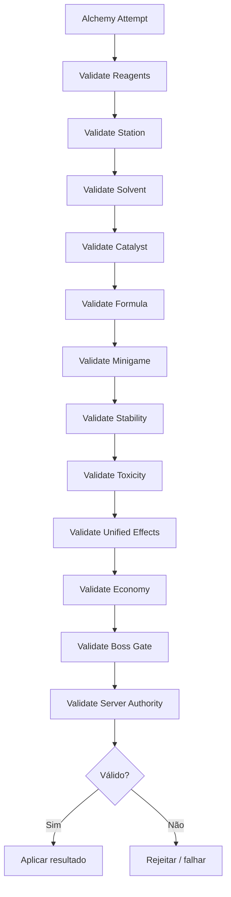

---

# 31. Escopo por Fase

> Fonte de gates: [Roadmap Content Scope](<../Production/Roadmap Content Scope.md>). Esta seção define o corte de Alchemy dentro das fases do roadmap principal, não um roadmap interno separado.

## 31.1 MVP

Alchemy no MVP existe como suporte de sobrevivência e experimentação básica no Hub. O objetivo é provar reagentes, estabilidade, falha e notes sem introduzir a complexidade dos sistemas avançados.

### Inclui

| Entrega | Regra |
| --- | --- |
| Bancada no Hub | Alchemy só acontece na estação do Hub no MVP. |
| 4 poções básicas | Cura, stamina, antídoto e fire flask. |
| Reagentes com tags | Cada reagente tem qualidade, toxicidade e tags funcionais. |
| Estabilidade simples | Reação calcula estabilidade em escala simples. |
| Falha possível | Mistura instável pode degradar output, consumir reagente ou gerar efeito negativo. |
| Notes de fórmula | Fórmulas descobertas, falhas e propriedades registram notes. |

### Exclui do MVP

- Sem centrifugação.
- Sem extração por camadas.
- Sem field alchemy.
- Sem coatings complexos.
- Sem multiplayer authority dedicado para alchemy.
- Sem validação completa de paridade VR/flatscreen para subminigames avançados.
- Sem transmutação econômica.

## 31.2 Alpha

Alpha expande Alchemy para o sistema completo de laboratório e começa a conectar o sistema com combate, dungeon e coleta avançada.

### Inclui

- Centrifugação.
- Extração por camadas.
- Coatings alquímicos.
- Field alchemy com risco, ruído, fumaça, tempo parado e falha.
- Integração completa com Bestiário para glândulas, venenos, órgãos e propriedades de criatura.
- Integração completa com Mining para sais, cristais, catalisadores minerais e estabilizadores.
- Contratos alquímicos simples, se o roadmap econômico da Alpha estiver ativo.

## 31.3 Beta

Beta valida Alchemy sob multiplayer, cross-input e produção de conteúdo mais ampla.

### Inclui

- Multiplayer authority para consumo de reagentes, resultado da reação e entrega de output.
- Validação de paridade VR/flatscreen para laboratório, field alchemy e coatings.
- Telemetria de falha, toxicidade, output econômico e diferença por modo de input.
- Party alchemy somente se o [Party System and Co-op Social Rules](<../Technical/Party System & Coop Social Rules.md>) já estiver estável.

---

# 32. Non-Goals

Não implementar no primeiro ciclo:

- centenas de fórmulas;
    
- simulação química realista completa;
    
- tabela periódica complexa;
    
- transmutação infinita de dinheiro;
    
- poção que substitui build inteira;
    
- cura infinita barata;
    
- explosivo que burla boss gate;
    
- alquimia automática passiva;
    
- fábrica de poções sem custo;
    
- client decidindo resultado;
    
- VR com qualidade máxima maior que Flatscreen;
    
- Flatscreen mais rápido que VR;
    
- efeitos alquímicos com sistema paralelo;
    
- centrífuga obrigatória para toda poção simples;
    
- minigame longo demais para itens básicos.
    

---

# 33. Critérios de Aceite

O Alchemy System está aceitável quando:

- reagentes possuem tags, qualidade, toxicidade e volatilidade;
    
- propriedades podem começar ocultas;
    
- fórmulas podem ser descobertas;
    
- solvente e catalisador afetam resultado;
    
- dosagem afeta qualidade;
    
- mistura afeta estabilidade;
    
- aquecimento afeta reação;
    
- centrifugação separa camadas em fórmulas avançadas;
    
- extração por pipeta pode contaminar ou purificar;
    
- estabilização define se o produto é seguro;
    
- toxicidade é calculada;
    
- falha é possível em fórmulas desconhecidas ou instáveis;
    
- poções usam o sistema unificado de efeitos;
    
- coatings alquímicos conectam com Crafting/Forging;
    
- reagentes vêm de Mining, Bestiário, Cooking ou exploração;
    
- alquimia pode gerar notes;
    
- itens físicos podem ir para corpse;
    
- fórmulas conhecidas persistem;
    
- field alchemy gera risco;
    
- economia valida anti-exploit;
    
- multiplayer é server-authoritative;
    
- VR e Flatscreen têm tempo, risco, custo e qualidade máxima equivalentes;
    
- alquimia não burla boss gate.
    

---

# 34. Definição Final para o GDD Principal

## Alchemy System

O Alchemy System transforma reagentes, solventes e catalisadores obtidos na dungeon em poções, elixires, frascos, coatings, ácidos, estabilizadores, purificadores e materiais transmutados. Ele fica entre Cooking, Crafting/Forging, Mining, Bestiário, Notes e Magic.

Alquimia é experimental. Reagentes possuem propriedades ocultas, como cura, veneno, fogo, gelo, mana, corrupção, estabilidade ou volatilidade. O jogador descobre essas propriedades por inspeção, tentativa, falha, notes, bestiário, mining, cooking e repetição.

O minigame de alquimia é baseado em laboratório diegético. O jogador prepara reagentes, dosa substâncias, mistura tubos, controla aquecimento, centrifuga amostras, extrai camadas com pipeta, estabiliza reações e engarrafa o resultado. Fórmulas simples usam apenas dosagem, mistura e estabilização. Fórmulas avançadas usam centrifugação e extração por camadas como identidade principal do sistema.

Toda reação alquímica calcula qualidade, estabilidade, toxicidade, volatilidade e chance de falha. Reações podem produzir poções estáveis, elixires fortes, coatings, transmutação, fumaça, ácido, veneno, explosão, corrupção ou item inerte. Falhas ensinam o jogador e podem gerar notes úteis.

Alchemy se integra ao Crafting & Forging por meio de coatings, solventes, purificadores, estabilizadores e catalisadores. Coatings como Poison Oil, Fire Oil, Frost Gel, Acid Paste, Conductive Oil e Holy Wash usam o sistema unificado de efeitos, sem criar lógica paralela.

Alchemy se integra ao Bestiário usando partes de criaturas, glândulas, sangue, órgãos, venenos e carapaças como reagentes. Integra-se ao Mining usando cristais, enxofre, sais, flux, obsidiana e fragmentos abissais. Integra-se ao Cooking quando compartilha materiais orgânicos, mas a diferença central é: Cooking cria efeitos alimentares; Alchemy cria efeitos por reação.

Na dungeon, field alchemy é possível, mas arriscada. Ela gera tempo parado, fumaça, ruído, cheiro, explosão e risco de contaminação. No Hub, a alquimia é mais segura e eficiente, mas depende do retorno vivo com reagentes. Itens físicos da run podem ser perdidos no corpse, mas fórmulas conhecidas e propriedades confirmadas persistem como meta progressão.

No multiplayer, o servidor valida reagentes, estação, solvente, catalisador, fórmula, minigame input, estabilidade, toxicidade, falha, consumo de materiais e criação do output. Em VR, alquimia deve ser física e diegética. Em Flatscreen, deve ser abstraída por sliders, timing, dosagem, posicionamento de tubos e controle de reação, mantendo tempo, risco, custo e qualidade máxima equivalentes.

---

# 35. Resumo Final

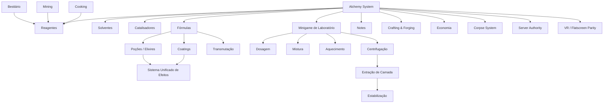

**Regra final:**  
**Alchemy é laboratório jogável.** O jogador coleta substâncias perigosas, testa hipóteses, registra falhas, centrifuga misturas, extrai camadas, estabiliza reações e converte conhecimento alquímico em poções, coatings, transmutação, economia e sobrevivência.
