## Linguística Arcana, Sintaxe em Tempo Real, Gestos, Catalisadores, Backlash e Efeitos Unificados

> **Projeto:** Dungeon Explorer: Ashvault  
> **Documento:** GDD completo do **Arcane Magic System**  
> **Escopo:** magia baseada em linguagem arcana, verbos, formas, modificadores, catalisadores, gestos VR, combos Flatscreen, validação por aptidão/treino/mana/sintaxe, backlash, slots cognitivos, notes, bestiário, alchemy, crafting/forging, AI, dungeon, boss gates, multiplayer, persistência e paridade VR/Flatscreen.  
> **Regra central:** o jogador não escolhe feitiços em um menu; ele **constrói frases arcanas em tempo real** e sofre as consequências da própria sintaxe.
> **`fase_permitida`:** P&D/vertical slice. A magia arcana completa não pertence ao trilho crítico do MVP.
> **Contrato obrigatório:** qualquer cast com movimento, destruição, scouting, passagem, verticalidade ou acesso estrutural passa pelo `LayerLockValidator`.

---

# 1. High Concept

O **Arcane Magic System** de Ashvault é baseado em **linguística arcana**.

Não existem menus tradicionais de magia, listas de feitiços prontas, spellbooks de seleção rápida ou desbloqueios por nível. O jogador descobre, testa e domina feitiços ao aprender a combinar:

- **Forma**;
    
- **Verbo Arcano**;
    
- **Modificadores**;
    
- **Catalisador**.
    

A estrutura base é:

$$  
Spell = Forma + Verbo + Modificadores + Catalisador  
$$

A magia funciona como uma frase dita ao mundo.  
Se a frase for simples, o risco é baixo.  
Se a frase for complexa, poderosa ou mal executada, a realidade responde com **backlash**.

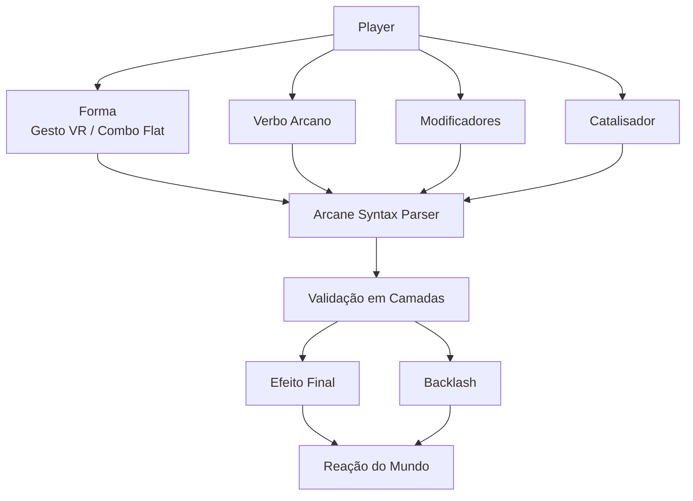

---

# 2. Objetivos de Design

## 2.1 Objetivo principal

Criar um sistema de magia que pareça:

- físico;
    
- linguístico;
    
- experimental;
    
- perigoso;
    
- sistêmico;
    
- compatível com VR;
    
- jogável em Flatscreen;
    
- integrado à dungeon.
    

O jogador deve sentir:

- “eu descobri uma palavra de poder”;
    
- “essa forma muda completamente o mesmo verbo”;
    
- “esse catalisador estabiliza o feitiço”;
    
- “esse modificador deixou a magia forte demais para mim”;
    
- “meu gesto falhou e a magia explodiu”;
    
- “essa criatura reage mal a Fulmen”;
    
- “posso tentar uma sintaxe nova, mas talvez pague caro”;
    
- “minha magia é uma linguagem, não uma hotbar”.
    

---

## 2.2 Problemas que o sistema resolve

| Problema                             | Solução via Linguística Arcana                 |
|--------------------------------------|------------------------------------------------|
| Magia comum vira lista de skills     | Feitiços são construídos por sintaxe           |
| Unlock por nível é genérico          | Progressão vem de descoberta, treino e domínio |
| VR precisa de embodiment             | Formas são gestos físicos                      |
| Flatscreen precisa equivalência      | Formas viram combos e inputs                   |
| Bestiário precisa importar           | Criaturas reagem a verbos e efeitos            |
| Notes precisam ter função            | Registram sintaxes, falhas e catalisadores     |
| Alchemy precisa conectar com magia   | Produz catalisadores e estabilizadores         |
| Crafting/Forging precisa gear mágico | Produz focos, luvas rúnicas e sockets          |
| AI precisa reagir                    | Magia gera Arcane Stimulus                     |
| Dungeon precisa manter progressão    | Magia não burla boss gates                     |

---

# 3. Pilares do Sistema

## 3.1 Magia é linguagem, não menu

O jogador não abre uma lista de feitiços prontos.

Ele aprende componentes e os combina.

| Componente  | Função                                       |
|-------------|----------------------------------------------|
| Forma       | como o efeito se manifesta                   |
| Verbo       | o núcleo semântico/elemental                 |
| Modificador | altera gramática e comportamento             |
| Catalisador | altera estabilidade, custo, potência e risco |

---

## 3.2 Magia é experimental

O jogador pode tentar combinações desconhecidas.

O sistema deve permitir:

- tentativa;
    
- falha;
    
- resultado parcial;
    
- descoberta;
    
- note automática/manual;
    
- domínio por repetição.
    

Estados de conhecimento:

| Estado       | Descrição                          |
|--------------|------------------------------------|
| `Unknown`    | componente ou sintaxe desconhecida |
| `Hypothesis` | jogador suspeita que funcione      |
| `Unstable`   | funciona, mas com risco alto       |
| `Partial`    | efeito conhecido parcialmente      |
| `Known`      | sintaxe confiável                  |
| `Refined`    | sintaxe otimizada                  |
| `Mastered`   | domínio alto da sintaxe            |

---

## 3.3 Magia exige aptidão

O jogador pode tentar qualquer frase, mas nem toda mente consegue contê-la.

A dificuldade vem da **complexidade sintática**, não de nível fixo.

$$  
SpellComplexity =  
VerbComplexity +  
FormComplexity +  
ModifierComplexity +  
CatalystComplexity  
$$

Aptidão mínima:

$$  
required_INT = SpellComplexity \times 5  
$$

$$  
required_FAI = SpellComplexity \times 3  
$$

Onde:

| Atributo | Função                                                    |
|----------|-----------------------------------------------------------|
| `INT`    | capacidade mental, estrutura e compreensão                |
| `FAI`    | afinidade, fé, foco interno ou ressonância arcana         |
| `WIS`    | estabilidade, percepção e capacidade de sustentar efeitos |

---

## 3.4 Magia tem custo e assinatura

Nenhum feitiço é gratuito.

Todo cast pode consumir:

- mana;
    
- tempo;
    
- concentração;
    
- catalisador;
    
- durabilidade do foco;
    
- estabilidade mental;
    
- espaço cognitivo.
    

Todo cast também gera uma assinatura:

- som;
    
- luz;
    
- calor;
    
- vibração;
    
- resíduo arcano;
    
- cheiro de ozônio;
    
- pulso mágico;
    
- alteração no ambiente.
    

Regra:

$$  
SpellPower \Rightarrow Cost + Risk + Signature  
$$

---

## 3.5 Magia usa o Sistema Unificado de Efeitos

Magia não deve criar um sistema paralelo de dano, buff ou debuff.

Todo resultado mágico gera efeitos pelo mesmo modelo usado por:

- Alchemy;
    
- Crafting/Forging;
    
- coatings;
    
- cooking buffs;
    
- bestiary weaknesses;
    
- divine modifiers;
    
- status effects;
    
- mutações.
    

Equação base:

$$  
FinalEffect =  
BaseEffect  
\cdot  
(1 + \sum AdditiveModifiers)  
\cdot  
\prod MultiplicativeModifiers  
\cdot  
ConditionModifier  
$$

---

## 3.6 Magia não burla boss gates

Magia pode ajudar na exploração, mas não pode ignorar progressão.

Regra inviolável:

$$  
ArcaneSyntax \not\Rightarrow BossGateBypass  
$$

Não permitido:

- atravessar boss gate com Umbra;
    
- perfurar parede selada com Terra;
    
- voar por shaft bloqueado com Ventus;
    
- ativar mecanismo futuro com Fulmen;
    
- dissolver selo com Aqua;
    
- revelar mapa completo com Lux;
    
- evitar todo dano de queda com Feather-like effects.
    

---

# 4. Core Loop — Linguística Arcana

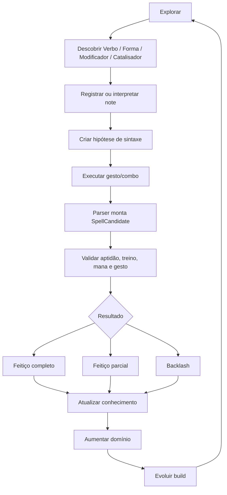

---

# 5. Estrutura da Sintaxe Arcana

## 5.1 Fórmula base

$$  
Spell = Forma + Verbo + Modificadores + Catalisador  
$$

Exemplos:

| Sintaxe                        | Resultado                  |
|--------------------------------|----------------------------|
| `Projétil + Ignis`             | bola de fogo simples       |
| `Projétil + Ignis + Directus`  | lança de fogo linear       |
| `Área + Ignis + Magna`         | explosão de fogo ampliada  |
| `Escudo + Terra`               | barreira de pedra          |
| `Canalização + Umbra + Stabil` | stealth sustentado         |
| `Toque + Aqua`                 | aplica Wet em superfície   |
| `Projétil + Fulmen + Directus` | raio linear                |
| `Onda + Ventus`                | rajada de vento direcional |
| `Área + Cura + Magna`          | cura em área               |
| `Toque + Cura`                 | cura direta em alvo/NPC    |

---

# 6. Verbos Arcanos Base

Verbos são o núcleo da magia. Eles definem o elemento e o comportamento base.

| Verbo    | Elemento    | Efeito Base                               | Mana Base |
|----------|-------------|-------------------------------------------|----------:|
| `Ignis`  | Fogo        | Dano por queimadura + Burn persistente    |        20 |
| `Aqua`   | Fluido      | Empurrão + Wet, amplifica Fulmen          |        15 |
| `Terra`  | Terra/Pedra | Escudo sólido + Slow em área              |        18 |
| `Fulmen` | Raio        | Dano alto + Chain em alvos molhados       |        25 |
| `Cura`   | Cura        | HP regen + remove Bleed/Burn leve         |        22 |
| `Umbra`  | Sombra      | Stealth boost temporário + Fear em Swarms |        28 |
| `Ventus` | Vento       | Empurrão direcional + redução de ruído    |        12 |

---

## 6.1 Função sistêmica de cada verbo

| Verbo    | Combate                   | Exploração                       | Stealth/AI                  |
|----------|---------------------------|----------------------------------|-----------------------------|
| `Ignis`  | Burn, dano em área        | ilumina, queima obstáculos leves | gera luz, calor e hive risk |
| `Aqua`   | Wet, empurrão             | apaga fogo, conduz Fulmen        | deixa rastros/umidade       |
| `Terra`  | escudo, slow, stagger     | apoio, bloqueio leve             | gera vibração               |
| `Fulmen` | burst, chain, stun        | energiza mecanismo válido        | assinatura arcana alta      |
| `Cura`   | regen, remove status leve | cura NPCs, purificação leve      | pulso vital detectável      |
| `Umbra`  | fear, obscure             | ocultação, apagar luz            | risco de corrupção          |
| `Ventus` | push, knockback           | dissipar gás, reduzir ruído      | desloca som/ar              |

---

## 6.2 Observação sobre `Cura`

`Cura` é mantido por legibilidade.

Alternativas futuras:

| Termo      | Direção                    |
|------------|----------------------------|
| `Cura`     | claro para o player        |
| `Sana`     | comando latino mais direto |
| `Vitae`    | vida, energia vital        |
| `Restituo` | restauração avançada       |

Recomendação: usar `Cura` no MVP e talvez `Vitae` como verbo avançado ou forma superior.

---

# 7. Formas — Gestos VR e Combos Flatscreen

A Forma define como o verbo se manifesta.

| Forma         | Gesto VR                   | Combo Flatscreen | Resultado                      |
|---------------|----------------------------|------------------|--------------------------------|
| `Projétil`    | Estocada direta            | `Q + Click`      | Projétil dirigido              |
| `Área`        | Círculo com o pulso        | `Q + E + Click`  | Explosão radial                |
| `Escudo`      | Palma aberta à frente      | `Q + Shift`      | Barreira defensiva             |
| `Canalização` | Hold do trigger            | `Hold Q`         | Efeito sustentado contínuo     |
| `Toque`       | Tocar objeto físico        | `Q + F`          | Aplicação direta em superfície |
| `Onda`        | Empurrão com ambas as mãos | `Q + E + Shift`  | Onda de força em linha         |

---

## 7.1 Complexidade das formas

| Forma         | Complexidade | Risco                    |
|---------------|-------------:|--------------------------|
| `Toque`       |            1 | baixo, exige proximidade |
| `Projétil`    |            1 | médio                    |
| `Escudo`      |            1 | baixo/médio              |
| `Onda`        |            2 | médio                    |
| `Área`        |            2 | alto em espaços fechados |
| `Canalização` |            2 | risco cresce por segundo |

---

# 8. Modificadores de Feitiço

Modificadores alteram a gramática do feitiço.

| Modificador | Função                      | Custo Adicional de Mana |
|-------------|-----------------------------|------------------------:|
| `Magna`     | Área/raio ampliado +100%    |                     +10 |
| `Latus`     | Splash AoE em cone          |                      +8 |
| `Directus`  | Projétil linear perfurante  |                      +5 |
| `Stabil`    | Efeito contínuo/canalização |                    +3/s |
| `Rapida`    | Cast speed +50%, poder -20% |                      -3 |
| `Fortis`    | Poder +50%, cast time +30%  |                     +12 |

---

## 8.1 Regras de combinação

| Combinação                            | Resultado                                                          |
|---------------------------------------|--------------------------------------------------------------------|
| `Rapida + Fortis`                     | permitido, mas aumenta instabilidade                               |
| `Magna + Directus`                    | feixe/projétil largo e perfurante                                  |
| `Stabil + Rapida`                     | canalização curta e instável                                       |
| `Magna + Latus + Fortis`              | alta complexidade e alto backlash                                  |
| `Umbra + Magna + Stabil`              | campo de sombra forte, assinatura detectável por criaturas arcanas |
| `Fulmen + Directus + Aqua/Wet target` | chain lightning aprimorado                                         |
| `Ventus + Stabil`                     | campo de redução de ruído sustentado                               |

---

## 8.2 Complexidade de modificadores

| Modificador | Complexidade |
|-------------|-------------:|
| `Rapida`    |            1 |
| `Directus`  |            1 |
| `Latus`     |            1 |
| `Magna`     |            2 |
| `Stabil`    |            2 |
| `Fortis`    |            2 |

---

# 9. Catalisadores

Catalisador é o quarto componente da frase.

Ele altera:

- potência;
    
- estabilidade;
    
- assinatura;
    
- custo;
    
- risco;
    
- chance de corrupção;
    
- afinidade elemental;
    
- interação com AI;
    
- chance de backlash.
    

| Catalisador       | Efeito                                      |
|-------------------|---------------------------------------------|
| Cristal comum     | estabilidade leve                           |
| Cristal condutor  | bônus para Fulmen                           |
| Enxofre refinado  | bônus para Ignis, mais ruído                |
| Água benta        | bônus para Cura/Lux futuro, reduz corrupção |
| Sangue abissal    | poder alto, corrupção alta                  |
| Osso sagrado      | estabiliza Cura e efeitos de purificação    |
| Flux arcano       | reduz backlash                              |
| Cinza ritual      | aumenta duração                             |
| Glândula venenosa | adiciona toxicidade                         |
| Fragmento abissal | alto poder, alto risco                      |
| Sal de vento      | melhora Ventus                              |
| Essência sombria  | melhora Umbra, aumenta risco mental         |

---

## 9.1 Catalisador nulo

Para permitir cast básico sem item, existe o conceito de **Catalisador Nulo**.

| Catalisador               | Efeito                                        |
|---------------------------|-----------------------------------------------|
| `None` / Catalisador Nulo | sem bônus, sem custo extra, estabilidade base |

Regra:

$$  
CatalystComplexity_{None} = 0  
$$

---

# 10. Mana Cost

O custo final de mana considera todos os componentes.

$$  
ManaCost =  
BaseVerbCost  
+  
FormCost  
+  
\sum ModifierCost  
+  
CatalystCostModifier  
$$

Exemplo:

| Componente       | Custo |
|------------------|------:|
| `Ignis`          |    20 |
| `Projétil`       |     0 |
| `Directus`       |    +5 |
| `Fortis`         |   +12 |
| Cristal condutor |    +0 |

Resultado:

$$  
ManaCost = 20 + 0 + 5 + 12 = 37  
$$

---

# 11. Complexidade Sintática

A complexidade substitui “nível de feitiço”.

$$  
SpellComplexity =  
VerbComplexity +  
FormComplexity +  
ModifierComplexity +  
CatalystComplexity  
$$

Exemplo:

$$  
Projétil + Ignis + Directus + Fortis  
$$

Com pesos:

| Componente | Complexidade |
|------------|-------------:|
| `Projétil` |            1 |
| `Ignis`    |            1 |
| `Directus` |            1 |
| `Fortis`   |            2 |

Resultado:

$$  
SpellComplexity = 1 + 1 + 1 + 2 = 5  
$$

Aptidão exigida:

$$  
required_INT = 5 \times 5 = 25  
$$

$$  
required_FAI = 5 \times 3 = 15  
$$

---

# 12. Equação de Poder do Feitiço

$$  
Power =  
BaseSpell  
\cdot  
TrainingModifier  
\cdot  
AptitudeModifier  
\cdot  
ManaRatio  
\cdot  
StabilityScore  
$$

---

## 12.1 Training Modifier

O treino cresce com repetição da mesma sintaxe ou componentes similares.

$$  
TrainingModifier =  
clamp(1 + SpellUses \times 0.001,\ 1,\ 2)  
$$

| Usos |      Bônus |
|-----:|-----------:|
|   10 |        +1% |
|  100 |       +10% |
|  500 |       +50% |
| 1000 | +100%, cap |

---

## 12.2 Aptitude Modifier

$$  
AptitudeModifier =  
\frac{INT}{10}  
\cdot  
\frac{FAI}{10}  
$$

Isso faz INT e FAI importarem juntos.

| INT | FAI | Modifier |
|----:|----:|---------:|
|  10 |  10 |     1.00 |
|  20 |  10 |     2.00 |
|  20 |  20 |     4.00 |
|  30 |   5 |     1.50 |
|   5 |  30 |     1.50 |

---

## 12.3 Mana Ratio

$$  
ManaRatio =  
clamp  
\left(  
\frac{ManaAvailable}{ManaCost},  
0,  
1  
\right)  
$$

---

## 12.4 Stability Score

$$  
StabilityScore =  
0.5 + (GestureAccuracy \times 0.5)  
$$

| Gesture Accuracy | Stability Score |
|-----------------:|----------------:|
|              0.0 |            0.50 |
|              0.4 |            0.70 |
|              0.7 |            0.85 |
|              1.0 |            1.00 |

---

# 13. Validação de Sucesso — 4 Camadas

O cast passa por quatro camadas sequenciais:

1. Aptidão;
    
2. Treino;
    
3. Mana;
    
4. Sintaxe do gesto/combo.
    

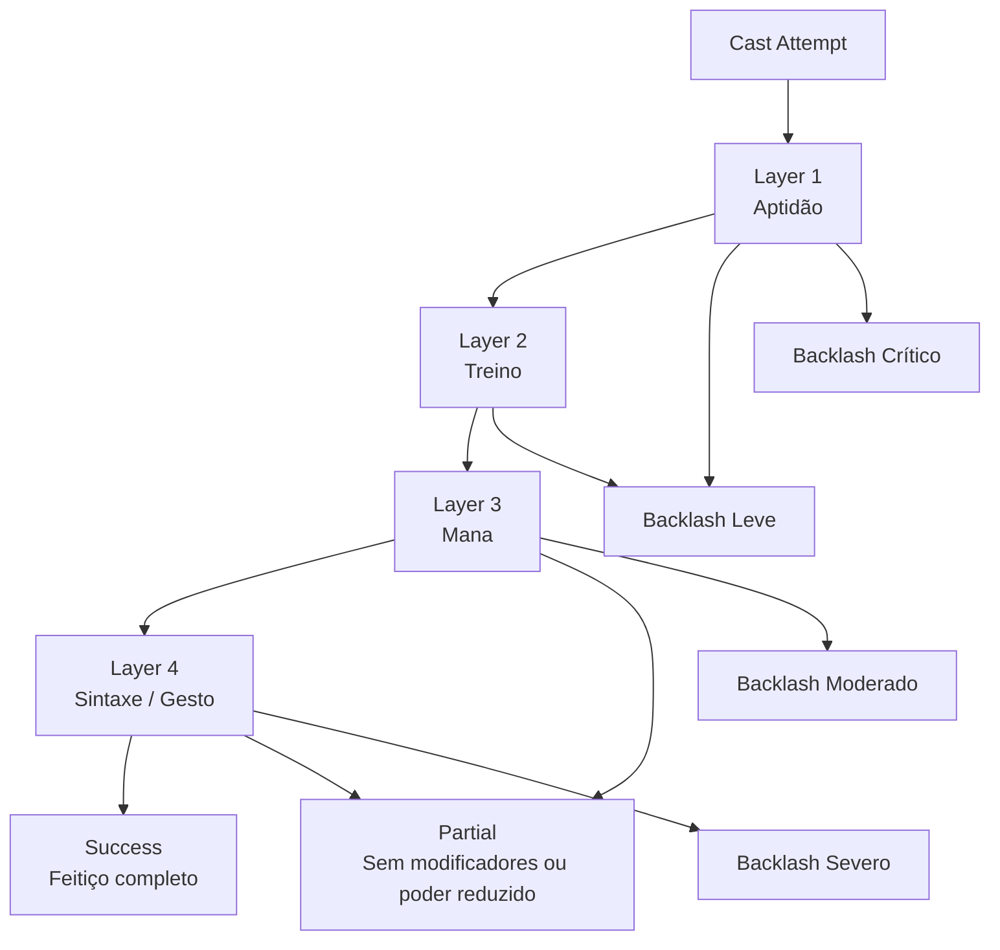

---

## 13.1 Layer 1 — Aptidão

$$  
required_INT = SpellComplexity \times 5  
$$

$$  
required_FAI = SpellComplexity \times 3  
$$

| Condição                                | Resultado         |
|-----------------------------------------|-------------------|
| INT/FAI suficiente                      | segue para treino |
| insuficiência leve, 10–20%              | backlash leve     |
| insuficiência alta                      | backlash severo   |
| complexidade 4+ com aptidão muito baixa | backlash crítico  |

Mensagem sugerida:

> “Mente insuficiente para conter este feitiço.”

---

## 13.2 Layer 2 — Treino

O treino não deve bloquear totalmente a experimentação. Ele deve aumentar risco.

$$  
TrainingRisk =  
1 -  
clamp  
\left(  
\frac{SpellUses}{MinimumTrainingThreshold},  
0,  
1  
\right)  
$$

| Treino            | Resultado                        |
|-------------------|----------------------------------|
| nenhum treino     | alto risco de backlash           |
| pouco treino      | spell possível, instável         |
| treino suficiente | cast normal                      |
| treino alto       | bônus de potência e estabilidade |

---

## 13.3 Layer 3 — Mana

| Condição                         | Resultado                          |
|----------------------------------|------------------------------------|
| `mana_current < mana_cost × 0.5` | falha + backlash moderado          |
| `mana_current < mana_cost`       | feitiço parcial, sem modificadores |
| `mana_current >= mana_cost`      | segue normal                       |

Regra de spell parcial:

$$  
PartialSpell = Forma + Verbo  
$$

Exemplo:

`Projétil + Ignis + Directus + Fortis`

Com mana parcial vira:

`Projétil + Ignis`

---

## 13.4 Layer 4 — Sintaxe / Gesto

| Gesture Accuracy | Resultado                        |
|-----------------:|----------------------------------|
|          `< 0.4` | backlash severo                  |
|       `0.4–0.69` | parcial, modificadores ignorados |
|       `0.7–0.89` | sucesso completo                 |
|         `>= 0.9` | perfect cast                     |

---

# 14. Gesture Accuracy

## 14.1 VR

No VR, a precisão vem de:

- direção do gesto;
    
- velocidade;
    
- amplitude;
    
- estabilidade da mão;
    
- conclusão da forma;
    
- alinhamento com foco/catalisador.
    

$$  
GestureAccuracy_{VR} =  
ShapeMatch  
\cdot  
DirectionAccuracy  
\cdot  
SpeedControl  
\cdot  
HandStability  
$$

---

## 14.2 Flatscreen

No Flatscreen, a precisão vem de:

- combo correto;
    
- timing;
    
- duração do input;
    
- mira;
    
- estabilidade da câmera;
    
- janela de execução.
    

$$  
GestureAccuracy_{Flat} =  
ComboCorrectness  
\cdot  
TimingAccuracy  
\cdot  
AimStability  
\cdot  
InputWindowAccuracy  
$$

---

## 14.3 Paridade VR / Flatscreen

$$  
Q_{max}^{VR} = Q_{max}^{Flat}  
$$

$$  
CastRisk_{VR} \approx CastRisk_{Flat}  
$$

$$  
CastTime_{VR} \approx CastTime_{Flat}  
$$

VR pode ser mais físico.  
Flatscreen pode ser mais abstrato.  
Nenhum modo deve ser numericamente superior por padrão.

---

# 15. Backlash

Backlash é a consequência de falhar ao falar com a realidade.

| Severidade | Causa                                           | Consequência                                               |
|------------|-------------------------------------------------|------------------------------------------------------------|
| Leve       | aptidão insuficiente em 10–20% ou treino baixo  | dano self `BaseSpell × 0.2`, ruído baixo                   |
| Moderado   | mana entre 50–100% do custo ou sintaxe instável | dano self `BaseSpell × 0.5`, spell fraco/deformado         |
| Severo     | gesture accuracy `< 0.4`                        | explosão local, mutação temporária, `AcousticEvent` máximo |
| Crítico    | complexidade 4+ sem aptidão                     | corrupção arcana persistente, atrai mobs do andar          |

---

## 15.1 Tipos de Backlash

| Tipo               | Efeito                                 |
|--------------------|----------------------------------------|
| Mana Burn          | dano arcano e perda temporária de mana |
| Spell Deformation  | efeito sai com forma errada            |
| Local Explosion    | explosão ao redor do caster            |
| Arcane Noise Burst | atrai AI e aumenta Hive Alert          |
| Mutation Pulse     | mutação temporária                     |
| Corruption Scar    | corrupção persistente até cura         |
| Focus Crack        | dano no foco                           |
| Catalyst Rupture   | catalisador quebra ou explode          |
| Reality Tear       | pequena anomalia temporária            |

---

## 15.2 Backlash e legibilidade

Falhas devem ser explicáveis.

| Causa                | Resultado mais legível           |
|----------------------|----------------------------------|
| falta de mana        | spell fraco ou sem modificadores |
| gesto ruim           | explosão/deformação              |
| catalisador ruim     | efeito secundário                |
| aptidão insuficiente | dano mental/corrupção            |
| treino baixo         | instabilidade, cast oscilante    |

---

# 16. Slots Cognitivos

O cérebro e o corpo do jogador possuem capacidade limitada para sustentar efeitos mágicos passivos.

$$  
MaxEffects =  
floor  
\left(  
\frac{INT + WIS}{4}  
\right)  
$$

Se:

$$  
ActiveEffects > MaxEffects  
$$

então:

$$  
ArcaneOverloadDamage =  
(ActiveEffects - MaxEffects) \times 2  
$$

por segundo.

---

## 16.1 Exemplo

| INT | WIS | Max Effects |
|----:|----:|------------:|
|   8 |   8 |           4 |
|  10 |  10 |           5 |
|  16 |  12 |           7 |
|  20 |  20 |          10 |

Esse sistema limita:

- buffs infinitos;
    
- stealth mágico permanente;
    
- defesa arcana infinita;
    
- múltiplas canalizações;
    
- exploração sem risco.
    

---

# 17. Progressão sem Unlock por Nível

A progressão mágica vem de descoberta e domínio.

| Progressão    | Como funciona                                   |
|---------------|-------------------------------------------------|
| Verbos        | inscrições, NPCs, bosses, notes                 |
| Formas        | treino físico, tutoriais diegéticos, observação |
| Modificadores | runas, falhas, grimórios, artefatos             |
| Catalisadores | mining, alchemy, bestiário                      |
| Treino        | repetir sintaxes                                |
| Aptidão       | INT, FAI, WIS                                   |
| Precisão      | habilidade manual do jogador                    |
| Notes         | registrar fórmulas e falhas                     |
| Bestiário     | descobrir reações mágicas de criaturas          |
| Crafting      | criar focos e luvas rúnicas                     |
| Alchemy       | produzir estabilizadores                        |

---

# 18. Grimórios, Notes e Aprendizado

Não existe spellbook como menu.

Pode existir **grimório físico**, mas sua função é documental.

| Uso do grimório                     | Permitido? |
|-------------------------------------|------------|
| registrar notes                     | sim        |
| guardar símbolos descobertos        | sim        |
| mostrar histórico de tentativas     | sim        |
| exibir propriedades conhecidas      | sim        |
| listar spells prontos para clicar   | não        |
| desbloquear feitiço automaticamente | não        |
| funcionar como hotbar mágica        | não        |

---

## 18.1 Fontes de descoberta

| Fonte               | O que ensina                |
|---------------------|-----------------------------|
| inscrição na parede | verbo ou modificador        |
| boss                | forma avançada ou counter   |
| NPC arcano          | pista parcial               |
| grimório            | símbolo, não spell pronto   |
| failed cast         | incompatibilidade           |
| bestiário           | fraqueza/resistência mágica |
| alchemy             | catalisador/estabilizador   |
| crafting            | foco e slots                |
| dungeon anomaly     | regra ambiental             |
| corpse de mago      | note de sintaxe             |

---

# 19. Notes Arcanas

As notes são centrais para o sistema.

| Note                | Exemplo                                           |
|---------------------|---------------------------------------------------|
| Verb Note           | `Fulmen` reage melhor em alvos Wet                |
| Modifier Note       | `Fortis` aumenta backlash sem foco estável        |
| Gesture Note        | círculo irregular falha em AoE                    |
| Catalyst Note       | cristal condutor estabiliza Fulmen                |
| Failure Note        | `Ignis + Magna + Fortis` explodiu em sala pequena |
| Syntax Note         | `Aqua + Directus` cria jato perfurante            |
| Bestiary Magic Note | Slime molhado reage perigosamente a Fulmen        |
| Boss Note           | boss abre fraqueza após `Terra + Escudo` quebrar  |

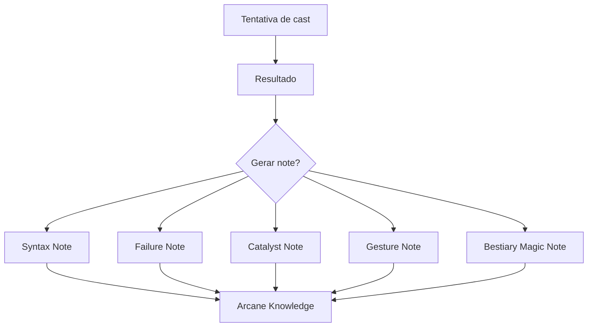

---

# 20. Arcane Syntax Parser

O parser transforma input do player em uma `SpellCandidate`.

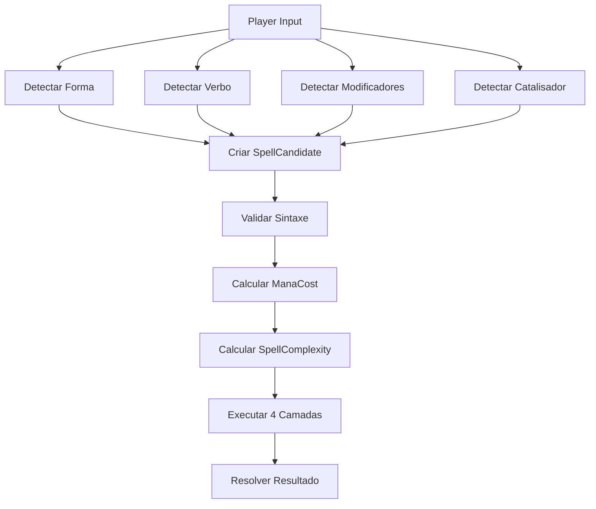

---

# 21. Sistema Unificado de Efeitos

## 21.1 Payload do spell

Cada feitiço gera um `EffectPayload`.

Exemplo:

| Sintaxe                         | EffectPayload              |
|---------------------------------|----------------------------|
| `Projétil + Ignis`              | Damage + Burn              |
| `Toque + Aqua`                  | Wet + Push                 |
| `Escudo + Terra`                | Barrier + Slow Aura        |
| `Projétil + Fulmen`             | Lightning Damage           |
| `Projétil + Fulmen` em alvo Wet | Lightning Damage + Chain   |
| `Canalização + Umbra`           | Stealth Boost + Fear Swarm |
| `Onda + Ventus`                 | Push + Noise Reduction     |

---

## 21.2 Ordem de modificadores

$$  
FinalEffect =  
BaseEffect  
\cdot  
(1 + TrainingBonus + SkillBonus)  
\cdot  
FocusModifier  
\cdot  
CatalystModifier  
\cdot  
TargetConditionModifier  
\cdot  
EnvironmentModifier  
$$

---

# 22. Integração com AI Systems

Toda magia gera `ArcaneStimulus`.

## $$  
ArcaneSignature =  
BaseSignature  
+  
ModifierNoise  
+  
CatalystSignature  
+  
BacklashNoise

Concealment  
$$

---

## 22.1 Estímulos por verbo

| Verbo    | Estímulo                             |
|----------|--------------------------------------|
| `Ignis`  | luz, calor, fumaça                   |
| `Aqua`   | umidade, som líquido                 |
| `Terra`  | vibração, poeira                     |
| `Fulmen` | som, ozônio, pulso arcano            |
| `Cura`   | pulso vital                          |
| `Umbra`  | distorção, frio, medo                |
| `Ventus` | deslocamento de ar, alteração sonora |

---

## 22.2 AI Arcane Detection

## $$  
ArcaneDetection =  
SpellSignature  
\cdot  
AetherDensity  
\cdot  
CreatureArcaneSensitivity  
\cdot  
DistanceFalloff

Concealment  
$$

Se:

$$  
ArcaneDetection \ge T_{arcaneDetect}  
$$

a IA percebe a magia.

---

## 22.3 Interações com stealth

| Sintaxe  | Efeito em stealth                           |
|----------|---------------------------------------------|
| `Ventus` | pode reduzir ruído                          |
| `Umbra`  | reduz percepção visual                      |
| `Fulmen` | assinatura alta, atrai sensores arcanos     |
| `Ignis`  | luz e calor revelam posição                 |
| `Terra`  | vibração pode atrair criaturas subterrâneas |
| `Cura`   | pulso vital pode atrair undead              |
| `Aqua`   | deixa rastros de umidade                    |

---

# 23. Integração com Bestiário

Bestiário revela como criaturas reagem à magia.

| Conhecimento               | Efeito                                              |
|----------------------------|-----------------------------------------------------|
| criatura sensível a Fulmen | Fulmen causa stagger                                |
| criatura molhada           | Fulmen pode dar chain                               |
| criatura fúngica           | Ignis causa dano alto, mas aumenta Hive Alert       |
| undead                     | Cura/Lux futuro causa dano ou purificação           |
| slime                      | Fulmen pode dividir ou paralisar, conforme variante |
| beast                      | Ventus pode dispersar cheiro                        |
| swarm                      | Umbra pode causar Fear                              |
| construct                  | Terra/Sigil pode interferir em patrulha             |
| abissal                    | Umbra pode fortalecer, Cura/Lux pode enfraquecer    |

---

# 24. Integração com Alchemy

Alchemy produz catalisadores e estabilizadores.

| Alchemy Output   | Uso mágico                         |
|------------------|------------------------------------|
| Mana Potion      | recupera mana                      |
| Clarity Elixir   | melhora GestureAccuracy            |
| Stabilizing Flux | reduz backlash                     |
| Conductive Oil   | melhora Fulmen                     |
| Holy Wash        | melhora Cura/Lux e reduz corrupção |
| Fire Oil         | melhora Ignis                      |
| Shadow Tincture  | melhora Umbra                      |
| Wind Salt        | melhora Ventus                     |
| Purity Elixir    | reduz corrupção                    |
| Arcane Solvent   | limpa resíduo de foco              |

---

# 25. Integração com Crafting & Forging

Crafting/Forging cria gear arcano.

| Item            | Uso                              |
|-----------------|----------------------------------|
| Wand            | cast rápido, menor poder         |
| Staff           | cast forte, lento                |
| Rune Glove      | melhora gesto VR                 |
| Crystal Focus   | estabilidade                     |
| Blade Focus     | spellblade                       |
| Arcane Lantern  | luz/reveal                       |
| Bone Focus      | Cura/Umbra/Ruina futura          |
| Conductive Ring | Fulmen                           |
| Catalyst Socket | encaixe seguro de catalisador    |
| Runic Armor     | slots cognitivos ou estabilidade |

---

## 25.1 Foco Arcano

O foco altera:

- potência;
    
- estabilidade;
    
- cast time;
    
- assinatura;
    
- consumo de mana;
    
- durabilidade;
    
- risco de backlash;
    
- escolas/verbos favorecidos.
    

| Atributo             | Função                 |
|----------------------|------------------------|
| `focus_power`        | aumenta Power          |
| `focus_stability`    | reduz backlash         |
| `focus_capacity`     | armazena carga         |
| `gesture_assist`     | melhora precisão       |
| `school_affinity`    | bônus por verbo        |
| `signature_modifier` | aumenta/reduz detecção |
| `durability`         | desgaste               |
| `socket_slots`       | catalisadores          |

---

# 26. Integração com Dungeon

## 26.1 Aether Zones

A dungeon pode ter zonas de densidade arcana.

| Zona           | Efeito                       |
|----------------|------------------------------|
| Low Aether     | magia fraca, estável         |
| Normal Aether  | padrão                       |
| High Aether    | magia forte, instável        |
| Corrupt Aether | Umbra/Ruina forte, corrupção |
| Sealed Zone    | magia limitada               |
| Dead Zone      | magia falha ou custa mais    |
| Resonant Zone  | sigils/canalização fortes    |

---

## 26.2 Environment Modifier

## $$  
EnvironmentModifier =  
AetherDensity  
+  
VerbAffinity

## AntiMagicField

CorruptionInterference  
$$

---

## 26.3 World Deltas

Spells fortes podem gerar deltas no mundo:

| Spell             | Delta possível                  |
|-------------------|---------------------------------|
| `Ignis + Magna`   | área queimada temporária        |
| `Terra + Escudo`  | barreira temporária             |
| `Aqua + Área`     | superfície molhada              |
| `Fulmen + Fortis` | mecanismo energizado, se válido |
| `Umbra + Stabil`  | zona escurecida temporária      |
| `Ventus + Onda`   | gás/fumaça dispersos            |

Regra:

$$  
MagicDelta \neq SeedBaseMutation  
$$

A magia altera estado runtime/snapshot, não a seed base da dungeon.

---

# 27. Anti-Boss-Gate Bypass

Validação obrigatória em qualquer cast.

| Sintaxe tentativa                             | Bloqueio orgânico                   |
|-----------------------------------------------|-------------------------------------|
| `Ventus + Magna` para voar por shaft selado   | corrente arcana quebra o fluxo      |
| `Terra + Directus` para perfurar boss wall    | rocha selada rejeita magia          |
| `Aqua + Fortis` para dissolver selo           | selo não é químico/físico           |
| `Umbra + Stabil` para atravessar gate         | sombra não atravessa camada selada  |
| `Fulmen + Magna` para ativar mecanismo futuro | circuito arcano incompleto          |
| `Cura + Magna` para reviver bypass            | revive não ignora corpse/progressão |

Regra técnica:

$$  
if\ TargetLayer > UnlockedLayer:  
CastResult = BlockedBySeal  
$$

---

# 28. Corpse System

Itens físicos podem ser perdidos. Conhecimento confirmado não.

| Dado                       |                Vai para corpse? |
|----------------------------|--------------------------------:|
| Catalisador da run         |                             Sim |
| Foco equipado              | depende da regra de equipamento |
| Grimório físico            |       depende da raridade/regra |
| Arcane note não confirmada |                             Sim |
| Verbo aprendido            |                             Não |
| Forma aprendida            |                             Não |
| Modificador aprendido      |                             Não |
| Sintaxe dominada           |                             Não |
| Corrupção arcana           |        Não, permanece no player |
| Mana atual                 |                             Não |

Regras:

$$  
KnownArcaneSyntax \not\subseteq CorpseLoot  
$$

$$  
RunArcaneItems \subseteq CorpseLoot  
$$

---

# 29. Multiplayer

## 29.1 Server authority

O servidor valida:

- forma;
    
- verbo;
    
- modificadores;
    
- catalisador;
    
- mana;
    
- aptidão;
    
- treino;
    
- gesture accuracy report;
    
- alvo;
    
- line of sight;
    
- range;
    
- boss gate;
    
- efeito;
    
- backlash;
    
- stimulus;
    
- consumo de recurso;
    
- persistência.
    

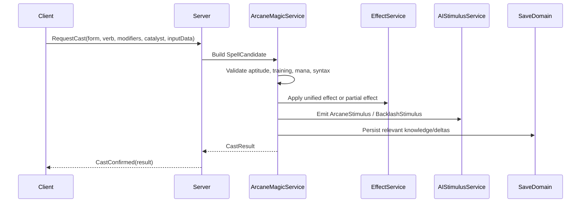

---

## 29.2 Gesture validation

O client pode enviar dados de input, mas o servidor precisa validar de forma tolerante.

| Dado        | Validação                          |
|-------------|------------------------------------|
| Combo Flat  | sequência e timing                 |
| VR gesture  | forma simplificada, não raw pesado |
| mira        | servidor confirma direção/alvo     |
| catalisador | inventário server-side             |
| mana        | server-side                        |
| resultado   | server-side                        |

---

## 29.3 Interest Management

| Caso                  | Replicação                  |
|-----------------------|-----------------------------|
| spell perto do player | efeito completo             |
| spell fora de visão   | som/resíduo se relevante    |
| spell em outro andar  | summary apenas              |
| boss spell            | completo para participantes |
| backlash severo       | evento para área afetada    |
| arcane residue        | só para quem pode detectar  |

---

# 30. Persistência

## 30.1 O que salvar

| Dado                      | Domínio            | Duração                |
|---------------------------|--------------------|------------------------|
| verbos descobertos        | MetaDomain         | permanente             |
| formas descobertas        | MetaDomain         | permanente             |
| modificadores descobertos | MetaDomain         | permanente             |
| catalisadores conhecidos  | MetaDomain         | permanente             |
| sintaxes conhecidas       | MetaDomain         | permanente             |
| spell uses                | MetaDomain         | permanente             |
| focus state               | Inventory/Run/Meta | variável               |
| arcane notes              | Run/World/Meta     | conforme validação     |
| corrupção arcana          | Character/Meta     | persistente            |
| magic deltas              | World/Run          | temporário/persistente |
| aether zones descobertas  | World/Weekly       | semanal                |

---

## 30.2 Fórmula de save

$$  
ArcaneSave =  
KnownVerbs  
+  
KnownForms  
+  
KnownModifiers  
+  
KnownCatalysts  
+  
SyntaxKnowledge  
+  
SpellUses  
+  
FocusStates  
+  
ArcaneCorruption  
+  
ArcaneNotes  
$$

---

# 31. Modelo de Dados

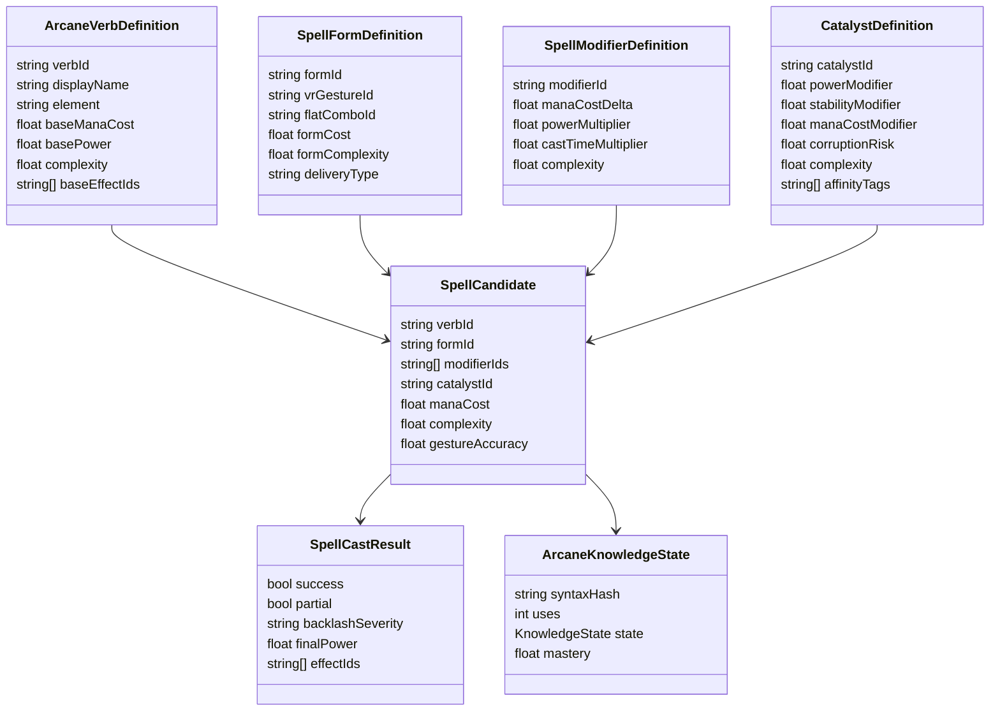

---

# 32. Estrutura de Scripts Recomendada

| Pasta               | Arquivos                                                                                                    |
|---------------------|-------------------------------------------------------------------------------------------------------------|
| `Magic/Core`        | `ArcaneVerbDefinition.cs`, `SpellFormDefinition.cs`, `SpellCandidate.cs`, `SpellCastResult.cs`              |
| `Magic/Syntax`      | `ArcaneSyntaxParser.cs`, `SpellComplexityCalculator.cs`, `SyntaxValidator.cs`, `SyntaxHashService.cs`       |
| `Magic/Modifiers`   | `SpellModifierDefinition.cs`, `ModifierConflictResolver.cs`, `ModifierCostResolver.cs`                      |
| `Magic/Catalysts`   | `CatalystDefinition.cs`, `CatalystResolver.cs`, `CatalystConsumptionService.cs`                             |
| `Magic/Casting`     | `CastingService.cs`, `CastLayerValidator.cs`, `GestureAccuracyResolver.cs`, `CastResultResolver.cs`         |
| `Magic/Resources`   | `ManaPool.cs`, `ManaCostCalculator.cs`, `CognitiveSlotService.cs`, `ArcaneOverloadService.cs`               |
| `Magic/Backlash`    | `BacklashResolver.cs`, `ArcaneCorruptionService.cs`, `MutationPulseService.cs`                              |
| `Magic/Effects`     | `MagicEffectBridge.cs`, `UnifiedEffectFactory.cs`, `StatusEffectResolver.cs`                                |
| `Magic/Focus`       | `FocusDefinition.cs`, `FocusInstance.cs`, `FocusDurabilityService.cs`, `FocusModifierResolver.cs`           |
| `Magic/Knowledge`   | `ArcaneKnowledgeState.cs`, `SpellUseTracker.cs`, `ArcaneDiscoveryService.cs`                                |
| `Magic/Notes`       | `ArcaneNoteBridge.cs`, `SyntaxNoteGenerator.cs`, `SpellFailureNoteGenerator.cs`, `CatalystNoteGenerator.cs` |
| `Magic/AI`          | `ArcaneStimulusEmitter.cs`, `ArcaneDetectionBridge.cs`, `MagicNoiseResolver.cs`                             |
| `Magic/Dungeon`     | `AetherZone.cs`, `MagicWorldDeltaService.cs`, `BossGateMagicValidator.cs`                                   |
| `Magic/Bestiary`    | `MagicWeaknessBridge.cs`, `CreatureArcaneReactionService.cs`                                                |
| `Magic/Alchemy`     | `ArcaneCatalystBridge.cs`, `ManaPotionBridge.cs`, `StabilizerBridge.cs`                                     |
| `Magic/Crafting`    | `FocusCraftingBridge.cs`, `RuneGloveBridge.cs`, `CatalystSocketBridge.cs`                                   |
| `Magic/Networking`  | `ServerArcaneMagicService.cs`, `MagicRpcController.cs`, `MagicVisibilityResolver.cs`                        |
| `Magic/Persistence` | `ArcaneSaveData.cs`, `ArcaneKnowledgeSave.cs`, `FocusSave.cs`, `MagicDeltaSave.cs`                          |
| `Magic/UI`          | `ArcaneGestureHUD.cs`, `SyntaxFeedbackView.cs`, `ArcaneJournalView.cs`, `CatalystInspectView.cs`            |

---

# 33. Pipeline Técnico

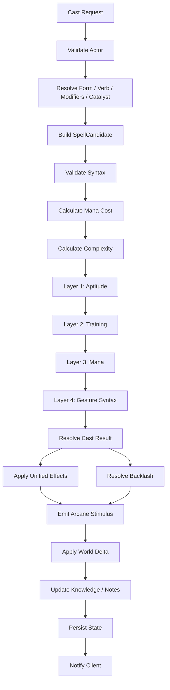

---

# 34. Validação

## 34.1 Constraints obrigatórias

| Constraint                    | Regra                                  |
|-------------------------------|----------------------------------------|
| `form_exists`                 | forma precisa existir                  |
| `verb_exists`                 | verbo precisa existir                  |
| `modifiers_are_valid`         | modificadores precisam existir         |
| `modifier_conflicts_resolved` | conflitos precisam ser tratados        |
| `catalyst_exists_or_null`     | catalisador existe ou é nulo           |
| `syntax_is_valid`             | parser precisa montar candidato válido |
| `spell_complexity_calculated` | complexidade sempre calculada          |
| `aptitude_checked`            | INT/FAI validados                      |
| `training_risk_calculated`    | treino influencia risco                |
| `mana_checked`                | mana suficiente/parcial/falha          |
| `gesture_accuracy_checked`    | sintaxe física validada                |
| `backlash_resolved`           | falhas têm consequência                |
| `effect_uses_unified_system`  | sem sistema paralelo                   |
| `arcane_stimulus_emitted`     | magia gera assinatura                  |
| `boss_gate_not_bypassed`      | magia não ignora progressão            |
| `server_authoritative_cast`   | servidor decide resultado              |
| `vr_flat_parity_validated`    | input equivalente                      |

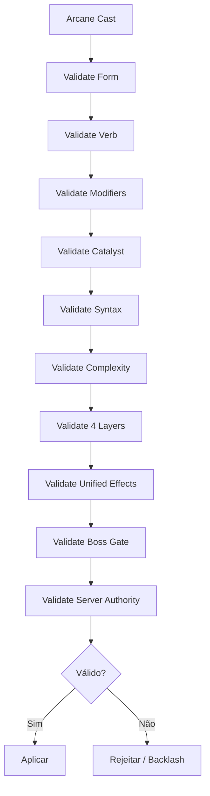

---

# 35. P&D Roadmap

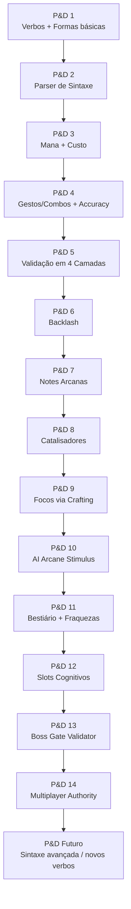

Este roadmap descreve uma trilha de prova técnica, não escopo de produto do MVP. Qualquer entrada em produção depende de `UnifiedEffectsRuntime`, `KnowledgeRuntime`, `NoiseAuthority`, `LayerLockValidator`, CrossInput e validação de performance já existirem.

## 35.1 Escopo por P&D

| Etapa  | Entrega                                                                                    |
|--------|--------------------------------------------------------------------------------------------|
| P&D 1  | `Ignis`, `Aqua`, `Terra`, `Fulmen`, `Cura`, `Umbra`, `Ventus`; formas Projétil/Área/Escudo |
| P&D 2  | parser cria `SpellCandidate`                                                               |
| P&D 3  | mana cost por verbo/forma/modificador                                                      |
| P&D 4  | accuracy para combo Flat e gesto VR                                                        |
| P&D 5  | aptidão, treino, mana e sintaxe                                                            |
| P&D 6  | backlash leve/moderado/severo/crítico                                                      |
| P&D 7  | notes de sintaxe/falha/catalisador                                                         |
| P&D 8  | catalisadores básicos e nulo                                                               |
| P&D 9  | foco simples fabricável                                                                    |
| P&D 10 | magia gera estímulo para IA                                                                |
| P&D 11 | bestiário revela reações mágicas                                                           |
| P&D 12 | limite de efeitos sustentados                                                              |
| P&D 13 | validação anti-boss-gate                                                                   |
| P&D 14 | servidor valida cast                                                                       |
| Futuro | novos verbos, sintaxes compostas, rituais e linguagem avançada                             |

---

# 36. Non-Goals

Não implementar no primeiro ciclo:

- menu tradicional de feitiços;
    
- spellbook com lista clicável;
    
- unlock por nível;
    
- teleport livre;
    
- voo permanente;
    
- invisibilidade perfeita;
    
- cura infinita barata;
    
- mana infinita;
    
- magia que ignora boss gate;
    
- magia que revela mapa inteiro;
    
- feitiço automático sem input;
    
- spellcrafting infinito sem validação;
    
- client decidindo dano;
    
- VR com vantagem numérica;
    
- Flatscreen mais rápido por padrão;
    
- rituais sem custo;
    
- summon army permanente;
    
- sistema paralelo de efeitos.
    

---

# 37. Critérios de Aceite

O sistema está aceitável quando:

- spells são construídos por Forma + Verbo + Modificadores + Catalisador;
    
- não existe menu tradicional de magia;
    
- verbos possuem mana base e efeito base;
    
- formas funcionam em VR e Flatscreen;
    
- modificadores alteram custo, poder, área ou duração;
    
- catalisadores afetam estabilidade, potência e risco;
    
- parser cria `SpellCandidate`;
    
- complexidade sintática é calculada;
    
- aptidão mínima usa INT e FAI;
    
- treino afeta risco e potência;
    
- mana parcial gera spell parcial;
    
- gesto ruim gera partial ou backlash;
    
- backlash tem severidade e consequência;
    
- slots cognitivos limitam efeitos simultâneos;
    
- notes registram sintaxes e falhas;
    
- bestiário revela interações mágicas;
    
- alchemy fornece catalisadores;
    
- crafting/forging cria focos;
    
- magia gera Arcane Stimulus para IA;
    
- sistema usa Unified Effects;
    
- magia não burla boss gates;
    
- multiplayer é server-authoritative;
    
- VR e Flatscreen têm custo, risco e teto equivalentes.
    

---

# 38. Definição Final para o GDD Principal

## Arcane Magic System — Linguística Arcana

O Arcane Magic System de Ashvault é baseado em linguística arcana. O jogador não seleciona feitiços prontos em menus tradicionais, não desbloqueia magia por nível e não usa spellbook como hotbar. Em vez disso, constrói feitiços em tempo real combinando Forma, Verbo, Modificadores e Catalisador.

A Forma define como o efeito aparece no mundo: projétil, área, escudo, canalização, toque ou onda. Em VR, a forma é executada por gesto físico. Em Flatscreen, a mesma forma é executada por combo equivalente. O Verbo Arcano define o núcleo semântico do efeito, como `Ignis`, `Aqua`, `Terra`, `Fulmen`, `Cura`, `Umbra` ou `Ventus`.

Modificadores alteram a gramática do feitiço. `Magna` amplia área, `Latus` cria cone, `Directus` transforma em perfurante linear, `Stabil` sustenta efeito, `Rapida` acelera cast com menor poder e `Fortis` aumenta poder com maior tempo de cast. Catalisadores alteram estabilidade, assinatura, potência, custo e risco.

A dificuldade da magia não vem de nível fixo, mas da complexidade sintática. Quanto mais complexo o verbo, a forma, os modificadores e o catalisador, maior a exigência de INT e FAI. O sucesso passa por quatro camadas: aptidão, treino, mana e sintaxe do gesto. Falhas podem gerar resultado parcial ou backlash.

Backlash representa a realidade reagindo contra uma frase mal formada. Pode causar dano arcano, explosão local, ruído, mutação temporária, corrupção persistente, quebra de foco, ruptura de catalisador ou atração de mobs. Magias também geram assinatura arcana detectável pela IA e podem alimentar Hive Alert.

O jogador possui slots cognitivos limitados, definidos por INT e WIS. Se tentar sustentar efeitos mágicos demais, sofre Arcane Overload Damage por segundo. Isso impede stacking infinito de buffs e canalizações permanentes.

A progressão mágica vem de descoberta, experimentação e domínio. O jogador encontra verbos, formas, modificadores e catalisadores em inscrições, notes, bosses, NPCs, grimórios físicos, bestiário, alchemy, crafting/forging e falhas. Grimórios existem como documentos e registros, não como menus de feitiços.

Alchemy fornece catalisadores, estabilizadores, mana potions e elixires de clareza. Crafting/Forging cria focos, luvas rúnicas, sockets de catalisador e gear mágico. Bestiário revela como criaturas reagem a verbos e efeitos. Notes registram sintaxes, falhas, catalisadores e interações.

Toda magia usa o Sistema Unificado de Efeitos. Magia não pode criar dano, buff ou debuff por lógica paralela. Também não pode burlar boss gates, camadas seladas, regras de queda, regras de corda ou progressão de dungeon.

No multiplayer, o servidor valida forma, verbo, modificadores, catalisador, mana, aptidão, treino, alvo, alcance, line of sight, boss gate, efeito, backlash e persistência. O client envia input e exibe feedback, mas não decide resultado.

---

# 39. Resumo Final

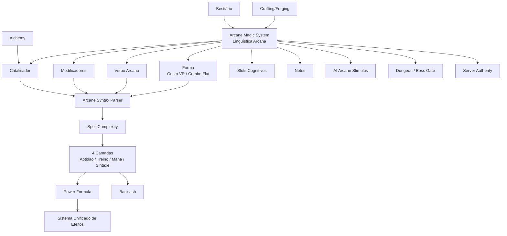

**Regra final:**  
**Magia em Ashvault é linguagem perigosa.** O jogador não escolhe feitiços; ele constrói frases arcanas com corpo, mente, mana e materiais. Quanto mais poderosa a frase, maior o custo — e maior a chance de a realidade responder de volta.
