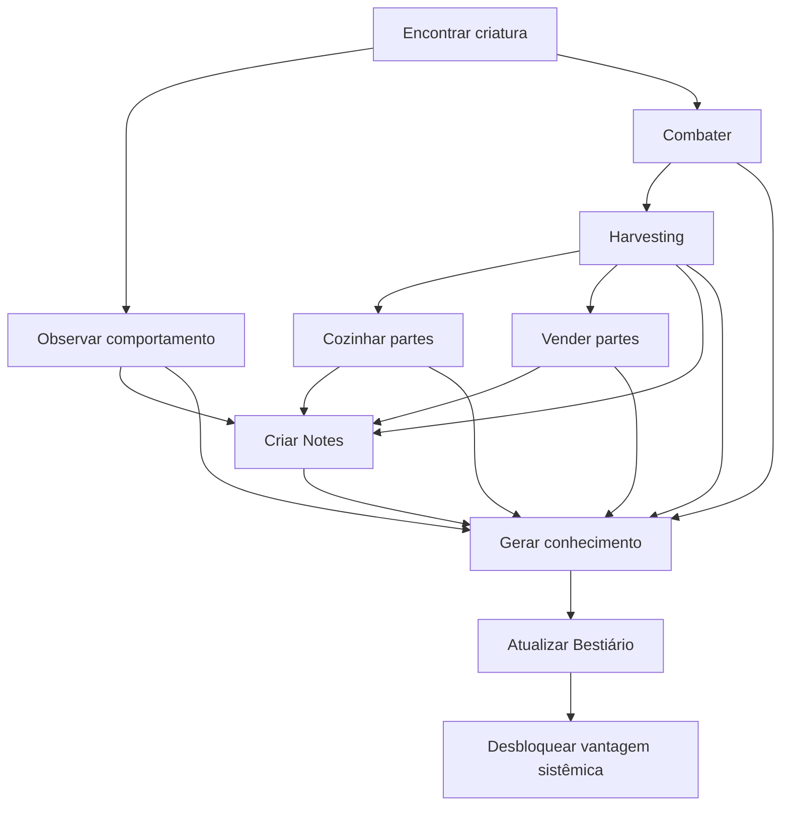
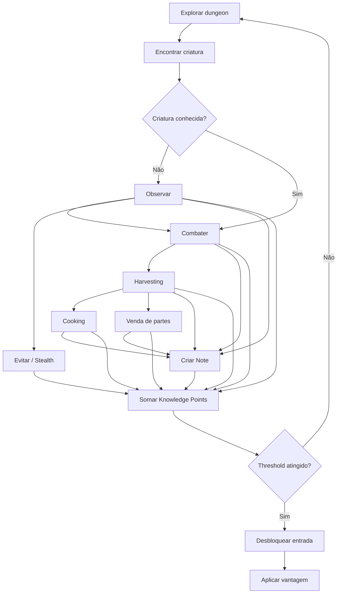
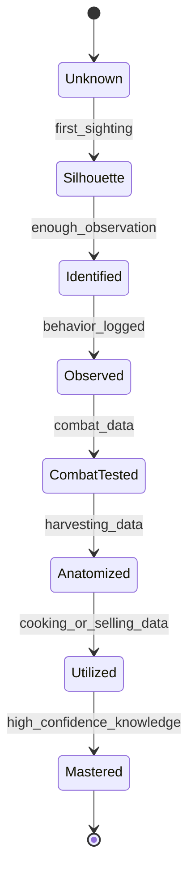
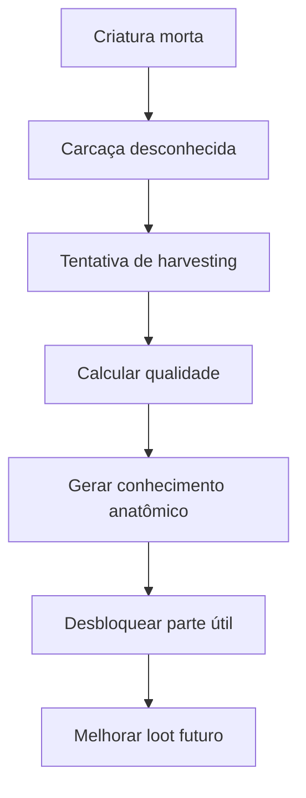
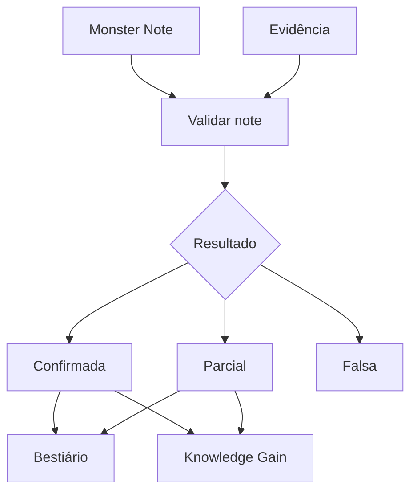
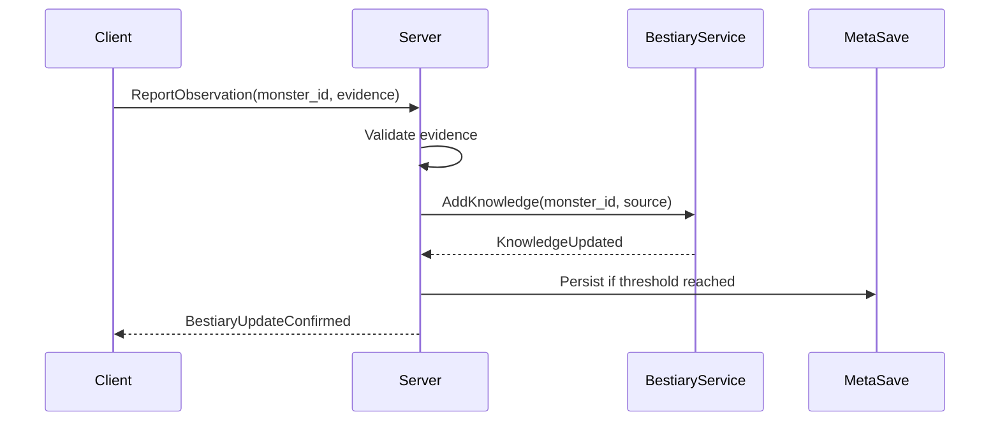
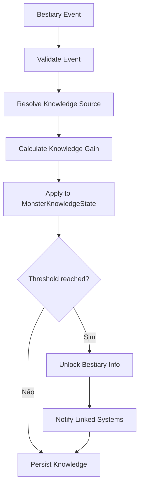
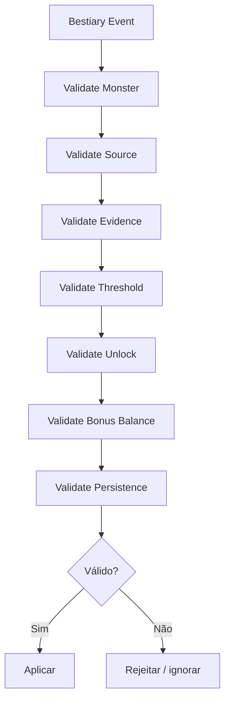
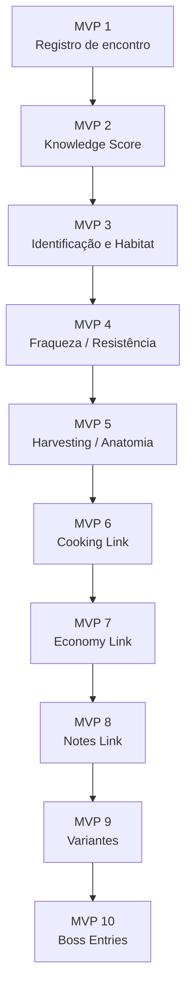
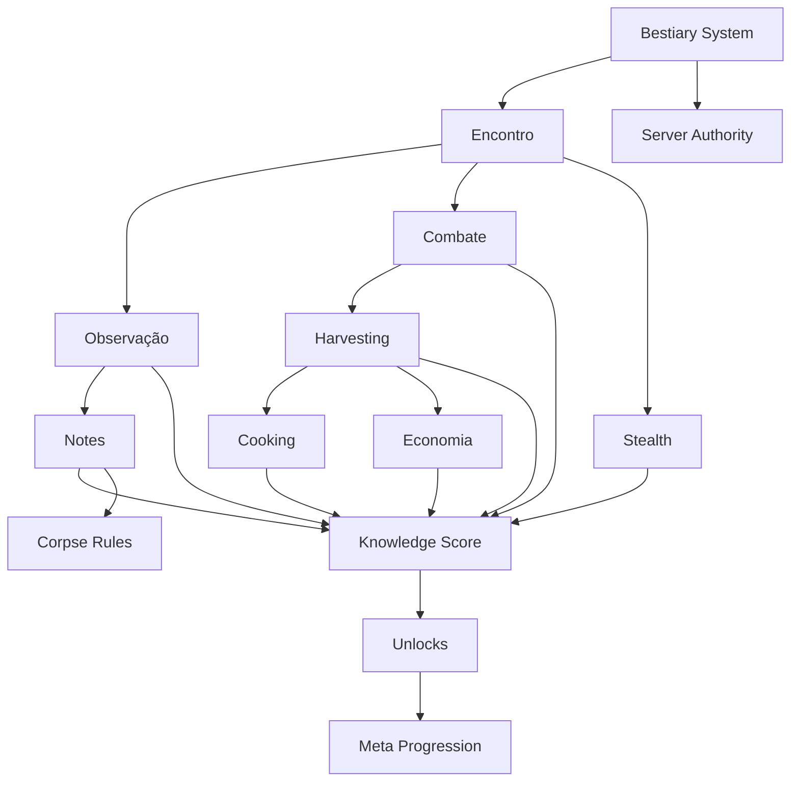

## Conhecimento de Criaturas, Ecologia, Anatomia, Fraquezas e Progressão por Observação

> **Projeto:** Dungeon Explorer: Ashvault  
> **Documento:** GDD específico de Bestiário  
> **Escopo:** descoberta de monstros, conhecimento progressivo, habitats, fraquezas, anatomia, harvesting, cooking, economia, notes, comportamento, variações por ambiente, multiplayer, persistência, VR/Flatscreen e validação.  
> **Fora de escopo:** GDD completo de Economia, Cooking e Notes. Esses sistemas se conectam ao Bestiário, mas possuem documentos próprios.

---

# 1. High Concept

O **Bestiary System** é o sistema de conhecimento sobre criaturas, ecologia e comportamento dentro da dungeon.

O bestiário consome e atualiza `KnowledgeRuntime`. Ele pode ter visualização própria, thresholds e bônus, mas não deve manter estados independentes para `hypothesis`, `confirmed`, `false` ou `obsolete`.

Ele não é uma enciclopédia pronta. O jogador constrói o bestiário por meio de:

- observação;
    
- combate;
    
- morte;
    
- stealth;
    
- harvesting;
    
- cooking;
    
- venda de partes;
    
- notes;
    
- análise de habitat;
    
- repetição de encontros;
    
- experimentação com fraquezas;
    
- interação com cadáveres e rastros.
    

A regra central:

**Conhecimento sobre monstros é progressão.**

O jogador não deve começar sabendo tudo sobre uma criatura. Ele deve aprender aos poucos:

- nome;
    
- habitat;
    
- comportamento;
    
- fraquezas;
    
- resistências;
    
- anatomia;
    
- partes úteis;
    
- valor culinário;
    
- valor comercial;
    
- risco;
    
- sinais de emboscada;
    
- resposta a som, luz, cheiro e movimento.
    

---

# 2. Objetivos de Design

## 2.1 Objetivo principal

Transformar o ato de entender monstros em uma forma de progressão tão importante quanto dano, equipamento ou level.

O player deve sentir:

- “eu conheço essa criatura agora”;
    
- “sei onde ela aparece”;
    
- “sei como evitar emboscada”;
    
- “sei qual parte vale a pena coletar”;
    
- “sei como cozinhar isso”;
    
- “sei vender melhor”;
    
- “sei qual dano usar”;
    
- “sei quando fugir”.
    

---

## 2.2 O que o Bestiário deve resolver

| Problema                             | Solução via Bestiário                                |
|--------------------------------------|------------------------------------------------------|
| Monstros não devem ser só HP + dano  | cada criatura tem ecologia, anatomia e comportamento |
| Player não deve saber tudo no começo | conhecimento é desbloqueado por evidência            |
| Harvesting precisa ter profundidade  | anatomia conhecida melhora coleta                    |
| Cooking precisa de descoberta        | partes comestíveis são reveladas pelo bestiário      |
| Economia precisa de informação       | valor comercial é aprendido                          |
| Notes precisam ter função            | notes alimentam conhecimento                         |
| Stealth precisa ser sistêmico        | bestiário revela sentidos e padrões                  |
| Dungeon precisa parecer viva         | habitats e rastros conectam criatura ao ambiente     |

---

# 3. Pilares do Bestiário

## 3.1 Conhecimento é conquistado

O bestiário começa incompleto.

O jogador pode ver uma criatura várias vezes antes de entender:

- nome verdadeiro;
    
- espécie;
    
- dieta;
    
- fraqueza;
    
- perigo;
    
- parte útil;
    
- comportamento de grupo.
    

---

## 3.2 Conhecimento vem de múltiplas fontes

Nenhuma fonte única deve revelar tudo.

| Fonte           | Tipo de conhecimento                     |
|-----------------|------------------------------------------|
| Observação      | comportamento, habitat, sentidos         |
| Combate         | fraqueza, resistência, padrões de ataque |
| Morte do player | risco, letalidade, emboscada             |
| Harvesting      | anatomia, partes úteis                   |
| Cooking         | valor culinário, toxicidade              |
| Venda           | valor comercial                          |
| Notes           | hipótese, confirmação, memória           |
| Stealth         | percepção, ruído, visão, cheiro          |
| Repetição       | consolidação de informação               |

---

## 3.3 Bestiário dá vantagem real

Conhecimento não deve ser apenas texto.

Ele deve gerar efeitos como:

- bônus de dano contra fraqueza conhecida;
    
- melhor chance de harvesting perfeito;
    
- alerta de emboscada;
    
- estimativa de valor comercial;
    
- desbloqueio de receita;
    
- indicação de habitat;
    
- melhor stealth contra a criatura;
    
- identificação de rastros;
    
- redução de penalidade por surpresa.
    

---

## 3.4 Bestiário não substitui habilidade

O bestiário ajuda, mas não joga pelo player.

Exemplo correto:

- mostra que o monstro é sensível a som;
    
- indica que fogo pode funcionar;
    
- revela que a cauda é valiosa;
    
- sugere que a criatura aparece em câmaras úmidas.
    

Exemplo incorreto:

- marcar todos os monstros através da parede;
    
- dar dano automático;
    
- mostrar rota perfeita;
    
- revelar tudo no primeiro encontro;
    
- eliminar completamente o risco.
    

---

# 4. Core Loop — Bestiário

---

# 5. Estrutura de Conhecimento

## 5.1 Categorias de conhecimento

| Categoria       | Descrição                       | Efeito sistêmico      |
|-----------------|---------------------------------|-----------------------|
| Identificação   | nome, tipo, espécie             | entrada básica        |
| Habitat         | onde aparece                    | previsão de spawn     |
| Comportamento   | patrulha, caça, fuga, grupo     | leitura tática        |
| Fraqueza        | dano ou condição eficaz         | dano bônus ou stagger |
| Resistência     | dano ineficaz                   | evita desperdício     |
| Anatomia        | partes, órgãos, pontos de corte | harvesting melhor     |
| Valor Culinário | partes comestíveis              | receitas              |
| Toxicidade      | risco ao consumir               | cooking seguro        |
| Valor Comercial | preço e comprador               | economia              |
| Sentidos        | visão, audição, cheiro          | stealth melhor        |
| Risco           | emboscada, veneno, grab, queda  | alerta contextual     |
| Rastros         | pegadas, muco, som, cheiro      | tracking              |
| Variação        | comportamento por ambiente      | adaptação             |

---

## 5.2 Progressão por blocos

| Nível | Nome          | O que revela                        |
|------:|---------------|-------------------------------------|
|     0 | Unknown       | silhueta ou “criatura desconhecida” |
|     1 | Identified    | nome comum e aparência              |
|     2 | Observed      | habitat e comportamento básico      |
|     3 | Combat Tested | fraquezas/resistências parciais     |
|     4 | Anatomized    | partes úteis e harvesting           |
|     5 | Utilized      | valor culinário/comercial           |
|     6 | Mastered      | sinais de risco, counters e domínio |

---

# 6. Fórmula de Conhecimento

## 6.1 Knowledge Score por criatura

$$  
K_{monster} =  
w_oK_{observe} +  
w_cK_{combat} +  
w_sK_{stealth} +  
w_hK_{harvest} +  
w_kK_{cook} +  
w_eK_{economy} +  
w_nK_{notes}  
$$

| Termo         | Fonte                         |
|---------------|-------------------------------|
| $K_{observe}$ | observar comportamento        |
| $K_{combat}$  | lutar, matar, testar dano     |
| $K_{stealth}$ | evitar, distrair, esconder-se |
| $K_{harvest}$ | coletar partes                |
| $K_{cook}$    | cozinhar partes               |
| $K_{economy}$ | vender partes                 |
| $K_{notes}$   | notes validadas               |
| $w$           | peso de cada fonte            |

---

## 6.2 Thresholds de desbloqueio

$$  
K_{monster} \ge T_1 \Rightarrow Identified  
$$

$$  
K_{monster} \ge T_2 \Rightarrow Observed  
$$

$$  
K_{monster} \ge T_3 \Rightarrow CombatTested  
$$

$$  
K_{monster} \ge T_4 \Rightarrow Anatomized  
$$

$$  
K_{monster} \ge T_5 \Rightarrow Utilized  
$$

$$  
K_{monster} \ge T_6 \Rightarrow Mastered  
$$

Valores iniciais sugeridos:

| Threshold | Valor |
|-----------|------:|
| $T_1$     |    10 |
| $T_2$     |    25 |
| $T_3$     |    50 |
| $T_4$     |    80 |
| $T_5$     |   120 |
| $T_6$     |   180 |

---

## 6.3 Knowledge Gain por evento

$$  
\Delta K = B_{event} \cdot M_{quality} \cdot M_{rarity} \cdot M_{risk}  
$$

| Termo         | Descrição                          |
|---------------|------------------------------------|
| $\Delta K$    | conhecimento ganho                 |
| $B_{event}$   | valor base do evento               |
| $M_{quality}$ | qualidade da observação/harvesting |
| $M_{rarity}$  | raridade da criatura               |
| $M_{risk}$    | risco assumido                     |

Exemplo:

| Evento               | $B_{event}$ |
|----------------------|------------:|
| primeiro encontro    |           5 |
| observar ataque      |           8 |
| sobreviver emboscada |          10 |
| matar                |          12 |
| harvesting perfeito  |          20 |
| cozinhar parte rara  |          18 |
| vender parte valiosa |          10 |
| validar note correta |          15 |

---

# 7. Estados da Entrada do Bestiário

## 7.1 Estado da informação

Cada campo do bestiário pode ter estado próprio:

| Estado     | Descrição                           |
|------------|-------------------------------------|
| Hidden     | não revelado                        |
| Hypothesis | suspeita baseada em note            |
| Partial    | parcialmente confirmado             |
| Confirmed  | confirmado                          |
| False      | hipótese errada                     |
| Obsolete   | perdeu validade por variação/season |
| Mastered   | dominado                            |

---

# 8. Tipos de Criatura

## 8.1 Categorias principais

| Categoria | Descrição                       |
|-----------|---------------------------------|
| Beast     | criatura animalística           |
| Insectoid | inseto/colônia                  |
| Fungoid   | fungo vivo                      |
| Undead    | cadáver, osso, espírito         |
| Construct | artificial/mágico               |
| Ooze      | slime, gel, massa               |
| Abyssal   | criatura de abismo              |
| Rootborn  | criatura de raiz                |
| Draconic  | criatura rara/reptiliana        |
| Humanoid  | cultista, explorador corrompido |
| Boss      | criatura gatekeeper             |
| MiniBoss  | elite/sentinel                  |

---

## 8.2 Perfil de criatura

Cada criatura deve possuir:

| Campo                  | Função                        |
|------------------------|-------------------------------|
| `monster_id`           | identificador estável         |
| `display_name_key`     | localization                  |
| `category`             | tipo                          |
| `danger_rating`        | risco                         |
| `habitat_tags`         | onde aparece                  |
| `behavior_profile`     | comportamento                 |
| `senses_profile`       | visão, audição, cheiro        |
| `weakness_profile`     | fraquezas                     |
| `resistance_profile`   | resistências                  |
| `anatomy_profile`      | partes e órgãos               |
| `harvest_profile`      | regras de coleta              |
| `culinary_profile`     | partes comestíveis            |
| `economic_profile`     | valor comercial               |
| `note_profile`         | notes geráveis                |
| `knowledge_thresholds` | thresholds                    |
| `variants`             | variações por ambiente/camada |

---

# 9. Habitat e Ecologia

## 9.1 Habitat

Habitat define onde a criatura aparece e como o jogador aprende a prever sua presença.

| Habitat Tag      | Exemplo                |
|------------------|------------------------|
| `WetCave`        | salas úmidas           |
| `CollapsedRoom`  | salas quebradas        |
| `VerticalShaft`  | shafts e quedas        |
| `AncientHall`    | ruínas artificiais     |
| `FungalNest`     | ninhos de fungo        |
| `CrystalChamber` | câmaras cristalinas    |
| `BonePit`        | ossuário               |
| `AbyssBridge`    | pontes sobre abismo    |
| `RootTunnel`     | túneis de raiz         |
| `BossLayer`      | camada próxima ao boss |

---

## 9.2 Fórmula de previsibilidade de spawn

Após o jogador aprender habitat, o jogo pode mostrar sinais sutis.

$$  
SpawnPrediction = H_{knowledge} \cdot E_{evidence} \cdot R_{recency}  
$$

| Termo           | Descrição                                 |
|-----------------|-------------------------------------------|
| $H_{knowledge}$ | conhecimento de habitat                   |
| $E_{evidence}$  | evidência local: rastro, som, muco, ossos |
| $R_{recency}$   | quão recente é a evidência                |

Se:

$$  
SpawnPrediction \ge T_{warning}  
$$

o jogo pode gerar alerta diegético.

Exemplo:

- som distante;
    
- pegadas;
    
- cheiro;
    
- marca no diário;
    
- vibração no VR;
    
- comentário do personagem.
    

---

# 10. Observação

## 10.1 O que conta como observação

| Observação                  | Conhecimento                |
|-----------------------------|-----------------------------|
| ver criatura patrulhando    | comportamento               |
| ver criatura comendo        | dieta                       |
| ver criatura fugindo de luz | fraqueza/sentido            |
| ouvir som antes da aparição | risco                       |
| ver rastro no chão          | habitat                     |
| ver criatura evitando área  | limite ambiental            |
| ver monstro atacar outro    | comportamento/agressividade |
| observar emboscada          | risco                       |

---

## 10.2 Fórmula de qualidade da observação

$$  
Q_{observe} =  
V_{clarity} \cdot T_{duration} \cdot D_{distance}^{-1} \cdot S_{stealth}  
$$

| Termo          | Descrição                                    |
|----------------|----------------------------------------------|
| $V_{clarity}$  | clareza visual/sonora                        |
| $T_{duration}$ | tempo observado                              |
| $D_{distance}$ | distância                                    |
| $S_{stealth}$  | estabilidade da observação sem ser detectado |

Aplicar clamp:

$$  
Q_{observe} = clamp(Q_{observe}, 0, 1)  
$$

---

# 11. Combate e Fraquezas

## 11.1 Descoberta de fraquezas

Fraquezas não devem ser reveladas automaticamente. O jogador precisa testar ou observar.

| Evento             | Exemplo                    |
|--------------------|----------------------------|
| dano alto repetido | fogo funciona contra slime |
| stagger específico | impacto quebra carapaça    |
| reação de fuga     | criatura teme luz          |
| resistência clara  | lâmina não penetra         |
| efeito ambiental   | gelo reduz velocidade      |
| note confirmada    | hipótese vira fraqueza     |

---

## 11.2 Fórmula de confirmação de fraqueza

$$  
C_{weakness} =  
\frac{SuccessfulTests}{RequiredTests}  
$$

Com:

$$  
C_{weakness} = clamp(C_{weakness}, 0, 1)  
$$

Quando:

$$  
C_{weakness} \ge 1  
$$

a fraqueza é confirmada.

---

## 11.3 Bônus de conhecimento em combate

Após fraqueza confirmada:

$$  
DamageFinal = DamageBase \cdot (1 + B_{knowledge})  
$$

Recomendação inicial:

$$  
B_{knowledge} = 0.10 \text{ a } 0.25  
$$

Esse bônus não deve substituir build ou skill. Ele representa eficiência por conhecimento.

---

# 12. Anatomia e Harvesting

## 12.1 Anatomia

Anatomia define:

- partes coletáveis;
    
- órgãos raros;
    
- pontos frágeis;
    
- melhor ferramenta de corte;
    
- penalidades por dano;
    
- relação com cooking;
    
- relação com economia.
    

## 12.2 Exemplo de anatomia

| Parte    | Uso                | Risco                         |
|----------|--------------------|-------------------------------|
| Couro    | crafting/venda     | dano por fogo reduz qualidade |
| Cauda    | cooking/harvesting | precisa corte preciso         |
| Glândula | veneno/alquimia    | pode explodir                 |
| Coração  | receita rara       | apodrece rápido               |
| Osso     | crafting           | menos sensível                |
| Olho     | bestiário/ritual   | destrói com dano perfurante   |

---

## 12.3 Fórmula de qualidade do harvesting

$$  
Q_{harvest} = Q_{base} + S_{harvest} + K_{anatomy} - P_{damage} - P_{time}  
$$

| Termo         | Descrição              |
|---------------|------------------------|
| $Q_{base}$    | qualidade base         |
| $S_{harvest}$ | skill/ferramenta       |
| $K_{anatomy}$ | conhecimento anatômico |
| $P_{damage}$  | dano causado à carcaça |
| $P_{time}$    | demora após morte      |

Clamp:

$$  
Q_{harvest} = clamp(Q_{harvest}, 0, 1)  
$$

---

## 12.4 Desbloqueio de partes úteis

---

# 13. Cooking e Valor Culinário

## 13.1 O que o bestiário revela para cooking

| Conhecimento        | Efeito no Cooking               |
|---------------------|---------------------------------|
| parte comestível    | ingrediente liberado            |
| toxicidade          | reduz chance de envenenar       |
| preparo recomendado | melhora qualidade               |
| combinação perigosa | evita receita ruim              |
| parte rara          | desbloqueia prato especial      |
| frescor             | indica tempo antes de apodrecer |

## 13.2 Fórmula de conhecimento culinário

$$  
K_{culinary} =  
K_{cook} + K_{consume} + K_{toxicity} + K_{recipeSuccess}  
$$

Quando:

$$  
K_{culinary} \ge T_{culinary}  
$$

o bestiário revela valor culinário.

---

# 14. Economia e Valor Comercial

## 14.1 O que o bestiário revela para economia

| Conhecimento      | Efeito econômico              |
|-------------------|-------------------------------|
| parte valiosa     | melhora decisão de harvesting |
| comprador ideal   | melhor venda                  |
| raridade          | estimativa de preço           |
| demanda           | economy note                  |
| condição da parte | previsão de valor             |
| uso em contrato   | prioriza coleta               |

## 14.2 Fórmula de valor da parte

$$  
V_{part} = V_{base} \cdot Q_{harvest} \cdot R_{rarity} \cdot D_{market}  
$$

Onde:

| Termo         | Descrição               |
|---------------|-------------------------|
| $V_{part}$    | valor final da parte    |
| $V_{base}$    | valor base              |
| $Q_{harvest}$ | qualidade do harvesting |
| $R_{rarity}$  | raridade                |
| $D_{market}$  | demanda                 |

---

# 15. Notes e Bestiário

## 15.1 Notes como hipótese

Notes podem alimentar o bestiário, mas não devem ser automaticamente verdadeiras.

## 15.2 Fórmula de conhecimento por note

$$  
K_{notes} =  
\begin{cases}  
K_{bonus}, & NoteValid = true \  
0.5K_{bonus}, & NotePartial = true \  
0, & NoteUnverified = true \  
-K_{penalty}, & NoteFalse = true  
\end{cases}  
$$

---

# 16. Stealth e Sentidos

O bestiário deve revelar como cada criatura percebe o mundo.

## 16.1 Sentidos possíveis

| Sentido  | Gameplay                  |
|----------|---------------------------|
| Visão    | cone de visão, luz/sombra |
| Audição  | ruído, passos, metal      |
| Olfato   | sangue, comida, cadáver   |
| Vibração | corrida, queda, mineração |
| Calor    | presença corporal/fogo    |
| Magia    | uso de mana/artefatos     |
| Luz      | cristais, tocha, brilho   |

## 16.2 Fórmula de detecção simplificada

$$  
Detection =  
V_{sight} + A_{sound} + O_{smell} + M_{magic} + H_{heat} - S_{stealth}  
$$

Se:

$$  
Detection \ge T_{detect}  
$$

a criatura detecta o player.

Bestiário conhecido pode reduzir risco:

$$  
S_{stealth}^{effective} = S_{stealth} + K_{senses}  
$$

---

# 17. Risco, Emboscada e Alertas

## 17.1 Risco conhecido

Após aprender comportamento de emboscada, o jogo pode gerar alerta diegético.

Exemplos:

- “o chão vibra levemente”;
    
- “há muco fresco na parede”;
    
- “ossos recentes estão espalhados”;
    
- “um cheiro metálico vem do corredor”;
    
- “o diário marca: risco de emboscada”.
    

## 17.2 Fórmula de alerta

$$  
AlertChance = K_{risk} \cdot E_{evidence} \cdot WIS_{modifier}  
$$

Se:

$$  
AlertChance \ge T_{alert}  
$$

o player recebe alerta contextual.

---

# 18. Variações de Criatura

## 18.1 Conceito

A mesma criatura pode variar de acordo com:

- profundidade;
    
- camada;
    
- ambiente;
    
- proximidade de boss;
    
- estado semanal;
    
- mutação;
    
- corrupção;
    
- tipo de sala.
    

## 18.2 Exemplo

| Criatura     | Variante    | Diferença                 |
|--------------|-------------|---------------------------|
| Slime        | Cave Slime  | comum, fraco a fogo       |
| Slime        | Ice Slime   | lento, resistente a frio  |
| Slime        | Lava Slime  | contato queima            |
| Slime        | Abyss Slime | escuro, emboscada         |
| Bat          | Cave Bat    | eco simples               |
| Bat          | Crystal Bat | atraído por luz           |
| Hound        | Bone Hound  | rastreia sangue           |
| Root Crawler | Deep Root   | usa raízes como cobertura |

---

## 18.3 Fórmula de variação

$$  
VariantScore_v = W_v + D_v + L_v + S_v  
$$

Onde:

| Termo | Descrição                   |
|-------|-----------------------------|
| $W_v$ | peso base da variante       |
| $D_v$ | modificador de profundidade |
| $L_v$ | compatibilidade com local   |
| $S_v$ | modificador da weekly seed  |

A variante escolhida é:

$$  
Variant = \arg\max_v(VariantScore_v)  
$$

---

# 19. Bosses e Mini-Bosses

## 19.1 Boss no bestiário

Bosses devem ter entradas especiais.

Antes do encontro:

- silhueta;
    
- rumores;
    
- sinais da camada;
    
- notes de gate;
    
- marcas ambientais.
    

Durante o combate:

- padrões observáveis;
    
- fraquezas parciais;
    
- fases;
    
- partes quebráveis.
    

Depois da vitória:

- entrada confirmada;
    
- lore;
    
- anatomia;
    
- materiais;
    
- valor;
    
- gate desbloqueado.
    

## 19.2 Mini-boss / Sentinel

Mini-boss a cada 5 andares pode revelar informações sobre a camada.

| Encontro      | Função no Bestiário                |
|---------------|------------------------------------|
| Mini-boss     | ensina mecânica do boss principal  |
| Sentinel      | mostra sinal de gate               |
| Elite         | testa fraqueza de criaturas comuns |
| Nest Guardian | revela ecologia local              |

---

# 20. Multiplayer

## 20.1 Conhecimento pessoal vs party

O bestiário pode ter conhecimento:

| Escopo       | Descrição                         |
|--------------|-----------------------------------|
| Personal     | aprendido pelo player             |
| Party        | compartilhado na party atual      |
| Guild/Future | futuro                            |
| Public Rumor | vindo de notes saqueadas          |
| Meta         | conhecimento permanente do player |

## 20.2 Compartilhamento

Conhecimento confirmado pode ser compartilhado com a party, mas isso precisa ser controlado.

Opções:

| Modelo               | Comportamento                         |
|----------------------|---------------------------------------|
| Individual           | cada player aprende sozinho           |
| Party Assist         | party vê resumo temporário            |
| Shared Run Knowledge | conhecimento da run é compartilhado   |
| Mentor System        | player experiente ensina parcialmente |
| Notes-Based Sharing  | compartilhar exige note/livro/tempo   |

Recomendação:

- conhecimento permanente é pessoal;
    
- notes podem ser compartilhadas;
    
- party pode receber resumo durante a run;
    
- informação completa exige leitura/tempo/ação.
    

---

## 20.3 Server authority

Em multiplayer, o servidor deve validar:

- kill count;
    
- harvesting;
    
- descoberta;
    
- knowledge gain;
    
- recipe/bestiary link;
    
- venda de partes;
    
- compartilhamento de notes;
    
- unlocks permanentes.
    

---

# 21. VR e Flatscreen

## 21.1 VR

No VR, bestiário deve parecer parte do diário:

- páginas físicas;
    
- desenho/silhueta;
    
- carimbo de descoberta;
    
- partes anatômicas reveladas;
    
- notas rabiscadas;
    
- anexos de partes/fragmentos;
    
- consulta vulnerável em tempo real.
    

## 21.2 Flatscreen

No Flatscreen:

- aba de bestiário;
    
- filtros;
    
- cards de criaturas;
    
- estados de descoberta;
    
- texto curto;
    
- ícones de fraqueza;
    
- entrada sem pausa ou com risco se aberto na dungeon.
    

## 21.3 Paridade

$$  
T_{consult}^{VR} \approx T_{consult}^{Flat}  
$$

$$  
Risk_{consult}^{VR} \approx Risk_{consult}^{Flat}  
$$

Consultar o bestiário dentro da dungeon não deve ser grátis. Pode reduzir percepção, movimento ou atenção.

---

# 22. Persistência

## 22.1 O que salvar

| Dado                             | Persistência |
|----------------------------------|--------------|
| criatura vista                   | Meta         |
| identificação                    | Meta         |
| kills                            | Meta         |
| observações confirmadas          | Meta         |
| fraquezas confirmadas            | Meta         |
| resistências confirmadas         | Meta         |
| anatomia conhecida               | Meta         |
| valor culinário                  | Meta         |
| valor comercial                  | Meta/Weekly  |
| notes não verificadas            | Run/Weekly   |
| variantes vistas                 | Meta/Weekly  |
| boss derrotado                   | Meta/World   |
| conhecimento temporário da party | Session      |

## 22.2 Fórmula de save

$$  
BestiarySave =  
MonsterEntries +  
KnowledgeStates +  
ConfirmedWeaknesses +  
AnatomyUnlocks +  
CulinaryUnlocks +  
CommercialUnlocks  
$$

Separação importante:

$$  
ConfirmedKnowledge \not\subseteq CorpseLoot  
$$

Conhecimento confirmado não deve ser perdido na morte.

Notes não confirmadas podem ir para corpse, mas bestiário validado é meta progressão.

---

# 23. Integração com Corpse System

Quando o player morre:

| Dado                                | Vai para corpse? |
|-------------------------------------|-----------------:|
| notes de monstro não confirmadas    |              Sim |
| partes coletadas                    |              Sim |
| itens de harvesting                 |              Sim |
| bestiário confirmado                |              Não |
| fraqueza confirmada                 |              Não |
| receita já desbloqueada             |              Não |
| conhecimento de anatomia confirmado |              Não |

## 23.1 Regra

$$  
UnverifiedMonsterNotes \subseteq CorpseLoot  
$$

Mas:

$$  
ConfirmedBestiaryKnowledge \not\subseteq CorpseLoot  
$$

---

# 24. UI/UX do Bestiário

## 24.1 Estrutura da entrada

Cada entrada deve mostrar:

- nome;
    
- silhueta/arte;
    
- categoria;
    
- perigo;
    
- habitat;
    
- comportamento;
    
- fraquezas;
    
- resistências;
    
- sentidos;
    
- anatomia;
    
- loot;
    
- valor culinário;
    
- valor comercial;
    
- notes ligadas;
    
- variações;
    
- status de confiança.
    

## 24.2 Estados visuais

| Estado        | Visual                      |
|---------------|-----------------------------|
| Unknown       | silhueta escura             |
| Identified    | nome comum                  |
| Observed      | habitat parcial             |
| Combat Tested | ícones parciais de fraqueza |
| Anatomized    | diagrama corporal           |
| Utilized      | cooking/economia liberados  |
| Mastered      | entrada limpa e completa    |

---

## 24.3 Filtros

Filtros recomendados:

- tipo;
    
- perigo;
    
- habitat;
    
- fraqueza;
    
- parte útil;
    
- valor culinário;
    
- valor comercial;
    
- visto recentemente;
    
- incompleto;
    
- boss/mini-boss;
    
- notes pendentes.
    

---

# 25. Localization

Entradas do bestiário devem usar localization keys.

Exemplos:

| Campo                         | Exemplo                    |
|-------------------------------|----------------------------|
| `monster.slime.name`          | Slime                      |
| `monster.slime.desc.partial`  | Massa gelatinosa instável  |
| `monster.slime.weakness.fire` | Reage mal ao calor intenso |
| `monster.slime.habitat.cave`  | Encontrado em áreas úmidas |

Notes automáticas e entradas dinâmicas podem usar templates com placeholders:

| Template                                | Saída                                 |
|-----------------------------------------|---------------------------------------|
| `{monster} foi visto em {room}`         | “Slime foi visto na Câmara Norte”     |
| `{monster} reagiu a {damage_type}`      | “Slime reagiu a Fogo”                 |
| `{part} pode ser coletado de {monster}` | “Glândula pode ser coletada de Slime” |

---

# 26. Data-Driven Implementation

O bestiário deve ser baseado em dados.

## 26.1 MonsterDefinition

| Campo                  | Função        |
|------------------------|---------------|
| `monster_id`           | id            |
| `display_name_key`     | nome          |
| `category`             | tipo          |
| `danger_rating`        | risco         |
| `habitat_tags`         | habitat       |
| `behavior_profile`     | comportamento |
| `senses_profile`       | sentidos      |
| `weakness_profile`     | fraquezas     |
| `resistance_profile`   | resistências  |
| `anatomy_profile`      | anatomia      |
| `harvest_profile`      | harvesting    |
| `culinary_profile`     | cooking       |
| `economic_profile`     | economia      |
| `knowledge_thresholds` | progressão    |
| `variants`             | variações     |

## 26.2 MonsterKnowledgeState

| Campo                   | Função       |
|-------------------------|--------------|
| `monster_id`            | monstro      |
| `knowledge_score`       | pontuação    |
| `entry_state`           | estado geral |
| `confirmed_weaknesses`  | fraquezas    |
| `confirmed_resistances` | resistências |
| `known_habitats`        | habitats     |
| `known_parts`           | partes       |
| `culinary_unlocks`      | cooking      |
| `commercial_unlocks`    | economia     |
| `linked_notes`          | notes        |
| `seen_variants`         | variantes    |

---

# 27. Estrutura de Scripts Recomendada

| Pasta                  | Arquivos                                                                                            |
|------------------------|-----------------------------------------------------------------------------------------------------|
| `Bestiary/Core`        | `MonsterDefinition.cs`, `MonsterId.cs`, `MonsterCategory.cs`, `DangerRating.cs`                     |
| `Bestiary/Knowledge`   | `MonsterKnowledgeState.cs`, `BestiaryEntryState.cs`, `KnowledgeSource.cs`, `KnowledgeThresholds.cs` |
| `Bestiary/Observation` | `ObservationEvent.cs`, `ObservationQualityCalculator.cs`, `HabitatEvidenceService.cs`               |
| `Bestiary/Combat`      | `WeaknessDiscoveryService.cs`, `ResistanceDiscoveryService.cs`, `CombatKnowledgeTracker.cs`         |
| `Bestiary/Harvesting`  | `AnatomyProfile.cs`, `HarvestKnowledgeService.cs`, `PartDiscoveryService.cs`                        |
| `Bestiary/Cooking`     | `CulinaryKnowledgeService.cs`, `MonsterPartCookingBridge.cs`                                        |
| `Bestiary/Economy`     | `CommercialKnowledgeService.cs`, `MonsterPartValueBridge.cs`                                        |
| `Bestiary/Notes`       | `BestiaryNoteBridge.cs`, `MonsterNoteValidationService.cs`                                          |
| `Bestiary/Persistence` | `BestiarySaveData.cs`, `MonsterKnowledgeSave.cs`                                                    |
| `Bestiary/Networking`  | `ServerBestiaryService.cs`, `BestiaryRpcController.cs`, `BestiaryVisibilityResolver.cs`             |
| `Bestiary/UI`          | `BestiaryView.cs`, `MonsterEntryView.cs`, `AnatomyDiagramView.cs`, `WeaknessIconView.cs`            |

---

# 28. Pipeline Técnico

---

# 29. Validação

## 29.1 Constraints obrigatórias

| Constraint                            | Regra                                       |
|---------------------------------------|---------------------------------------------|
| `monster_definition_exists`           | evento precisa referenciar monstro válido   |
| `knowledge_source_valid`              | fonte precisa ser permitida                 |
| `event_evidence_valid`                | observação precisa ser real                 |
| `client_cannot_fake_unlock`           | client não decide unlock                    |
| `thresholds_are_configured`           | todo monstro tem thresholds                 |
| `confirmed_knowledge_persists`        | conhecimento confirmado salva               |
| `unverified_notes_not_auto_confirmed` | note não vira verdade sem evidência         |
| `bestiary_bonus_not_overpowered`      | bônus não trivializa combate                |
| `boss_info_not_revealed_early`        | boss não revela tudo antes do encontro      |
| `corpse_rules_respected`              | conhecimento confirmado não vai para corpse |

---

# 30. MVP Roadmap

## 30.1 Escopo por MVP

| MVP    | Entrega                                        |
|--------|------------------------------------------------|
| MVP 1  | criatura vista cria entrada Unknown/Silhouette |
| MVP 2  | knowledge score por evento                     |
| MVP 3  | identificação, habitat e comportamento básico  |
| MVP 4  | fraqueza e resistência por testes              |
| MVP 5  | anatomia e harvesting                          |
| MVP 6  | partes comestíveis e cooking                   |
| MVP 7  | valor comercial e venda                        |
| MVP 8  | notes alimentam bestiário                      |
| MVP 9  | variantes por ambiente/camada                  |
| MVP 10 | boss e mini-boss entries                       |

---

# 31. Non-Goals

Não implementar no primeiro ciclo:

- enciclopédia completa desde o início;
    
- IA ecológica completa;
    
- simulação alimentar entre monstros;
    
- árvore evolutiva complexa;
    
- wiki externa dentro do jogo;
    
- reveal automático de fraqueza no primeiro hit;
    
- bônus de dano exagerado;
    
- identificação perfeita sem observação;
    
- todos os monstros com dezenas de variantes no MVP;
    
- multiplayer compartilhando conhecimento permanente sem regra;
    
- bestiário removendo completamente risco de emboscada.
    

---

# 32. Critérios de Aceite

O Bestiary System está aceitável quando:

- criatura vista gera entrada inicial;
    
- conhecimento começa incompleto;
    
- conhecimento aumenta por múltiplas fontes;
    
- observação gera progresso;
    
- combate gera progresso;
    
- harvesting gera anatomia;
    
- cooking revela valor culinário;
    
- venda revela valor comercial;
    
- notes podem alimentar conhecimento;
    
- fraqueza exige confirmação;
    
- resistência exige teste;
    
- habitat melhora previsão de spawn;
    
- conhecimento confirmado persiste;
    
- notes não confirmadas podem ser perdidas no corpse;
    
- bestiário gera vantagem real, mas não remove risco;
    
- multiplayer é server-authoritative;
    
- VR e Flatscreen têm custo equivalente para consulta;
    
- boss entries não revelam tudo antes da hora.
    

---

# 33. Definição Final para o GDD Principal

## Bestiary System

O Bestiary System é o sistema de conhecimento progressivo sobre criaturas, ecologia, anatomia, fraquezas, riscos e usos econômicos/culinários dos monstros da dungeon. Ele não funciona como uma enciclopédia pronta. Cada entrada começa incompleta e evolui por observação, combate, stealth, harvesting, cooking, venda de partes e notes validadas.

Conhecimento é tratado como progressão. Ao aprender sobre uma criatura, o jogador pode desbloquear vantagens sistêmicas: identificar habitats, prever emboscadas, reconhecer rastros, aplicar dano mais eficiente, evitar ataques, coletar partes melhores, descobrir valor culinário e estimar valor comercial.

Cada criatura possui definição data-driven com categoria, perigo, habitat, comportamento, sentidos, fraquezas, resistências, anatomia, harvesting, cooking, economia, notes e variantes. A mesma criatura pode ter comportamento ou propriedades diferentes conforme profundidade, ambiente, camada, proximidade de boss ou weekly seed.

Notes alimentam o bestiário, mas não são automaticamente verdadeiras. Uma note pode ser hipótese, parcial, falsa ou confirmada. Apenas conhecimento confirmado deve virar meta progressão permanente. Notes não confirmadas podem ser perdidas ou saqueadas no corpse, mas conhecimento validado não é perdido na morte.

Cooking e Economia são extensões naturais do bestiário. Cozinhar partes de monstros revela toxicidade, valor culinário e receitas. Vender partes revela valor comercial, demanda e compradores. Harvesting revela anatomia, partes úteis e qualidade de coleta.

No multiplayer, o bestiário deve ser server-authoritative. O client pode reportar observações, mas o servidor valida evidências, aplica knowledge score e confirma unlocks. Conhecimento permanente pode ser pessoal, enquanto notes e resumos podem ser compartilhados com a party conforme regras de escopo.

Em VR, o bestiário deve existir como parte do diário físico. Em Flatscreen, deve ser uma interface equivalente sem remover risco. Consultar o bestiário dentro da dungeon deve ter custo de atenção, tempo ou vulnerabilidade.

---

# 34. Resumo Final

Regra final:

**Bestiário é conhecimento jogável.**  
O jogador não lê uma wiki; ele constrói uma através de risco, observação, erro, combate, harvesting, cooking, venda e notes.
