## Alimentação, Receitas, Ingredientes, Toxicidade e Conhecimento Culinário

> **Projeto:** Dungeon Explorer: Ashvault  
> **Documento:** GDD específico de Cooking  
> **Escopo:** ingredientes, preparo, receitas, toxicidade, efeitos alimentares, descoberta, integração com notes, bestiário, economia, dungeon, corpse system, multiplayer, persistência, VR/Flatscreen e validação.  
> **Fora de escopo:** GDD completo de Economia, GDD completo de Bestiário e GDD completo de Notes. Esses sistemas se conectam ao Cooking, mas possuem documentos próprios.

---

# 1. High Concept

O **Cooking System** transforma ingredientes coletados na dungeon em **sobrevivência, conhecimento, risco e economia**.

Cooking não deve ser apenas crafting de comida. Ele deve ser uma camada sistêmica que responde a quatro perguntas:

| Pergunta                | Sistema conectado    |
|-------------------------|----------------------|
| O que é comestível?     | Cooking / Notes      |
| O que é tóxico?         | Cooking / Bestiário  |
| O que pode virar buff?  | Cooking / Progressão |
| O que pode ser vendido? | Cooking / Economia   |

A regra central:

**Cooking é conhecimento aplicado sobre a dungeon.**

O jogador não deve começar sabendo todas as receitas, efeitos e riscos. Ele aprende por:

- tentativa;
    
- erro;
    
- notes;
    
- observação;
    
- harvesting;
    
- bestiário;
    
- venda;
    
- consumo;
    
- preparo repetido;
    
- sobrevivência após comer algo perigoso.
    

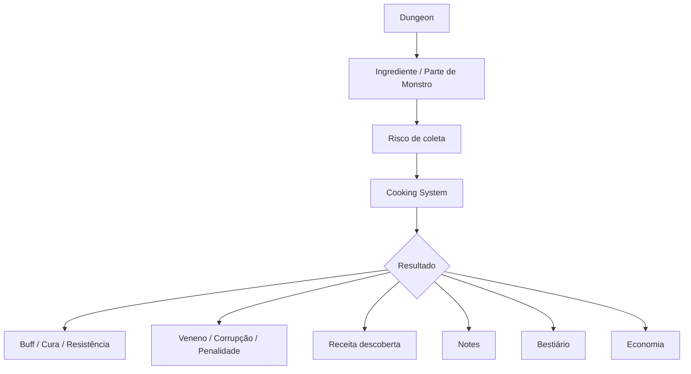

---

# 2. Pilares de Design

## 2.1 Cooking exige risco

Ingrediente forte não deve ser obtido de forma segura.

$$  
IngredientPower \propto CollectionRisk  
$$

Ou seja:

$$  
StrongFood \Rightarrow DangerousIngredient  
$$

Comida poderosa deve exigir pelo menos uma destas condições:

- ingrediente raro;
    
- monstro perigoso;
    
- harvesting preciso;
    
- bioma perigoso;
    
- preparo arriscado;
    
- tempo de cozimento;
    
- chance de falha;
    
- conhecimento prévio;
    
- perda de oportunidade econômica.
    

---

## 2.2 Cooking é descoberta

O player não deve abrir uma lista completa de receitas no início.

Receitas podem estar em estados:

| Estado     | Descrição                               |
|------------|-----------------------------------------|
| Unknown    | o player não sabe que a receita existe  |
| Hypothesis | o player suspeita da combinação         |
| Failed     | tentativa falhou                        |
| Partial    | efeito parcialmente conhecido           |
| Known      | receita funcional conhecida             |
| Mastered   | receita dominada com bônus de qualidade |

---

## 2.3 Cooking não pode trivializar a dungeon

Comida pode ajudar, mas não pode apagar risco.

Exemplo correto:

- reduzir dano de queda;
    
- aumentar stamina;
    
- resistir a veneno;
    
- reduzir frio/calor;
    
- aumentar foco;
    
- melhorar harvesting;
    
- melhorar percepção de ingredientes.
    

Exemplo incorreto:

- imunidade total sem custo;
    
- cura infinita;
    
- comida barata que substitui poções;
    
- buff permanente fácil;
    
- alimento que remove boss gate;
    
- receita que gera dinheiro sem risco.
    

---

## 2.4 Cooking conecta corpo, conhecimento e economia

Cooking deve afetar três eixos:

| Eixo          | Função                                                  |
|---------------|---------------------------------------------------------|
| Sobrevivência | cura, stamina, resistência, anti-veneno                 |
| Conhecimento  | descoberta de efeitos, toxicidade, anatomia e receitas  |
| Economia      | venda de comida, ingredientes raros, demanda de mercado |

---

# 3. Core Loop — Cooking

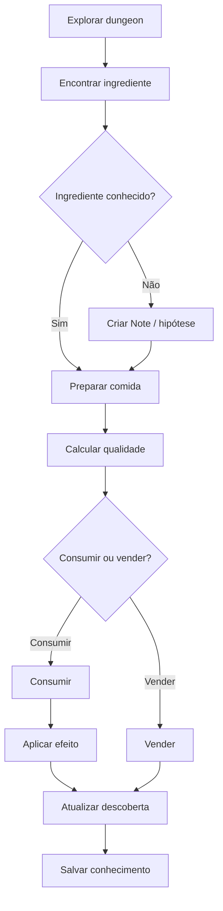

## 3.1 Loop curto

1. Player coleta ingrediente.
    
2. Player prepara comida.
    
3. Sistema calcula qualidade.
    
4. Comida gera buff, penalidade ou falha.
    
5. Resultado vira note ou conhecimento.
    

## 3.2 Loop longo

1. Player aprende ingredientes.
    
2. Player melhora receitas.
    
3. Player vende pratos ou usa em runs.
    
4. Player desbloqueia conhecimento no bestiário.
    
5. Player explora áreas mais perigosas.
    
6. Player encontra ingredientes mais raros.
    

---

# 4. Tipos de Ingrediente

## 4.1 Categorias principais

| Categoria           | Exemplos                        | Uso                       |
|---------------------|---------------------------------|---------------------------|
| Carne               | carne de monstro, órgão, tutano | stamina, força, regen     |
| Fungos              | cogumelos, esporos, musgo       | cura, veneno, alucinação  |
| Plantas             | raízes, ervas, folhas           | antídotos, buffs leves    |
| Minerais            | sal, pó cristalino, enxofre     | catalisadores             |
| Líquidos            | sangue, seiva, água mineral     | poções, cozidos           |
| Partes raras        | coração, glândula, olho, cauda  | efeitos fortes            |
| Relíquias orgânicas | carne abissal, osso ritual      | buffs fortes com risco    |
| Condimentos         | sal, gordura, especiaria        | qualidade e estabilização |

---

## 4.2 Propriedades do ingrediente

Cada ingrediente deve possuir:

| Propriedade        | Função                         |
|--------------------|--------------------------------|
| `ingredient_id`    | identificador estável          |
| `display_name_key` | localization                   |
| `source_type`      | monstro, planta, mineral, loot |
| `base_quality`     | qualidade inicial              |
| `toxicity`         | toxicidade                     |
| `freshness`        | frescor                        |
| `rarity`           | raridade                       |
| `edible_raw`       | pode comer cru?                |
| `cooking_tags`     | tags culinárias                |
| `known_effects`    | efeitos conhecidos             |
| `hidden_effects`   | efeitos ainda não descobertos  |
| `market_value`     | valor econômico                |
| `bestiary_links`   | vínculos com criaturas         |

---

## 4.3 Tags culinárias

Tags são usadas para combinar ingredientes.

| Tag          | Função               |
|--------------|----------------------|
| `Meat`       | base proteica        |
| `Fungus`     | cura/toxina          |
| `Root`       | resistência          |
| `Mineral`    | catalisador          |
| `Blood`      | buff físico/risco    |
| `Arcane`     | mana/efeito instável |
| `Abyssal`    | poder alto/corrupção |
| `Medicinal`  | cura                 |
| `Toxic`      | risco                |
| `Stabilizer` | reduz falha          |
| `Spice`      | melhora qualidade    |

---

# 5. Tipos de Receita

## 5.1 Categorias de receita

| Receita              | Função                          |
|----------------------|---------------------------------|
| Refeição simples     | recuperação de stamina          |
| Sopa/Caldo           | cura leve e estabilização       |
| Ensopado             | buff de duração média           |
| Ração de dungeon     | alimento portátil               |
| Antídoto culinário   | remove ou reduz veneno          |
| Refeição ritual      | buff forte com custo            |
| Prato medicinal      | regen, anti-bleed, anti-poison  |
| Prato de resistência | frio, calor, queda, toxicidade  |
| Prato de combate     | força, foco, velocidade         |
| Prato comercial      | alto valor de venda             |
| Prato instável       | buff alto + penalidade possível |

---

## 5.2 Estrutura de uma receita

| Campo              | Função                             |
|--------------------|------------------------------------|
| `recipe_id`        | identificador                      |
| `display_name_key` | nome localizado                    |
| `required_tags`    | tags necessárias                   |
| `optional_tags`    | tags que melhoram qualidade        |
| `forbidden_tags`   | tags que causam falha              |
| `station_type`     | fogueira, panela, alquimia, grelha |
| `cook_time`        | tempo de preparo                   |
| `difficulty`       | dificuldade                        |
| `base_effect`      | efeito base                        |
| `toxicity_rule`    | regra de toxicidade                |
| `discovery_rule`   | como descobrir                     |
| `market_profile`   | valor de venda                     |
| `knowledge_output` | o que ensina                       |

---

# 6. Estações de Cooking

## 6.1 Tipos de estação

| Estação         | Uso                         | Risco                                 |
|-----------------|-----------------------------|---------------------------------------|
| Campfire        | comida básica               | fumaça, luz, atrai inimigos           |
| Cooking Pot     | sopas e ensopados           | exige tempo                           |
| Grill           | carne e partes grandes      | cheiro forte                          |
| Alchemy Stove   | receitas medicinais/arcanas | instabilidade                         |
| Field Kit       | preparo rápido em run       | qualidade menor                       |
| Shop Kitchen    | preparo seguro no Hub       | sem risco imediato, custo operacional |
| Ritual Cauldron | pratos fortes               | custo raro/corrupção                  |

---

## 6.2 Cooking na dungeon vs Hub

| Local            | Vantagem                     | Desvantagem                                    |
|------------------|------------------------------|------------------------------------------------|
| Dungeon          | uso imediato, sobrevivência  | risco, vulnerabilidade, ruído                  |
| Hub              | segurança, qualidade melhor  | não salva run se player morrer antes de voltar |
| Loja             | venda, padronização, estoque | custo operacional                              |
| Camp improvisado | flexível                     | qualidade menor                                |

---

# 7. Fórmulas Principais

## 7.1 Qualidade da receita

$$  
Q_{recipe} = Q_{ingredient} + K_{recipe} + S_{cooking} + B_{station} - P_{toxicity} - P_{mistake}  
$$

| Termo            | Descrição                        |
|------------------|----------------------------------|
| $Q_{recipe}$     | qualidade final da receita       |
| $Q_{ingredient}$ | qualidade média dos ingredientes |
| $K_{recipe}$     | conhecimento da receita          |
| $S_{cooking}$    | skill de cooking/survival        |
| $B_{station}$    | bônus da estação                 |
| $P_{toxicity}$   | penalidade por toxinas           |
| $P_{mistake}$    | penalidade por erro de preparo   |

Aplicar clamp:

$$  
Q_{recipe} = clamp(Q_{recipe}, 0, 1)  
$$

---

## 7.2 Qualidade média dos ingredientes

$$  
Q_{ingredient} = \frac{\sum_{i=1}^{n} Q_i \cdot W_i}{\sum_{i=1}^{n} W_i}  
$$

| Termo | Descrição                           |
|-------|-------------------------------------|
| $Q_i$ | qualidade do ingrediente $i$        |
| $W_i$ | peso/importância do ingrediente $i$ |
| $n$   | número de ingredientes              |

---

## 7.3 Chance de falha

$$  
P_{fail} = D_{recipe} + T_{toxicity} - S_{cooking} - K_{recipe} - B_{station}  
$$

Com clamp:

$$  
P_{fail} = clamp(P_{fail}, 0.05, 0.95)  
$$

Onde:

| Termo          | Descrição                 |
|----------------|---------------------------|
| $D_{recipe}$   | dificuldade da receita    |
| $T_{toxicity}$ | toxicidade acumulada      |
| $S_{cooking}$  | skill do jogador          |
| $K_{recipe}$   | familiaridade com receita |
| $B_{station}$  | bônus da estação          |

---

## 7.4 Poder do efeito

$$  
EffectPower = BaseEffect \cdot Q_{recipe} \cdot AffinityModifier  
$$

Exemplo:

$$  
StaminaRestore = BaseStaminaRestore \cdot Q_{recipe}  
$$

---

## 7.5 Duração do efeito

$$  
Duration = BaseDuration \cdot (0.5 + Q_{recipe})  
$$

Se:

$$  
Q_{recipe} = 1  
$$

então:

$$  
Duration = 1.5 \cdot BaseDuration  
$$

Se:

$$  
Q_{recipe} = 0.5  
$$

então:

$$  
Duration = 1.0 \cdot BaseDuration  
$$

---

## 7.6 Toxicidade acumulada

$$  
T_{total} = \sum_{i=1}^{n} T_i - S_{stabilizer}  
$$

Se:

$$  
T_{total} > T_{safe}  
$$

a receita pode gerar penalidade.

---

# 8. Estados do Resultado Culinário

| Estado    | Condição                                 | Resultado                  |
|-----------|------------------------------------------|----------------------------|
| Perfect   | $Q_{recipe} \ge 0.85$ e $P_{fail}$ baixo | buff completo + descoberta |
| Good      | $0.60 \le Q_{recipe} < 0.85$             | buff normal                |
| Unstable  | $0.35 \le Q_{recipe} < 0.60$             | buff fraco + risco         |
| Failed    | $Q_{recipe} < 0.35$                      | efeito ruim                |
| Toxic     | $T_{total} > T_{safe}$                   | veneno/corrupção           |
| Discovery | primeira execução bem-sucedida           | receita desbloqueada       |

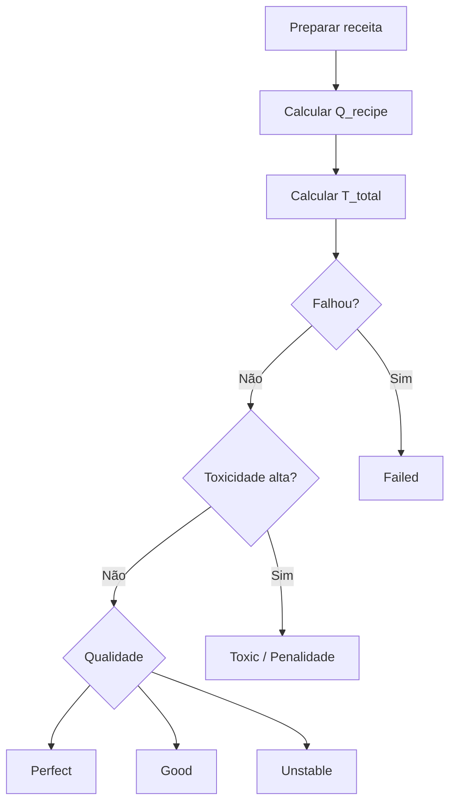

---

# 9. Efeitos Alimentares

## 9.1 Categorias de efeito

| Categoria   | Exemplos                                  |
|-------------|-------------------------------------------|
| Recovery    | cura, stamina, mana                       |
| Resistance  | frio, calor, veneno, queda                |
| Combat      | força, velocidade, foco                   |
| Utility     | visão, smell tracking, audição            |
| Harvesting  | melhor precisão, menos dano à parte       |
| Exploration | menor consumo de stamina, melhor escalada |
| Mental      | coragem, resistência a medo               |
| Risk        | náusea, lentidão, alucinação, corrupção   |

---

## 9.2 Stacking de buffs

Buffs alimentares não devem empilhar infinitamente.

Regra:

$$  
Buff_{final} = max(Buff_1, Buff_2, ..., Buff_n) + SynergyBonus  
$$

Com:

$$  
SynergyBonus \le SynergyCap  
$$

Recomendação:

$$  
SynergyCap = 0.25 \cdot Buff_{max}  
$$

---

## 9.3 Satiety / Saciedade

A comida deve ter limite de consumo.

$$  
Satiety_{new} = Satiety_{current} + Satiety_{food}  
$$

Se:

$$  
Satiety_{new} > Satiety_{max}  
$$

então aplicar penalidade:

- lentidão;
    
- náusea;
    
- desperdício;
    
- bloqueio temporário de comida.
    

---

# 10. Descoberta de Receitas

## 10.1 Fontes de descoberta

Receitas podem ser descobertas por:

| Fonte          | Exemplo                                 |
|----------------|-----------------------------------------|
| Tentativa      | player combina ingredientes             |
| Note           | player registra resultado               |
| Bestiário      | parte de monstro revela valor culinário |
| NPC            | cozinheiro ensina receita               |
| Livro/relíquia | receita antiga                          |
| Venda          | mercado revela valor                    |
| Erro           | falha revela combinação proibida        |
| Repetição      | sucesso repetido vira domínio           |

---

## 10.2 Estados da descoberta

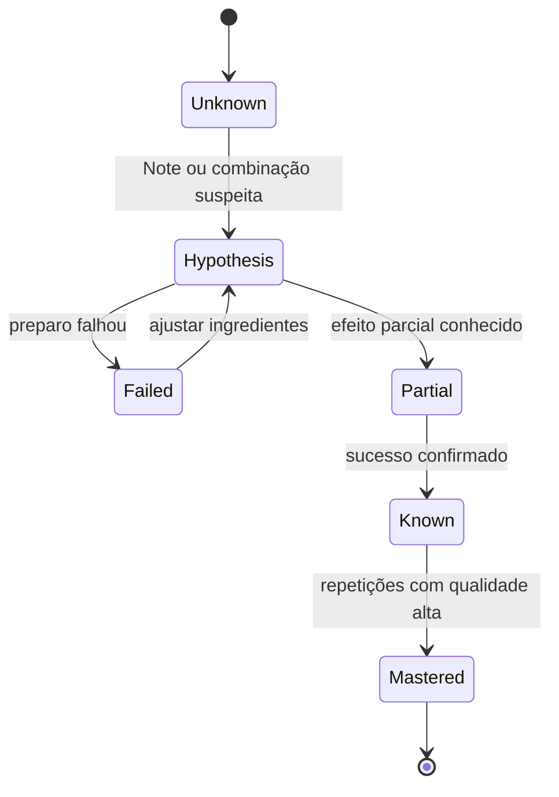

---

## 10.3 Fórmula de progresso da receita

$$  
K_{recipe} = K_{attempt} + K_{notes} + K_{bestiary} + K_{npc} + K_{success}  
$$

Thresholds:

$$  
K_{recipe} \ge T_{known} \Rightarrow RecipeKnown  
$$

$$  
K_{recipe} \ge T_{mastered} \Rightarrow RecipeMastered  
$$

---

# 11. Integração com Notes

Cooking deve gerar notes automaticamente ou semi-automaticamente.

## 11.1 Tipos de Cooking Notes

| Note             | Exemplo                                    | Uso                      |
|------------------|--------------------------------------------|--------------------------|
| Ingredient Note  | “fungo azul cura levemente”                | identifica efeito        |
| Toxicity Note    | “misturar enxofre com sangue gerou veneno” | evita erro               |
| Recipe Note      | “carne + seiva = anti-bleed”               | receita parcial          |
| Preparation Note | “cozinhar pouco preserva efeito”           | melhora qualidade        |
| Failure Note     | “cristal + enxofre explode”                | bloqueia combinação ruim |
| Market Food Note | “sopa medicinal vende bem”                 | economia                 |

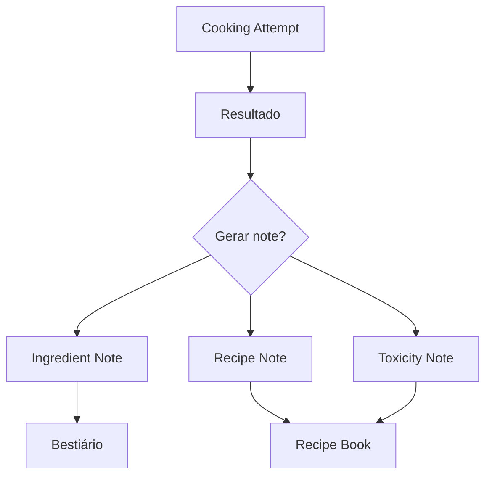

## 11.2 Localization

Receitas, efeitos e notes automáticas devem usar templates localizáveis. Unity Localization Smart Strings usa placeholders entre chaves, como `{ingredient}` ou `{effect}`, o que serve para frases automáticas de descoberta culinária. ([Unity Docs](https://docs.unity3d.com/Packages/com.unity.localization%401.4/manual/Smart/SmartStrings.html?utm_source=chatgpt.com "Smart Strings | Localization | 1.4.5"))

Exemplos:

| Template                         | Saída                                 |
|----------------------------------|---------------------------------------|
| `{ingredient} causou {effect}`   | “Fungo Azul causou Cura Leve”         |
| `{recipe} falhou por {reason}`   | “Caldo de Raiz falhou por Toxicidade” |
| `{monster_part} pode ser cozido` | “Cauda de Slime pode ser cozida”      |

---

# 12. Integração com Bestiário

Cooking é uma fonte de conhecimento sobre monstros.

## 12.1 O que cooking pode revelar

| Ação                      | Conhecimento        |
|---------------------------|---------------------|
| cozinhar carne de monstro | valor culinário     |
| comer parte crua          | toxicidade          |
| cozinhar órgão raro       | efeito especial     |
| falhar preparo            | combinação proibida |
| vender prato de monstro   | valor comercial     |
| repetir receita           | domínio culinário   |

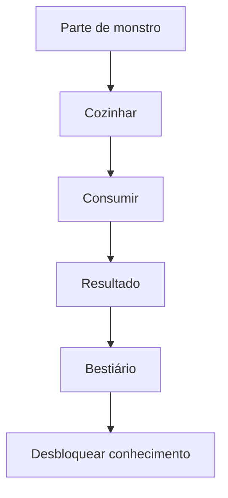

## 12.2 Fórmula de conhecimento culinário no bestiário

$$  
K_{culinary} = K_{cook} + K_{consume} + K_{toxicity} + K_{recipeSuccess}  
$$

Quando:

$$  
K_{culinary} \ge T_{culinaryInfo}  
$$

o bestiário revela valor culinário daquela criatura.

---

# 13. Integração com Economia

Cooking pode criar itens vendáveis.

## 13.1 Decisões econômicas

Após coletar ingrediente, o player pode:

- consumir cru;
    
- cozinhar e consumir;
    
- vender ingrediente cru;
    
- cozinhar e vender;
    
- guardar para contrato;
    
- usar em receita rara;
    
- usar como insumo de NPC/loja.
    

## 13.2 Valor de prato

$$  
V_{food} = (V_{ingredients} \cdot M_{recipe}) \cdot Q_{recipe} \cdot D_{food}  
$$

| Termo             | Descrição                      |
|-------------------|--------------------------------|
| $V_{food}$        | valor final da comida          |
| $V_{ingredients}$ | soma do valor dos ingredientes |
| $M_{recipe}$      | multiplicador da receita       |
| $Q_{recipe}$      | qualidade do preparo           |
| $D_{food}$        | demanda por comida             |

## 13.3 Anti-exploit culinário

Para evitar lucro infinito:

$$  
V_{food} \le V_{ingredients} \cdot M_{maxProfit}  
$$

Recomendação inicial:

$$  
M_{maxProfit} = 1.5  
$$

Exceções só são permitidas quando houver:

- ingrediente raro;
    
- risco alto;
    
- chance de falha;
    
- custo de preparo;
    
- demanda limitada;
    
- recipe mastery;
    
- contrato específico.
    

---

# 14. Integração com Dungeon

## 14.1 Cooking durante run

Cooking na dungeon deve ser possível, mas arriscado.

Riscos:

- luz da fogueira;
    
- cheiro de comida;
    
- ruído;
    
- tempo parado;
    
- fumaça;
    
- ataque durante preparo;
    
- contaminação por ambiente;
    
- perda de ingrediente em falha.
    

## 14.2 Fórmula de risco ao cozinhar na dungeon

$$  
Risk_{cooking} = T_{cook} \cdot E_{exposure} \cdot S_{smell} \cdot N_{noise} \cdot D_{danger}  
$$

| Termo          | Descrição        |
|----------------|------------------|
| $T_{cook}$     | tempo de preparo |
| $E_{exposure}$ | exposição física |
| $S_{smell}$    | cheiro gerado    |
| $N_{noise}$    | ruído            |
| $D_{danger}$   | perigo local     |

## 14.3 Cooking e Sleep Zone

Sleep Zones podem permitir cooking seguro limitado.

Regras:

- receitas simples permitidas;
    
- receitas rituais proibidas ou arriscadas;
    
- cooking pode consumir tempo da run;
    
- cheiro pode persistir após sair da Sleep Zone;
    
- estação segura não deve gerar comida infinita.
    

---

# 15. Integração com Corpse System

Se o player morre:

| Item                               |                 Vai para corpse? |
|------------------------------------|---------------------------------:|
| ingredientes da run                |                              Sim |
| comida preparada da run            |                              Sim |
| receitas descobertas e confirmadas |                              Não |
| notes culinárias não confirmadas   | Sim, se estavam no diário da run |
| conhecimento permanente            |                              Não |
| comida consumida                   |                              Não |
| prato em preparo                   |                 Pode ser perdido |

## 15.1 Regra

$$  
RunFoodItems \subseteq CorpseLoot  
$$

Mas:

$$  
KnownRecipes \not\subseteq CorpseLoot  
$$

Ou seja: a comida física pode ser perdida; o conhecimento confirmado não.

---

# 16. Multiplayer

## 16.1 Autoridade

Em multiplayer, o servidor deve validar:

- posse dos ingredientes;
    
- estação usada;
    
- receita válida;
    
- resultado;
    
- toxicidade;
    
- item criado;
    
- consumo;
    
- venda;
    
- transferência para corpse.
    

No modelo client-server do Netcode for GameObjects, o servidor possui autoridade final sobre spawn/despawn de `NetworkObjects` por padrão, o que encaixa com Cooking server-authoritative para evitar duplicação de comida, ingredientes ou efeitos. ([Unity Docs](https://docs.unity3d.com/Packages/com.unity.netcode.gameobjects%402.5/manual/basics/ownership.html?utm_source=chatgpt.com "Understanding ownership and authority | Netcode for ..."))

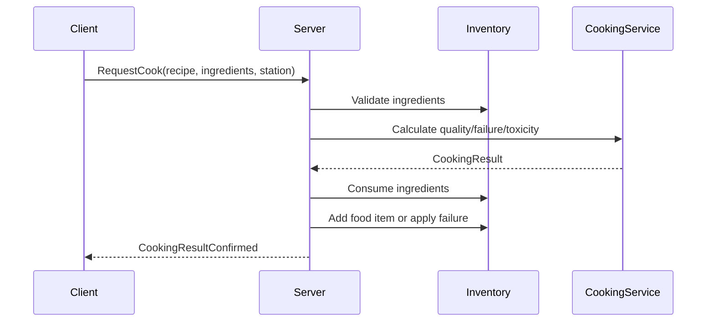

---

## 16.2 Cooking em party

Possibilidades:

| Ação                             | Regra                             |
|----------------------------------|-----------------------------------|
| cozinhar para si                 | sempre permitido                  |
| cozinhar para party              | exige compartilhar comida         |
| usar ingrediente de outro player | exige permissão                   |
| cooking station da party         | estado compartilhado              |
| receita descoberta por um player | pode ser pessoal ou compartilhada |
| prato vendido na loja da party   | depende do escopo da loja         |

## 16.3 Interest Management

Players em outro andar não precisam receber:

- progresso detalhado do preparo;
    
- animação da panela;
    
- ingredientes usados;
    
- UI de receita.
    

Recebem apenas:

- Party Summary;
    
- “Player está cozinhando” se relevante;
    
- item final compartilhado;
    
- note/descoberta, se compartilhada.
    

---

# 17. VR e Flatscreen

## 17.1 Princípio

VR é físico/diegético. Flatscreen é abstração equivalente.

A regra:

$$  
T_{cook}^{VR} \approx T_{cook}^{Flat}  
$$

$$  
Risk_{cook}^{VR} \approx Risk_{cook}^{Flat}  
$$

## 17.2 VR

Ações possíveis:

- cortar ingrediente com faca;
    
- mexer panela;
    
- segurar ingrediente no fogo;
    
- jogar tempero;
    
- abrir caderno de receita;
    
- provar;
    
- embalar comida;
    
- apagar fogueira.
    

## 17.3 Flatscreen

Ações equivalentes:

- hold/timing;
    
- seleção de ingrediente;
    
- minigame curto;
    
- barra de calor;
    
- sequência de preparo;
    
- confirmação de risco;
    
- interface sem pausa.
    

## 17.4 Paridade de risco

Se Flatscreen for rápido demais:

- aplicar lock de animação;
    
- reduzir awareness;
    
- manter mundo ativo;
    
- adicionar tempo mínimo.
    

Se VR for lento demais:

- templates físicos;
    
- ações simplificadas;
    
- presets de receita;
    
- ferramentas assistivas.
    

---

# 18. Persistência

## 18.1 O que salvar

| Dado                          | Persistência |
|-------------------------------|--------------|
| ingrediente na mochila da run | RunDomain    |
| comida preparada na run       | RunDomain    |
| receita conhecida             | MetaDomain   |
| receita dominada              | MetaDomain   |
| toxicidade conhecida          | MetaDomain   |
| notes culinárias temporárias  | Run/World    |
| notes culinárias confirmadas  | MetaDomain   |
| estoque de comida da loja     | ShopDomain   |
| preço de comida               | Shop/World   |
| pratos em contracts           | ShopDomain   |

## 18.2 Fórmula de save

$$  
CookingSave = KnownRecipes + MasteredRecipes + IngredientKnowledge + ToxicityKnowledge + CookingNotes  
$$

Separação importante:

$$  
RunIngredients \neq MetaKnowledge  
$$

A perda da run pode remover ingredientes, mas não deve apagar conhecimento confirmado.

---

# 19. UI/UX

## 19.1 Recipe Book

O livro de receitas deve mostrar estados:

| Estado     | Visual                |
|------------|-----------------------|
| Unknown    | oculto                |
| Hypothesis | rascunho              |
| Partial    | ingredientes parciais |
| Known      | receita legível       |
| Mastered   | selo/ícone especial   |
| Dangerous  | alerta de toxicidade  |

## 19.2 Informação exibida

Sem conhecimento:

- nome desconhecido;
    
- efeito desconhecido;
    
- risco desconhecido;
    
- “ingrediente estranho”.
    

Com conhecimento parcial:

- categoria;
    
- possível efeito;
    
- toxicidade estimada;
    
- combinação sugerida.
    

Com domínio:

- efeito exato;
    
- duração;
    
- qualidade esperada;
    
- valor de venda;
    
- risco de falha.
    

---

# 20. Estrutura de Dados Recomendada

## 20.1 IngredientDefinition

| Campo              | Função                   |
|--------------------|--------------------------|
| `ingredient_id`    | id estável               |
| `display_name_key` | localization             |
| `source_type`      | monstro, planta, mineral |
| `rarity`           | raridade                 |
| `base_quality`     | qualidade base           |
| `toxicity`         | toxicidade               |
| `freshness_decay`  | degradação               |
| `cooking_tags`     | tags                     |
| `raw_effect`       | efeito se comer cru      |
| `cooked_effects`   | efeitos possíveis        |
| `market_value`     | valor base               |
| `bestiary_link`    | monstro relacionado      |

## 20.2 RecipeDefinition

| Campo              | Função      |
|--------------------|-------------|
| `recipe_id`        | id          |
| `display_name_key` | nome        |
| `required_tags`    | requisitos  |
| `optional_tags`    | bônus       |
| `forbidden_tags`   | falha       |
| `station_type`     | estação     |
| `difficulty`       | dificuldade |
| `base_duration`    | duração     |
| `base_effect`      | efeito      |
| `failure_effect`   | falha       |
| `discovery_rule`   | descoberta  |
| `market_profile`   | venda       |

## 20.3 CookingResult

| Campo                  | Função                    |
|------------------------|---------------------------|
| `result_id`            | id                        |
| `recipe_id`            | receita                   |
| `quality`              | qualidade                 |
| `toxicity`             | toxicidade                |
| `state`                | perfect/good/failed/toxic |
| `effects`              | buffs/debuffs             |
| `discovered_knowledge` | conhecimento              |
| `generated_notes`      | notes                     |
| `created_item_id`      | comida criada             |

---

# 21. Data-Driven Implementation

Ingredientes, receitas, estações, efeitos e regras de falha devem ser data-driven. `ScriptableObject` é uma boa base em Unity para armazenar dados compartilhados de definições, como itens, receitas e configurações, porque reduz duplicação e separa dados de GameObjects de cena. ([Unity Docs](https://docs.unity3d.com/6000.4/Documentation/Manual/class-ScriptableObject.html?utm_source=chatgpt.com "ScriptableObject"))

## 21.1 Assets recomendados

| Asset                      | Função                 |
|----------------------------|------------------------|
| `IngredientDefinition`     | define ingrediente     |
| `RecipeDefinition`         | define receita         |
| `CookingStationDefinition` | define estação         |
| `FoodEffectDefinition`     | define buff/debuff     |
| `ToxicityRuleSet`          | define toxicidade      |
| `RecipeDiscoveryRuleSet`   | define descoberta      |
| `CookingMarketProfile`     | define valor econômico |

---

# 22. Estrutura de Scripts Recomendada

| Pasta                 | Arquivos                                                                                                 |
|-----------------------|----------------------------------------------------------------------------------------------------------|
| `Cooking/Core`        | `IngredientDefinition.cs`, `RecipeDefinition.cs`, `CookingTag.cs`, `FoodItem.cs`                         |
| `Cooking/Stations`    | `CookingStation.cs`, `CookingStationDefinition.cs`, `CampfireCookingStation.cs`, `ShopKitchenStation.cs` |
| `Cooking/Processing`  | `CookingService.cs`, `RecipeMatcher.cs`, `CookingQualityCalculator.cs`, `ToxicityCalculator.cs`          |
| `Cooking/Effects`     | `FoodEffectDefinition.cs`, `FoodEffectApplier.cs`, `BuffStackingService.cs`, `SatietyService.cs`         |
| `Cooking/Discovery`   | `RecipeDiscoveryService.cs`, `RecipeKnowledgeState.cs`, `IngredientKnowledgeState.cs`                    |
| `Cooking/Notes`       | `CookingNoteBridge.cs`, `RecipeNoteGenerator.cs`, `IngredientNoteGenerator.cs`                           |
| `Cooking/Bestiary`    | `CulinaryBestiaryBridge.cs`, `MonsterPartCookingService.cs`                                              |
| `Cooking/Economy`     | `FoodValueCalculator.cs`, `CookingMarketBridge.cs`, `FoodContractService.cs`                             |
| `Cooking/Persistence` | `CookingSaveData.cs`, `RecipeSaveData.cs`, `IngredientKnowledgeSave.cs`                                  |
| `Cooking/Networking`  | `ServerCookingService.cs`, `CookingRpcController.cs`, `CookingVisibilityResolver.cs`                     |
| `Cooking/UI`          | `RecipeBookView.cs`, `CookingStationView.cs`, `IngredientInspectView.cs`                                 |

---

# 23. Pipeline Técnico

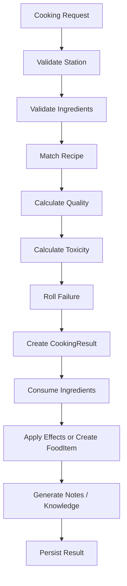

---

# 24. Validação

## 24.1 Constraints obrigatórias

| Constraint                            | Regra                          |
|---------------------------------------|--------------------------------|
| `ingredients_exist_in_inventory`      | não cozinhar item inexistente  |
| `station_supports_recipe`             | estação correta                |
| `recipe_not_forbidden_by_context`     | contexto permite receita       |
| `toxicity_calculated`                 | toxicidade sempre calculada    |
| `failure_possible_for_unknown_recipe` | desconhecido pode falhar       |
| `food_effect_has_duration`            | buff não infinito              |
| `satiety_limit_respected`             | não comer infinito             |
| `server_authoritative_result`         | client não decide resultado    |
| `recipe_discovery_persisted`          | descoberta salva corretamente  |
| `corpse_rules_respected`              | comida física pode ser perdida |
| `economy_anti_exploit_validated`      | não gerar lucro infinito       |

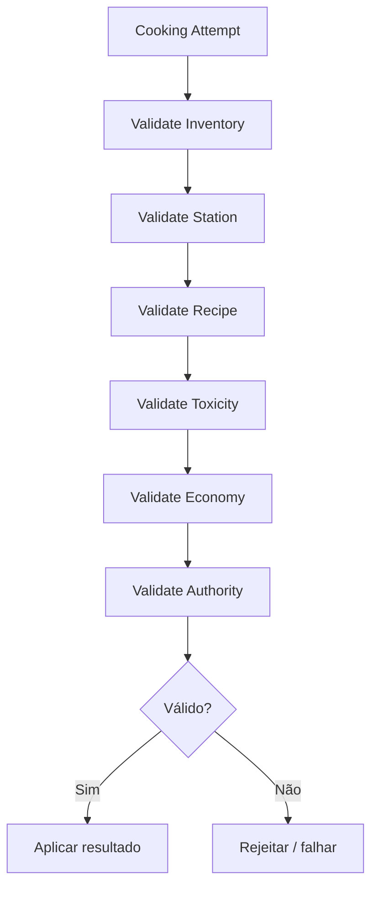

---

# 25. MVP Roadmap

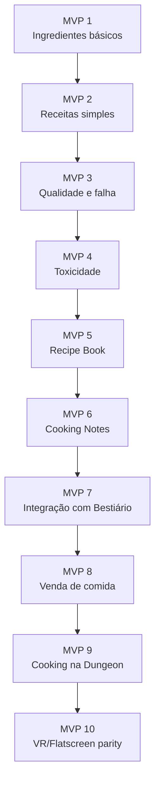

## 25.1 Escopo por MVP

| MVP    | Entrega                           |
|--------|-----------------------------------|
| MVP 1  | ingredientes com tags e qualidade |
| MVP 2  | 5 receitas simples                |
| MVP 3  | qualidade, falha e resultado      |
| MVP 4  | toxicidade e efeitos negativos    |
| MVP 5  | livro de receitas com estados     |
| MVP 6  | notes culinárias                  |
| MVP 7  | cooking alimenta bestiário        |
| MVP 8  | comida vendável e anti-exploit    |
| MVP 9  | cooking em campfire na dungeon    |
| MVP 10 | paridade VR/Flatscreen            |

---

# 26. Non-Goals

Não implementar no primeiro ciclo:

- centenas de receitas;
    
- sistema nutricional realista;
    
- decomposição complexa;
    
- cooking automático sem risco;
    
- comida infinita;
    
- pausa durante preparo;
    
- receitas completas desde o início;
    
- buffs permanentes fáceis;
    
- comida que substitui builds;
    
- cooking que quebra economia;
    
- crafting culinário industrial;
    
- minigames complexos de cozinha no MVP;
    
- simulação física completa de panela/ingredientes.
    

---

# 27. Critérios de Aceite

O Cooking System está aceitável quando:

- ingredientes possuem tags, qualidade e toxicidade;
    
- receitas podem ser descobertas;
    
- receita desconhecida pode falhar;
    
- preparo calcula qualidade;
    
- toxicidade pode gerar penalidade;
    
- comida gera efeito temporário;
    
- buffs não empilham infinitamente;
    
- saciedade limita consumo;
    
- cooking pode gerar notes;
    
- cooking pode alimentar bestiário;
    
- comida pode ter valor econômico;
    
- comida física pode ser perdida no corpse;
    
- receita confirmada persiste como conhecimento;
    
- cooking na dungeon gera risco;
    
- servidor valida cooking em multiplayer;
    
- VR e Flatscreen têm custo equivalente;
    
- cooking não trivializa dungeon, boss gate ou economia.
    

---

# 28. Definição Final para o GDD Principal

## Cooking System

O Cooking System transforma ingredientes, partes de monstros e recursos orgânicos em comida, buffs, conhecimento e valor econômico. Cooking não é apenas crafting de alimento; é uma forma de aplicar conhecimento sobre a dungeon para sobreviver melhor, vender melhor e compreender melhor criaturas e ingredientes.

Ingredientes possuem qualidade, toxicidade, raridade, frescor, tags culinárias e origem. Receitas são descobertas por tentativa, notes, bestiário, NPCs, livros, erro ou repetição. O jogador não começa com uma lista completa de receitas. Cada receita pode estar em estado Unknown, Hypothesis, Failed, Partial, Known ou Mastered.

O preparo calcula qualidade, toxicidade, chance de falha, duração e potência do efeito. Comidas podem curar, restaurar stamina, conceder resistência, melhorar harvesting, ampliar percepção ou gerar penalidades como veneno, náusea, alucinação e corrupção. Buffs alimentares não empilham infinitamente, e saciedade limita consumo.

Cooking se conecta ao Notes System porque tentativas, falhas, toxicidade e descobertas podem gerar Ingredient Notes, Recipe Notes e Toxicity Notes. Também se conecta ao Bestiário porque cozinhar partes de monstros revela valor culinário, toxicidade e anatomia. Na Economia, comida pode ser vendida, usada em contratos ou consumida como investimento de sobrevivência.

Na dungeon, cooking é possível, mas gera risco: tempo parado, cheiro, fumaça, luz, ruído e exposição. No Hub ou loja, o preparo é mais seguro, mas depende de o jogador retornar vivo com ingredientes. Se o jogador morrer, ingredientes e comidas da run podem ir para o corpse; receitas confirmadas e conhecimento permanente não são perdidos.

No multiplayer, cooking deve ser server-authoritative. O client solicita o preparo, mas o servidor valida ingredientes, estação, resultado, toxicidade, consumo dos itens e criação da comida. Em VR, cooking deve ser físico e diegético. Em Flatscreen, deve ser abstraído por interface sem pausa, mantendo tempo, risco e vulnerabilidade equivalentes.

---

# 29. Resumo Final

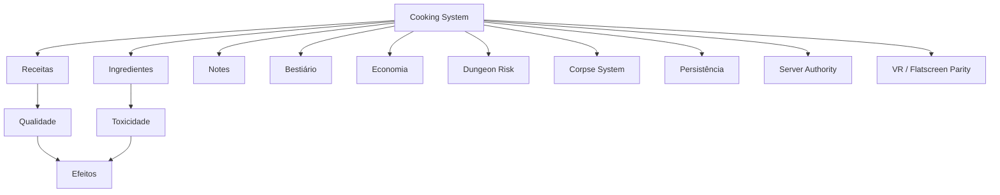

Regra final:

**Cooking é sobrevivência por conhecimento.**  
Comida boa não vem de menu; vem de exploração, risco, tentativa, erro, notes, bestiário e retorno vivo da dungeon.