## Sistema Unificado de Fabricação, Forja Modular, Ligas, Gear, Reparos, Coatings e Progressão Material

> **Projeto:** Dungeon Explorer: Ashvault  
> **Documento:** GDD completo do sistema de **Crafting + Forging**  
> **Escopo:** crafting geral, forja, armas modulares, armaduras, ferramentas, ligas, blueprints, peças, traits, coatings, reparos, upgrades, qualidade, falha, economia, notes, mineração, bestiário, multiplayer, persistência e paridade VR/Flatscreen.  
> **Referências principais:** **Tinkers’ Construct**, **Silent Gear**, **Kingdom Come: Deliverance / Kingdom Come: Deliverance II**.  
> **Regra central:** o jogador não fabrica progresso do nada; ele transforma risco, materiais reais, conhecimento e execução técnica em capacidade operacional.

---

# 1. High Concept

O **Crafting & Forging System** é o sistema que converte recursos obtidos na dungeon em **ferramentas, armas, armaduras, kits, componentes, upgrades, coatings, reparos e infraestrutura**.

Ele deve unir três ideias principais:

1. **Modularidade material**, inspirada em Tinkers’ Construct e Silent Gear.
    
2. **Processo físico/manual**, inspirado em Kingdom Come.
    
3. **Regras sistêmicas próprias de Ashvault**, como economia fechada, boss gate, corpse system, VR/Flatscreen parity e efeitos unificados.
    

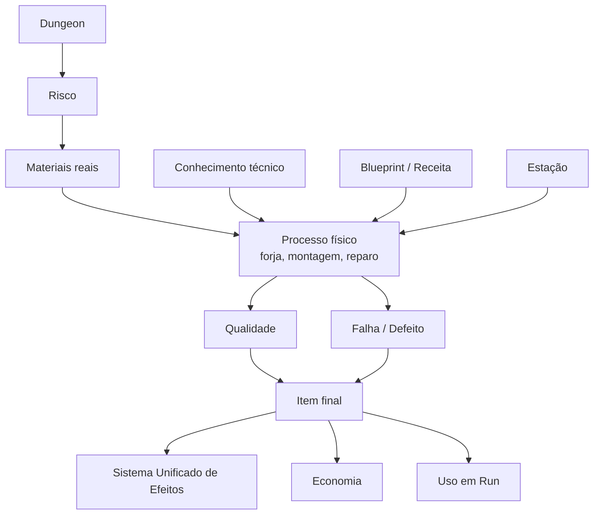

---

# 2. Referências de Design

## 2.1 Tinkers’ Construct

**Tinkers’ Construct** é referência para o conceito de montar ferramentas de várias formas, usar diferentes materiais e modificar ferramentas depois da criação; a própria página do mod descreve essa ideia de colocar ferramentas juntas de várias maneiras, modificá-las e usar muitos materiais diferentes. ([CurseForge](https://www.curseforge.com/minecraft/mc-mods/tinkers-construct "Tinkers Construct - Minecraft Mods - CurseForge"))

### O que Ashvault aproveita

| Referência em Tinkers            | Aplicação em Ashvault                         |
|----------------------------------|-----------------------------------------------|
| Ferramentas montadas por partes  | Gear modular por componentes                  |
| Muitos materiais possíveis       | Materiais com propriedades próprias           |
| Modificadores pós-criação        | Upgrades e coatings                           |
| Ferramenta como item persistente | Equipamento com histórico, qualidade e reparo |
| Material define comportamento    | Traits derivados de material                  |

### O que Ashvault altera

Ashvault não deve copiar o modelo de Minecraft. A adaptação precisa ser mais diegética, física e ligada ao risco:

- materiais vêm da dungeon;
    
- itens podem ir para corpse;
    
- forja exige tempo e processo;
    
- VR precisa manipulação física;
    
- Flatscreen precisa abstração equivalente;
    
- item não pode burlar boss gate;
    
- economia não pode gerar lucro infinito.
    

---

## 2.2 Silent Gear

**Silent Gear** é referência para blueprints, gear modular, materiais, partes e traits. A página do Modrinth descreve o mod como focado em tools, weapons e armor, feitos com materiais usados para gear; ela também descreve blueprints/templates como essenciais para criar gear, com main parts, rods e cords em várias receitas. ([Modrinth](https://modrinth.com/project/73mSSnCf "Silent Gear - Minecraft Mod"))

O repositório do Silent Gear também descreve o sistema como um mod modular de tools/armor, com crafting por blueprints, materiais e partes adicionáveis por JSON/data packs e possibilidade de alterar receitas por data packs. ([GitHub](https://github.com/SilentChaos512/Silent-Gear "GitHub - SilentChaos512/Silent-Gear: Modular tool/armor mod (formerly part of Silent's Gems) · GitHub"))

### O que Ashvault aproveita

| Referência em Silent Gear         | Aplicação em Ashvault                               |
|-----------------------------------|-----------------------------------------------------|
| Blueprint define o tipo de gear   | Blueprint define item, slots e constraints          |
| Materiais e partes compõem o item | Componentes físicos com propriedades                |
| Traits derivados de materiais     | Traits sistêmicos em armas, ferramentas e armaduras |
| Data-driven gear                  | ScriptableObjects / data assets                     |
| Materiais e ordem importam        | Ordem e slot afetam resultado                       |

### O que Ashvault altera

Ashvault precisa ser mais orientado a processo:

- blueprint não basta;
    
- material precisa ter origem rastreável;
    
- qualidade do processo importa;
    
- temperatura importa na forja;
    
- falha pode destruir ou deformar item;
    
- notes podem registrar receita ou erro;
    
- conhecimento técnico evolui.
    

---

## 2.3 Kingdom Come

**Kingdom Come** entra como referência para a fantasia de processo artesanal e físico. A expansão _Legacy of the Forge_ de **Kingdom Come: Deliverance II** é oficialmente apresentada em torno de restaurar uma forge, ganhar prestígio como blacksmith e realizar sword crafting. ([Deep Silver](https://www.deepsilver.com/games/kingdom-come-deliverance-ii/legacy-of-the-forge "Kingdom Come: Deliverance II | Legacy of the Forge"))

### O que Ashvault aproveita

| Referência em Kingdom Come | Aplicação em Ashvault                   |
|----------------------------|-----------------------------------------|
| Trabalho artesanal         | crafting como processo, não botão       |
| Forja como espaço físico   | forge/smelter/workbench no Hub          |
| Sword crafting             | armas forjadas por partes               |
| Prestígio de ferreiro      | progressão de loja/oficina              |
| Tempo e execução           | temperatura, timing, martelada, têmpera |

### O que Ashvault altera

Ashvault precisa acomodar:

- VR físico;
    
- Flatscreen equivalente;
    
- dungeon procedural;
    
- multiplayer;
    
- economia fechada;
    
- corpse system;
    
- sistema de efeitos;
    
- boss gate;
    
- materiais de monstros e biomas.
    

---

# 3. Fórmula de Direção do Sistema

O Forging de Ashvault deve ser definido assim:

# $$  
Forging_{Ashvault}

Modularity_{Tinkers/SilentGear}  
+  
PhysicalProcess_{KingdomCome}  
+  
SystemicRules_{Ashvault}  
$$

Ou seja:

| Fonte              | Contribuição                                                                         |
|--------------------|--------------------------------------------------------------------------------------|
| Tinkers’ Construct | peças, materiais, modificadores                                                      |
| Silent Gear        | blueprints, gear modular, traits data-driven                                         |
| Kingdom Come       | processo físico, temperatura, execução                                               |
| Ashvault           | VR/Flat parity, economia fechada, boss gate, corpse, multiplayer, efeitos unificados |

---

# 4. Objetivos de Design

## 4.1 Objetivo principal

Permitir que o jogador transforme exploração em capacidade operacional.

O jogador deve sentir:

- “minha arma veio dos materiais que eu arrisquei buscar”;
    
- “essa liga tem comportamento próprio”;
    
- “essa peça de monstro mudou o efeito do item”;
    
- “se eu errar a temperatura, o item fica instável”;
    
- “essa ferramenta é minha, foi montada e evoluída por mim”;
    
- “craftar esse item talvez seja melhor do que vender o material bruto”;
    
- “essa receita eu aprendi por tentativa, note, bestiário ou NPC”.
    

---

## 4.2 Problemas que o sistema resolve

| Problema                             | Solução                                                 |
|--------------------------------------|---------------------------------------------------------|
| Mining precisa ter uso além da venda | minérios viram ligas, ferramentas e armas               |
| Bestiário precisa gerar utilidade    | partes de monstros viram traits, coatings e componentes |
| Notes precisam registrar aprendizado | notes salvam receitas, falhas, ligas e temperatura      |
| Economia precisa de transformação    | item craftado agrega valor ao material bruto            |
| Gear precisa de identidade           | arma/ferramenta nasce da combinação de peças            |
| VR precisa embodiment                | forja e crafting têm manipulação física                 |
| Flatscreen precisa equivalência      | minigame mantém tempo, risco e qualidade máxima         |
| Progressão precisa de limites        | item não pode burlar boss gate ou economia              |

---

# 5. Pilares do Sistema

## 5.1 Recurso real obrigatório

Nenhum item pode ser criado sem material real.

$$  
CraftedItem \Rightarrow RealMaterialsConsumed  
$$

Se não houve mineração, harvesting, loot, compra legítima ou recuperação de corpse, não pode haver item.

---

## 5.2 Crafting e Forging são o mesmo domínio

Forja é uma especialização do crafting, não um sistema separado.

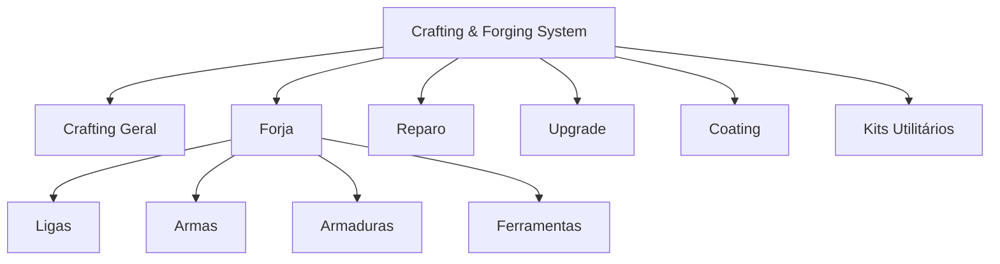

---

## 5.3 Qualidade nasce de material + processo + conhecimento

Um item não é bom só porque a receita existe.

# $$  
Q_{item}

f(Q_{materials}, K_{recipe}, S_{crafting}, B_{station}, B_{tool}, P_{process})  
$$

Onde:

| Termo           | Função                       |
|-----------------|------------------------------|
| $Q_{materials}$ | qualidade dos materiais      |
| $K_{recipe}$    | conhecimento da receita      |
| $S_{crafting}$  | skill do jogador             |
| $B_{station}$   | bônus da estação             |
| $B_{tool}$      | bônus da ferramenta          |
| $P_{process}$   | qualidade do processo físico |

---

## 5.4 O processo importa

Na forja, a execução importa:

- temperatura;
    
- tempo de aquecimento;
    
- marteladas;
    
- ritmo;
    
- têmpera;
    
- resfriamento;
    
- acabamento;
    
- aplicação de coating;
    
- estabilização com flux.
    

---

## 5.5 Efeitos são unificados

Coatings, ligas, materiais, deuses, buffs, debuffs, armas e armaduras devem usar a mesma equação de efeito:

# $$  
FinalEffect

BaseEffect  
\cdot  
(1 + \sum AdditiveModifiers)  
\cdot  
\prod MultiplicativeModifiers  
\cdot  
ConditionModifier  
$$

Ordem recomendada:

1. Base Effect;
    
2. Skill Perks;
    
3. Equipment Stats;
    
4. Status Effects;
    
5. God Modifier;
    
6. Condition Modifier.
    

---

# 6. Core Loop

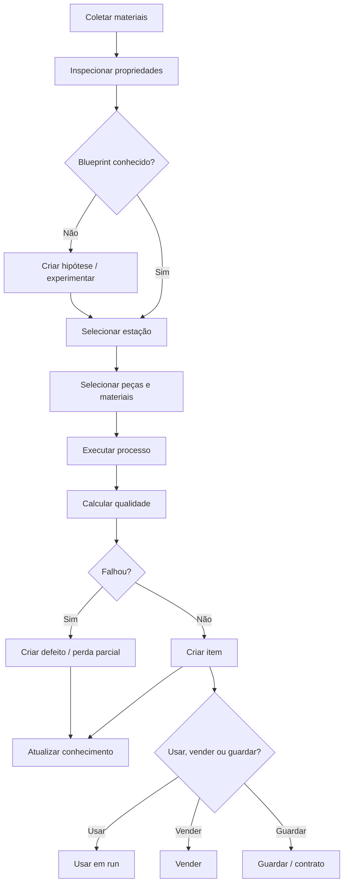

---

# 7. Tipos de Produção

## 7.1 Crafting geral

| Item           | Uso                               |
|----------------|-----------------------------------|
| Rope Kit       | descida por Fall Origin Point     |
| Anchor Kit     | melhora estabilidade da corda     |
| Marker Kit     | marcação diegética                |
| Repair Kit     | reparo de campo                   |
| Trap Kit       | defesa temporária                 |
| Camp Kit       | crafting leve e descanso limitado |
| Mining Kit     | mineração eficiente               |
| Harvesting Kit | melhor coleta anatômica           |
| Torch Kit      | luz temporária                    |
| Silent Wedge   | mineração silenciosa              |
| Dust Chalk     | marcação temporária               |
| Arcane Marker  | marcação luminosa com risco       |

---

## 7.2 Forja

| Item            | Uso                  |
|-----------------|----------------------|
| Espada          | combate equilibrado  |
| Machado         | dano pesado e corte  |
| Martelo         | stagger e impacto    |
| Lança           | alcance              |
| Adaga           | stealth e harvesting |
| Foice           | bleed e controle     |
| Picareta        | mineração            |
| Cinzel          | precisão em cristais |
| Escudo          | defesa               |
| Armadura leve   | mobilidade           |
| Armadura média  | equilíbrio           |
| Armadura pesada | defesa alta          |
| Foco arcano     | canalização de magia |

---

# 8. Materiais

## 8.1 Categorias de materiais

| Material       | Origem                   | Uso                            |
|----------------|--------------------------|--------------------------------|
| Minério        | Mining                   | ligas, ferramentas, armas      |
| Lingote        | Refino                   | base de forja                  |
| Cristal        | Mining/loot              | foco, coating arcano           |
| Couro          | Harvesting               | grip, armadura leve            |
| Osso           | Bestiário/harvesting     | cabo, binding, lâmina orgânica |
| Escama         | criaturas                | armadura, resistência          |
| Glândula       | criaturas                | poison/acid coating            |
| Sangue         | criaturas                | blood coating, ritual          |
| Resina         | raízes/monstros          | binding, selagem               |
| Fibra          | raízes/plantas           | cordas, costura                |
| Flux           | mining/crafting          | estabilizar liga               |
| Catalisador    | cristal/relíquia/monstro | propriedade especial           |
| Relíquia       | ruínas                   | upgrades raros                 |
| Água benta     | religião                 | holy coating                   |
| Sebo alquímico | cooking/alquimia         | absorção de impacto            |
| Enxofre        | mining                   | fire coating                   |

---

## 8.2 Propriedades de material

| Propriedade          | Função                       |
|----------------------|------------------------------|
| `material_id`        | identificador estável        |
| `rarity`             | raridade                     |
| `quality`            | qualidade                    |
| `condition`          | condição                     |
| `weight`             | peso                         |
| `hardness`           | dano e durabilidade          |
| `ductility`          | flexibilidade da liga        |
| `conductivity`       | canalização arcana           |
| `stability`          | reduz falha                  |
| `toxicity`           | risco de coating/catalisador |
| `flexibility`        | cabos, cordas, couro         |
| `sharpness_affinity` | lâminas                      |
| `impact_affinity`    | martelos/armaduras           |
| `organic_tag`        | orgânico                     |
| `arcane_tag`         | mágico                       |
| `holy_tag`           | sagrado                      |
| `corrupt_tag`        | corrompido                   |
| `market_value`       | valor econômico              |
| `crafting_tags`      | compatibilidade de receita   |

---

# 9. Blueprints, Recipes e Hypotheses

## 9.1 Blueprint

O **Blueprint** define a estrutura do item:

- tipo do item;
    
- slots obrigatórios;
    
- slots opcionais;
    
- materiais permitidos;
    
- estação necessária;
    
- ferramentas necessárias;
    
- dificuldade;
    
- possíveis traits;
    
- outputs válidos.
    

Exemplo:

| Blueprint              | Slots                                            |
|------------------------|--------------------------------------------------|
| Sword Blueprint        | Blade + Handle + Binding + Optional Coating      |
| Pickaxe Blueprint      | Head + Handle + Binding                          |
| Armor Chest Blueprint  | Plate + Underlayer + Strap + Optional Insulation |
| Rope Kit Blueprint     | Fiber + Anchor + Binding                         |
| Arcane Focus Blueprint | Core + Handle + Crystal + Binding                |

---

## 9.2 Recipe

A **Recipe** define uma combinação mais específica.

Exemplo:

| Recipe            | Requisitos                                 |
|-------------------|--------------------------------------------|
| Iron Sword        | Iron Blade + Wood Handle + Leather Binding |
| Root Rope Kit     | Root Fiber + Bone Anchor + Resin           |
| Burn Coating      | Sulfur + Monster Fat + Ember Dust          |
| Holy Silver Blade | Silver Alloy + Sacred Bone + Holy Water    |

---

## 9.3 Estados da receita

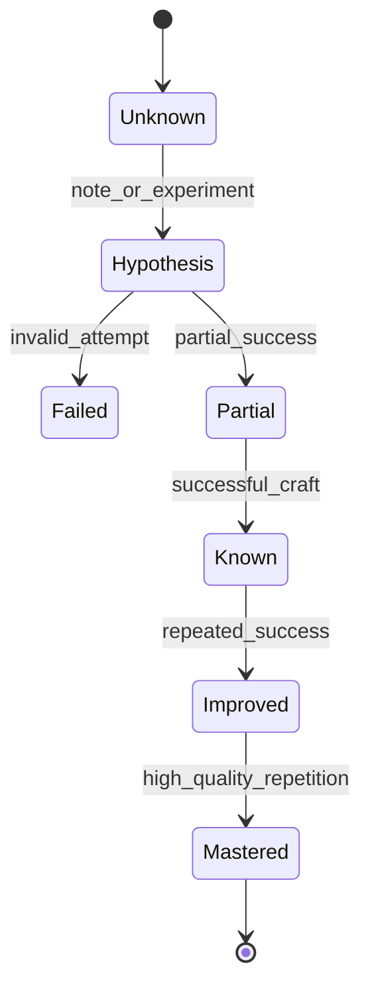

| Estado     | Descrição                       |
|------------|---------------------------------|
| Unknown    | jogador não conhece             |
| Hypothesis | jogador suspeita da combinação  |
| Failed     | tentativa falhou                |
| Partial    | combinação parcialmente correta |
| Known      | receita funcional               |
| Improved   | receita com variação melhorada  |
| Mastered   | domínio técnico                 |

---

# 10. Estações

## 10.1 Estações principais

| Estação          | Função                                 | Local        |
|------------------|----------------------------------------|--------------|
| Workbench        | crafting básico                        | Hub/loja     |
| Field Workbench  | crafting limitado                      | dungeon/camp |
| Forge            | armas, ferramentas e armaduras         | Hub          |
| Smelter          | lingotes e ligas                       | Hub          |
| Tempering Bath   | têmpera                                | Hub          |
| Leather Rack     | couro, straps, grips                   | Hub          |
| Bone Table       | ossos, talismãs, componentes orgânicos | Hub          |
| Arcane Bench     | cristais, relíquias, coatings arcanos  | Hub avançado |
| Coating Table    | revestimentos                          | Hub/loja     |
| Repair Station   | reparos completos                      | Hub/loja     |
| Field Repair Kit | reparos parciais                       | dungeon      |

---

## 10.2 Hub vs Dungeon

| Local      | Vantagem                | Desvantagem                   |
|------------|-------------------------|-------------------------------|
| Hub        | seguro, qualidade maior | exige retorno vivo            |
| Loja       | produção comercial      | custo operacional             |
| Dungeon    | resolve emergência      | risco, ruído, qualidade menor |
| Sleep Zone | crafting limitado       | consome tempo                 |
| Field Kit  | portátil                | baixo tier, baixa qualidade   |

---

# 11. Gear Modular

## 11.1 Conceito

Gear deve ser montado por peças.

Isso se aplica a:

- armas;
    
- ferramentas;
    
- armaduras;
    
- kits;
    
- focos arcanos;
    
- acessórios.
    

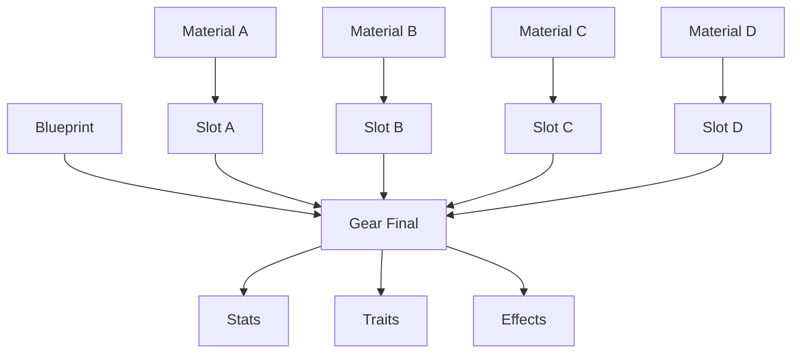

---

## 11.2 Armas modulares

Cada arma usa quatro partes principais:

| Peça           | Função                   |
|----------------|--------------------------|
| Blade / Head   | parte ofensiva principal |
| Handle / Shaft | controle e ergonomia     |
| Binding        | estabilidade estrutural  |
| Coating        | efeito superficial       |

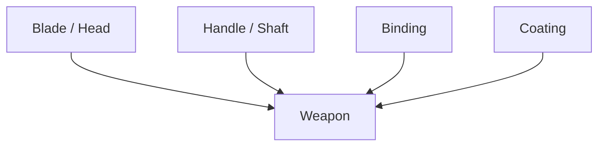

---

## 11.3 Ferramentas modulares

| Ferramenta       | Peças                         |
|------------------|-------------------------------|
| Pickaxe          | Head + Handle + Binding       |
| Chisel           | Tip + Grip + Stabilizer       |
| Hammer           | Head + Handle + Binding       |
| Harvesting Knife | Blade + Handle + Edge Coating |
| Arcane Lens      | Crystal + Frame + Binding     |
| Rope Anchor      | Hook + Shaft + Binding        |

---

## 11.4 Armaduras modulares

| Peça       | Função                 |
|------------|------------------------|
| Plate      | defesa física          |
| Underlayer | conforto, isolamento   |
| Strap      | flexibilidade e ajuste |
| Padding    | absorção de impacto    |
| Coating    | resistência elemental  |
| Rune Slot  | efeito especial        |

---

# 12. Traits

## 12.1 Conceito

Traits são propriedades derivadas dos materiais, peças e processo.

Exemplos:

| Trait      | Origem               | Efeito                        |
|------------|----------------------|-------------------------------|
| Jagged     | osso/metal irregular | bleed leve                    |
| Conductive | cristal/cobre        | amplifica Fulmen              |
| Flexible   | fibra/couro          | menor custo de stamina        |
| Heavy      | metal denso          | mais stagger, mais peso       |
| Brittle    | cristal instável     | alto dano, baixa durabilidade |
| Sacred     | prata/osso sagrado   | anti-corruption               |
| Corrupt    | material abissal     | poder alto, risco             |
| Silent     | fibra especial       | reduz ruído                   |
| Insulated  | couro/escama         | resistência térmica           |
| Stable     | flux bom             | reduz falha                   |

---

## 12.2 Fórmula de Trait Score

# $$  
TraitScore_t

\sum_{i=1}^{n}  
MaterialAffinity_{i,t}  
\cdot  
SlotWeight_i  
\cdot  
Q_i  
$$

Trait é ativado se:

$$  
TraitScore_t \ge T_{trait}  
$$

---

# 13. Sistema de Ligas

## 13.1 Conceito

A liga é a base química e física de armas, ferramentas e armaduras metálicas.

Ela usa:

- metal base;
    
- metal secundário;
    
- flux;
    
- temperatura;
    
- catalisador;
    
- proporção;
    
- tempo;
    
- qualidade do processo.
    

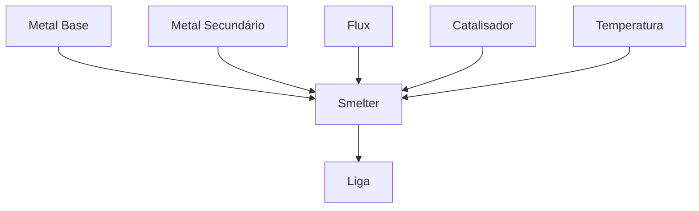

---

## 13.2 Fórmula de qualidade da liga

# $$  
Q_{alloy}

## Q_{baseMetal} \cdot W_b  
+  
Q_{secondaryMetal} \cdot W_s  
+  
F_{flux}  
+  
A_{temperature}  
+  
C_{catalyst}

P_{impurity}  
$$

Com:

$$  
W_b + W_s = 1  
$$

| Termo                | Descrição                     |
|----------------------|-------------------------------|
| $Q_{baseMetal}$      | qualidade do metal principal  |
| $Q_{secondaryMetal}$ | qualidade do metal secundário |
| $F_{flux}$           | estabilização por flux        |
| $A_{temperature}$    | precisão térmica              |
| $C_{catalyst}$       | propriedade especial          |
| $P_{impurity}$       | penalidade de impureza        |

---

## 13.3 Stats derivados da liga

# $$  
DamageModifier

MaterialHardness \cdot 0.1  
+  
TemperatureAccuracy \cdot 0.3  
$$

# $$  
Durability

MaterialDuctility  
\cdot  
TemperatureAccuracy  
\cdot  
FluxRatio  
$$

# $$  
SpecialProperty

CatalystEffect  
\cdot  
SecondaryRatio  
$$

---

## 13.4 Estados de temperatura

| Estado    |          Faixa | Consequência                         |
|-----------|---------------:|--------------------------------------|
| Underheat | < 60% do ideal | durabilidade muito baixa, dano menor |
| Fria      |         60–85% | durabilidade reduzida                |
| Ideal     |        85–100% | stats plenos                         |
| Quente    |       100–115% | dano maior, durabilidade menor       |
| Overheat  |         > 115% | dano alto, risco de quebra súbita    |

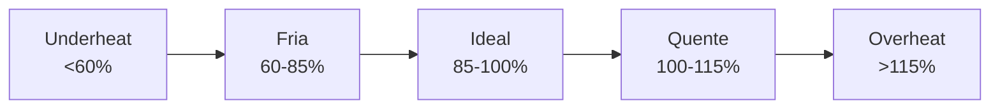

---

## 13.5 Temperature Accuracy

# $$  
A_{temperature}

1 -  
\frac{|T_{actual} - T_{ideal}|}{T_{tolerance}}  
$$

Com clamp:

$$  
A_{temperature} = clamp(A_{temperature}, 0, 1)  
$$

---

# 14. Exemplos de Ligas e Sinergias

| Combinação                                 | Resultado                                  |
|--------------------------------------------|--------------------------------------------|
| Ferro + Osso de Monstro + Resina           | arma barata com bleed nativo               |
| Bronze + Cristal Arcano + Flux Puro        | amplifica feitiços canalizados             |
| Aço + Couro de Besta + Sebo Alquímico      | alta durabilidade e absorção de stagger    |
| Ferro Negro + Escama de Drake + Enxofre    | burn coating e resistência ao próprio fogo |
| Prata + Osso Sagrado + Água Benta          | dano extra contra corrupção                |
| Cobre + Cristal Condutivo + Flux Estável   | alta sinergia com Fulmen                   |
| Obsidiana + Sangue Abissal + Resina Escura | dano alto, risco de corrupção              |
| Titânio Antigo + Relíquia + Flux Refinado  | durabilidade excepcional, custo alto       |

---

# 15. Qualidade Final

## 15.1 Qualidade média dos materiais

# $$  
Q_{materials}

\frac{  
\sum_{i=1}^{n} Q_i \cdot W_i  
}{  
\sum_{i=1}^{n} W_i  
}  
$$

---

## 15.2 Qualidade geral do item

# $$  
Q_{item}

## Q_{materials}  
+  
S_{crafting}  
+  
K_{recipe}  
+  
B_{station}  
+  
B_{tool}  
+  
P_{process}

## D_{difficulty}

P_{mistake}  
$$

Com clamp:

$$  
Q_{item} = clamp(Q_{item}, 0, 1)  
$$

---

## 15.3 Qualidade modular de arma

# $$  
Q_{weapon}

Q_{blade} \cdot W_{blade}  
+  
Q_{handle} \cdot W_{handle}  
+  
Q_{binding} \cdot W_{binding}  
+  
Q_{coating} \cdot W_{coating}  
+  
Q_{alloy} \cdot W_{alloy}  
$$

Pesos iniciais:

| Componente     | Peso |
|----------------|-----:|
| Blade / Head   | 0.35 |
| Handle / Shaft | 0.15 |
| Binding        | 0.15 |
| Coating        | 0.15 |
| Alloy          | 0.20 |

---

# 16. Falha, Defeito e Risco

## 16.1 Chance de falha

# $$  
P_{fail}

## D_{recipe}  
+  
M_{mismatch}  
+  
R_{process}

## S_{crafting}

## K_{recipe}

## B_{station}

B_{tool}  
$$

Com clamp:

$$  
P_{fail} = clamp(P_{fail}, 0.05, 0.95)  
$$

---

## 16.2 Tipos de falha

| Falha             | Consequência                             |
|-------------------|------------------------------------------|
| Material mismatch | item instável                            |
| Underheat         | baixa durabilidade                       |
| Overheat          | quebra súbita                            |
| Binding failure   | perda de estabilidade                    |
| Coating failure   | efeito não aplica ou vira debuff         |
| Tool slip         | perda parcial de material                |
| Arcane backlash   | dano self, ruído, corrupção              |
| Critical failure  | item quebrado ou material destruído      |
| Tempering crack   | item bom inicialmente, mas quebra rápido |
| Hidden impurity   | trait negativo oculto até uso            |

---

## 16.3 Resultado

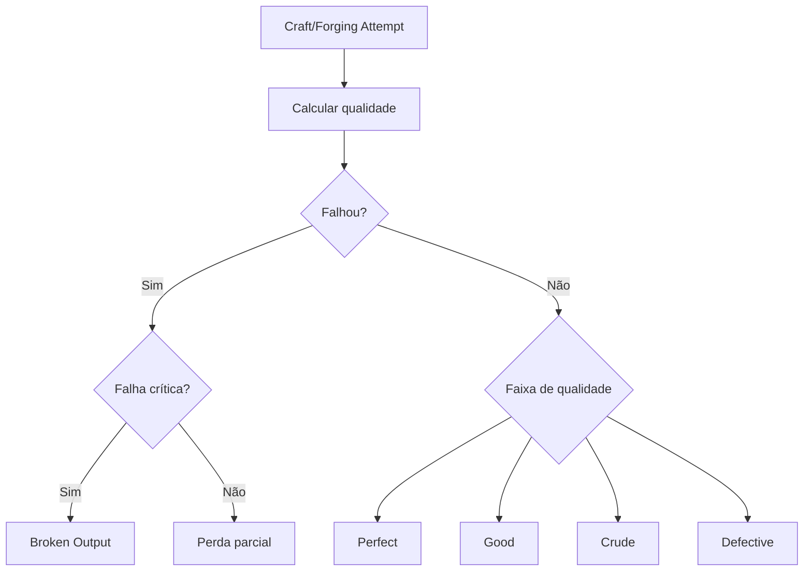

---

# 17. Coatings

## 17.1 Conceito

Coatings são revestimentos aplicados ao item.

Eles podem ser:

- temporários;
    
- semi-permanentes;
    
- permanentes;
    
- instáveis;
    
- removíveis;
    
- incompatíveis com certos materiais.
    

---

## 17.2 Tipos de coating

| Coating    | Efeito                      |
|------------|-----------------------------|
| Bleed      | sangramento                 |
| Poison     | veneno                      |
| Burn       | queimadura                  |
| Frost      | slow                        |
| Acid       | armor shred                 |
| Arcane     | dano mágico/instabilidade   |
| Holy       | anti-corruption             |
| Conductive | amplifica Fulmen            |
| Silence    | reduz ruído                 |
| Impact Oil | aumenta stagger             |
| Anti-Rust  | preserva durabilidade       |
| Beast Lure | atrai criaturas específicas |

---

## 17.3 Chance de proc

# $$  
P_{proc}

B_{coating}  
\cdot  
Q_{coating}  
\cdot  
Compatibility  
\cdot  
ConditionModifier  
$$

---

## 17.4 Duração do coating

# $$  
Duration_{coating}

BaseDuration  
\cdot  
Q_{coating}  
\cdot  
BindingStability  
$$

---

# 18. Reparos

## 18.1 Conceito

Itens se desgastam.

Reparo é parte de:

- preparação;
    
- economia;
    
- risco;
    
- manutenção de build;
    
- progressão da loja.
    

---

## 18.2 Tipos de reparo

| Tipo          | Local          | Efeito                      |
|---------------|----------------|-----------------------------|
| Field Repair  | dungeon        | rápido, limitado            |
| Hub Repair    | Hub            | seguro e completo           |
| Shop Repair   | loja           | serviço comercial           |
| Divine Repair | altar          | remove corrupção            |
| Arcane Repair | bancada arcana | restaura propriedade mágica |

---

## 18.3 Fórmula de reparo

# $$  
RepairAmount

M_{repairMaterial}  
\cdot  
S_{repair}  
\cdot  
B_{station}  
$$

# $$  
Durability_{new}

min(Durability_{current} + RepairAmount, Durability_{max})  
$$

Reparo ruim:

# $$  
DurabilityMax_{new}

## DurabilityMax_{old}

P_{badRepair}  
$$

---

# 19. Upgrades

## 19.1 Tipos de upgrade

| Upgrade           | Efeito                       |
|-------------------|------------------------------|
| Reinforced        | mais durabilidade            |
| Lightweight       | menos peso                   |
| Silent            | menos ruído                  |
| Sharp             | mais dano cortante           |
| Balanced          | melhor controle              |
| Insulated         | resistência térmica          |
| Anchored          | melhora corda e estabilidade |
| Conductive        | canalização elétrica         |
| Arcane Slot       | aceita efeito mágico         |
| Holy Seal         | anti-corruption              |
| Monster-Bone Core | trait orgânico               |
| Shock Absorber    | reduz stagger recebido       |

---

## 19.2 Fórmula de sucesso

# $$  
UpgradeSuccess

## S_{crafting}  
+  
K_{recipe}  
+  
B_{station}  
+  
Q_{item}

D_{upgrade}  
$$

Se:

$$  
UpgradeSuccess < T_{success}  
$$

o upgrade falha, degrada ou consome material sem aplicar efeito.

---

# 20. Ruído e Vulnerabilidade

## 20.1 Crafting na dungeon

Crafting na dungeon gera:

- som;
    
- luz;
    
- cheiro;
    
- tempo parado;
    
- inventário aberto;
    
- atenção reduzida;
    
- chance de interrupção.
    

# $$  
Risk_{craft}

T_{craft}  
\cdot  
NoiseLevel  
\cdot  
ExposureScore  
\cdot  
DangerLevel  
$$

---

## 20.2 Ações e ruído

| Ação                    |       Noise |
|-------------------------|------------:|
| costura/couro           |       baixo |
| repair kit              | baixo/médio |
| montagem de rope kit    |       baixo |
| martelar metal          |        alto |
| fundir liga             |       médio |
| explosivo artesanal     |     extremo |
| coating arcano instável | alto/mágico |
| field repair em metal   |       médio |

---

# 21. Integração com Mining

Mining fornece:

- minério;
    
- cristais;
    
- flux;
    
- catalisadores;
    
- enxofre;
    
- sal;
    
- pedra rara;
    
- fósseis;
    
- materiais abissais.
    

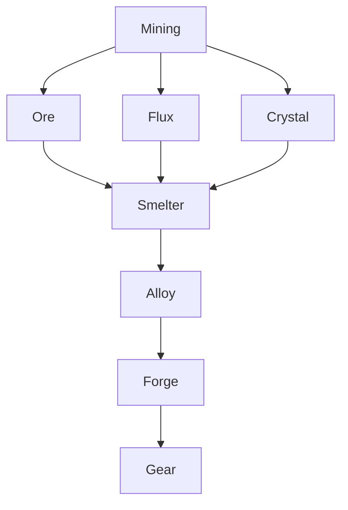

---

# 22. Integração com Bestiário

Bestiário fornece:

- couro;
    
- ossos;
    
- escamas;
    
- glândulas;
    
- sangue;
    
- seda;
    
- carapaças;
    
- olhos;
    
- órgãos especiais.
    

| Conhecimento        | Uso               |
|---------------------|-------------------|
| anatomia conhecida  | melhor harvesting |
| carapaça resistente | armadura          |
| osso flexível       | cabo              |
| glândula tóxica     | poison coating    |
| escama de drake     | burn resistance   |
| couro de besta      | grip              |
| olho arcano         | lente/foco        |
| sangue corrompido   | coating arriscado |

---

# 23. Integração com Cooking

Cooking e Crafting/Forging compartilham alguns materiais, mas não têm a mesma finalidade.

| Material      | Cooking          | Crafting/Forging    |
|---------------|------------------|---------------------|
| sal mineral   | preservação      | catalisador leve    |
| enxofre       | receita perigosa | fire coating        |
| gordura/sebo  | alimento         | absorção de impacto |
| sangue        | receita ritual   | blood coating       |
| osso          | caldo            | componente          |
| cristal em pó | prato arcano     | arcane coating      |

---

# 24. Integração com Economia

Crafting e Forja transformam valor.

# $$  
ExpectedProfit

## V_{crafted}

## V_{materials}

## C_{station}

## C_{tools}

C_{failureRisk}  
$$

Anti-exploit:

$$  
V_{crafted}  
\le  
(V_{materials} + V_{labor})  
\cdot  
M_{profitCap}  
$$

Recomendação inicial:

$$  
M_{profitCap} = 1.5  
$$

Exceções só devem ocorrer com:

- contrato específico;
    
- material raro;
    
- falha relevante;
    
- demanda limitada;
    
- estação avançada;
    
- recipe mastery;
    
- custo operacional.
    

---

# 25. Integração com Notes

Notes registram:

- receita descoberta;
    
- combinação ruim;
    
- temperatura ideal;
    
- coating compatível;
    
- liga instável;
    
- comprador ideal;
    
- material raro;
    
- falha crítica.
    

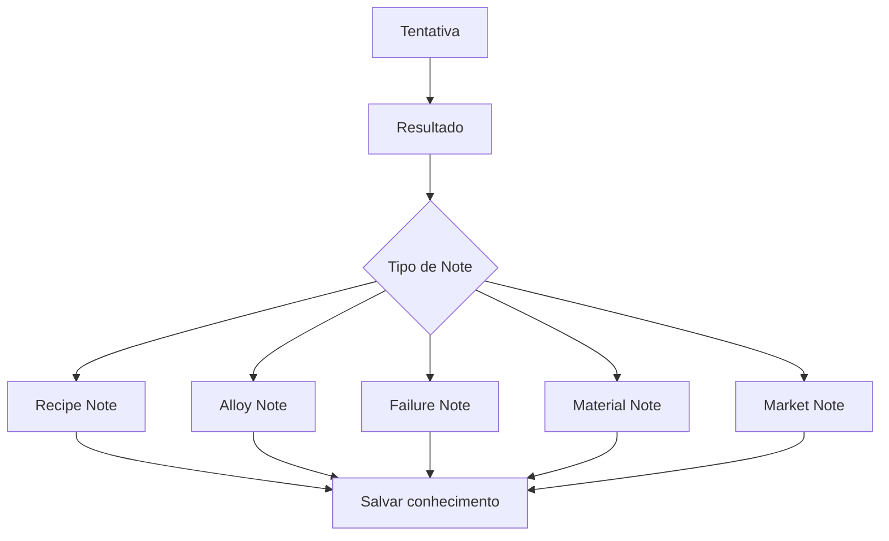

---

# 26. Integração com Dungeon

Crafting gera utilitários de dungeon.

| Item             | Função                        |
|------------------|-------------------------------|
| Rope Kit         | descer pelo Fall Origin Point |
| Anchor Kit       | reforçar ponto de corda       |
| Marker Kit       | marcar rota                   |
| Silent Wedge     | mineração silenciosa          |
| Reinforced Piton | escalada/ancoragem            |
| Repair Kit       | reparo em campo               |
| Trap Kit         | controle de área              |
| Camp Kit         | crafting limitado             |
| Dust Chalk       | marca temporária              |
| Arcane Marker    | marca luminosa com risco      |

Regra inviolável:

$$  
CraftedUtility \not\Rightarrow BossGateBypass  
$$

Um item craftado pode facilitar exploração, mas não pode ignorar:

- boss gate;
    
- camada selada;
    
- anti-bypass de corda;
    
- validação de queda;
    
- host budget;
    
- constraints de dungeon.
    

---

# 27. Deuses e Modificadores Divinos

Deuses podem alterar crafting e forja, mas sempre dentro do sistema unificado de efeitos.

| Deus         | Possível influência                           |
|--------------|-----------------------------------------------|
| Terra        | durabilidade, estabilidade de liga, mineração |
| Destruição   | dano, bleed, burn, risco de quebra            |
| Vida         | reparo, purificação, anti-corruption          |
| Sacrifício   | bypass de requisito com custo permanente      |
| Comércio     | valor de venda, contratos                     |
| Conhecimento | identificação de material, menos falha        |

God Modifier entra como multiplicador no cálculo final:

# $$  
FinalEffect

BaseEffect  
\cdot  
(1 + \sum AdditiveModifiers)  
\cdot  
\prod MultiplicativeModifiers  
\cdot  
GodModifier  
\cdot  
ConditionModifier  
$$

---

# 28. Corpse System

Itens físicos podem ser perdidos.

Conhecimento confirmado não.

| Dado                 |                Vai para corpse? |
|----------------------|--------------------------------:|
| materiais da run     |                             Sim |
| componentes da run   |                             Sim |
| item craftado na run |                             Sim |
| arma equipada        | depende da regra de equipamento |
| ferramenta da run    |                             Sim |
| receita conhecida    |                             Não |
| alloy mastery        |                             Não |
| note não confirmada  |                             Sim |
| recipe mastery       |                             Não |

$$  
RunCraftedItems \subseteq CorpseLoot  
$$

$$  
KnownRecipes \not\subseteq CorpseLoot  
$$

---

# 29. Persistência

## 29.1 Domínios

| Dado                        | Domínio         | Duração            |
|-----------------------------|-----------------|--------------------|
| materiais na mochila da run | RunDomain       | até extração/morte |
| item craftado na run        | RunDomain       | até extração/morte |
| item guardado na loja       | ShopDomain      | permanente         |
| receitas conhecidas         | MetaDomain      | permanente         |
| recipe mastery              | MetaDomain      | permanente         |
| alloy knowledge             | MetaDomain      | permanente         |
| station unlocks             | Shop/MetaDomain | permanente         |
| tool durability             | Inventory/Run   | variável           |
| crafting notes              | Run/World/Meta  | conforme validação |
| contratos de item           | ShopDomain      | até conclusão      |

---

## 29.2 Fórmula de save

# $$  
CraftingSave

KnownRecipes  
+  
MasteredRecipes  
+  
AlloyKnowledge  
+  
StationUnlocks  
+  
CraftedItems  
+  
ToolStates  
+  
CraftingNotes  
$$

Separação crítica:

$$  
RunMaterials \neq MetaKnowledge  
$$

A morte pode remover materiais, mas não apaga conhecimento técnico validado.

---

# 30. Multiplayer

## 30.1 Server authority

Em multiplayer, o servidor valida:

- posse dos materiais;
    
- estação usada;
    
- ferramentas;
    
- receita;
    
- blueprint;
    
- tempo;
    
- temperatura;
    
- processo;
    
- qualidade;
    
- falha;
    
- consumo de materiais;
    
- criação do item;
    
- propriedades da liga;
    
- effects aplicados;
    
- transferência de propriedade.
    

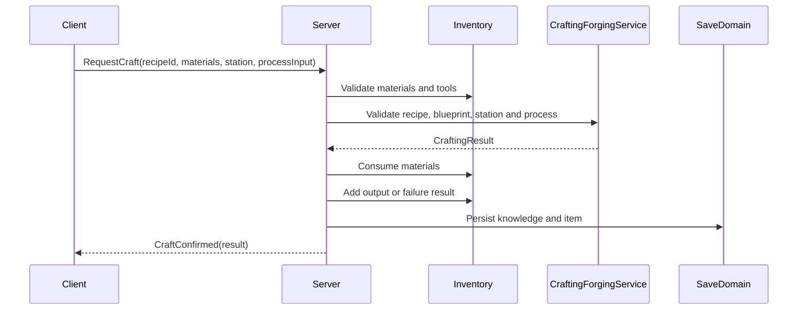

---

## 30.2 Party crafting

| Modelo             | Regra                                 |
|--------------------|---------------------------------------|
| Personal Crafting  | player usa próprios materiais         |
| Party Crafting     | usa stash compartilhado com permissão |
| Assisted Forging   | outros ajudam e reduzem tempo         |
| Specialist Forging | especialista melhora qualidade        |
| Shop Crafting      | vinculado à loja da party             |

Fórmula de assistência:

# $$  
S_{partyCrafting}

S_{main}  
+  
\sum_{i=1}^{n} A_i  
$$

Com cap:

$$  
S_{partyCrafting}  
\le  
S_{main}  
\cdot  
1.5  
$$

---

# 31. VR / Flatscreen Parity

## 31.1 Princípio

VR e Flatscreen devem produzir o mesmo teto de qualidade.

$$  
Q_{max}^{VR} = Q_{max}^{Flat}  
$$

$$  
MaterialCost_{VR} = MaterialCost_{Flat}  
$$

$$  
T_{forge}^{VR} \approx T_{forge}^{Flat}  
$$

$$  
Risk_{forge}^{VR} \approx Risk_{forge}^{Flat}  
$$

---

## 31.2 VR

Ações:

- segurar martelo;
    
- posicionar metal;
    
- aquecer peça;
    
- observar cor/temperatura;
    
- martelar em ritmo;
    
- resfriar no banho;
    
- aplicar coating;
    
- encaixar binding;
    
- ajustar cabo;
    
- polir lâmina.
    

---

## 31.3 Flatscreen

Ações equivalentes:

- slider de temperatura;
    
- timing de martelo;
    
- hold de pressão;
    
- minigame de encaixe;
    
- controle de resfriamento;
    
- seleção de coating;
    
- janela de precisão;
    
- animação sem pausa.
    

---

# 32. Modelo de Dados

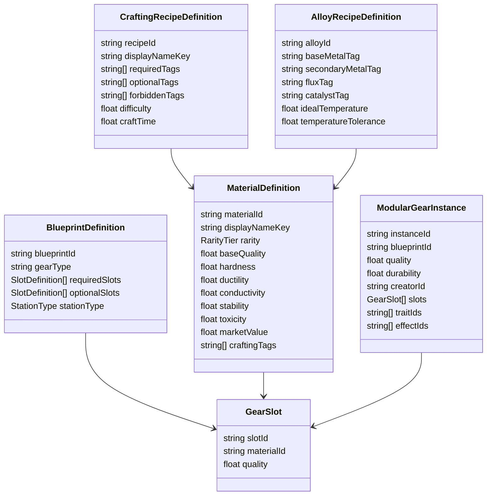

---

# 33. Estrutura de Scripts Recomendada

| Pasta                  | Arquivos                                                                                                                       |
|------------------------|--------------------------------------------------------------------------------------------------------------------------------|
| `Crafting/Core`        | `MaterialDefinition.cs`, `CraftingTag.cs`, `CraftingResult.cs`, `CraftedItemInstance.cs`                                       |
| `Crafting/Blueprints`  | `BlueprintDefinition.cs`, `SlotDefinition.cs`, `BlueprintMatcher.cs`                                                           |
| `Crafting/Recipes`     | `CraftingRecipeDefinition.cs`, `RecipeMatcher.cs`, `RecipeKnowledgeState.cs`                                                   |
| `Crafting/Forging`     | `AlloyRecipeDefinition.cs`, `AlloyForgeService.cs`, `TemperatureController.cs`, `FluxResolver.cs`                              |
| `Crafting/Gear`        | `ModularGearInstance.cs`, `GearSlot.cs`, `GearAssembler.cs`, `GearStatResolver.cs`                                             |
| `Crafting/Traits`      | `TraitDefinition.cs`, `TraitResolver.cs`, `MaterialTraitTable.cs`                                                              |
| `Crafting/Coatings`    | `CoatingDefinition.cs`, `CoatingApplicationService.cs`, `CoatingEffectResolver.cs`                                             |
| `Crafting/Stations`    | `CraftingStation.cs`, `ForgeStation.cs`, `SmelterStation.cs`, `RepairStation.cs`, `ArcaneBenchStation.cs`                      |
| `Crafting/Quality`     | `CraftingQualityCalculator.cs`, `AlloyQualityCalculator.cs`, `GearQualityCalculator.cs`                                        |
| `Crafting/Failure`     | `CraftingFailureResolver.cs`, `ForgeFailureResolver.cs`, `DefectGenerator.cs`                                                  |
| `Crafting/Effects`     | `UnifiedEffectFactory.cs`, `EquipmentEffectBridge.cs`, `StatusEffectBridge.cs`                                                 |
| `Crafting/Repair`      | `RepairService.cs`, `DurabilityService.cs`, `RepairCostCalculator.cs`                                                          |
| `Crafting/Upgrade`     | `UpgradeDefinition.cs`, `UpgradeService.cs`, `UpgradeSuccessCalculator.cs`                                                     |
| `Crafting/Notes`       | `CraftingNoteBridge.cs`, `AlloyNoteGenerator.cs`, `FailureNoteGenerator.cs`                                                    |
| `Crafting/Economy`     | `CraftedItemValueCalculator.cs`, `CraftingContractBridge.cs`                                                                   |
| `Crafting/Networking`  | `ServerCraftingService.cs`, `CraftingRpcController.cs`, `CraftingVisibilityResolver.cs`                                        |
| `Crafting/Persistence` | `CraftingSaveData.cs`, `CraftedItemSave.cs`, `RecipeKnowledgeSave.cs`, `AlloyKnowledgeSave.cs`                                 |
| `Crafting/UI`          | `ForgeView.cs`, `WorkbenchView.cs`, `BlueprintView.cs`, `RecipeBookView.cs`, `MaterialInspectView.cs`, `CraftingResultView.cs` |

---

# 34. Pipeline Técnico

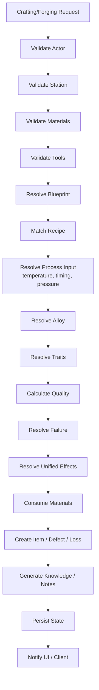

---

# 35. Validação

## 35.1 Constraints obrigatórias

| Constraint                           | Regra                                         |
|--------------------------------------|-----------------------------------------------|
| `materials_exist_in_inventory`       | não fabricar sem material                     |
| `materials_have_traceable_origin`    | material precisa origem                       |
| `blueprint_exists`                   | gear precisa blueprint                        |
| `station_supports_recipe`            | estação correta                               |
| `tools_are_valid`                    | ferramenta correta                            |
| `recipe_match_is_valid`              | tags e slots batem                            |
| `alloy_temperature_resolved`         | liga precisa temperatura                      |
| `quality_calculated`                 | qualidade sempre calculada                    |
| `failure_possible_when_unknown`      | receita desconhecida pode falhar              |
| `materials_consumed`                 | material é gasto                              |
| `crafted_item_has_origin`            | item rastreia materiais                       |
| `traits_are_resolved_from_materials` | trait vem do material/slot/processo           |
| `effects_use_unified_system`         | coating/equipamento não cria sistema paralelo |
| `economy_anti_exploit_validated`     | sem lucro infinito                            |
| `server_authoritative_result`        | client não decide                             |
| `corpse_rules_respected`             | item físico pode ser perdido                  |
| `boss_gate_not_bypassed`             | utilitário não ignora progressão              |
| `cross_input_parity_validated`       | VR e Flat têm custo equivalente               |

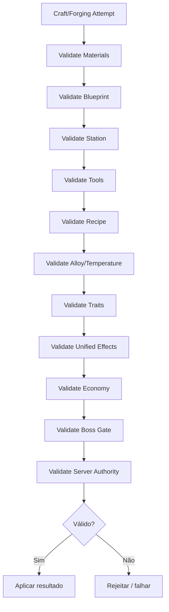

---

# 36. MVP Roadmap

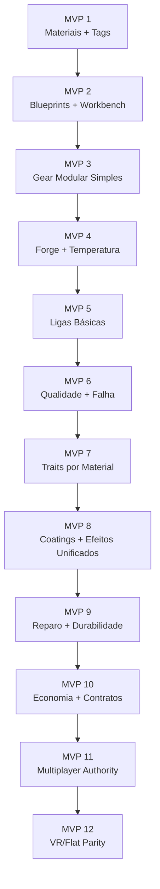

## 36.1 Escopo por MVP

| MVP    | Entrega                                          |
|--------|--------------------------------------------------|
| MVP 1  | materiais com tags, raridade, qualidade e origem |
| MVP 2  | blueprints e bancada básica                      |
| MVP 3  | uma arma modular simples com slots               |
| MVP 4  | forja com controle de temperatura                |
| MVP 5  | liga simples com metal + flux                    |
| MVP 6  | cálculo de qualidade e falha                     |
| MVP 7  | traits derivados de materiais                    |
| MVP 8  | coatings usando sistema unificado de efeitos     |
| MVP 9  | reparo, durabilidade e defeitos                  |
| MVP 10 | valor econômico e contratos                      |
| MVP 11 | servidor valida crafting/forja                   |
| MVP 12 | interação VR/Flatscreen equivalente              |

---

# 37. Non-Goals

Não implementar no primeiro ciclo:

- fábrica industrial;
    
- crafting automático infinito;
    
- economia passiva via produção;
    
- centenas de receitas;
    
- simulação metalúrgica realista completa;
    
- física completa de todos os objetos;
    
- item editor ilimitado;
    
- blueprint marketplace;
    
- upgrades infinitos;
    
- reparo gratuito;
    
- item que burla boss gate;
    
- coating com sistema de status próprio;
    
- client decidindo resultado;
    
- Flatscreen mais rápido que VR;
    
- VR com qualidade máxima maior por padrão;
    
- traits impossíveis de auditar;
    
- gear sem origem rastreável.
    

---

# 38. Critérios de Aceite

O sistema está aceitável quando:

- Crafting e Forja estão no mesmo domínio sistêmico.
    
- Forja é especialização de Crafting, não sistema paralelo.
    
- Todo item fabricado consome material real.
    
- Materiais têm origem rastreável.
    
- Blueprints definem o tipo do gear.
    
- Slots definem as partes necessárias.
    
- Materiais e slots geram stats e traits.
    
- Ligas usam metal base, metal secundário, flux, temperatura e catalisador.
    
- Armas podem ser montadas com blade/head, handle, binding e coating.
    
- Temperatura afeta dano, durabilidade e risco de quebra.
    
- Qualidade final considera material, skill, estação, ferramenta, blueprint e processo.
    
- Falha é possível em receitas difíceis ou desconhecidas.
    
- Coatings usam o sistema unificado de efeitos.
    
- Reparos consomem materiais.
    
- Upgrades têm custo, risco e limite.
    
- Crafting pode gerar notes.
    
- Crafting alimenta economia sem gerar lucro infinito.
    
- Itens físicos podem ir para corpse.
    
- Receitas conhecidas e alloy mastery persistem como meta progressão.
    
- Multiplayer é server-authoritative.
    
- VR e Flatscreen têm tempo, custo, risco e qualidade máxima equivalentes.
    
- Itens utilitários não burlam boss gate.
    

---

# 39. Definição Final para o GDD Principal

## Crafting & Forging System

O Crafting & Forging System é o sistema que transforma recursos reais obtidos na dungeon em ferramentas, armas, armaduras, kits, upgrades, coatings, componentes e infraestrutura. Ele usa Tinkers’ Construct como referência para modularidade de ferramentas e modificação pós-criação, Silent Gear como referência para blueprints, materiais, partes e traits data-driven, e Kingdom Come como referência para processo físico de forja, execução manual, temperatura e prestígio artesanal.

Forja não é um sistema separado: ela é a especialização metálica e química do Crafting. A forja cobre ligas, temperatura, flux, catalisadores, têmpera, martelada, coatings e montagem modular de armas. Gear é criado a partir de blueprints e slots. Cada slot recebe material e contribui com stats, traits, qualidade, peso, durabilidade e efeitos.

Todo item fabricado exige materiais rastreáveis. Minérios vêm de Mining; couros, ossos, escamas e glândulas vêm de Harvesting e Bestiário; cristais e catalisadores vêm de exploração; relíquias vêm de ruínas. Nenhum item pode ser criado do vazio.

A qualidade final depende de materiais, skill, conhecimento da receita, estação, ferramenta, temperatura e processo. Falhas podem gerar perda parcial, item defeituoso, quebra, backlash arcano, coating instável ou material destruído. Receitas começam desconhecidas e podem evoluir para Hypothesis, Partial, Known, Improved e Mastered.

Coatings aplicam efeitos como Bleed, Poison, Burn, Arcane, Holy, Frost, Acid, Conductive ou Silence, mas não criam lógica paralela. Todos os efeitos de armas, armaduras, coatings, ligas, magia, mutações e deuses usam o sistema unificado de efeitos.

Crafting também cobre Rope Kits, Anchor Kits, Marker Kits, Repair Kits, Trap Kits, Camp Kits e ferramentas utilitárias. Esses itens facilitam exploração, mas nunca podem burlar boss gates, camadas seladas, regras de queda, regras de corda ou validações de progressão.

No Hub, crafting é seguro e eficiente. Na dungeon, crafting é limitado, barulhento, demorado e vulnerável. Em VR, o processo deve ser físico e diegético. Em Flatscreen, deve ser abstraído por sliders, timing, hold actions e minigames, mantendo tempo, risco, custo e qualidade máxima equivalentes.

No multiplayer, o servidor valida materiais, blueprints, estações, ferramentas, temperatura, qualidade, falha, consumo de recursos e criação do item. Clients apenas solicitam e exibem resultados confirmados. Itens físicos podem ser perdidos no corpse, mas receitas conhecidas, alloy mastery e conhecimento técnico confirmado persistem como meta progressão.

---

# 40. Resumo Final

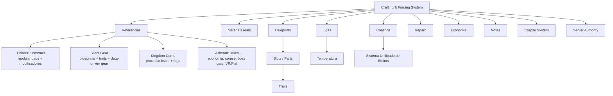

**Regra final:**  
**Crafting & Forging é risco materializado em gear.** O jogador explora, coleta, aprende, experimenta, erra, forja, repara e evolui equipamentos que carregam a história da sua run, dos seus materiais e do seu domínio técnico.