# Economia Fechada, Loja, Mercado, NPCs e Progressão Mercantil

> **Projeto:** Dungeon Explorer: Ashvault  
> **Documento:** GDD específico de Economia  
> **Escopo:** economia fechada, venda, compra, loja do jogador, NPCs comerciantes, NPCs exploradores, oferta/demanda, saturação, inflação, sinks, persistência, multiplayer, notes econômicas e integração com dungeon/crafting/cooking/bestiário.  
> **Fora de escopo:** GDD completo de Cooking, Bestiário e Notes. Esses sistemas se conectam com economia, mas devem ter documentos próprios.
> **`fase_permitida`:** MVP para venda, loja T1, demanda simples, contracts e sinks básicos; NPC Explorer em Alpha ou posterior.

---

# 1. High Concept

O **Economy System** é o sistema que transforma risco de exploração em capital, infraestrutura e poder operacional.

A economia de Ashvault não deve ser uma economia passiva. O dinheiro não nasce de idle income, daily reward ou geração automática. Ele nasce de um ciclo claro:

**entrar na dungeon → assumir risco → coletar recurso → retornar vivo → converter em valor.**

O GDD mestre define que o projeto combina exploração de dungeon vertical, coleta de recursos por mineração e harvesting, economia de loja e transição orgânica do jogador de **Explorador** para **Mercador**. Também estabelece a economia fechada como pilar: tudo que entra na economia precisa ter vindo de alguém que assumiu risco na dungeon.

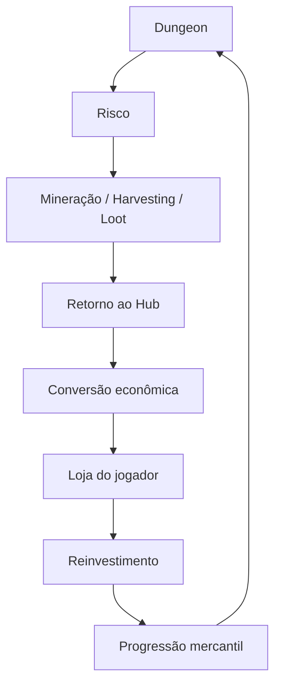

---

# 2. Regra Econômica Fundamental

A regra inviolável:

$$  
CapitalGenerated \Rightarrow DungeonRisk > 0  
$$

Ou seja:

$$  
Money \neq PassiveGeneration  
$$

A economia só pode receber valor por meio de:

- mineração;
    
- harvesting;
    
- loot de inimigos;
    
- recuperação de corpse;
    
- exploração de salas;
    
- venda de recursos extraídos;
    
- crafting/forja usando recursos extraídos;
    
- NPC explorador com risco, custo e chance de falha, apenas em Alpha ou posterior;
    
- contratos abastecidos por recursos reais.
    

A economia **não** pode receber valor por meio de:

- reward diário sem risco;
    
- geração passiva infinita;
    
- NPC que gera recurso sem limite;
    
- idle farm;
    
- loja que cria estoque do vazio;
    
- crafting que duplica valor sem custo;
    
- exploit de compra/venda;
    
- mercado sem saturação.
    

O GDD mestre é explícito: dinheiro só provém do risco na dungeon; artesão e loja convertem/comercializam, mas não geram capital do vazio.

---

# 3. Objetivos de Design

## 3.1 Objetivo principal

Criar uma economia em que o jogador sinta que cada moeda representa risco real.

A economia deve:

- valorizar exploração;
    
- incentivar retorno seguro;
    
- tornar morte um risco econômico;
    
- transformar conhecimento em vantagem comercial;
    
- permitir evolução de loja;
    
- permitir contratação de NPCs;
    
- criar escassez e saturação;
    
- evitar inflação descontrolada;
    
- conectar dungeon, crafting, notes, bestiário e cooking.
    

---

## 3.2 Fantasia do jogador

O jogador começa como explorador pobre e vulnerável.

Com o tempo, ele pode virar:

- minerador especializado;
    
- caçador de partes raras;
    
- cozinheiro/comerciante de alimentos;
    
- ferreiro/forjador;
    
- dono de loja;
    
- contratante de NPCs;
    
- operador de supply chain;
    
- mercador influente no Hub.
    

O GDD mestre já descreve esse loop híbrido: o jogador transita naturalmente de **Explorador** para **Mercador** conforme acumula capital e conhecimento.

---

# 4. Core Loop Econômico

## 4.1 Loop principal — Explorar para vender

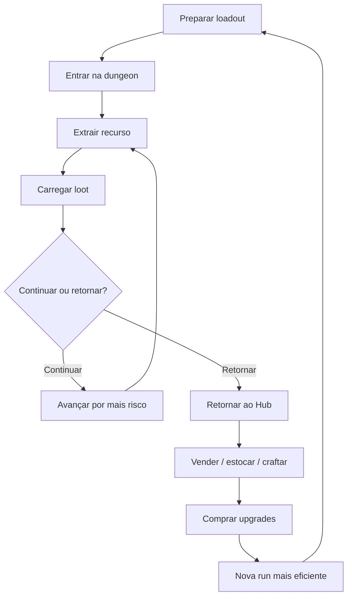

## 4.2 Loop secundário — Loja do jogador

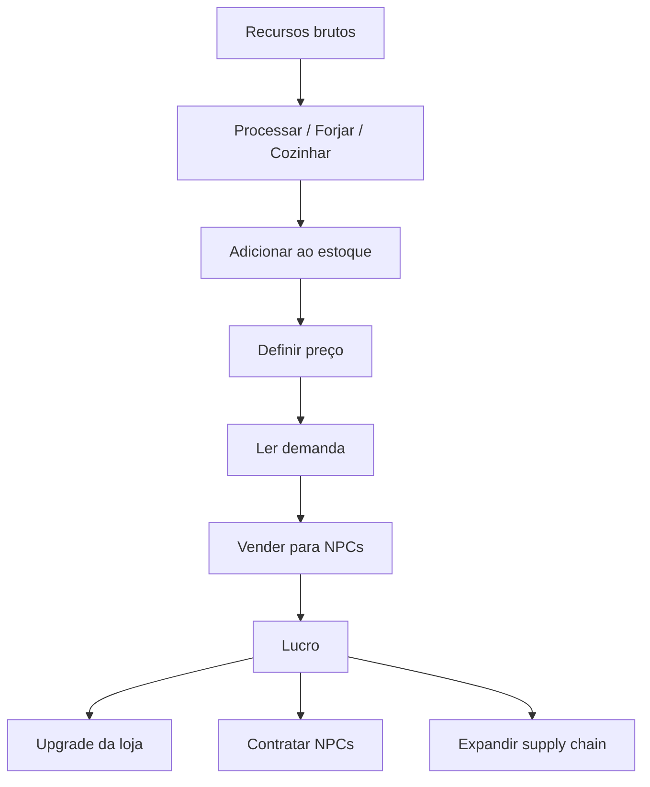

## 4.3 Loop terciário — NPC Explorador

Este loop é Alpha ou posterior. Ele não faz parte do trilho crítico do MVP.

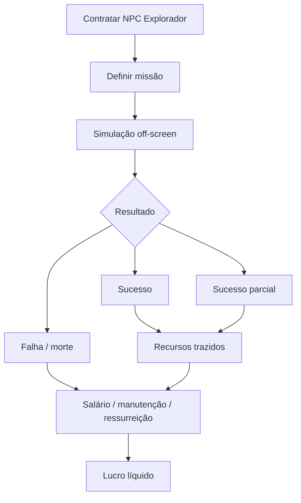

O GDD mestre define que NPC Explorador é automação parcial e não substitui o gameplay ativo; `player_yield_rate > npc_yield_rate` precisa ser verdadeiro em qualquer circunstância.

---

# 5. Fontes de Valor

## 5.1 Fontes válidas

|Fonte|Entra na economia? |Condição|
|---|--:|---|
|Mineração|Sim |precisa de ferramenta, tempo, ruído e risco|
|Harvesting|Sim |exige criatura morta e minijogo vulnerável|
|Loot de inimigo|Sim |exige combate ou stealth|
|Recurso em sala perigosa|Sim |exige exploração|
|Corpse recuperado|Sim |risco de retorno ao ponto de morte|
|Crafting/forja|Sim |converte recursos existentes|
|Cooking vendável|Sim |converte ingredientes reais|
|NPC Explorador|Sim, Alpha+ |precisa custo, risco e chance de falha|
|Contrato comercial|Sim |exige estoque real|
|Compra e revenda|Sim |apenas se houver spread controlado e risco de mercado|

## 5.2 Fontes proibidas

| Fonte                            | Motivo                      |
|----------------------------------|-----------------------------|
| Daily reward em moedas           | gera capital sem risco      |
| Idle income infinito             | quebra economia fechada     |
| NPC que coleta sem custo         | substitui gameplay          |
| Loja com estoque infinito barato | destrói escassez            |
| Crafting com lucro garantido     | vira exploit                |
| Compra/venda sem spread          | permite arbitragem infinita |
| Recurso duplicável               | quebra supply/demand        |

---

# 6. Fórmulas de Valor

## 6.1 Valor base do recurso

A base matemática do GDD mestre define o valor como multiplicação de valor base, raridade, demanda e condição.

$$  
V_{resource} = V_{base} \cdot R_{rarity} \cdot D_{demand} \cdot C_{condition}  
$$

|Termo|Descrição|
|---|---|
|$V_{resource}$|valor final do recurso|
|$V_{base}$|valor base do item|
|$R_{rarity}$|multiplicador de raridade|
|$D_{demand}$|modificador de demanda|
|$C_{condition}$|condição/qualidade do item|

## 6.2 Raridade

|Raridade|Multiplicador inicial |
|---|--:|
|Common|$1.0$ |
|Uncommon|$2.5$ |
|Rare|$7.0$ |
|Epic|$20.0$ |
|Legendary|$60.0$ |

## 6.3 Qualidade por extração

Para recursos de mining:

$$  
Q_{mining} = Q_{base} + S_{tool} + S_{skill} - P_{damage} - P_{noise}  
$$

Para harvesting:

$$  
Q_{harvest} = Q_{base} + S_{precision} - P_{damage} - P_{time}  
$$

O GDD mestre já define que harvesting calcula qualidade por `base_quality + skill_precision - damage_penalty - time_penalty`, e que matar com explosão/AoE deve degradar condição do loot.

---

# 7. Oferta, Demanda e Saturação

## 7.1 Demanda semanal

A demanda muda por semana, estoque e comportamento dos players.

$$  
D_{demand} =  
\begin{cases}  
0.70, & Supply_{7d} > Demand_{7d} \cdot 1.5 \  
1.40, & Supply_{7d} < Demand_{7d} \cdot 0.5 \  
1.00, & \text{caso contrário}  
\end{cases}  
$$

|Estado|Condição|Efeito |
|---|---|--:|
|Saturado|oferta muito maior que demanda|preço cai |
|Escasso|oferta muito menor que demanda|preço sobe |
|Equilibrado|oferta próxima da demanda|preço normal |

## 7.2 Saturação por item

$$  
Saturation_i = \frac{Supply_i}{Demand_i}  
$$

Se:

$$  
Saturation_i > 1.5  
$$

então o item está saturado.

Se:

$$  
Saturation_i < 0.5  
$$

então o item está escasso.

## 7.3 Variação semanal por seed

A weekly seed pode gerar tendência de mercado:

$$  
WeeklyMarketBias_i = Hash(weeklySeed, itemId) \cdot W_{market}  
$$

Demanda final:

$$  
D_{final} = D_{demand} + WeeklyMarketBias_i - SaturationPenalty_i  
$$

---

# 8. Preço de Venda

## 8.1 Fórmula base

O GDD mestre define preço de venda como valor do item multiplicado por tier da loja e modificador de negociação.

$$  
P_{sell} = V_{resource} \cdot M_{shopTier} \cdot M_{negotiation}  
$$

## 8.2 Multiplicador da loja

|Tier|Multiplicador |
|---|--:|
|T1|$1.00$ |
|T2|$1.05$ |
|T3|$1.12$ |
|T4|$1.20$ |
|T5|$1.30$ |

## 8.3 Negociação

$$  
M_{negotiation} = 1 + (CHA \cdot 0.02) + B_{tradeSkill} + B_{godCommerce}  
$$

|Termo|Descrição|
|---|---|
|$CHA$|atributo social|
|$B_{tradeSkill}$|bônus de skill Trade|
|$B_{godCommerce}$|bônus de deuses ligados a comércio|

---

# 9. Compra, Revenda e Anti-Arbitragem

## 9.1 Problema

Se o jogador puder comprar barato e vender caro sem risco, a economia quebra.

## 9.2 Regra

Todo item comprado de NPC deve ter preço de compra maior que preço de venda esperado.

$$  
P_{buy} > P_{sellExpected}  
$$

Spread mínimo:

$$  
Spread = P_{buy} - P_{sellExpected}  
$$

Com:

$$  
Spread \ge Spread_{min}  
$$

Recomendação inicial:

$$  
Spread_{min} = 0.15 \cdot P_{buy}  
$$

## 9.3 Exceções permitidas

Lucro por comércio só deve existir quando houver:

- conhecimento de mercado;
    
- tempo;
    
- risco de estoque;
    
- demanda semanal;
    
- contrato específico;
    
- reputação;
    
- perecibilidade;
    
- transporte;
    
- escassez real.
    

---

# 10. Loja do Jogador

## 10.1 Função

A loja é a interface de transformação do jogador de explorador para mercador.

Ela permite:

- vender recursos;
    
- estocar itens;
    
- definir preços;
    
- aceitar contratos;
    
- contratar NPCs;
    
- melhorar infraestrutura;
    
- processar bens;
    
- influenciar mercado local.
    

## 10.2 Tiers da loja

O GDD mestre já define o Hub como espaço físico que escala visualmente com sucesso do jogador, incluindo tiers funcionais de T0 a T5.

|Tier|Estado|Desbloqueios|
|---|---|---|
|T0|albergue/começo|venda básica para NPC|
|T1|estabelecimento simples|balcão de venda|
|T2|loja funcional|artesão, estoque maior, 2 NPCs|
|T3|centro de operações|altar, supply chains simples, 3 NPCs|
|T4|complexo comercial|contratos, automação parcial|
|T5|santuário/quartel-general|influência de mercado e eventos globais|

## 10.3 Solvência da loja

A loja precisa conseguir pagar custos fixos.

$$  
Solvency = CashReserve - OperatingCosts_{7d}  
$$

Se:

$$  
Solvency < 0  
$$

então a loja entra em estado de risco.

Estados:

|Estado|Condição|Efeito|
|---|---|---|
|Saudável|reserva cobre custos|operação normal|
|Pressionada|reserva baixa|alertas e corte de custos|
|Insolvente|reserva negativa|NPCs saem, estoque é liquidado|
|Falência controlada|insolvência prolongada|downgrade parcial, não apaga meta total|

---

# 11. NPC Explorador

## 11.1 Função

O NPC Explorador é automação parcial de Alpha ou posterior, não substituição do jogador.

Ele deve:

- consumir dinheiro;
    
- ter risco;
    
- ter cooldown;
    
- poder falhar;
    
- trazer menos que jogador ativo;
    
- operar como multiplicador de capital, não como fonte infinita.
    

## 11.2 Fórmula de yield

$$  
YieldValue = \sum_{i=1}^{n}(Quantity_i \cdot Value_i)  
$$

## 11.3 Custos

$$  
Salary = BaseSalary \cdot (1 + SkillLevel \cdot 0.10)  
$$

$$  
TotalCost = Salary + Maintenance + FailureCost  
$$

## 11.4 Lucro do NPC

O GDD mestre usa a lógica de `npc_profit = yield_value - (salary + maintenance + failure_cost)` e recomenda contratar apenas se lucro projetado for positivo.

$$  
NPCProfit = YieldValue - (Salary + Maintenance + FailureCost)  
$$

Regra:

$$  
NPCProfitProjected > 0  
$$

Mas com limitação:

$$  
NPCYieldRate < PlayerYieldRate  
$$

## 11.5 Resultado da missão

|Resultado|Efeito|
|---|---|
|Sucesso total|traz recursos|
|Sucesso parcial|traz menos recursos, pode gerar custo|
|Falha|não traz recursos|
|Morte|custo de ressurreição/recuperação|
|Desaparecido|evento futuro, missão de resgate|

---

# 12. Controle de Inflação

## 12.1 Problema

Se a economia só injeta dinheiro, o dinheiro perde valor.

## 12.2 Sinks primários

|Sink|Função|
|---|---|
|manutenção da loja|remove dinheiro recorrente|
|salário de NPC|remove dinheiro recorrente|
|ressurreição/recuperação de NPC|pune automação|
|upgrade de loja|remove dinheiro em marcos|
|compra de ferramentas|investimento|
|reparo de equipamento|custo de risco|
|aluguel/imposto do Hub|sink progressivo|
|contratos falhos|perda por má decisão|
|taxas de mercado|controle de venda|
|sacrifícios aos deuses|sink alternativo|

## 12.3 Fórmula de inflação

$$  
InflationPressure = \frac{CurrencyInjected_{7d}}{CurrencyRemoved_{7d}}  
$$

Se:

$$  
InflationPressure > 1.2  
$$

a economia está inflacionando.

Se:

$$  
InflationPressure < 0.8  
$$

a economia está apertada demais.

## 12.4 Ajustes automáticos

|Situação|Ajuste|
|---|---|
|inflação alta|aumentar sinks, reduzir demanda, aumentar manutenção|
|economia apertada|aumentar contratos, aumentar demanda, reduzir manutenção|
|saturação de item|reduzir preço|
|escassez extrema|aumentar preço e gerar rumores|
|NPCs lucrando demais|aumentar salário/manutenção/risco|

---

# 13. Economia e Notes

## 13.1 Função das Economy Notes

Notes econômicas transformam observação de mercado em vantagem.

Exemplos:

|Note|Uso|
|---|---|
|“Cristal está saturado”|segurar estoque|
|“Obsidiana está escassa”|explorar lava/áreas ígneas|
|“Ferreiro paga mais por metal antigo”|escolher comprador|
|“NPCs trouxeram excesso de osso”|evitar vender ossuário|
|“Contrato pede couro raro”|priorizar caça|

## 13.2 Fórmula de valor da informação econômica

$$  
I_{economyNote} = PriceDelta \cdot StockQuantity \cdot Confidence  
$$

Onde:

|Termo|Descrição|
|---|---|
|$PriceDelta$|diferença entre preço esperado e preço observado|
|$StockQuantity$|quantidade que o player possui|
|$Confidence$|confiança da note|

---

# 14. Economia e Bestiário

O Bestiário pode desbloquear valor comercial.

Exemplo:

|Conhecimento|Efeito econômico|
|---|---|
|anatomia conhecida|melhor harvesting|
|parte útil identificada|mais chance de item valioso|
|habitat conhecido|farm direcionado|
|valor comercial conhecido|preço estimado antes da venda|
|risco conhecido|menos perdas na run|

Fórmula:

$$  
Q_{loot} = Q_{base} + K_{anatomy} + S_{harvest} - P_{damage}  
$$

Valor final:

$$  
V_{part} = V_{base} \cdot Q_{loot} \cdot D_{market}  
$$

---

# 15. Economia e Cooking

Cooking cria itens vendáveis e consumíveis.

## 15.1 Decisão econômica

O jogador deve escolher:

- vender ingrediente cru;
    
- cozinhar e consumir;
    
- cozinhar e vender;
    
- guardar para contrato;
    
- usar em crafting/alquimia.
    

## 15.2 Fórmula de valor culinário

$$  
V_{food} = (V_{ingredients} \cdot M_{recipe}) \cdot Q_{recipe} \cdot D_{food}  
$$

Onde:

|Termo|Descrição|
|---|---|
|$V_{ingredients}$|soma do valor dos ingredientes|
|$M_{recipe}$|multiplicador da receita|
|$Q_{recipe}$|qualidade do preparo|
|$D_{food}$|demanda por comida/consumível|

## 15.3 Anti-exploit culinário

Para evitar lucro infinito:

$$  
V_{food} \le V_{ingredients} \cdot M_{maxProfit}  
$$

Recomendação:

$$  
M_{maxProfit} = 1.5  
$$

Receitas especiais podem exceder isso apenas se exigirem:

- ingrediente raro;
    
- risco alto;
    
- conhecimento;
    
- falha possível;
    
- tempo de preparo;
    
- demanda limitada.
    

---

# 16. Economia e Forja

A forja transforma recursos em armas, peças e ligas.

## 16.1 Valor de item forjado

$$  
V_{crafted} = (V_{materials} + V_{labor}) \cdot Q_{craft} \cdot D_{category}  
$$

Onde:

|Termo|Descrição|
|---|---|
|$V_{materials}$|valor dos materiais|
|$V_{labor}$|valor de trabalho/processamento|
|$Q_{craft}$|qualidade da forja|
|$D_{category}$|demanda por arma/ferramenta|

## 16.2 Anti-exploit de crafting

$$  
ExpectedProfit_{craft} = V_{crafted} - V_{materials} - Cost_{process}  
$$

Crafting só deve gerar lucro alto quando houver:

- risco de falha;
    
- skill;
    
- tempo;
    
- demanda;
    
- material raro;
    
- custo de processamento.
    

---

# 17. Economy Tick

## 17.1 Frequência

A economia não deve rodar por frame.

O GDD mestre indica um `ECONOMY TICK` a cada 60 segundos, processando runs off-screen de NPCs, atualizando demand modifier e verificando solvência da loja.

## 17.2 Pipeline do tick econômico

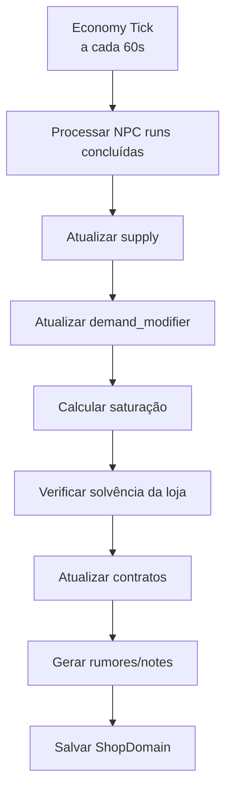

---

# 18. Persistência

O GDD mestre separa domínios de persistência: `Meta`, `Run`, `World`, `Shop` e `Settings`. O domínio `Shop` guarda stock, preços, contratos e NPCs contratados, com autosave a cada transação; essa separação evita que uma run corrompida destrua a loja rica do jogador.

## 18.1 Domínios

|Dado|Domínio|Duração|
|---|---|---|
|moedas do jogador|Meta/Shop|permanente|
|estoque da loja|Shop|permanente|
|preço semanal|World/Shop|weekly|
|recursos na mochila da run|Run|até extração/morte|
|itens no corpse|Run/World|até decay|
|NPCs contratados|Shop/Meta|permanente|
|contratos ativos|Shop|até conclusão/expiração|
|demanda/saturação|Shop/World|weekly|
|notes econômicas|Shop/World|weekly/meta parcial|
|histórico de venda|Shop|persistente ou rolling window|

## 18.2 Fórmula de save

$$  
EconomySave = Wallet + ShopStock + Contracts + HiredNPCs + MarketSnapshot + TransactionLog  
$$

## 18.3 Regra de segurança

$$  
RunCorruption \nRightarrow ShopCorruption  
$$

A run pode falhar sem destruir:

- loja;
    
- tiers;
    
- NPCs;
    
- contratos;
    
- reputação;
    
- skills;
    
- dinheiro persistente já extraído.
    

---

# 19. Multiplayer e Autoridade

## 19.1 Regra

A economia precisa ser server-authoritative quando houver multiplayer online.

O client pode exibir preço, mas não deve decidir:

- valor final;
    
- transação concluída;
    
- estoque global;
    
- contrato;
    
- recompensa de NPC;
    
- demanda;
    
- saturação;
    
- moeda final.
    

## 19.2 Fluxo de venda multiplayer

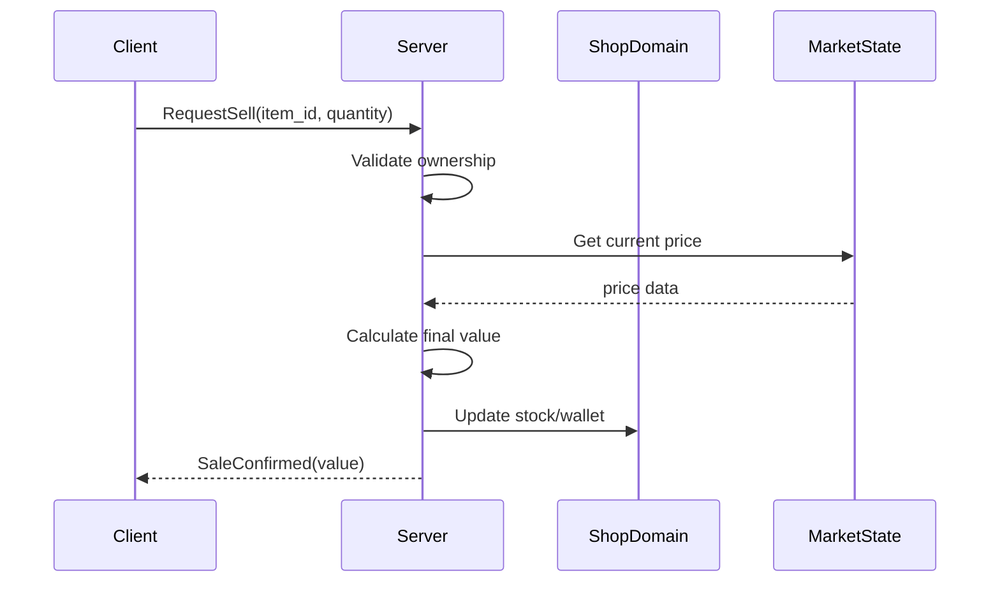

## 19.3 Interest management econômico

O client não precisa receber todo mercado.

Ele deve receber:

- preços relevantes;
    
- itens da loja atual;
    
- contratos disponíveis;
    
- rumores econômicos;
    
- transações próprias;
    
- summary da party, se compartilhado.
    

Não deve receber:

- estoque oculto global;
    
- simulação completa de NPCs de outros players;
    
- seed econômica completa;
    
- dados internos de manipulação de demanda.
    

---

# 20. Estrutura de Dados

## 20.1 ResourceDefinition

|Campo|Função|
|---|---|
|`resource_id`|identificador estável|
|`display_name_key`|localization|
|`base_value`|valor base|
|`rarity`|raridade|
|`category`|minério, parte, ingrediente, relíquia|
|`weight`|peso|
|`condition_range`|condição possível|
|`market_tags`|tags econômicas|
|`source_tags`|origem: mining, harvesting, boss, chest|
|`crafting_tags`|usos em forja/cooking/crafting|

## 20.2 MarketState

|Campo|Função|
|---|---|
|`market_id`|mercado local/global|
|`weekly_seed`|variação semanal|
|`supply_7d`|oferta recente|
|`demand_7d`|demanda recente|
|`demand_modifier`|modificador atual|
|`saturation_state`|saturado/equilibrado/escasso|
|`active_contracts`|contratos que puxam demanda|
|`last_tick_at`|último tick|

## 20.3 ShopState

|Campo|Função|
|---|---|
|`shop_tier`|nível da loja|
|`wallet`|dinheiro|
|`stock`|estoque|
|`contracts`|contratos|
|`hired_npcs`|NPCs contratados|
|`operating_costs`|custos|
|`solvency_state`|saúde financeira|
|`transaction_log`|histórico|

## 20.4 Transaction

|Campo|Função|
|---|---|
|`transaction_id`|id|
|`type`|buy/sell/craft/contract/npc|
|`item_id`|item|
|`quantity`|quantidade|
|`unit_price`|preço unitário|
|`total_value`|valor final|
|`market_state_snapshot`|estado do mercado|
|`timestamp`|data|
|`actor_id`|player/NPC|

---

# 21. Data-Driven Implementation

Definições como recursos, perfis econômicos, contratos e tiers de loja devem ser data-driven. Em Unity, ScriptableObjects são apropriados para centralizar dados acessados por cenas/assets e para criar objetos de dados independentes de GameObjects. ([Unity Docs](https://docs.unity3d.com/6000.4/Documentation/ScriptReference/ScriptableObject.html?utm_source=chatgpt.com "Scripting API: ScriptableObject"))

## 21.1 Definições recomendadas

|Asset|Função|
|---|---|
|`ResourceDefinition`|item econômico base|
|`RarityTable`|multiplicadores|
|`ShopTierDefinition`|custo e bônus de loja|
|`ContractDefinition`|contratos comerciais|
|`NPCExplorerProfile`|perfil de NPC|
|`MarketRuleSet`|regras de oferta/demanda|
|`EconomicSinkDefinition`|custos e sinks|

---

# 22. Estrutura de Scripts Recomendada

|Pasta|Arquivos|
|---|---|
|`Economy/Core`|`ResourceDefinition.cs`, `CurrencyAmount.cs`, `RarityTier.cs`, `EconomicTag.cs`|
|`Economy/Market`|`MarketState.cs`, `DemandService.cs`, `SupplyTracker.cs`, `MarketTickService.cs`, `MarketSnapshot.cs`|
|`Economy/Pricing`|`PriceCalculator.cs`, `NegotiationModifierService.cs`, `SaturationCalculator.cs`, `AntiArbitrageValidator.cs`|
|`Economy/Shop`|`ShopState.cs`, `ShopInventory.cs`, `ShopTierDefinition.cs`, `ShopSolvencyService.cs`, `TransactionService.cs`|
|`Economy/NPC`|`NPCExplorerProfile.cs`, `NPCMission.cs`, `NPCMissionSimulator.cs`, `NPCProfitCalculator.cs`|
|`Economy/Contracts`|`ContractDefinition.cs`, `ContractBoard.cs`, `ContractResolutionService.cs`|
|`Economy/Notes`|`EconomyNoteBridge.cs`, `MarketRumorService.cs`, `PriceObservationService.cs`|
|`Economy/Persistence`|`ShopSaveData.cs`, `MarketSaveData.cs`, `TransactionLogRepository.cs`|
|`Economy/Networking`|`ServerEconomyService.cs`, `EconomyRpcController.cs`, `MarketVisibilityResolver.cs`|
|`Economy/Validation`|`EconomyIntegrityValidator.cs`, `InflationValidator.cs`, `ExploitDetector.cs`|

---

# 23. Pipeline Técnico de Transação

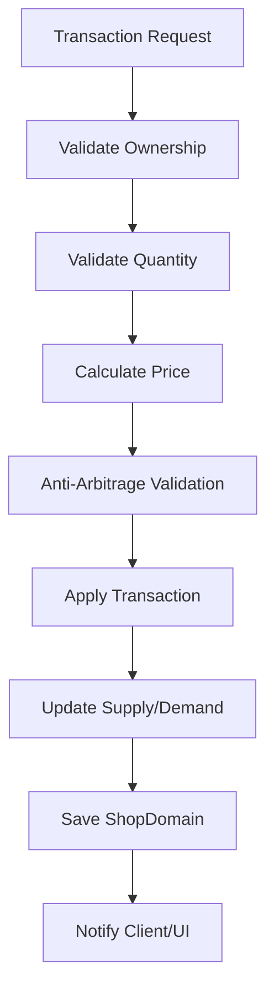

---

# 24. Validação Econômica

## 24.1 Constraints obrigatórias

|Constraint|Regra|
|---|---|
|`resource_has_risk_source`|todo recurso vendável precisa origem válida|
|`no_passive_currency_generation`|moeda não nasce sem risco|
|`sell_price_not_exploitable`|venda não permite loop infinito|
|`npc_yield_less_than_player_yield`|NPC não substitui player|
|`market_tick_not_per_frame`|economia não roda por frame|
|`shop_save_isolated_from_run`|run corrompida não destrói loja|
|`demand_modifier_within_bounds`|preço não explode sem limite|
|`inflation_pressure_within_bounds`|economia não infla demais|
|`transaction_server_authoritative`|client não decide valor|
|`contract_requires_real_stock`|contrato consome item real|

## 24.2 Diagrama de validação

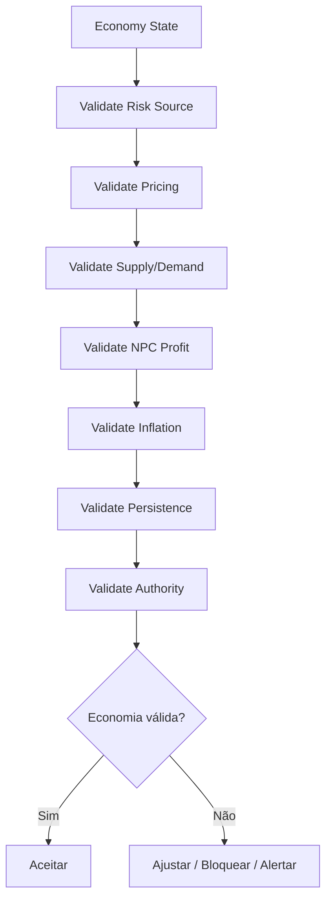

---

# 25. UI/UX Econômica

## 25.1 Informações que o player vê

Sem skill:

- valor aproximado;
    
- raridade;
    
- peso;
    
- comprador disponível;
    
- preço final só no momento da venda.
    

Com `Market Insight`:

- preço antes da negociação;
    
- tendência de demanda;
    
- saturação;
    
- melhor comprador próximo.
    

O ramo Trade do GDD mestre já inclui `Market Insight`, `Bulk Dealer`, `Supply Chain` e `Monopoly`, o que dá base para a economia revelar progressivamente informação ao jogador.

## 25.2 Estados de mercado na UI

|Estado|Texto sugerido|
|---|---|
|Escasso|“Alta demanda”|
|Equilibrado|“Preço estável”|
|Saturado|“Mercado saturado”|
|Contrato ativo|“Comprador interessado”|
|Risco de queda|“Preço instável”|
|Oferta desconhecida|“Sem dados suficientes”|

---

# 26. Integração com Notes

## 26.1 Economy Notes

Economy Notes devem registrar:

- preço observado;
    
- comprador;
    
- saturação;
    
- escassez;
    
- contrato;
    
- oportunidade;
    
- rumor.
    

## 26.2 Fluxo

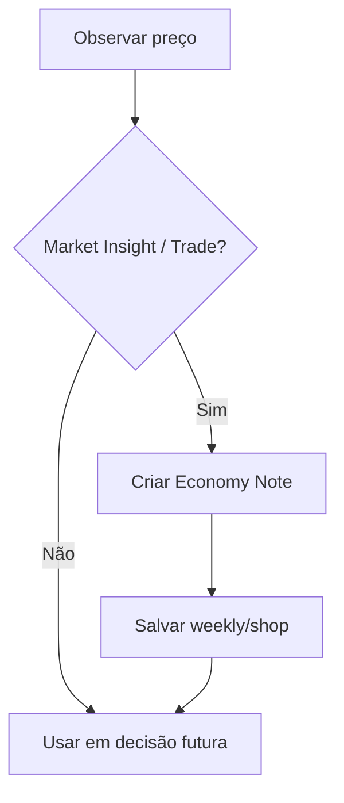

---

# 27. Integração com Dungeon

## 27.1 Risco e valor

Quanto mais fundo o recurso, maior o potencial de valor.

$$  
DepthModifier = 1 + (floorIndex \cdot d)  
$$

Recomendação inicial:

$$  
d = 0.015  
$$

Valor com profundidade:

$$  
V_{depth} = V_{resource} \cdot DepthModifier  
$$

## 27.2 Boss gate e mercado

Boss gates controlam acesso a recursos mais valiosos.

Antes de derrotar boss:

- recursos da próxima camada são escassos;
    
- preço desses recursos sobe;
    
- contratos podem aparecer como “indisponíveis”;
    
- NPCs não podem acessar camada bloqueada.
    

Depois de derrotar boss:

- nova camada entra na economia;
    
- oferta começa baixa;
    
- preço alto no início;
    
- preço estabiliza com exploração.
    

---

# 28. Integração com Corpse System

Se o player morre, os recursos da run vão para o corpse. Isso mantém o risco econômico.

O GDD mestre define que morrer não afeta skills, loja ou meta progressão, mas a mochila da run é perdida e transferida para o `CorpseContainer`.

## 28.1 Fórmula de perda econômica

$$  
RunLoss = \sum_{i=1}^{n}(Quantity_i \cdot Value_i)  
$$

## 28.2 Recuperação

$$  
RecoveredValue = RunLoss \cdot RecoveryRate(t)  
$$

## 28.3 GlobalPool

Itens não recuperados podem alimentar pool global:

$$  
GlobalPool += UnrecoveredValue \cdot \alpha  
$$

Com:

$$  
0.1 \le \alpha \le 0.3  
$$

---

# 29. Roadmap de Fase

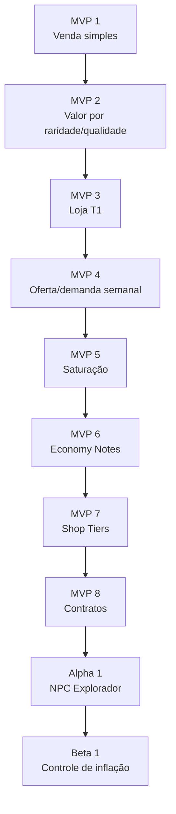

## 29.1 Escopo por Fase

|Fase|Entrega|
|---|---|
|MVP 1|vender recursos extraídos por valor fixo|
|MVP 2|raridade, qualidade e condição|
|MVP 3|loja T1 com estoque e carteira|
|MVP 4|demanda semanal simples|
|MVP 5|saturação por item|
|MVP 6|Economy Notes e Market Insight|
|MVP 7|tiers de loja T1–T3|
|MVP 8|contratos comerciais|
|Alpha 1|NPC Explorador com custo/lucro/falha|
|Beta 1|sinks e inflação|

---

# 30. Non-Goals

Não implementar no primeiro ciclo:

- mercado global MMO completo;
    
- leilão entre players;
    
- manipulação avançada de commodities;
    
- supply chains completas;
    
- contratos dinâmicos infinitos;
    
- inflação macroeconômica realista;
    
- banco/empréstimo/juros;
    
- idle income;
    
- geração passiva de moeda;
    
- NPC explorador sem risco;
    
- loja autossuficiente sem player;
    
- arbitragem sem custo;
    
- economia 100% server-cloud obrigatória no MVP.
    

---

# 31. Critérios de Aceite

O Economy System está aceitável quando:

- todo dinheiro vem de risco;
    
- recurso vendável tem origem rastreável;
    
- mineração e harvesting alimentam economia;
    
- morte gera perda econômica de run;
    
- loja converte valor, mas não cria capital do vazio;
    
- preço usa raridade, demanda e condição;
    
- saturação reduz preço;
    
- escassez aumenta preço;
    
- em Alpha, NPC Explorador tem custo, risco e lucro limitado;
    
- `player_yield_rate > npc_yield_rate`;
    
- economy tick não roda por frame;
    
- loja tem persistência separada da run;
    
- contracts consomem estoque real;
    
- notes econômicas ajudam decisão;
    
- Trade skills revelam informação, não criam dinheiro;
    
- sinks removem moeda;
    
- client não decide transação em multiplayer.
    

---

# 32. Definição Final para o GDD Principal

## Economy System

O Economy System transforma risco de exploração em capital, estoque, loja e progressão mercantil. A economia é fechada: nenhum recurso ou moeda pode ser gerado sem risco atrelado à dungeon. Mineração, harvesting, loot, recuperação de corpse e crafting são fontes MVP válidas quando envolvem custo, vulnerabilidade, tempo ou chance de falha. NPC Explorador só entra em Alpha ou posterior.

O jogador começa como explorador e pode evoluir organicamente para mercador. Recursos extraídos da dungeon são vendidos, processados, cozinhados, forjados, estocados ou usados em contratos. A loja do jogador converte valor e amplia infraestrutura, mas nunca cria capital do vazio.

O preço de venda é determinado por valor base, raridade, demanda, condição, tier da loja e negociação. Oferta e demanda são recalculadas periodicamente por Economy Tick, não por frame. Itens saturados perdem valor; itens escassos ganham valor. Weekly seed pode criar tendências de mercado, mas sempre dentro de limites controlados.

NPCs Exploradores funcionam como automação parcial de Alpha. Eles possuem salário, manutenção, risco, cooldown e chance de falha. Eles nunca podem superar o rendimento do jogador ativo. Se o NPC gerar lucro excessivo, o sistema ajusta custos, riscos ou rendimento.

A economia se conecta com Notes, Bestiário, Cooking, Forja, Corpse System e Dungeon Generation. Notes econômicas registram preços e oportunidades. Bestiário melhora harvesting e valor de partes. Cooking e Forja transformam recursos em itens de maior valor com risco de falha. Boss gates controlam acesso a recursos de camadas mais profundas.

No multiplayer, a economia deve ser autoritativa no servidor. Clients podem solicitar transações e exibir preços, mas não decidem valores finais, estoque global ou recompensas. A persistência econômica usa domínio separado da run para impedir que uma run corrompida destrua a loja rica do jogador.

---

# 33. Resumo Final

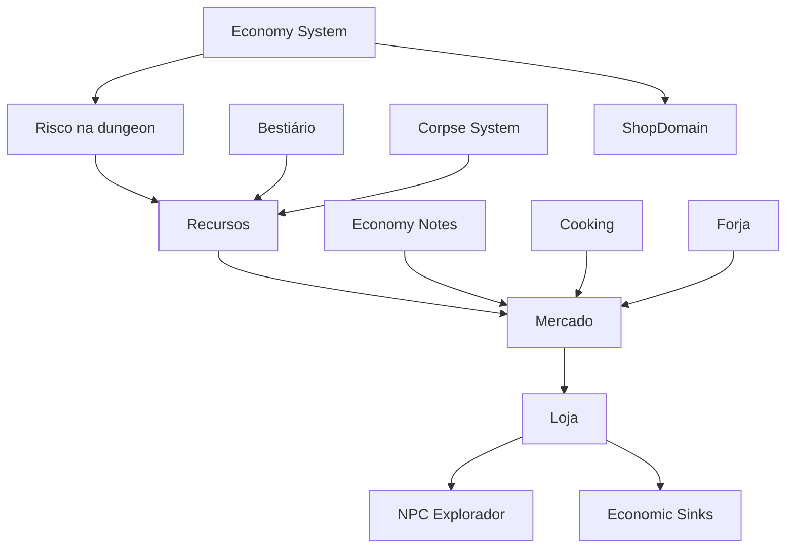

Regra final:

**Economia em Ashvault é risco convertido em valor.**  
Se não houve risco, não deve haver dinheiro.
