## Mineração, Veios, Ferramentas, Ruído, Colapso, Qualidade e Economia

> **Projeto:** Dungeon Explorer: Ashvault  
> **Documento:** GDD específico de Mining  
> **Escopo:** mineração de recursos, nós minerais, veios, ferramentas, durabilidade, qualidade de extração, ruído, risco de colapso, integração com economia, crafting/forja, notes, dungeon, multiplayer, persistência, VR/Flatscreen e validação.  
> **Fora de escopo:** GDD completo de Economia, Cooking, Bestiário, Notes e Forja. Esses sistemas se conectam ao Mining, mas possuem documentos próprios.

---

# 1. High Concept

O **Mining System** é o sistema que transforma a dungeon em uma fonte física de recursos minerais, catalisadores e materiais de crafting.

Mineração não deve ser apenas “bater na pedra até dropar item”. Ela deve ser uma decisão de risco:

- vale a pena parar aqui?
    
- o barulho vai atrair inimigos?
    
- o veio é estável?
    
- minha ferramenta aguenta?
    
- o minério vale o peso?
    
- há risco de colapso?
    
- continuo minerando ou volto vivo para vender?
    
- marco esse veio para retornar depois?
    

A regra central:

**Mineração é extração de valor sob risco ambiental.**

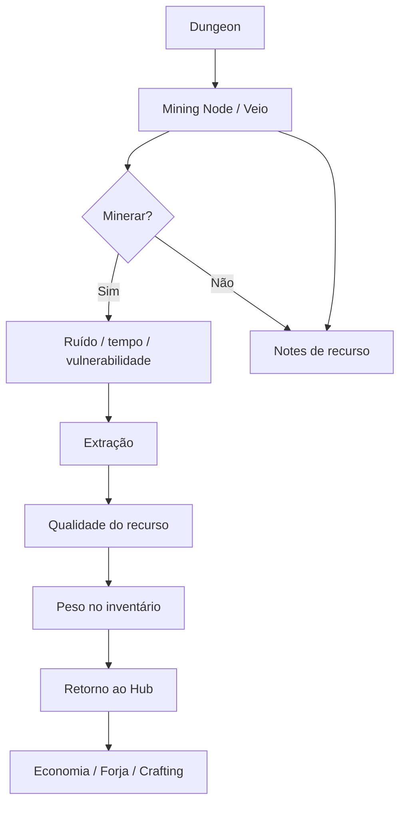

---

# 2. Objetivos de Design

## 2.1 Objetivo principal

Criar uma mineração que seja útil, arriscada e integrada à dungeon vertical.

O jogador deve sentir:

- “achei um veio valioso”;
    
- “preciso decidir se vale minerar agora”;
    
- “o som pode atrair algo”;
    
- “esse minério pesa”;
    
- “minha ferramenta pode quebrar”;
    
- “posso marcar no diário para voltar depois”;
    
- “se eu morrer, perco os recursos da run”;
    
- “se eu voltar vivo, isso vira dinheiro, equipamento ou progresso”.
    

---

## 2.2 Problemas que o Mining System resolve

|Problema|Solução via Mining|
|---|---|
|Economia precisa de recurso real|mineração injeta material com risco|
|Dungeon precisa recompensar exploração|veios raros aparecem em salas perigosas|
|Player precisa decidir retorno|minério tem peso e valor|
|Forja precisa de insumo|minério vira metal, liga e equipamento|
|Notes precisam utilidade|player marca veios, riscos e rotas|
|Ruído precisa importar|mineração atrai inimigos ou Hive|
|Verticalidade precisa consequência|mineração pode abrir fenda, queda ou colapso|
|Weekly dungeon precisa variação|veios mudam por seed semanal|

---

# 3. Pilares do Mining System

## 3.1 Recurso exige risco

Nenhum minério valioso deve ser coletado sem risco.

$$  
OreValue \propto ExtractionRisk  
$$

Se o minério é muito valioso, ele deve exigir pelo menos uma das condições:

- sala perigosa;
    
- ruído alto;
    
- ferramenta avançada;
    
- tempo longo;
    
- risco de colapso;
    
- proximidade de inimigos;
    
- área profunda;
    
- boss gate desbloqueado;
    
- capacidade de carga;
    
- retorno vivo ao Hub.
    

---

## 3.2 Mineração gera ruído

Mineração deve criar som e vibração.

Esse ruído pode:

- atrair inimigos;
    
- acordar criaturas;
    
- alimentar Hive System;
    
- aumentar risco de emboscada;
    
- criar alertas em salas próximas;
    
- revelar posição da party;
    
- gerar notes automáticas se o player tiver percepção alta.
    

---

## 3.3 Mineração altera estado da sala

Minerar pode:

- esgotar um node;
    
- quebrar parede;
    
- revelar passagem;
    
- enfraquecer estrutura;
    
- gerar queda de pedra;
    
- abrir fissura;
    
- criar colapso;
    
- desbloquear recurso escondido;
    
- criar delta runtime.
    

---

## 3.4 Mineração é física e tática

O jogador precisa considerar:

- posição;
    
- exposição;
    
- ferramenta;
    
- som;
    
- stamina;
    
- peso;
    
- durabilidade;
    
- tempo;
    
- rota de fuga;
    
- suporte da party.
    

---

# 4. Core Loop — Mining

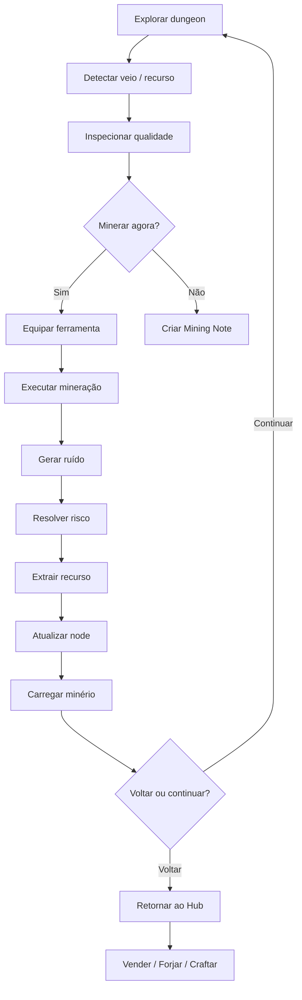

---

# 5. Tipos de Recurso Minerável

## 5.1 Categorias principais

|Categoria|Exemplos|Uso|
|---|---|---|
|Ore|ferro, cobre, prata, mithril|forja, venda|
|Gem|cristal, gema prismática|magia, comércio|
|Catalyst|pó arcano, sal negro, enxofre|crafting, cooking, alquimia|
|Stone|pedra rara, basalto, mármore antigo|construção/crafting|
|Fossil|osso mineralizado, concha antiga|bestiário/economia|
|Relic Deposit|fragmento ritual, metal antigo|loja, lore, crafting|
|Volatile Mineral|minério instável, cristal explosivo|alto valor/alto risco|
|Abyssal Material|fragmento abissal|endgame, corrupção, valor alto|

---

## 5.2 Recursos por profundidade

Quanto mais fundo o andar, maior o valor potencial.

$$  
V_{depth} = V_{base} \cdot (1 + floorIndex \cdot d)  
$$

Recomendação inicial:

$$  
d = 0.015  
$$

Exemplo:

|Floor|Multiplicador aproximado|
|--:|--:|
|1|$1.015$|
|10|$1.15$|
|20|$1.30$|
|50|$1.75$|
|100|$2.50$|

---

# 6. Mining Nodes

## 6.1 Conceito

Um `MiningNode` é um ponto minerável no mundo.

Ele pode representar:

- veio exposto;
    
- parede rachada;
    
- cristal;
    
- depósito fóssil;
    
- rocha rara;
    
- metal antigo;
    
- estrutura colapsada;
    
- material instável.
    

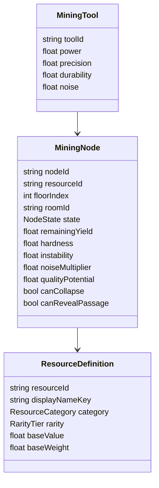

---

## 6.2 Estados de um node

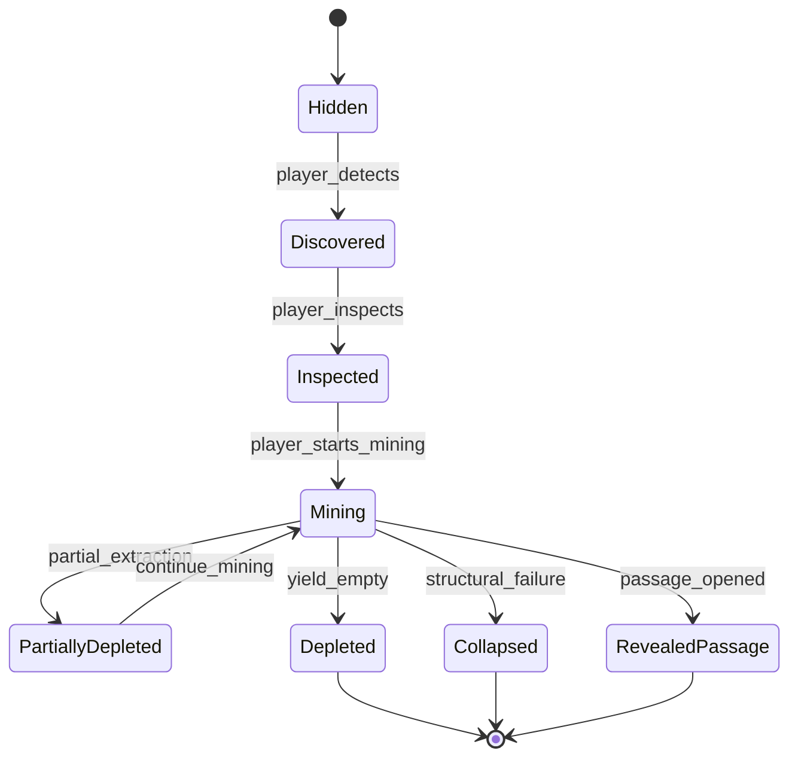

---

## 6.3 Tipos de node

|Tipo|Comportamento|
|---|---|
|Surface Vein|fácil de ver, baixo/médio valor|
|Deep Vein|exige ferramenta melhor, maior valor|
|Hidden Deposit|exige percepção, note ou skill|
|Unstable Crystal|alto valor, risco de explosão/colapso|
|Structural Ore|minerar pode abrir passagem ou colapsar|
|Boss-Locked Deposit|só acessível após boss gate|
|Fall-Adjacent Deposit|perto de buracos/shafts, alto risco|
|Relic Embedded Node|mineração pode quebrar item se feita mal|

---

# 7. Ferramentas de Mineração

## 7.1 Tipos de ferramenta

|Ferramenta|Uso|Vantagem|Desvantagem|
|---|---|---|---|
|Pickaxe T1|mineração básica|barata|lenta e barulhenta|
|Pickaxe T2|minério médio|melhor eficiência|custo maior|
|Precision Chisel|gemas/relíquias|qualidade alta|lento|
|Heavy Hammer|rocha dura|rápido|muito ruído|
|Drill Tool|mineração avançada|rápido|alto ruído/energia|
|Arcane Extractor|cristal/catalisador|preserva magia|consome mana/recurso|
|Explosive Charge|abrir parede|rápido|destrói qualidade e atrai inimigos|
|Silent Wedge|stealth mining|baixo ruído|baixo rendimento|

---

## 7.2 Atributos da ferramenta

|Atributo|Função|
|---|---|
|`power`|capacidade contra dureza|
|`precision`|preserva qualidade|
|`durability`|resistência da ferramenta|
|`noise`|ruído gerado|
|`speed`|tempo de extração|
|`stability`|reduz colapso|
|`resource_affinity`|bônus para tipo específico|
|`weight`|custo de carregar|

---

## 7.3 Durabilidade

A ferramenta perde durabilidade ao minerar.

$$  
DurabilityLoss = H_{node} \cdot U_{time} \cdot (1 - ToolResistance)  
$$

|Termo|Descrição|
|---|---|
|$H_{node}$|dureza do node|
|$U_{time}$|tempo/uso da ferramenta|
|$ToolResistance$|resistência da ferramenta|

Se:

$$  
Durability \le 0  
$$

a ferramenta quebra ou perde eficiência.

---

# 8. Fórmulas Principais

## 8.1 Velocidade de mineração

$$  
MiningSpeed = \frac{ToolPower \cdot SkillMining}{NodeHardness}  
$$

Com clamp:

$$  
MiningSpeed = clamp(MiningSpeed, MinSpeed, MaxSpeed)  
$$

---

## 8.2 Tempo de extração

$$  
T_{extract} = \frac{NodeYield}{MiningSpeed}  
$$

Onde:

|Termo|Descrição|
|---|---|
|$T_{extract}$|tempo necessário|
|$NodeYield$|quantidade total extraível|
|$MiningSpeed$|velocidade final|

---

## 8.3 Qualidade do recurso

$$  
Q_{resource} = Q_{potential} + ToolPrecision + SkillMining - DamagePenalty - InstabilityPenalty  
$$

Com clamp:

$$  
Q_{resource} = clamp(Q_{resource}, 0, 1)  
$$

|Termo|Descrição|
|---|---|
|$Q_{potential}$|potencial do node|
|$ToolPrecision$|precisão da ferramenta|
|$SkillMining$|skill do player|
|$DamagePenalty$|dano causado por força bruta/explosivo|
|$InstabilityPenalty$|penalidade por node instável|

---

## 8.4 Yield extraído

$$  
YieldExtracted = BaseYield \cdot ToolEfficiency \cdot SkillMultiplier \cdot NodeRemaining  
$$

---

## 8.5 Valor final do minério

$$  
V_{ore} = V_{base} \cdot R_{rarity} \cdot Q_{resource} \cdot D_{market} \cdot M_{depth}  
$$

|Termo|Descrição|
|---|---|
|$V_{ore}$|valor final|
|$V_{base}$|valor base|
|$R_{rarity}$|raridade|
|$Q_{resource}$|qualidade|
|$D_{market}$|demanda|
|$M_{depth}$|modificador por profundidade|

---

# 9. Ruído e Atração de Inimigos

## 9.1 Ruído de mineração

Mineração gera ruído.

$$  
Noise_{mining} = ToolNoise \cdot NodeHardness \cdot ImpactRate \cdot RoomEcho  
$$

|Termo|Descrição|
|---|---|
|$ToolNoise$|ruído da ferramenta|
|$NodeHardness$|dureza do node|
|$ImpactRate$|frequência de golpes|
|$RoomEcho$|reverberação da sala|

---

## 9.2 Propagação do ruído

$$  
NoiseAtDistance = \frac{Noise_{mining}}{1 + Distance^2 \cdot Absorption}  
$$

Se:

$$  
NoiseAtDistance \ge HearingThreshold_{enemy}  
$$

a criatura pode investigar.

---

## 9.3 Níveis de resposta

|Nível de ruído|Resposta|
|---|---|
|Baixo|nenhuma resposta ou curiosidade|
|Médio|inimigo próximo investiga|
|Alto|patrulha muda rota|
|Muito alto|emboscada/evento|
|Extremo|Hive alert / colapso / boss attention|

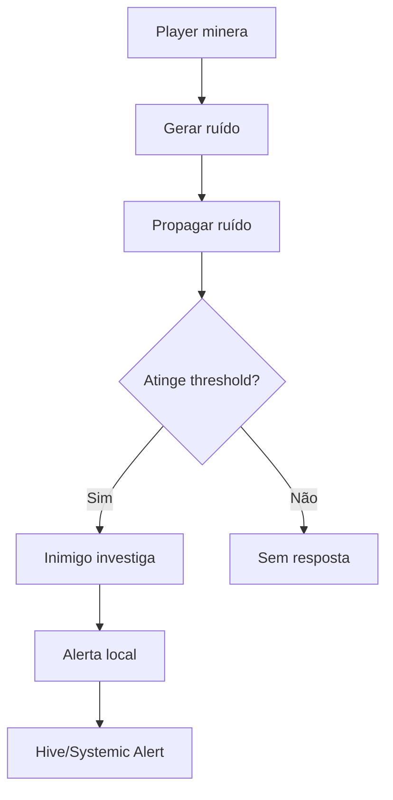

---

# 10. Risco de Colapso

## 10.1 Conceito

Alguns nodes fazem parte da estrutura da sala.

Minerar demais ou com ferramenta errada pode causar:

- queda de pedra;
    
- bloqueio de rota;
    
- abertura de fenda;
    
- dano;
    
- ruído extremo;
    
- nova passagem;
    
- queda para outro andar;
    
- RoomRuntimeDelta.
    

---

## 10.2 Fórmula de colapso

$$  
P_{collapse} = I_{node} + F_{force} + E_{explosive} - S_{support} - K_{knowledge}  
$$

Com clamp:

$$  
P_{collapse} = clamp(P_{collapse}, 0, 1)  
$$

|Termo|Descrição|
|---|---|
|$I_{node}$|instabilidade natural|
|$F_{force}$|força bruta aplicada|
|$E_{explosive}$|penalidade por explosivo|
|$S_{support}$|estabilidade/suporte da sala|
|$K_{knowledge}$|conhecimento/skill do minerador|

---

## 10.3 Resultados de colapso

|Resultado|Efeito|
|---|---|
|Pebble Fall|dano leve, ruído|
|Partial Collapse|bloqueia parte da sala|
|Full Collapse|muda rota, força caminho alternativo|
|Shaft Opened|abre queda ou passagem vertical|
|Resource Lost|destrói parte do veio|
|Enemy Alert|atrai criaturas|
|Boss Seal Interaction|bloqueado se atravessar camada selada|

---

# 11. Mineração e Verticalidade

## 11.1 Mineração perto de buracos

Minerar perto de:

- Fall Origin Point;
    
- shaft;
    
- ponte fina;
    
- sala colapsada;
    
- parede rachada;
    
- teto instável;
    

aumenta risco de colapso e queda.

$$  
P_{fallCollapse} = P_{collapse} \cdot V_{verticalRisk}  
$$

Onde:

|Termo|Descrição|
|---|---|
|$P_{fallCollapse}$|chance de abrir queda|
|$P_{collapse}$|chance base de colapso|
|$V_{verticalRisk}$|risco vertical da área|

---

## 11.2 Mining não pode burlar boss gate

Mineração não pode abrir passagem para camada bloqueada.

A regra é:

$$  
layer(sourceFloor) \neq layer(targetFloor)  
\land BossDefeated(requiredBossFloor) = false  
\Rightarrow MiningPassageAllowed = false  
$$

Se mineração tentaria atravessar um boss gate, o mundo deve bloquear organicamente:

- rocha selada;
    
- cristal impenetrável;
    
- raiz colossal;
    
- metal antigo;
    
- barreira ritual;
    
- colapso que fecha a abertura.
    

---

# 12. Mining Notes

## 12.1 Função

Mining Notes registram conhecimento de recursos e riscos.

Exemplos:

|Note|Uso|
|---|---|
|“veio de cristal no Floor 04, sala leste”|voltar depois|
|“minério instável explode com martelo”|evitar erro|
|“parede rachada pode abrir passagem”|exploração|
|“barulho atrai morcegos”|stealth|
|“obsidiana em alta demanda”|economia|
|“node perto de queda aceita corda?”|dungeon/party|

---

## 12.2 Auto-notes

Podem ser geradas quando:

- player inspeciona node raro;
    
- player falha e causa colapso;
    
- player detecta instabilidade;
    
- player tem skill Mining/Geology;
    
- player observa resposta de inimigo ao ruído;
    
- player encontra veio de alto valor.
    

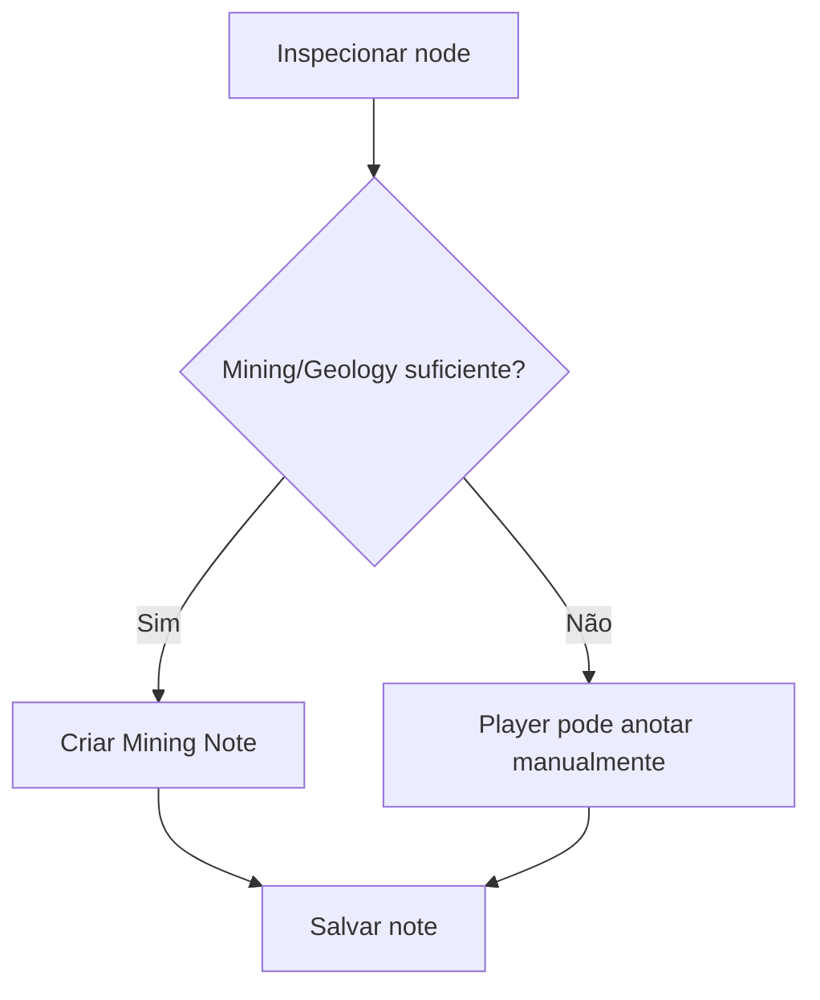

---

# 13. Integração com Economia

## 13.1 Mineração como fonte econômica

Mineração é uma das fontes principais de capital.

Mas ela só gera valor se o jogador:

- extraiu;
    
- carregou;
    
- retornou vivo;
    
- vendeu ou processou.
    

$$  
MiningProfit = V_{ore} - ToolCost - RepairCost - RiskLoss  
$$

---

## 13.2 Decisão: vender bruto ou processar

Após retornar ao Hub, o player pode:

- vender minério bruto;
    
- refinar;
    
- fundir;
    
- usar na forja;
    
- guardar para contrato;
    
- usar como catalisador;
    
- vender após demanda subir.
    

---

## 13.3 Anti-exploit

Mineração não pode gerar valor infinito.

Regras:

- nodes têm yield limitado;
    
- nodes esgotados viram deltas/snapshots;
    
- mercado satura;
    
- ferramenta desgasta;
    
- minério pesa;
    
- mineração gera risco;
    
- reset semanal muda distribuição;
    
- nodes não respawnam na mesma run sem regra explícita.
    

---

# 14. Integração com Forja / Crafting

Mineração alimenta forja.

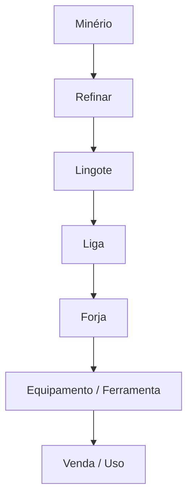

## 14.1 Qualidade do material refinado

$$  
Q_{refined} = Q_{ore} + S_{refining} - P_{impurity}  
$$

## 14.2 Qualidade do item forjado

$$  
Q_{crafted} = Q_{refined} + S_{smithing} + ToolBonus - P_{failure}  
$$

---

# 15. Integração com Cooking

Mining pode fornecer catalisadores culinários ou alquímicos.

Exemplos:

|Mineral|Uso culinário|
|---|---|
|Sal de caverna|preservação|
|Enxofre|receita de resistência a calor, com risco|
|Pó cristalino|prato arcano|
|Gelo mineral|conservação de carne|
|Cinza vulcânica|tempero ritual|
|Ossos mineralizados|caldo medicinal/ritual|

Mining não substitui Cooking, mas fornece insumos especiais.

---

# 16. Integração com Bestiário

Mining pode afetar criaturas.

Exemplos:

|Evento de mineração|Bestiário|
|---|---|
|ruído atrai morcego|revela audição sensível|
|cristal quebrado atrai criatura|revela habitat|
|mineração expõe ninho|revela comportamento|
|explosivo mata slime|revela resistência/fraqueza|
|creature defende depósito|revela relação ecológica|
|minério em carcaça fossilizada|revela lore/anatomia|

---

# 17. Integração com Dungeon Snapshot

## 17.1 O que salvar

Se um node for minerado, o estado precisa persistir durante a run/sessão.

Salvar:

- node descoberto;
    
- node parcialmente minerado;
    
- node esgotado;
    
- colapso gerado;
    
- passagem aberta;
    
- recursos dropados no chão;
    
- Mining Notes;
    
- ruído/evento relevante se ainda ativo.
    

## 17.2 Fórmula de reconstrução

$$  
RestoredFloor = Generate(floorSeed) \oplus MiningDeltas \oplus RuntimeDeltas  
$$

Onde `MiningDeltas` incluem:

- `NodeDepletedDelta`;
    
- `NodePartialYieldDelta`;
    
- `CollapseDelta`;
    
- `PassageOpenedDelta`;
    
- `DroppedOreDelta`.
    

---

# 18. Persistência

## 18.1 Política de persistência

|Dado|Persistência|
|---|---|
|minério na mochila da run|RunDomain|
|minério extraído e retornado|Shop/Meta/Inventory|
|node parcialmente minerado|WorldDomain/session|
|node esgotado|WorldDomain/session ou weekly|
|colapso causado|WorldDomain/session|
|passagem aberta|WorldDomain/session/weekly|
|notes de mineração|Run/World/Meta conforme tipo|
|conhecimento geológico|Meta|
|ferramenta danificada|Run/Inventory|
|ferramenta comprada|Meta/Inventory|

## 18.2 Save de mineração

$$  
MiningSave = MiningDeltas + ToolStates + ExtractedResources + MiningNotes  
$$

---

# 19. Multiplayer

## 19.1 Autoridade

No multiplayer, mineração deve ser server-authoritative.

O servidor valida:

- existência do node;
    
- distância do player;
    
- ferramenta usada;
    
- tempo de mineração;
    
- ruído gerado;
    
- yield extraído;
    
- qualidade;
    
- durabilidade;
    
- colapso;
    
- deltas;
    
- inventário.
    

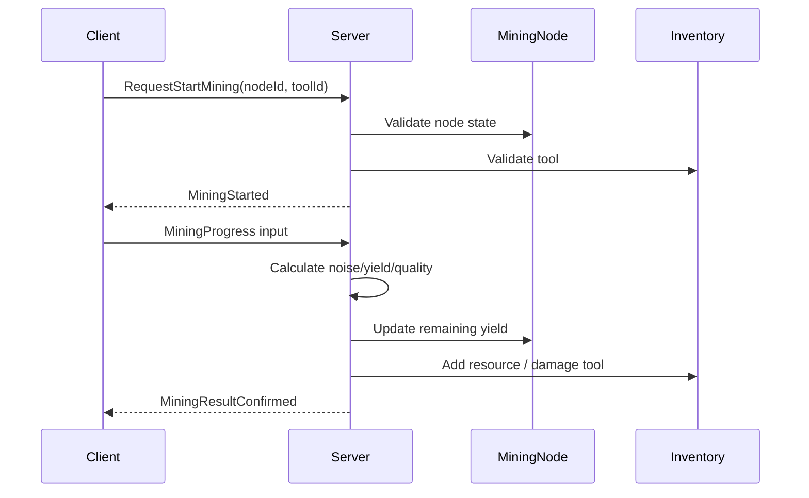

---

## 19.2 Party mining

A party pode minerar junta.

Modelos:

|Modelo|Regra|
|---|---|
|Solo Mining|um player minera|
|Assisted Mining|outros reduzem tempo|
|Guard Duty|outros protegem minerador|
|Tool Combo|ferramentas diferentes melhoram qualidade|
|Carry Support|outros carregam minério|

## 19.3 Fórmula de mineração cooperativa

$$  
MiningSpeed_{party} = MiningSpeed_{main} + \sum_{i=1}^{n} AssistEfficiency_i  
$$

Com limite:

$$  
MiningSpeed_{party} \le MiningSpeed_{main} \cdot M_{assistCap}  
$$

Recomendação:

$$  
M_{assistCap} = 2.0  
$$

Assim, party ajuda, mas não quebra o ritmo.

---

## 19.4 Interest Management

Players em outro andar não precisam receber detalhes da mineração.

Recebem apenas:

- Party Summary;
    
- ruído se for relevante;
    
- alerta de colapso se conectado;
    
- delta de passagem se afetar rota;
    
- note compartilhada se party criar.
    

---

# 20. VR e Flatscreen

## 20.1 Princípio

Mining em VR deve ser físico.  
Mining em Flatscreen deve ser abstraído, mas equivalente em tempo e risco.

$$  
T_{mining}^{VR} \approx T_{mining}^{Flat}  
$$

$$  
Risk_{mining}^{VR} \approx Risk_{mining}^{Flat}  
$$

---

## 20.2 VR

Ações possíveis:

- segurar picareta;
    
- golpear veio;
    
- ajustar ângulo;
    
- usar cinzel;
    
- aplicar força;
    
- carregar minério fisicamente;
    
- sentir vibração;
    
- ouvir rachaduras;
    
- recuar em colapso.
    

## 20.3 Flatscreen

Ações equivalentes:

- hold action;
    
- timing de golpes;
    
- minigame de precisão;
    
- stamina drain;
    
- ruído proporcional;
    
- lock de animação;
    
- risco de interrupção.
    

---

# 21. UI/UX

## 21.1 Inspeção do node

Sem skill:

- “rocha estranha”;
    
- valor desconhecido;
    
- risco desconhecido.
    

Com skill Mining/Geology:

- recurso provável;
    
- dureza;
    
- instabilidade;
    
- qualidade estimada;
    
- ferramenta recomendada;
    
- ruído estimado.
    

## 21.2 Estados visuais

|Estado|Visual|
|---|---|
|Hidden|sem brilho/indício|
|Discovered|leve destaque|
|Inspected|ícone ou note|
|Mining|partículas/rachaduras|
|Partial|veio reduzido|
|Depleted|rocha quebrada|
|Unstable|rachaduras, som, vibração|
|Collapsed|detritos/bloqueio|

---

# 22. Dados Recomendados

## 22.1 ResourceDefinition

|Campo|Função|
|---|---|
|`resource_id`|id|
|`display_name_key`|nome|
|`category`|ore, gem, catalyst, fossil|
|`rarity`|raridade|
|`base_value`|valor|
|`base_weight`|peso|
|`market_tags`|economia|
|`crafting_tags`|forja/crafting|
|`cooking_tags`|cooking se aplicável|
|`quality_range`|qualidade possível|

## 22.2 MiningNodeDefinition

|Campo|Função|
|---|---|
|`node_type`|surface, deep, hidden, unstable|
|`resource_table`|recursos possíveis|
|`hardness`|dureza|
|`instability`|risco|
|`yield_range`|quantidade|
|`quality_potential`|qualidade|
|`noise_multiplier`|ruído|
|`required_tool_power`|ferramenta mínima|
|`can_collapse`|colapso|
|`can_reveal_passage`|passagem|

## 22.3 MiningToolDefinition

|Campo|Função|
|---|---|
|`tool_id`|id|
|`power`|força|
|`precision`|qualidade|
|`speed`|velocidade|
|`noise`|ruído|
|`durability`|durabilidade|
|`stability_bonus`|reduz colapso|
|`resource_affinity`|bônus por recurso|

---

# 23. Data-Driven Implementation

Mining deve ser data-driven.

Usar definições para:

- recursos;
    
- nodes;
    
- ferramentas;
    
- loot tables;
    
- riscos;
    
- ruído;
    
- colapso;
    
- notas;
    
- integração econômica.
    

Isso permite balancear sem reescrever lógica.

---

# 24. Estrutura de Scripts Recomendada

|Pasta|Arquivos|
|---|---|
|`Mining/Core`|`MiningNode.cs`, `MiningNodeState.cs`, `ResourceDefinition.cs`, `ResourceCategory.cs`|
|`Mining/Tools`|`MiningToolDefinition.cs`, `MiningToolInstance.cs`, `ToolDurabilityService.cs`|
|`Mining/Extraction`|`MiningService.cs`, `MiningSpeedCalculator.cs`, `ResourceQualityCalculator.cs`, `MiningYieldCalculator.cs`|
|`Mining/Noise`|`MiningNoiseEmitter.cs`, `NoisePropagationService.cs`, `EnemyAttractionService.cs`|
|`Mining/Collapse`|`CollapseRiskCalculator.cs`, `CollapseResolutionService.cs`, `MiningCollapseDelta.cs`|
|`Mining/Dungeon`|`MiningNodePlacer.cs`, `MiningDeltaApplier.cs`, `MiningSnapshotBridge.cs`|
|`Mining/Economy`|`MiningValueCalculator.cs`, `ResourceMarketBridge.cs`|
|`Mining/Notes`|`MiningNoteBridge.cs`, `ResourceDiscoveryNoteService.cs`|
|`Mining/Networking`|`ServerMiningService.cs`, `MiningRpcController.cs`, `MiningVisibilityResolver.cs`|
|`Mining/UI`|`MiningInspectView.cs`, `MiningProgressView.cs`, `ResourceTooltipView.cs`|

---

# 25. Pipeline Técnico

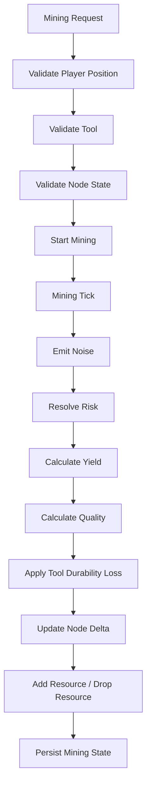

---

# 26. Validação

## 26.1 Constraints obrigatórias

|Constraint|Regra|
|---|---|
|`node_exists`|node precisa existir|
|`node_not_depleted`|não minerar node vazio|
|`player_in_range`|player precisa estar perto|
|`tool_valid`|ferramenta precisa existir|
|`tool_power_sufficient`|ferramenta precisa conseguir minerar|
|`server_authoritative_yield`|client não decide yield|
|`noise_emitted`|mineração gera ruído|
|`collapse_validated`|colapso calculado se aplicável|
|`boss_gate_not_bypassed`|mineração não atravessa camada selada|
|`node_state_persisted`|node minerado gera delta|
|`inventory_capacity_checked`|peso/capacidade validado|
|`economy_value_traceable`|recurso tem origem rastreável|

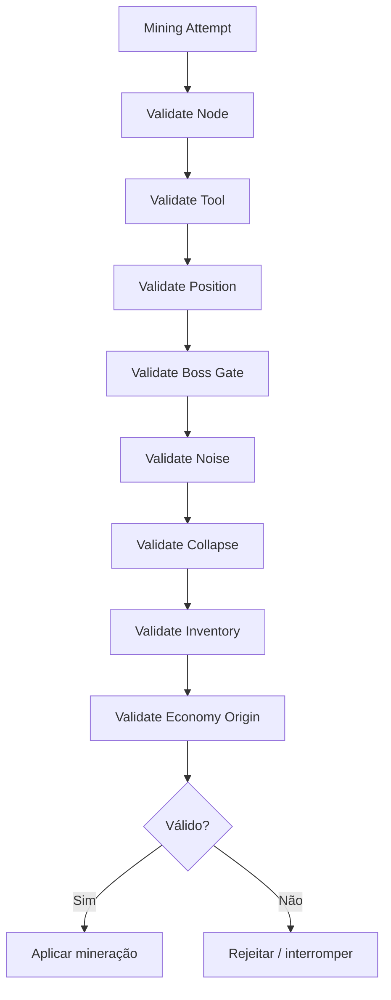

---

# 27. MVP Roadmap

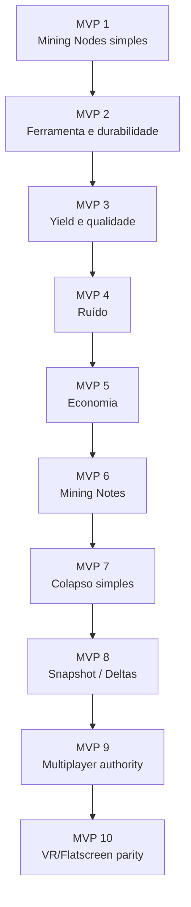

## 27.1 Escopo por MVP

|MVP|Entrega|
|---|---|
|MVP 1|node minerável, recurso básico, interação|
|MVP 2|ferramenta, power e durabilidade|
|MVP 3|yield, qualidade e peso|
|MVP 4|ruído atraindo inimigos|
|MVP 5|recurso vendável na economia|
|MVP 6|Mining Notes para nodes e risco|
|MVP 7|colapso simples e bloqueio de rota|
|MVP 8|node depleted salvo em snapshot|
|MVP 9|servidor valida mineração|
|MVP 10|input VR/Flat equivalente|

---

# 28. Non-Goals

Não implementar no primeiro ciclo:

- voxel mining completo;
    
- destruição livre total;
    
- mineração infinita;
    
- economia sem saturação;
    
- nodes respawnando dentro da mesma run;
    
- máquinas automáticas sem custo;
    
- mineração que burla boss gate;
    
- colapso destruindo floor inteiro;
    
- simulação física realista de rocha;
    
- geologia procedural complexa;
    
- perfuração industrial;
    
- mineração passiva por idle income.
    

---

# 29. Critérios de Aceite

O Mining System está aceitável quando:

- existem mining nodes na dungeon;
    
- nodes têm recurso, dureza, yield e qualidade;
    
- player precisa ferramenta válida;
    
- mineração consome tempo;
    
- mineração gera ruído;
    
- ruído pode atrair inimigos;
    
- ferramenta perde durabilidade;
    
- recurso tem peso;
    
- recurso tem valor econômico;
    
- node pode ser parcialmente minerado ou esgotado;
    
- estado do node é salvo em snapshot/delta;
    
- mineração pode gerar notes;
    
- mineração pode causar colapso simples;
    
- mineração não burla boss gate;
    
- multiplayer é server-authoritative;
    
- VR e Flatscreen têm tempo e risco equivalentes;
    
- mineração alimenta economia, forja, crafting e notes.
    

---

# 30. Definição Final para o GDD Principal

## Mining System

O Mining System transforma a dungeon em uma fonte física e arriscada de recursos minerais, catalisadores, gemas, fósseis e materiais de crafting. Mineração não é uma interação passiva; ela exige tempo, ferramenta, posição, capacidade de carga e aceitação de risco.

Cada Mining Node possui recurso, dureza, instabilidade, yield, qualidade potencial, ruído e estado. Nodes podem estar ocultos, descobertos, inspecionados, parcialmente minerados, esgotados, colapsados ou convertidos em passagem. A distribuição dos nodes é determinada pela seed do andar e pela weekly seed, mas alterações runtime devem ser salvas como MiningDeltas.

Mineração gera ruído e vibração. Esse ruído pode atrair inimigos, mudar patrulhas, alimentar sistemas como Hive, gerar emboscadas ou criar alerta local. Ferramentas diferentes alteram velocidade, precisão, durabilidade, ruído e risco de colapso. Ferramentas brutas extraem rápido, mas reduzem qualidade e fazem barulho. Ferramentas precisas preservam valor, mas exigem mais tempo.

A qualidade do recurso depende do potencial do node, precisão da ferramenta, skill de mineração, dano causado e instabilidade. O valor final do recurso depende de raridade, qualidade, demanda de mercado e profundidade. Recursos minerados só entram na economia se o jogador retornar vivo ou recuperar o corpse.

Mineração pode afetar a estrutura da sala. Em nodes instáveis, existe chance de colapso, bloqueio de rota, queda de pedras, abertura de shaft ou passagem. Contudo, mineração nunca pode burlar boss gates ou atravessar camadas seladas. Se uma tentativa de mineração atravessaria uma camada bloqueada, o ambiente deve bloquear organicamente por rocha selada, cristal, raiz, metal antigo ou colapso.

O sistema se conecta à Economia, Forja, Cooking, Bestiário e Notes. Minérios alimentam venda, refino e crafting. Catalisadores minerais podem ser usados em cooking ou alquimia. Ruído de mineração pode revelar comportamento de criaturas no bestiário. Mining Notes registram nodes raros, riscos, rotas e demanda econômica.

No multiplayer, o servidor valida mineração, yield, ruído, colapso, durabilidade e inventário. Clients não decidem resultado. Em VR, mineração usa gestos físicos e impacto. Em Flatscreen, usa interação abstrata equivalente, mantendo tempo, ruído e risco semelhantes.

---

# 31. Resumo Final

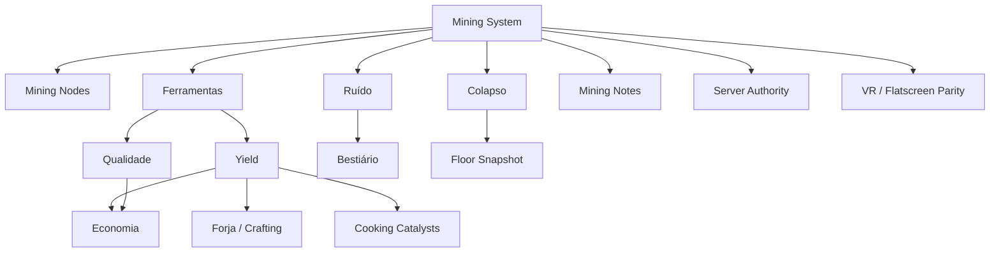

Regra final:

**Mining é risco convertido em matéria-prima.**  
Se o jogador quer minério valioso, precisa aceitar tempo parado, ruído, peso, ferramenta, colapso, inimigos e o risco de morrer antes de voltar ao Hub.