## Diário de Exploração, Anotações Sistêmicas e Cartografia Diegética

> **Projeto:** Dungeon Explorer: Ashvault  
> **Documento:** GDD específico de Notes  
> **Escopo:** notes manuais, auto-notes, diário de exploração, cartografia diegética, vulnerabilidade ao anotar, integração com bestiário, cooking, economia, dungeon, corpse system, multiplayer, persistência e localização.  
> **Fora de escopo:** GDD completo de Economia, GDD completo de Cooking e GDD completo de Bestiário. Esses devem virar documentos separados.

---

# 1. High Concept

O **Notes System** é o sistema de memória, interpretação e cartografia do jogador dentro da dungeon.

Ele substitui minimapa tradicional por um modelo diegético: o jogador observa o mundo, registra descobertas, cria marcações e transforma informação em vantagem. O GDD mestre já estabelece que o jogo não possui minimapa tradicional e que a orientação deve ser diegética, com ferramentas como marcas de carvão, magia de marcação, diário de exploração, ressonância arcana e bússola de morte. O Diário de Exploração é descrito como caderno físico em VR ou interface em Flatscreen, anotado em tempo real, com vulnerabilidade durante escrita e risco de virar item saqueável caso o jogador morra.

A regra central:

**Notes não são apenas texto. Notes são um sistema de gameplay.**

Notes usam `KnowledgeRuntime` para estado de descoberta. Uma note pode criar hipótese, confirmar evidência, marcar falsidade ou ficar obsoleta; o Notes System não mantém state machine paralela para conhecimento.

Elas devem afetar:

- navegação;
    
- sobrevivência;
    
- recuperação de corpse;
    
- queda e corda;
    
- bestiário;
    
- cooking;
    
- economia;
    
- boss gates;
    
- aprendizado sistêmico;
    
- multiplayer;
    
- memória da run;
    
- persistência semanal/meta.
    

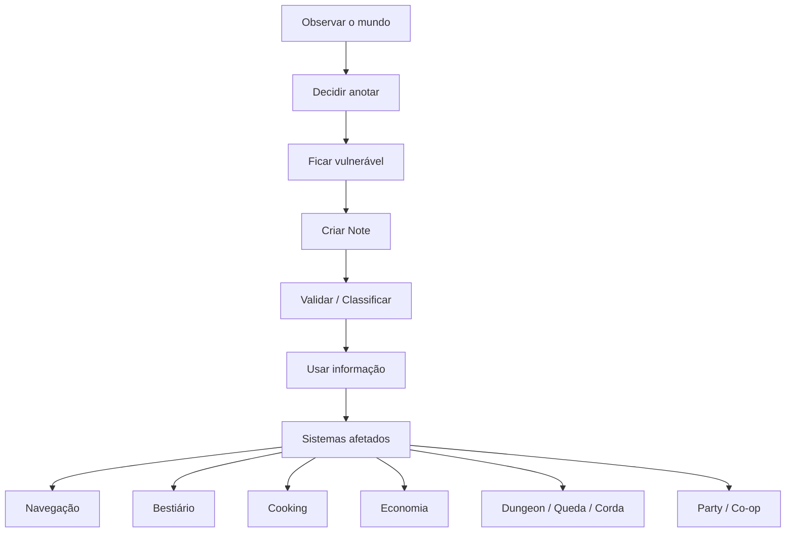

---

# 2. Objetivos de Design

## 2.1 Objetivo principal

Criar um sistema de anotações que funcione como **memória ativa do jogador**, sem transformar a dungeon em um mapa automático.

O player deve sentir:

- “eu aprendi isso”;
    
- “eu registrei isso”;
    
- “eu posso usar isso depois”;
    
- “eu me arrisquei para anotar”;
    
- “minha anotação vale alguma coisa”;
    
- “se eu morrer, minha informação também pode virar loot”.
    

---

## 2.2 O que o Notes System deve resolver

|Problema|Solução via Notes|
|---|---|
|Dungeon procedural muda semanalmente|notes de rota são run/weekly, não eternas|
|Sem minimapa tradicional|notes e marcações substituem mapa completo|
|Bestiário não deve ser wiki pronta|notes alimentam conhecimento confirmado|
|Cooking exige descoberta|notes registram tentativa, efeito e toxicidade|
|Economia muda por demanda|notes registram preços, saturação e oportunidades|
|Party pode se separar|notes indicam queda, corda, ponto de resgate|
|Player pode morrer|notes podem ficar no corpse|
|VR e Flatscreen precisam paridade|ambos anotam em tempo real, sem pausa|

---

# 3. Pilares do Notes System

## 3.1 Notes são diegéticas

A note deve existir dentro da fantasia do jogo:

- caderno físico em VR;
    
- diário/interface sem pausa no Flatscreen;
    
- marcação em parede;
    
- símbolos de carvão;
    
- marcas arcanas;
    
- pins locais;
    
- fragmentos recuperáveis no corpse.
    

## 3.2 Notes geram vulnerabilidade

Anotar nunca pausa o jogo.

$$  
V_{note} = T_{write} \cdot E_{exposure} \cdot N_{noise} \cdot R_{context}  
$$

|Termo|Descrição|
|---|---|
|$V_{note}$|vulnerabilidade total da anotação|
|$T_{write}$|tempo gasto escrevendo/marcando|
|$E_{exposure}$|exposição física da posição|
|$N_{noise}$|ruído ou distração gerada pela ação|
|$R_{context}$|risco do contexto: inimigos, noite, boss, queda, hazard|

Quanto maior a note, maior o risco.

## 3.3 Notes não são verdade automaticamente

Uma note pode estar:

- não verificada;
    
- parcialmente correta;
    
- confirmada;
    
- falsa;
    
- obsoleta após reset semanal;
    
- vinculada a evidência.
    

## 3.4 Notes têm duração diferente

Nem toda note deve persistir para sempre.

|Tipo|Duração correta|
|---|---|
|rota da dungeon|run/weekly|
|ponto de queda|run/session ou weekly|
|corda instalada|session|
|monstro observado|meta|
|fraqueza confirmada|meta|
|receita descoberta|meta|
|preço de mercado|weekly|
|boss gate observado|meta/progressão|

---

# 4. Core Loop — Notes

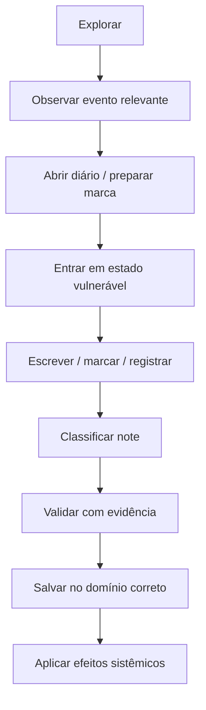

## 4.1 Loop curto

1. O player observa algo.
    
2. O player decide se vale a pena anotar.
    
3. O mundo continua rodando.
    
4. O player fica vulnerável.
    
5. A note é criada.
    
6. O sistema classifica a note.
    
7. A note pode alimentar navegação, bestiário, cooking ou economia.
    

## 4.2 Loop longo

1. Player coleta várias notes durante runs.
    
2. Algumas notes são confirmadas por evidência.
    
3. Notes confirmadas viram conhecimento persistente.
    
4. Conhecimento persistente aumenta eficiência.
    
5. Eficiência permite explorar mais fundo.
    
6. Exploração gera notes mais valiosas.
    

---

# 5. Tipos de Notes

## 5.1 Categorias principais

|Tipo|Exemplo|Sistema afetado|Persistência|
|---|---|---|---|
|Route Note|“corredor norte leva à Sleep Zone”|navegação|run/weekly|
|Hazard Note|“ponte congelada quebra”|sobrevivência|weekly|
|Monster Note|“slime evita fogo”|bestiário|meta após confirmação|
|Ingredient Note|“fungo azul cura”|cooking|meta após confirmação|
|Recipe Note|“carne + seiva reduz bleed”|cooking|meta após receita|
|Economy Note|“cristal está saturado”|economia|weekly|
|Rope Note|“queda aqui aceita corda T1”|dungeon/co-op|session/weekly|
|Fall Note|“player caiu neste ponto”|dungeon/co-op|session/weekly|
|Boss Gate Note|“camada selada por cristal”|progressão|meta|
|Harvest Note|“cortar cauda preserva órgão”|bestiário/loot|meta|
|Corpse Note|“corpo caiu no Floor 04”|recuperação|run/session|
|Party Note|“Max desceu pela corda”|multiplayer|session|
|Market Rumor|“ferreiro paga mais por obsidiana”|economia|weekly/meta parcial|

---

# 6. Notes Manuais, Automáticas e Semi-Automáticas

## 6.1 Manual Note

Criada diretamente pelo player.

Uso:

- desenhar símbolo;
    
- escrever frase curta;
    
- marcar sala;
    
- registrar receita;
    
- apontar perigo;
    
- criar lembrete de rota.
    

Vantagem:

- sempre disponível.
    

Desvantagem:

- mais lenta;
    
- gera vulnerabilidade;
    
- pode ser imprecisa;
    
- pode ser saqueável no corpse.
    

## 6.2 Auto Note

Criada automaticamente quando o player possui requisito suficiente.

O GDD mestre já indica que o Diário de Exploração exige WIS 8+ para auto-notas.

Exemplos:

|Trigger|Auto Note|
|---|---|
|WIS suficiente + queda vista|“Ponto de queda registrado”|
|WIS suficiente + monstro novo|“Criatura desconhecida observada”|
|Trade skill + transação|“Preço registrado”|
|Cooking skill + tentativa|“Efeito alimentar registrado”|
|Grave Sense + morte|“Corpse direction note”|

## 6.3 Semi-Auto Note

O sistema sugere, mas o player confirma.

Exemplo:

- “Registrar este buraco como ponto de corda?”
    
- “Salvar preço deste item?”
    
- “Adicionar monstro ao bestiário?”
    
- “Marcar esta sala como perigosa?”
    

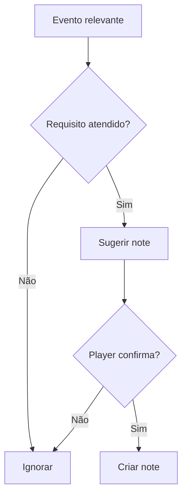

---

# 7. Note Lifecycle

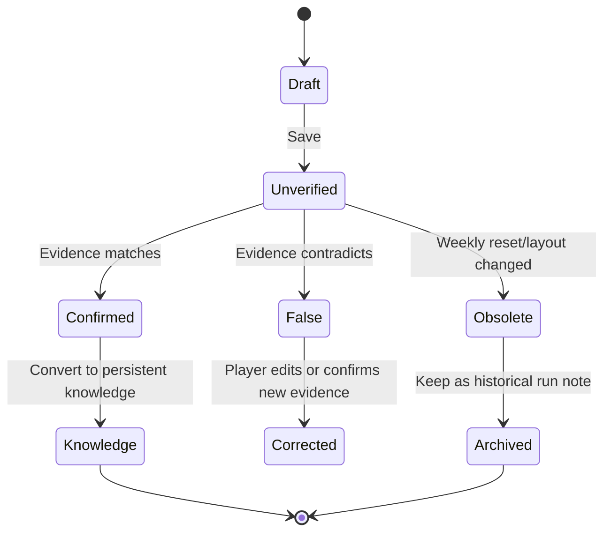

## 7.1 Estados

|Estado|Descrição|
|---|---|
|Draft|note sendo escrita|
|Unverified|note salva, mas não confirmada|
|Confirmed|note validada por evidência|
|False|note contradita pelo mundo|
|Obsolete|note perdeu validade por reset/layout|
|Archived|note mantida só como histórico|
|Knowledge|convertida em conhecimento persistente|

---

# 8. Fórmulas Principais

## 8.1 Valor informacional da note

$$  
I_{note} = U_{system} \cdot R_{rarity} \cdot C_{confidence} \cdot T_{validity}  
$$

|Termo|Descrição|
|---|---|
|$I_{note}$|valor informacional|
|$U_{system}$|utilidade sistêmica|
|$R_{rarity}$|raridade da informação|
|$C_{confidence}$|confiança/validação|
|$T_{validity}$|validade temporal|

## 8.2 Risco de anotar

$$  
Risk_{note} = T_{write} \cdot E_{exposure} \cdot D_{danger} \cdot M_{mode}  
$$

|Termo|Descrição|
|---|---|
|$T_{write}$|duração da escrita|
|$E_{exposure}$|exposição da posição|
|$D_{danger}$|perigo local|
|$M_{mode}$|modificador de modo, ajustado para paridade VR/Flat|

## 8.3 Confiança da note

$$  
C_{confidence} =  
\frac{E_{confirmed}}{E_{required}}  
$$

Com clamp:

$$  
C_{confidence} = clamp(C_{confidence}, 0, 1)  
$$

## 8.4 Conversão em conhecimento

$$  
K_{gain} = I_{note} \cdot C_{confidence} \cdot S_{wisdom}  
$$

Onde:

$$  
S_{wisdom} = 1 + (WIS \cdot 0.02)  
$$

---

# 9. Integração com Navegação e Dungeon

## 9.1 Sem minimapa

O Notes System deve reforçar a regra de **cartografia ativa sem minimapa**.

Ferramentas possíveis:

|Método|Função|Limitação|
|---|---|---|
|Marca de carvão|símbolo em parede|água/tempo/reset podem apagar|
|Marca arcana|símbolo luminoso|consome mana e atrai criaturas|
|Diário|registro textual/visual|vulnerabilidade|
|Ressonância arcana|scan temporário|custo de mana e aggro|
|Bússola de morte|indica corpse|requer skill|

Esses elementos já existem no GDD mestre como alternativas diegéticas ao minimapa.

## 9.2 Notes de queda

Quando um player cai:

- sistema registra Fall Origin Point;
    
- pode criar auto-note para a party;
    
- Fall Landing Point pode ser registrado se houver comunicação ou retorno;
    
- note pode indicar que o ponto aceita corda.
    

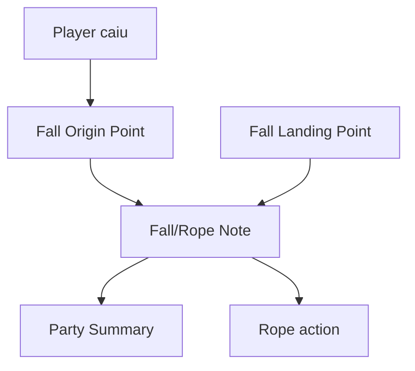

## 9.3 Notes de corda

Quando a party instala corda:

- cria Rope Note;
    
- marca o Origin Point;
    
- indica tier de corda usado;
    
- registra se a conexão é segura;
    
- pode sumir ao reset ou fim da sessão.
    

## 9.4 Notes de boss gate

Boss Gate Notes registram:

- tipo de selo;
    
- floor gate;
    
- camada bloqueada;
    
- requisito observado;
    
- estado: vivo/derrotado;
    
- abertura liberada após boss.
    

---

# 10. Integração com Bestiário

Notes devem alimentar bestiário apenas quando houver evidência.

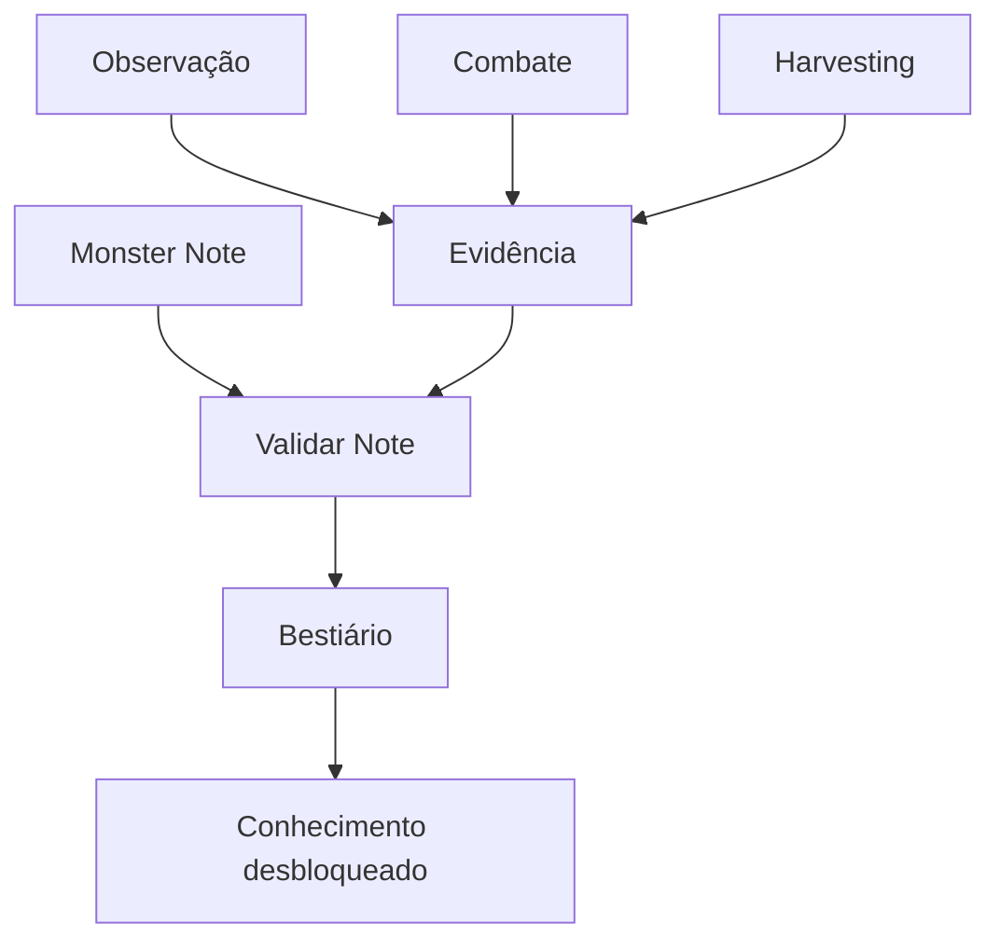

## 10.1 Exemplos

|Note|Evidência necessária|Desbloqueio|
|---|---|---|
|“Slime evita fogo”|slime recua de Ignis 3 vezes|fraqueza/comportamento|
|“morcego reage a metal”|metal gera alert perto dele|audição sensível|
|“cauda preserva órgão”|harvesting perfeito pela cauda|anatomia|
|“fungo vivo atrai besta”|spawn após exposição|risco ecológico|

---

# 11. Integração com Cooking

Cooking deve usar notes para registrar tentativa, erro e descoberta.

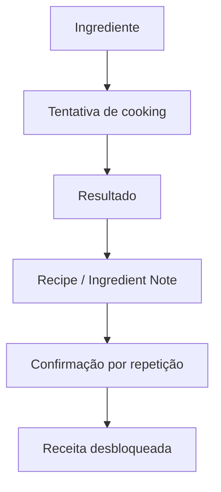

## 11.1 Tipos de cooking notes

|Tipo|Exemplo|Efeito|
|---|---|---|
|Ingredient Note|“fungo azul causou cura leve”|identifica ingrediente|
|Toxicity Note|“fungo vermelho causou veneno”|evita preparo ruim|
|Recipe Note|“carne + seiva = anti-bleed”|receita parcial|
|Preparation Note|“aquecer pouco preserva efeito”|melhora qualidade|
|Failure Note|“misturar cristal com enxofre explodiu”|evita erro futuro|

---

# 12. Integração com Economia

Economy Notes registram informação de mercado.

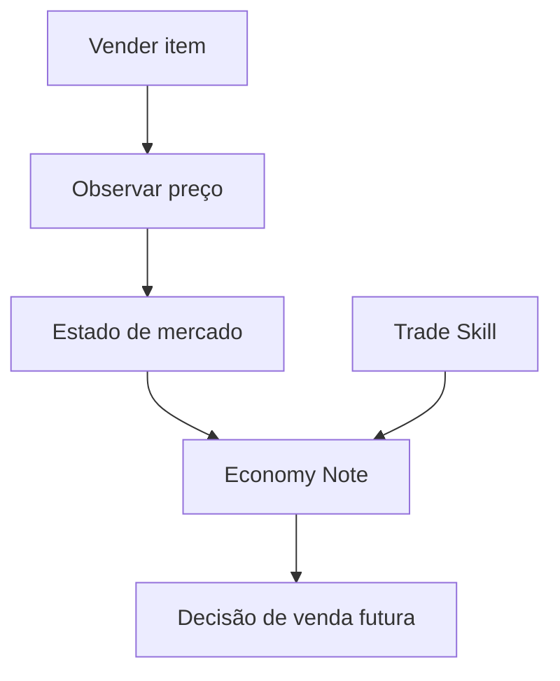

## 12.1 Exemplos

|Note|Uso|
|---|---|
|“obsidiana valorizada esta semana”|priorizar Lava|
|“cristal saturado”|segurar estoque|
|“ferreiro paga +15% por metal antigo”|escolher comprador|
|“fungo medicinal em demanda”|coletar Cogumelos|
|“NPC explorador trouxe excesso de ossos”|evitar Ossuário|

---

# 13. Integração com Corpse System

Se o player morrer, notes da run podem ser transferidas para o `CorpseContainer`.

O GDD mestre define que, ao morrer, o jogador perde a mochila da run corrente, o corpse nasce no ponto exato da morte, e skills/meta progressão são mantidas.

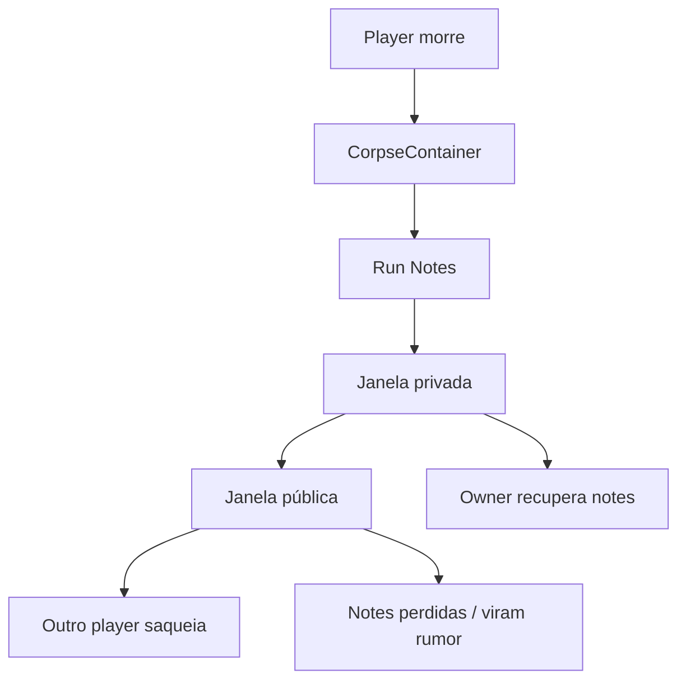

## 13.1 Regras

|Regra|Comportamento|
|---|---|
|Notes da run ficam no corpse|sim|
|Notes meta confirmadas são perdidas?|não|
|Notes não verificadas podem ser saqueadas?|sim|
|Notes de rota podem ser roubadas?|sim|
|Notes de bestiário confirmadas persistem?|sim|
|Notes falsas podem virar rumor?|sim|
|Party pode recuperar notes do aliado?|sim, se permitido pela regra co-op|

---

# 14. Integração Multiplayer

## 14.1 Party Notes

A party pode ter notes compartilhadas, mas com controle.

Tipos:

|Tipo|Visibilidade|
|---|---|
|Personal Note|só player|
|Party Note|party atual|
|Public Corpse Note|saqueável após janela privada|
|Market Rumor|compartilhável no Hub|
|Guild Note futuro|sistema futuro|

## 14.2 Party split

Se a party se separa por queda:

- o player acima vê Fall Origin Note;
    
- o player abaixo pode gerar Fall Landing Note;
    
- a corda conecta ambas se instalada;
    
- notes de ambos podem sincronizar quando a party se reencontra.
    

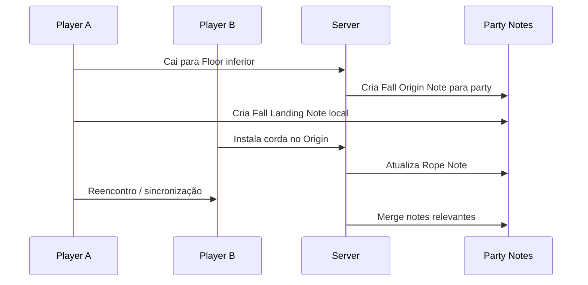

## 14.3 Interest Management

Notes devem respeitar visibilidade por andar.

- Notes locais do Floor 04 não precisam ir para player no Floor 03.
    
- Fall Origin Note pode ser visível no Floor 03.
    
- Rope Note pode ser visível nos dois floors conectados.
    
- Party Summary pode incluir “player criou note relevante”.
    

---

# 15. VR e Flatscreen

O GDD mestre define VR como modo primário e Flatscreen como abstração equivalente, nunca versão mais fácil. Toda interação precisa preservar custo de tempo, risco e vulnerabilidade entre os modos.

## 15.1 VR

No VR:

- diário físico;
    
- caneta/carvão;
    
- marcação em parede;
    
- gesto de abrir caderno;
    
- escrita/desenho simplificados;
    
- carimbos visuais rápidos;
    
- risco por atenção desviada.
    

## 15.2 Flatscreen

No Flatscreen:

- overlay sem pausa;
    
- templates rápidos;
    
- pins por sala;
    
- atalhos de categoria;
    
- preenchimento com teclado;
    
- vulnerabilidade durante interface aberta;
    
- câmera/controle reduzidos durante escrita.
    

## 15.3 Fórmula de paridade

$$  
T_{note}^{VR} \approx T_{note}^{Flat}  
$$

$$  
Risk_{note}^{VR} \approx Risk_{note}^{Flat}  
$$

Se Flatscreen for mais rápido, aplicar:

- animation lock;
    
- stamina cost;
    
- UI delay;
    
- reduced awareness;
    
- input commitment.
    

Se VR for mais lento, aplicar:

- carimbos rápidos;
    
- templates físicos;
    
- auto-notes por WIS;
    
- símbolos pré-desenhados.
    

---

# 16. UI/UX do Notes System

## 16.1 Estrutura da interface

|Área|Função|
|---|---|
|Página de rota|salas, direção, símbolos|
|Página de criaturas|notes de monstro|
|Página de ingredientes|cooking/ingredientes|
|Página de mercado|economia/preços|
|Página de queda/corda|pontos verticais|
|Página de boss gate|progressão|
|Página de rumores|notes não confirmadas|

## 16.2 Estados visuais da note

|Estado|Indicador|
|---|---|
|Unverified|ícone cinza/interrogação|
|Confirmed|selo/check|
|False|risco/rasura|
|Obsolete|amarelada/desbotada|
|Meta Knowledge|escrita limpa/organizada|
|Stolen/Rumor|marca de origem externa|

## 16.3 Templates localizados

Notes geradas por template devem usar placeholders.

Unity Localization Smart Strings usa textos literais com format items/placeholders entre chaves, como `{placeholder}`, e permite substituir dados em runtime. Isso é adequado para notes automáticas como “{monster} foi visto em {floor}” ou “{resource} está em alta demanda”. ([Unity Docs](https://docs.unity3d.com/Packages/com.unity.localization%401.4/manual/Smart/SmartStrings.html?utm_source=chatgpt.com "Smart Strings | Localization | 1.4.5"))

Exemplos:

|Template|Saída|
|---|---|
|`{monster} foi visto em {room}`|“Slime foi visto na Câmara Norte”|
|`{resource} está em {market_state}`|“Cristal está saturado”|
|`{fall_origin} aceita {rope_tier}`|“Buraco Norte aceita Corda T1”|
|`{ingredient} causou {effect}`|“Fungo Azul causou Cura Leve”|

---

# 17. Persistência

O GDD mestre organiza persistência por domínios, incluindo `MetaDomain`, `RunDomain`, `WorldDomain`, `ShopDomain` e `SettingsDomain`; o `RunDomain` salva a run atual, o `WorldDomain` salva estado de dungeon por floor e é limpo no reset semanal, enquanto o `MetaDomain` guarda progresso mais permanente.

## 17.1 Política de persistência das notes

|Tipo de note|Domínio|Duração|
|---|---|---|
|Route Note|WorldDomain/RunDomain|run/weekly|
|Fall Note|WorldDomain|session/weekly|
|Rope Note|WorldDomain|session|
|Hazard Note|WorldDomain|weekly|
|Monster Note não verificada|RunDomain/WorldDomain|run/weekly|
|Monster Note confirmada|MetaDomain|permanente|
|Ingredient Note|MetaDomain após confirmação|permanente|
|Recipe Note|MetaDomain|permanente|
|Economy Note|ShopDomain/WorldDomain|weekly|
|Boss Gate Note|MetaDomain/WorldDomain|permanente/progressão|
|Corpse Note|RunDomain|enquanto corpse existir|
|Party Note|Network session|sessão|

## 17.2 Fórmula de save

$$  
SavedNotes = RunNotes + WeeklyNotes + MetaKnowledgeNotes + PartyNotes  
$$

Com separação:

$$  
MetaKnowledgeNotes \not\subseteq CorpseLoot  
$$

Ou seja: notes convertidas em conhecimento permanente não devem ser perdidas no corpse.

---

# 18. Estrutura de Dados Recomendada

## 18.1 FieldNote

|Campo|Tipo conceitual|Função|
|---|---|---|
|`note_id`|string/Guid|identificador|
|`owner_id`|player id|dono|
|`scope`|enum|personal, party, public, corpse|
|`category`|enum|route, monster, recipe, economy etc.|
|`state`|enum|draft, unverified, confirmed, false, obsolete|
|`floor_index`|int opcional|andar|
|`room_id`|string opcional|sala|
|`world_position`|Vector3 opcional|localização|
|`linked_entity_id`|string opcional|monstro, item, corpse, rope|
|`content_key`|string|chave de localization/template|
|`raw_text`|string opcional|texto manual|
|`evidence_ids`|list|evidências|
|`confidence`|float|confiança|
|`created_at`|timestamp|criação|
|`expires_at`|timestamp opcional|expiração|

## 18.2 NoteCategory

|Categoria|Uso|
|---|---|
|`Route`|navegação|
|`Hazard`|perigo|
|`Monster`|bestiário|
|`Ingredient`|cooking|
|`Recipe`|cooking|
|`Economy`|mercado|
|`Fall`|queda|
|`Rope`|corda|
|`BossGate`|progressão|
|`Harvest`|loot|
|`Corpse`|recuperação|
|`Party`|co-op|

## 18.3 NoteScope

|Scope|Visibilidade|
|---|---|
|`Personal`|só dono|
|`Party`|party atual|
|`CorpseLoot`|dentro do corpse|
|`PublicRumor`|saqueável/compartilhável|
|`MetaKnowledge`|conhecimento permanente|

---

# 19. Estrutura de Scripts Recomendada

|Pasta|Arquivos|
|---|---|
|`Notes/Core`|`FieldNote.cs`, `NoteId.cs`, `NoteCategory.cs`, `NoteState.cs`, `NoteScope.cs`|
|`Notes/Authoring`|`ManualNoteController.cs`, `AutoNoteService.cs`, `NoteTemplateDefinition.cs`|
|`Notes/Validation`|`NoteValidationService.cs`, `EvidenceMatcher.cs`, `NoteConfidenceCalculator.cs`|
|`Notes/Navigation`|`RouteNoteService.cs`, `FallNoteService.cs`, `RopeNoteService.cs`, `BossGateNoteService.cs`|
|`Notes/Knowledge`|`BestiaryNoteBridge.cs`, `CookingNoteBridge.cs`, `EconomyNoteBridge.cs`|
|`Notes/Persistence`|`NoteSaveData.cs`, `NotePersistenceService.cs`, `NoteArchiveService.cs`|
|`Notes/Networking`|`PartyNoteReplicator.cs`, `NoteVisibilityResolver.cs`, `CorpseNoteLootService.cs`|
|`Notes/UI`|`VRJournalView.cs`, `FlatJournalOverlay.cs`, `NoteFilterView.cs`, `NotePinView.cs`|
|`Notes/Localization`|`NoteLocalizationResolver.cs`, `NoteTemplateArguments.cs`|

---

# 20. Pipeline Técnico

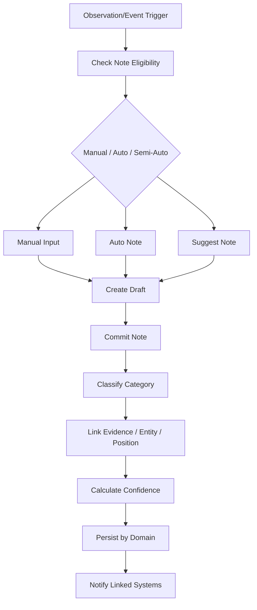

---

# 21. Validação de Notes

## 21.1 O que validar

|Validação|Motivo|
|---|---|
|categoria válida|evitar note quebrada|
|dono válido|multiplayer/autoria|
|escopo válido|privacidade/co-op|
|posição válida|rota/queda/corda|
|evidência compatível|bestiário/cooking/economia|
|duração correta|reset semanal|
|não revela info proibida|anti-spoiler/boss gate|
|não burla minimapa|sem cartografia automática total|
|não quebra interest management|não replica notes indevidas|

## 21.2 Diagrama de validação

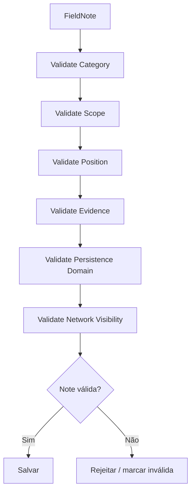

---

# 22. MVP Roadmap

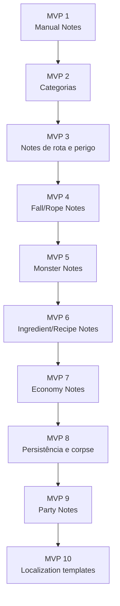

## 22.1 Escopo por MVP

|MVP|Entrega|
|---|---|
|MVP 1|notes manuais simples no diário|
|MVP 2|categorias e filtros|
|MVP 3|notes de rota, sala e hazard|
|MVP 4|notes de queda, Fall Origin, Landing e corda|
|MVP 5|notes de monstro conectadas ao bestiário|
|MVP 6|notes de ingrediente/receita conectadas ao cooking|
|MVP 7|notes econômicas conectadas à loja|
|MVP 8|notes no corpse e persistência por domínio|
|MVP 9|party notes com visibilidade por andar|
|MVP 10|templates localizados com Smart Strings|

---

# 23. Non-Goals

Não implementar no primeiro ciclo:

- minimapa completo;
    
- mapa 3D automático da dungeon inteira;
    
- editor de texto complexo;
    
- OCR ou handwriting recognition avançado;
    
- compartilhamento global de notes entre todos os players;
    
- wiki automática;
    
- notes sem risco;
    
- pausa durante escrita;
    
- IA generativa obrigatória para interpretar notes;
    
- notes revelando boss gate sem observação;
    
- notes persistentes para rotas que resetam semanalmente;
    
- sistema de desenho livre complexo no MVP.
    

---

# 24. Critérios de Aceite

O Notes System está aceitável quando:

- player pode criar note manual;
    
- note não pausa o jogo;
    
- note gera vulnerabilidade;
    
- note possui categoria;
    
- note possui escopo de visibilidade;
    
- note possui estado de confiança;
    
- note pode ser vinculada a posição, sala, entidade ou evento;
    
- route notes não persistem indevidamente após reset;
    
- monster notes podem alimentar bestiário;
    
- ingredient/recipe notes podem alimentar cooking;
    
- economy notes podem alimentar loja/mercado;
    
- fall/rope notes ajudam resgate da party;
    
- notes relevantes podem ir para corpse;
    
- notes meta confirmadas não são perdidas na morte;
    
- VR e Flatscreen têm custo equivalente;
    
- notes automáticas exigem WIS ou skill;
    
- templates automáticos são localizáveis;
    
- multiplayer respeita interest management.
    

---

# 25. Definição Final para o GDD Principal

## Notes System

O Notes System é o sistema de memória ativa, cartografia diegética e interpretação sistêmica do jogador. Como o jogo não usa minimapa tradicional, a orientação nasce de marcas no mundo, diário de exploração, observação, auto-notes, party notes e informações recuperadas em corpse.

Notes podem ser manuais, automáticas ou semi-automáticas. Notes manuais estão sempre disponíveis, mas exigem tempo, atenção e deixam o player vulnerável. Auto-notes dependem de atributos ou skills, como WIS, Trade, Cooking, Grave Sense ou conhecimento de bestiário. Semi-auto-notes são sugestões do sistema que o player pode confirmar ou ignorar.

Toda note possui categoria, escopo, estado de confiança, domínio de persistência e, quando necessário, vínculo com sala, posição, entidade ou evento. Notes podem ser pessoais, compartilhadas com a party, saqueáveis via corpse, públicas como rumor ou convertidas em conhecimento permanente.

Notes não são automaticamente verdadeiras. Elas podem ser não verificadas, confirmadas, falsas, obsoletas ou arquivadas. Apenas notes confirmadas devem virar conhecimento permanente, como fraquezas no bestiário, receitas descobertas, toxicidade de ingredientes ou padrões econômicos confiáveis.

O sistema integra dungeon, bestiário, cooking e economia. Route notes ajudam navegação. Fall/Rope notes ajudam resgate e party split. Monster notes alimentam o bestiário. Ingredient/Recipe notes alimentam cooking. Economy notes ajudam decisões de venda, estoque e exploração. Boss Gate notes registram bloqueios estruturais e progresso de camada.

Se o player morrer, notes da run podem ser transferidas ao corpse junto com outros itens da run. Notes de rota, queda, corda e rumores não confirmados podem ser recuperados ou saqueados. Conhecimento meta confirmado, como receita desbloqueada ou fraqueza validada, não deve ser perdido na morte.

No multiplayer, notes respeitam interest management. Um player não recebe todos os detalhes de notes de outro andar, exceto quando a note é relevante para queda, corda, party summary ou progressão compartilhada. No VR, o diário é físico e diegético. No Flatscreen, é overlay sem pausa. Os dois modos devem manter custo equivalente de tempo, risco e vulnerabilidade.

---

# 26. Resumo Final

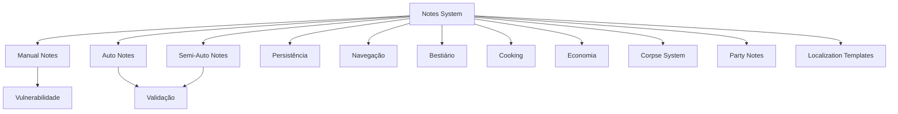

Regra final:

**Notes são a memória jogável da dungeon.**  
Elas substituem minimapa passivo por conhecimento conquistado, vulnerável, validável, saqueável e sistemicamente útil.
